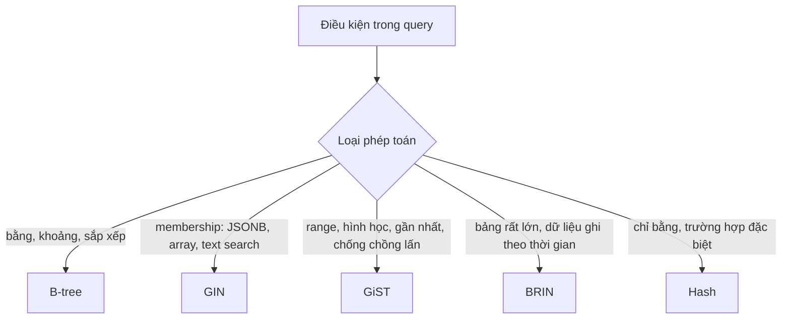
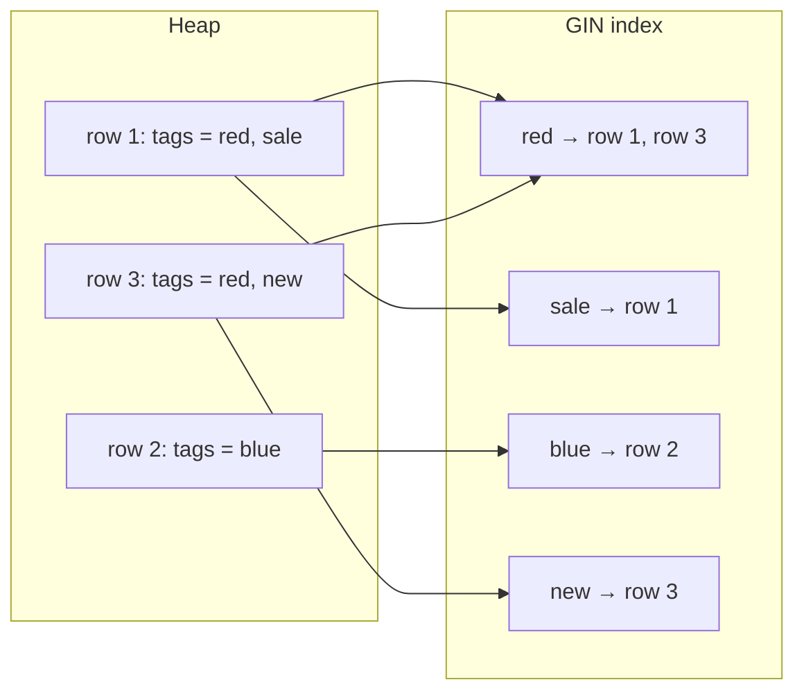
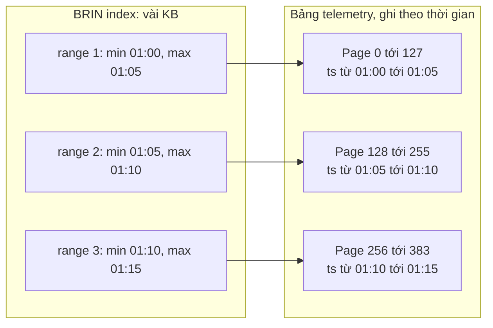

# Các loại index: B-tree, Hash, GIN, GiST, SP-GiST, BRIN

## 1. Tổng quan

PostgreSQL có nhiều **access method** cho index, mỗi loại tổ chức dữ liệu theo cách khác nhau để phục vụ một nhóm **toán tử** khác nhau. Chọn loại index không dựa vào kiểu dữ liệu của cột, mà dựa vào **phép toán** trong điều kiện query:

| Câu hỏi của query | Toán tử | Loại index |
|---|---|---|
| Bằng, lớn hơn, khoảng, sắp xếp | `=`, `<`, `>`, `BETWEEN`, `ORDER BY` | B-tree |
| Chỉ bằng | `=` | Hash (hiếm khi tốt hơn B-tree) |
| Phần tử có nằm trong tập không | `@>`, `?`, `&&`, `@@` (JSONB, array, full-text) | GIN |
| Chồng lấn, chứa, gần nhất | `&&`, `@>`, `<->` (range, hình học) | GiST |
| Không gian phân chia không đều | IP, prefix text, điểm | SP-GiST |
| Bảng khổng lồ có thứ tự vật lý tự nhiên | `<`, `>` trên cột tương quan với thứ tự ghi | BRIN |

## 2. Mental Model



Diễn giải: đi từ **câu hỏi** của query tới loại cấu trúc có thể trả lời câu hỏi đó nhanh. B-tree trả lời "giá trị nằm ở đâu trong thứ tự"; GIN trả lời "những row nào chứa phần tử này"; GiST trả lời "những row nào có vùng giao với vùng này"; BRIN trả lời "những khối page nào có thể chứa giá trị trong khoảng này".

Mỗi loại index hỗ trợ một tập toán tử thông qua **operator class**. Index GIN với `jsonb_path_ops` chỉ hỗ trợ `@>`, không hỗ trợ `?`. Kiểm tra operator class trước khi kỳ vọng planner dùng index.

## 3. B-tree

Loại mặc định. Chi tiết cấu trúc ở [Index](index.md#4-cơ-chế-hoạt-động-b-tree).

- Hỗ trợ `=`, `<`, `<=`, `>`, `>=`, `BETWEEN`, `IN`, `IS NULL`, và cung cấp thứ tự cho `ORDER BY`.
- `LIKE 'abc%'` (tiền tố) dùng được B-tree khi collation là `C` hoặc dùng operator class `text_pattern_ops`. `LIKE '%abc'` thì không.
- Deduplication (13+) giảm kích thước với giá trị lặp nhiều.
- Là loại duy nhất hỗ trợ unique constraint (cùng với một số trường hợp đặc biệt).

Dùng B-tree cho gần như mọi trường hợp tra cứu theo khóa, khoảng và sắp xếp.

## 4. Hash

- Lưu mã băm 32-bit của giá trị; chỉ hỗ trợ `=`.
- Từ PostgreSQL 10 được ghi WAL và an toàn khi crash (trước đó không nên dùng).
- Có thể nhỏ hơn B-tree cho giá trị dài (URL, token) vì chỉ lưu mã băm.
- Không hỗ trợ unique, không hỗ trợ range, không hỗ trợ sắp xếp, không dùng cho index nhiều cột.

Trong thực tế, B-tree thường đủ tốt cho equality; chỉ cân nhắc Hash khi đo được lợi ích rõ về kích thước.

## 5. GIN (Generalized Inverted Index)

### Cấu trúc

GIN là **inverted index**: thay vì "row → giá trị", nó lưu "phần tử → danh sách row chứa phần tử đó".



Diễn giải:

1. Mỗi giá trị cột được tách thành nhiều **key** (phần tử array, key/value của JSONB, từ trong `tsvector`).
2. Mỗi key trỏ tới **posting list** (hoặc posting tree khi danh sách dài) các TID.
3. Query `tags @> ARRAY['red']` tra key "red" và lấy ngay danh sách row.
4. Query nhiều điều kiện giao các posting list.

### Dùng cho

| Kiểu | Operator class | Toán tử |
|---|---|---|
| `jsonb` | `jsonb_ops` (mặc định) | `@>`, `?`, `?|`, `?&`, `@?`, `@@` |
| `jsonb` | `jsonb_path_ops` | `@>`, `@?`, `@@` — nhỏ hơn, nhanh hơn cho `@>` |
| array | `array_ops` | `@>`, `<@`, `&&`, `=` |
| `tsvector` | mặc định | `@@` (full-text search) |
| text với `pg_trgm` | `gin_trgm_ops` | `LIKE '%abc%'`, `ILIKE`, `~`, similarity |

### Chi phí ghi

Một row có thể sinh hàng chục key → một insert cập nhật hàng chục vị trí trong index. GIN giảm chi phí bằng **fastupdate**: entry mới được đưa vào một **pending list** chưa sắp xếp, rồi được gộp vào cấu trúc chính theo lô (khi VACUUM chạy, hoặc khi pending list vượt `gin_pending_list_limit`). Hệ quả:

- Insert nhanh hơn, nhưng query phải quét cả pending list → đọc chậm dần khi list dài.
- Việc gộp có thể xảy ra ngay trong một insert của người dùng, gây latency spike không đều.

Với bảng ghi nhiều, cân nhắc tắt `fastupdate` hoặc giảm `gin_pending_list_limit` để latency đều hơn.

## 6. GiST (Generalized Search Tree)

### Cấu trúc

GiST là cây cân bằng trong đó mỗi node lưu một **vị từ bao** (bounding predicate) cho mọi thứ bên dưới nó: với hình học là hình chữ nhật bao (như R-tree), với range là khoảng bao. Tìm kiếm đi xuống mọi nhánh có vị từ bao **có thể** khớp — có thể phải đi nhiều nhánh, và kết quả ở leaf có thể cần kiểm tra lại (lossy).

### Dùng cho

- **Range type** (`tstzrange`, `daterange`, `int4range`): chồng lấn `&&`, chứa `@>`.
- **Hình học và PostGIS**: điểm trong vùng, giao nhau.
- **Tìm gần nhất (KNN)**: `ORDER BY location <-> point LIMIT 10` — GiST trả về theo khoảng cách tăng dần mà không cần tính khoảng cách cho mọi row.
- **Exclusion constraint**: đảm bảo không có hai row "xung đột".

### Exclusion constraint: ví dụ đặt lịch

```sql
CREATE EXTENSION IF NOT EXISTS btree_gist;

CREATE TABLE bay_bookings (
    service_bay_id int NOT NULL,
    during tstzrange NOT NULL,
    EXCLUDE USING gist (service_bay_id WITH =, during WITH &&)
);
```

Database đảm bảo không có hai booking cho cùng một khoang sửa chữa có khoảng thời gian chồng lấn — kể cả với hàng trăm transaction đồng thời. Viết logic này ở tầng ứng dụng dễ gặp [race condition](../02-python-concurrency/race-condition.md); exclusion constraint giải quyết nó ở nơi lưu trạng thái.

## 7. SP-GiST (Space-Partitioned GiST)

Cây phân chia không gian **không cân bằng**: quadtree, k-d tree, radix tree. Phù hợp với dữ liệu phân bố không đều như địa chỉ IP (`inet`), tiền tố text, điểm 2D có cụm. Ít dùng trong backend thông thường; biết để nhận ra khi gặp.

## 8. BRIN (Block Range Index)

### Cấu trúc

BRIN không index từng row. Nó chia bảng thành các **block range** (mặc định 128 page mỗi range) và với mỗi range chỉ lưu **tóm tắt**: giá trị nhỏ nhất và lớn nhất của cột trong range đó.



Diễn giải:

1. Query `WHERE ts BETWEEN '01:06' AND '01:08'` kiểm tra tóm tắt của mỗi range.
2. Chỉ range 2 có thể chứa dữ liệu phù hợp; executor đọc 128 page đó và lọc từng row (lossy).
3. Index cho bảng hàng tỷ row chỉ vài MB thay vì hàng chục GB như B-tree.

### Điều kiện để BRIN hiệu quả

Giá trị cột phải **tương quan với thứ tự vật lý** trên disk (`correlation` gần 1 hoặc -1 trong `pg_stats`). Điều này đúng tự nhiên với bảng append-only ghi theo thời gian: event log, telemetry, audit. Nếu dữ liệu bị update nhiều hoặc insert lộn xộn, mỗi range có min/max bao phủ gần như mọi giá trị → BRIN vô dụng.

Range mới được tóm tắt khi VACUUM chạy hoặc khi bật `autosummarize`. Từ PostgreSQL 14 có thêm operator class `minmax_multi` (lưu nhiều khoảng thay vì một min/max) và `bloom`, chịu được dữ liệu kém tương quan hơn.

## 9. So sánh

| Loại | Kích thước | Chi phí ghi | Toán tử | Điểm mạnh | Điểm yếu |
|---|---|---|---|---|---|
| B-tree | Trung bình | Trung bình | So sánh, sắp xếp | Đa năng, unique | Không cho membership, hình học |
| Hash | Nhỏ với key dài | Trung bình | `=` | Nhỏ gọn | Chỉ equality |
| GIN | Lớn | Cao (có pending list) | Membership | JSONB, array, full-text, trigram | Ghi chậm, đọc chậm khi pending list dài |
| GiST | Trung bình | Trung bình | Chồng lấn, gần nhất | Range, hình học, exclusion | Lossy, có thể đi nhiều nhánh |
| BRIN | Rất nhỏ | Rất thấp | So sánh khoảng | Bảng khổng lồ theo thời gian | Cần tương quan vật lý, lossy |

## 10. Hành vi trong production

- **JSONB + GIN**: tiện để truy vấn thuộc tính linh hoạt, nhưng index GIN trên cả document lớn tốn chi phí ghi đáng kể. Nếu chỉ truy vấn một vài key cố định, expression B-tree trên `(payload->>'vin')` nhỏ và nhanh hơn.
- **Tìm kiếm chuỗi chứa (`%abc%`)**: `pg_trgm` + GIN giải quyết được với dữ liệu vừa phải; với tìm kiếm full-text phức tạp (ranking, đa ngôn ngữ, typo) ở quy mô lớn, hệ thống tìm kiếm chuyên dụng thường phù hợp hơn.
- **BRIN cho bảng event**: thay B-tree trên `created_at` của bảng hàng tỷ row bằng BRIN có thể giải phóng hàng chục GB và giảm chi phí ghi, đổi lại query theo khoảng thời gian hẹp đọc nhiều page hơn một chút.

## 11. Failure Modes

| Failure | Nguyên nhân | Dấu hiệu |
|---|---|---|
| Index không được dùng | Operator class không hỗ trợ toán tử | Seq scan dù có GIN trên JSONB |
| Latency insert không đều | GIN pending list được gộp trong insert | Spike latency ghi |
| BRIN không hiệu quả | Dữ liệu không tương quan vật lý | EXPLAIN đọc gần như mọi page, `Rows Removed by Index Recheck` lớn |
| Index quá lớn | GIN trên document lớn | Index lớn hơn cả bảng, ghi chậm |

## 12. Sai lầm thường gặp

- Chọn index theo kiểu dữ liệu ("cột JSONB thì GIN") thay vì theo toán tử của query.
- Dùng B-tree cho `LIKE '%x%'`.
- Dùng BRIN trên cột bị update ngẫu nhiên.
- Viết logic chống trùng lịch ở ứng dụng thay vì exclusion constraint.

## 13. Cách debug

```sql
-- Operator class của index
SELECT indexrelid::regclass, opcname
FROM pg_index i JOIN pg_opclass o ON o.oid = ANY(i.indclass)
WHERE indrelid = 'claims'::regclass;

-- Tương quan vật lý của cột (cho BRIN)
SELECT attname, correlation FROM pg_stats WHERE tablename = 'telemetry';

-- Kích thước index so với bảng
SELECT indexrelid::regclass, pg_size_pretty(pg_relation_size(indexrelid))
FROM pg_index WHERE indrelid = 'claims'::regclass;
```

Luôn xác nhận bằng `EXPLAIN (ANALYZE, BUFFERS)` rằng query thật dùng index và số page đọc giảm.

## 14. Best Practices

- Bắt đầu từ câu hỏi của query và toán tử, rồi chọn loại index và operator class.
- B-tree cho gần như mọi tra cứu khóa, khoảng, sắp xếp.
- GIN cho JSONB, array, full-text, trigram; theo dõi chi phí ghi.
- GiST cho range, hình học, KNN và exclusion constraint.
- BRIN cho bảng append-only rất lớn theo thời gian.
- Đo kích thước và chi phí ghi của index, không chỉ tốc độ đọc.

## 15. Tóm tắt

- Mỗi loại index tổ chức dữ liệu để trả lời một loại câu hỏi; chọn theo toán tử, không theo kiểu dữ liệu.
- GIN là inverted index: phần tử → danh sách row; mạnh cho membership, tốn chi phí ghi.
- GiST lưu vị từ bao; phục vụ chồng lấn, gần nhất, và exclusion constraint.
- BRIN lưu min/max theo khối page; cực nhỏ nhưng chỉ hiệu quả khi dữ liệu tương quan với thứ tự vật lý.
- Operator class quyết định index hỗ trợ toán tử nào.

## Liên quan

- [Index](index.md)
- [Query Optimization](query-optimization.md)
- [Large Table Design](large-table-design.md)
- [Partitioning](partitioning.md)
