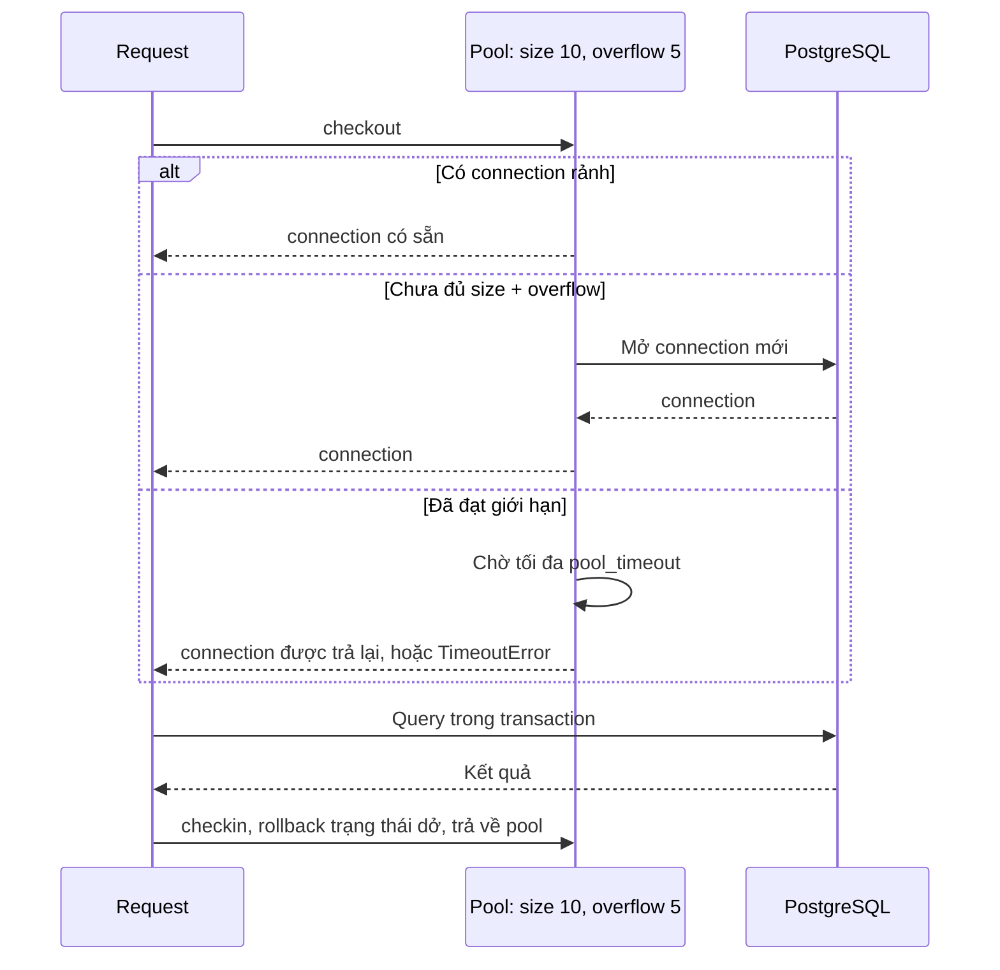
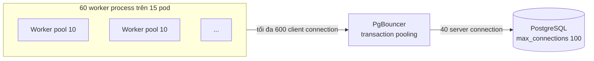
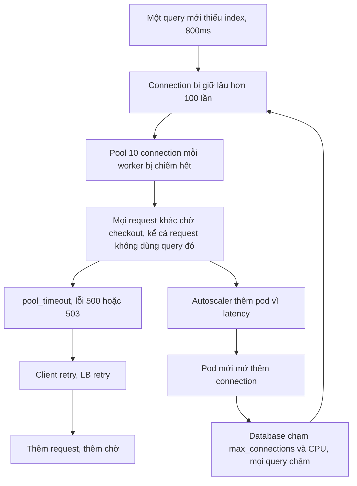

# Connection Pooling

## 1. Tổng quan

Connection pool là tập hợp các kết nối database được giữ lại để tái sử dụng thay vì tạo một connection mới cho mỗi request.

Với PostgreSQL, pooling không chỉ là tối ưu hiệu năng. Vì mỗi connection là một **process** trên server ([PostgreSQL Fundamentals](database-fundamentals.md#3-kiến-trúc-process)), số connection đồng thời là một tài nguyên hữu hạn và đắt. Connection pool đóng vai trò **admission control**: nó quyết định tối đa bao nhiêu thao tác được vào database cùng lúc, và những thao tác còn lại phải **xếp hàng ở đâu**.

Có hai tầng pool thường gặp:

1. **Pool trong ứng dụng** (SQLAlchemy `QueuePool`, asyncpg pool): mỗi worker process có pool riêng.
2. **Pool ngoài** (PgBouncer, RDS Proxy, pgcat): một proxy đứng giữa mọi instance ứng dụng và PostgreSQL, gộp hàng nghìn connection phía client thành vài chục connection thật tới server.

## 2. Mental Model

> Pool là cánh cửa có số chỗ cố định dẫn vào database. Request vượt quá số chỗ sẽ xếp hàng **trước cửa** (trong ứng dụng) thay vì chen vào **bên trong** database. Tăng kích thước pool không làm database mạnh hơn; nó chỉ dời hàng đợi từ ứng dụng vào trong database — nơi hàng đợi đắt hơn nhiều.

## 3. Vì sao cần connection pool?

Tạo một connection PostgreSQL mới cần: TCP handshake, TLS handshake, xác thực, `fork` backend process, khởi tạo. Tổng từ vài ms tới hàng chục ms — thường lâu hơn cả query. Mở/đóng connection mỗi request lãng phí thời gian và làm postmaster bận fork liên tục.

Quan trọng hơn: nếu không giới hạn, mỗi request đồng thời mở một connection. Traffic spike 3.000 request đồng thời → 3.000 backend process → database hết memory, CPU dành cho context switch, mọi query chậm lại. Database sụp đổ vì quá nhiều người "đang làm việc" cùng lúc.

## 4. Cơ chế hoạt động: pool trong ứng dụng



Diễn giải:

1. Request **mượn** (checkout) một connection khi bắt đầu dùng database.
2. Nếu có connection rảnh, dùng ngay. Nếu chưa đạt giới hạn, mở mới. Nếu đã đạt giới hạn, **chờ** tới khi có connection được trả, tối đa `pool_timeout`.
3. Request dùng connection trong suốt transaction.
4. Khi xong, connection được **trả** (checkin); pool reset trạng thái (rollback transaction dở) để request sau dùng sạch.

### Tham số SQLAlchemy quan trọng

| Tham số | Ý nghĩa | Gợi ý |
|---|---|---|
| `pool_size` | Số connection giữ thường trực | Theo tính toán ở mục 6 |
| `max_overflow` | Số connection tạm thời thêm khi đông | Nhỏ; overflow được đóng khi trả về |
| `pool_timeout` | Thời gian tối đa chờ checkout | 1–5 giây: fail nhanh thay vì treo |
| `pool_recycle` | Đóng connection sống quá N giây | Nhỏ hơn idle timeout của proxy/LB/firewall |
| `pool_pre_ping` | Kiểm tra connection còn sống trước khi dùng | Bật khi có proxy/failover có thể cắt connection im lặng |

Mỗi **worker process** có pool riêng. Pool không được chia sẻ giữa process (và không được kế thừa qua `fork`).

## 5. Pool ngoài: PgBouncer



Diễn giải:

1. Ứng dụng có thể mở tổng cộng 600 connection **tới PgBouncer** — mỗi cái rất rẻ (PgBouncer là process event-driven nhẹ).
2. PgBouncer chỉ giữ 40 connection **thật** tới PostgreSQL.
3. Ở **transaction mode**, một connection thật chỉ được gán cho client trong thời gian của **một transaction**. Khi transaction kết thúc, connection thật được trả về cho client khác.
4. Vì phần lớn thời gian connection phía ứng dụng rảnh (giữa các transaction, chờ HTTP, xử lý logic), 600 client connection có thể được phục vụ bởi 40 server connection.

### Ba chế độ

| Mode | Server connection được gán cho client trong | Tương thích |
|---|---|---|
| **Session** | Cả session của client | Mọi tính năng; ít lợi ích gộp |
| **Transaction** | Một transaction | Phổ biến nhất; hạn chế tính năng gắn với session |
| **Statement** | Một câu lệnh | Không cho phép transaction nhiều câu lệnh |

### Hạn chế của transaction mode

Vì mỗi transaction có thể chạy trên một backend khác nhau, những gì gắn với **session** không còn đáng tin:

- `SET` không có `LOCAL` (ví dụ `SET statement_timeout`) — ảnh hưởng tới client khác dùng backend đó sau. Dùng `SET LOCAL` trong transaction.
- Session advisory lock (`pg_advisory_lock`) — dùng bản mức transaction.
- `LISTEN/NOTIFY`, temporary table giữa các transaction.
- Prepared statement ở mức giao thức — > **Ghi chú version:** PgBouncer 1.21+ hỗ trợ prepared statement ở transaction mode qua `max_prepared_statements`. Với phiên bản cũ hơn, phải tắt statement cache của driver (ví dụ asyncpg `statement_cache_size=0`).

## 6. Sizing: bao nhiêu connection là đủ?

### Từ phía database

Số connection **đang hoạt động** hữu ích bị giới hạn bởi tài nguyên của database: CPU core, và khả năng I/O. Một nguyên tắc kinh nghiệm cũ (từ HikariCP) là `connections ≈ (số core × 2) + số disk hiệu dụng`. Con số chính xác phụ thuộc workload, nhưng thông điệp quan trọng: số connection **hoạt động** tối ưu thường là **hàng chục**, không phải hàng nghìn. Quá mức đó, throughput không tăng mà latency tăng vì tranh chấp CPU, lock, và cache.

### Từ phía ứng dụng: Little's Law

```text
connection cần ≈ throughput query × thời gian giữ connection
```

1.000 query/giây, mỗi query giữ connection 5 ms → trung bình 5 connection bận. Cần dư cho spike và phân phối không đều, nhưng không cần 200.

Điều quan trọng là **thời gian giữ connection**, không chỉ thời gian query. Transaction mở, gọi HTTP 300 ms, rồi commit → giữ connection 300+ ms. Cùng throughput cần gấp 60 lần số connection.

### Connection budget toàn hệ thống

```text
tổng connection tới DB = số pod × worker mỗi pod × (pool_size + max_overflow)
                        + worker Celery × pool + migration + monitoring + admin
```

Ví dụ: 20 pod × 4 worker × (10 + 5) = 1.200 — vượt xa khả năng của một PostgreSQL instance. Lựa chọn:

- Giảm pool mỗi worker (async worker thường cần ít connection hơn nghĩ, nếu transaction ngắn).
- Đặt PgBouncer giữa ứng dụng và database.
- Giới hạn autoscaling của ứng dụng theo budget.

Luôn chừa connection cho admin (`superuser_reserved_connections`) và cho công cụ vận hành.

## 7. Bên trong hệ thống xảy ra gì khi pool cạn?

Pool cạn thường **không phải** do database chậm, mà do connection bị giữ lâu. Các nguyên nhân:

- Transaction bao cả lời gọi HTTP, xử lý file, chờ queue.
- Query chậm (thiếu index, lock wait).
- Session ORM được mở ở đầu request và chỉ đóng ở cuối, dù chỉ cần database trong vài ms.
- Leak: connection không được trả (code không dùng context manager).
- Background task/streaming response giữ session của request.

Triệu chứng đặc trưng: **latency API cao trong khi CPU database thấp**. Request đang xếp hàng chờ checkout, không phải đang chạy query.

## 8. Failure chain: query chậm làm cạn pool



Diễn giải:

1. Một thay đổi nhỏ (query mới, thống kê cũ, lock) làm connection bị giữ lâu.
2. Pool cạn, mọi request dùng database trên worker đó bị ảnh hưởng — **kể cả** request vốn nhanh.
3. Timeout và retry khuếch đại tải.
4. Autoscaling theo latency/CPU thêm pod, mỗi pod mang pool mới, dồn thêm connection vào database đang quá tải.
5. Vòng lặp tự củng cố.

Phá vòng: `pool_timeout` ngắn để fail nhanh, `statement_timeout` để giới hạn query tệ, retry có budget, giới hạn autoscaling theo connection budget, và [bulkhead](../10-distributed-systems/bulkhead.md) — pool riêng cho đường xử lý nặng để không ảnh hưởng đường nhẹ.

## 9. Hành vi trong production

- **Failover và idle timeout**: khi primary chuyển sang replica (RDS Multi-AZ, Patroni), connection cũ trong pool trỏ tới server chết. `pool_pre_ping` phát hiện và tạo lại. NAT/firewall/proxy có thể cắt connection idle im lặng; `pool_recycle` nhỏ hơn timeout của chúng.
- **Async không cần pool lớn**: coroutine chỉ giữ connection khi thực sự đang query (nếu session được quản lý đúng). Pool 10 có thể phục vụ hàng trăm request đồng thời với transaction ngắn.
- **Celery worker**: mỗi worker process cũng có pool; prefork 16 process × pool 5 = 80 connection từ một máy worker.
- **Kết nối khởi động đồng loạt**: deploy hoặc scale-out 50 pod cùng lúc tạo storm kết nối mới vào database; pool lazy (mở khi cần) và PgBouncer giúp làm mượt.

## 10. Khi scale lên thì chuyện gì xảy ra?

| Quy mô ứng dụng | Kiến trúc pool thường phù hợp |
|---|---|
| 1–5 instance | Pool trong ứng dụng là đủ |
| 10–50 instance | Tổng connection bắt đầu vượt ngưỡng; PgBouncer hoặc pool nhỏ hơn |
| 50+ instance, nhiều service dùng chung DB | PgBouncer bắt buộc; cân nhắc tách database theo service |
| Replica cho đọc | Pool riêng cho primary và replica; routing theo loại query |

## 11. Trade-offs

| Lựa chọn | Lợi ích | Chi phí |
|---|---|---|
| Pool lớn | Ít chờ checkout | Dồn tải vào DB, dễ quá tải khi spike |
| Pool nhỏ + timeout ngắn | Bảo vệ DB, fail nhanh | Lỗi sớm hơn khi tải cao |
| PgBouncer transaction mode | Gộp connection mạnh | Mất tính năng gắn session, thêm một hop mạng |
| PgBouncer session mode | Tương thích đầy đủ | Gộp kém |
| Managed proxy (RDS Proxy) | Ít vận hành, hỗ trợ failover | Chi phí, latency thêm, giới hạn riêng |

## 12. Sai lầm thường gặp

- Tăng `max_connections` và `pool_size` khi gặp lỗi pool timeout thay vì tìm nguyên nhân giữ connection lâu.
- Tính pool theo một instance mà quên nhân số pod × worker.
- Giữ session/transaction trong lúc gọi dịch vụ ngoài.
- Dùng `SET` (không `LOCAL`) hoặc session advisory lock qua PgBouncer transaction mode.
- Không đặt `pool_timeout` — request treo vô hạn.

## 13. Cách debug

Phía database:

```sql
-- Số connection theo trạng thái và ứng dụng
SELECT application_name, state, count(*)
FROM pg_stat_activity GROUP BY 1, 2 ORDER BY 3 DESC;

-- Connection idle in transaction lâu
SELECT pid, application_name, now() - state_change AS idle_for, left(query, 60)
FROM pg_stat_activity WHERE state = 'idle in transaction' ORDER BY idle_for DESC;
```

Phía ứng dụng — metric cần có:

- Số connection đang checkout / tổng pool.
- **Thời gian chờ checkout** (histogram) — tín hiệu quan trọng nhất.
- Số lần `pool_timeout`.
- Thời gian giữ connection mỗi request.

SQLAlchemy cung cấp event `checkout`/`checkin` để đo. PgBouncer: `SHOW POOLS;` (`cl_waiting` = client đang chờ server connection), `SHOW STATS;`.

## 14. Best Practices

- Luôn dùng pool; không mở connection mỗi request.
- Tính connection budget toàn hệ thống trước khi chọn `pool_size` và số worker.
- Giữ connection ngắn nhất có thể: transaction ngắn, không I/O bên ngoài trong transaction.
- `pool_timeout` ngắn, `statement_timeout` và `idle_in_transaction_session_timeout` ở database.
- Bật `pool_pre_ping` và `pool_recycle` phù hợp với hạ tầng mạng.
- Dùng PgBouncer transaction mode khi nhiều instance; tránh tính năng gắn session.
- Đo thời gian chờ checkout như một metric hạng nhất.

## 15. Tóm tắt

- Connection PostgreSQL là process đắt; pool tái sử dụng connection và giới hạn số thao tác vào database cùng lúc.
- Pool là admission control: tăng pool chỉ dời hàng đợi vào trong database.
- Số connection cần = throughput × thời gian giữ connection; giữ connection ngắn quan trọng hơn pool lớn.
- Tổng connection = pod × worker × pool; PgBouncer gộp nhiều client connection thành ít server connection.
- Pool cạn thường do connection bị giữ lâu; có thể kích hoạt vòng lặp retry và autoscaling làm sập database.

## Liên quan

- [PostgreSQL Fundamentals](database-fundamentals.md)
- [Session Lifecycle trong SQLAlchemy](../05-sqlalchemy/session-lifecycle.md)
- [Kiến trúc FastAPI](../03-fastapi/architecture.md)
- [FastAPI Performance](../03-fastapi/performance.md)
- [Bulkhead](../10-distributed-systems/bulkhead.md)
- [High Traffic](../20-production-incidents/high-traffic.md)
