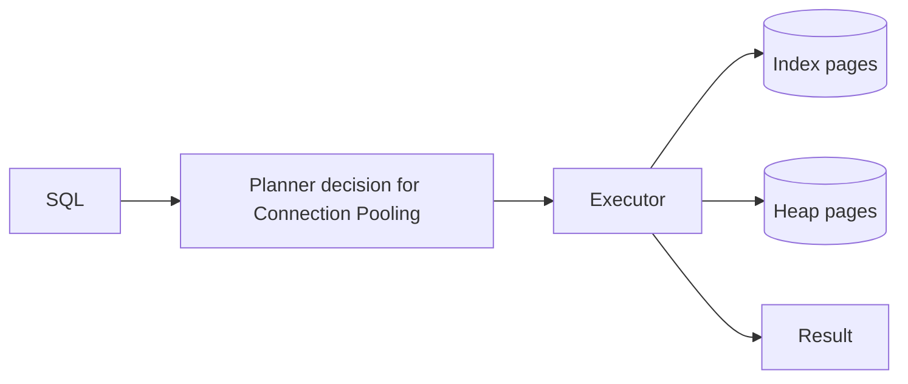

# Connection Pooling

> **Phạm vi phỏng vấn:** PostgreSQL · **Ưu tiên:** P0/P1 · **Mindset:** Why → How → Trade-off → Production.

## 1. What is it?

Connection pool tái sử dụng connection đắt đỏ và giới hạn concurrency đi vào PostgreSQL; pool không tạo thêm database capacity.

## 2. Why does it matter?

Senior Engineer cần hiểu **Connection Pooling** để database thường là stateful bottleneck và sai lầm có thể gây mất dữ liệu. Điểm phỏng vấn nằm ở khả năng nêu invariant, điều kiện áp dụng và failure behavior, không nằm ở việc thuộc định nghĩa.

## 3. How does it work?

Tổng connection = replicas × workers × pool size cộng background jobs. Pool wait cho thấy backpressure; PgBouncer transaction mode giảm session cost nhưng hạn chế session state/prepared behavior.

Khi reasoning, đi theo chuỗi: **input → state transition → output → failure → recovery**. Quan sát `query latency, rows scanned, buffer hit ratio, lock wait, WAL lag và IOPS` và phân biệt symptom, bottleneck với root cause.

## 4. Example

```sql
EXPLAIN (ANALYZE, BUFFERS, WAL)
SELECT id, status, created_at
FROM warranty_claim
WHERE vehicle_id = 4242 AND created_at >= now() - interval '90 days'
ORDER BY created_at DESC
LIMIT 50;
```

Với **Connection Pooling**, đọc `actual rows`, `loops`, buffer hit/read và sort spill; thử trên dữ liệu có distribution đại diện.

## 5. Production Use Case

Scale API từ 20 lên 200 pod mà pool 20 sẽ đòi 4.000 connection; đặt global budget, pool nhỏ, PgBouncer và queue/rate limit để bảo vệ DB.

Checklist triển khai: capacity budget, timeout, idempotency (nếu có side effect), telemetry, canary, rollback và reconciliation.

## 6. Common Problems

- Không định nghĩa invariant và source of truth trước khi chọn công nghệ.
- Retry không backoff/jitter làm traffic amplification khi dependency lỗi.
- Không có bound cho queue, connection, memory hoặc concurrency.
- Chỉ theo dõi average; bỏ qua p95/p99, saturation và error semantics.
- Rollout toàn bộ, thiếu feature flag/canary và đường rollback dữ liệu.

## 7. Trade-offs

| Lựa chọn | Lợi ích | Chi phí / rủi ro | Khi phù hợp |
|---|---|---|---|
| Tối ưu/thiết kế xoay quanh Connection Pooling | Kiểm soát rõ constraint chính | Tăng complexity và coupling | Metric chứng minh đây là bottleneck/risk |
| Giữ baseline đơn giản | Ít dependency, dễ debug | Có thể chạm giới hạn sớm | Traffic vừa, invariant vẫn được giữ |
| Managed service/library | Giảm vận hành hạ tầng | Cost, lock-in, giới hạn control | SLA và economics phù hợp |
| Tự vận hành/customize | Kiểm soát sâu | Ownership và failure surface lớn | Có năng lực vận hành và nhu cầu thật |

## 8. Interview Questions

### Basic / Mid-level (10)

- **B1.** What is Connection Pooling, and which concrete problem does it address?
- **B2.** Explain the main internal mechanism behind Connection Pooling.
- **B3.** Which guarantees does Connection Pooling provide, and which does it not provide?
- **B4.** Which metrics or observations reveal the behavior of Connection Pooling?
- **B5.** What is the most common misconception about Connection Pooling?
- **B6.** How would you test assumptions involving Connection Pooling?
- **B7.** Which edge cases or failure modes matter most for Connection Pooling?
- **B8.** How can Connection Pooling affect latency, throughput, memory, or correctness?
- **B9.** Which runtime conditions or configuration choices change the behavior of Connection Pooling?
- **B10.** When is a different or simpler approach better than relying on Connection Pooling?

### Production Scenarios (5)

- **S1.** Scaling from 20 to 200 pods requests 4,000 DB connections. Build a safe global connection budget.
- **S2.** Pool wait rises while query duration is flat. What does this reveal, and what should you not do blindly?
- **S3.** PgBouncer transaction mode breaks session-level assumptions. Which features and code paths do you audit?
- **S4.** One tenant monopolizes the pool. Design admission control and isolation.
- **S5.** During failover every pod reconnects simultaneously. How do you prevent a connection storm?

## 9. Senior-level Questions

- **L1.** How does Connection Pooling constrain the surrounding architecture and operational model?
- **L2.** Which subtle correctness issue appears when Connection Pooling meets concurrency or partial failure?
- **L3.** What breaks first around Connection Pooling at 20,000 RPS or 100× data volume?
- **L4.** Where should admission control or backpressure be placed when using Connection Pooling?
- **L5.** How would you benchmark or validate Connection Pooling without a misleading microbenchmark?
- **L6.** Which hidden coupling or migration cost can Connection Pooling introduce?
- **L7.** How would you change a poor decision around Connection Pooling with no downtime?
- **L8.** What production evidence would make you choose a different approach?
- **L9.** How do correctness, latency, cost, and complexity trade off for Connection Pooling?
- **L10.** How would you turn an incident involving Connection Pooling into a durable prevention mechanism?

## 10. Short Answers

**B1.** Connection pool tái sử dụng connection đắt đỏ và giới hạn concurrency đi vào PostgreSQL; pool không tạo thêm database capacity. Trả lời tốt nối definition với constraint/invariant và một use case cụ thể.

**B2.** Mô tả state, lifecycle, boundary và failure path; không dừng ở public API của Connection Pooling.

**B3.** Nêu lúc tạo, lúc sử dụng, lúc release/commit và điều xảy ra khi timeout hoặc cancellation.

**B4.** Đo query latency, rows scanned, buffer hit ratio, lock wait, WAL lag và IOPS; luôn tách average khỏi tail và success khỏi useful result.

**B5.** Lỗi phổ biến là dùng Connection Pooling như mặc định mà không xác định ownership, limit và fallback.

**B6.** Test invariant trước, sau đó integration test failure path, concurrency và representative load.

**B7.** Xét timeout, duplicate, stale state, overload, dependency loss và recovery/reconciliation.

**B8.** Đo critical path, contention, queueing và amplification; throughput cao không bù được p99 xấu.

**B9.** Deadline, concurrency limit, retention/TTL, resource budget, telemetry và rollout policy phải explicit.

**B10.** Tránh Connection Pooling khi bài toán đơn giản hơn giải được invariant với ít state và operational cost hơn.

Cấu trúc câu trả lời: **Definition → Why → How → Trade-off → Production example**. Với câu scenario: **stabilize → observe → hypothesize → verify → mitigate → prevent**.

## 11. Follow-up Questions

- **F1.** What assumption in your answer is most risky?
- **F2.** How would you prove that with metrics or an experiment?
- **F3.** What changes if the operation is not idempotent?
- **F4.** Where would you add timeout, retry, and backpressure?
- **F5.** What is your rollback and data-reconciliation plan?

## 12. Key Takeaways

- Nói được **vai trò, constraint hoặc invariant của Connection Pooling**, không chỉ “dùng để làm gì”.
- Định lượng bằng query latency, rows scanned, buffer hit ratio, lock wait, WAL lag và IOPS và có baseline trước tối ưu.
- Thiết kế cho timeout, duplicate, overload, partial failure và recovery.
- Mọi tối ưu đều có chi phí về correctness, complexity, latency hoặc money.
- Production-ready nghĩa là có owner, alert, runbook, canary, rollback và reconciliation.


## 13. Mental Model

Pool là hàng rào admission vào database. Request vượt số connection sẽ xếp hàng; tăng pool chỉ chuyển queue từ app vào database.

## 14. Internals Deep Dive

Reason đồng thời ở logical SQL, planner/executor tree, heap/index page, buffer/WAL và MVCC/lock. Một query nhanh đơn lẻ có thể chậm dưới concurrency vì pool, cache, I/O và lock wait.

Implementation detail có thể đổi theo version; khi trả lời interview, nêu rõ CPython/PostgreSQL/Redis/framework version nếu kết luận dựa vào behavior nội bộ thay vì public contract.

## 15. Request / Data Flow



Đọc diagram từ input tới state transition và output. Tại mỗi mũi tên, hỏi: operation có block không, có retry không, state có durable không, identity nào dùng để dedupe và metric nào chứng minh bước đó khỏe.

## 16. Failure Scenario

Plan regression, lock wait, connection storm, bloat hoặc I/O saturation làm tail latency tăng. Mitigate bằng rollback/query kill có chọn lọc/admission control; thay đổi index/schema phải verify bằng representative plan và write cost.

Phân tích theo chuỗi: **trigger → saturation/incorrect state → propagation → user impact → immediate mitigation → durable prevention**. Tránh gọi retry hoặc scale là giải pháp nếu chưa chỉ ra dependency budget.

## 17. How I would debug this in production

1. Kiểm DB CPU/IO/connections và application pool wait.
2. Dùng `pg_stat_activity` xem wait/lock/transaction age.
3. Dùng `pg_stat_statements` tìm total-time/calls/rows regression.
4. Chạy `EXPLAIN (ANALYZE, BUFFERS)` an toàn trên dữ liệu đại diện.
5. Kiểm estimate, scan/join, loops, spill, index/statistics/bloat.
6. Mitigate rồi đo lại p99 và write/WAL cost.

## 18. Common Misconceptions

**Sai:** có index thì PostgreSQL phải dùng index. **Đúng:** planner chọn plan theo cost/selectivity; sequential scan có thể rẻ hơn.

## 19. When NOT to use

Không thêm index/partition/replica trước khi access pattern và bottleneck được đo; mỗi component tăng write/operation cost.

## 20. What interviewer may ask next

1. **What guarantee does Connection Pooling provide, and what does it explicitly not guarantee?**
2. **Which implementation detail changes across versions or runtimes?**
3. **Where is the first queue or contention point under high load?**
4. **What happens if the dependency times out after committing state?**
5. **How would you observe, degrade, and recover this in production?**
6. **Which simpler design would you choose at 100 RPS, and when would you evolve it?**

## 21. Check Your Understanding

1. Nếu throughput tăng 20× nhưng downstream capacity không đổi, **Connection Pooling** sẽ tạo queue/backpressure ở đâu?
2. Timeout xảy ra ngay sau một state transition; caller có thể kết luận điều gì và không thể kết luận điều gì?
3. Metric, trace span và log field tối thiểu nào giúp phân biệt application, dependency và network latency?

<details>
<summary>Answer</summary>

1. Queue xuất hiện tại bounded resource đầu tiên: worker/thread/semaphore/connection pool/broker hoặc dependency. Nếu không có bound, overload chuyển thành memory growth và timeout storm.
2. Caller chỉ biết chưa nhận response trong deadline; operation có thể chưa chạy, đang chạy hoặc đã commit. Cần operation identity/idempotency và status/reconciliation.
3. Dùng end-to-end latency + queue/service time, correlation/trace ID, dependency spans, error/retry classification và saturation của pool/queue/resource.

</details>

## 22. See also

- [Index](index.md)
- [EXPLAIN ANALYZE](explain-analyze.md)
- [MVCC](mvcc.md)
- [Transactions](transaction.md)
