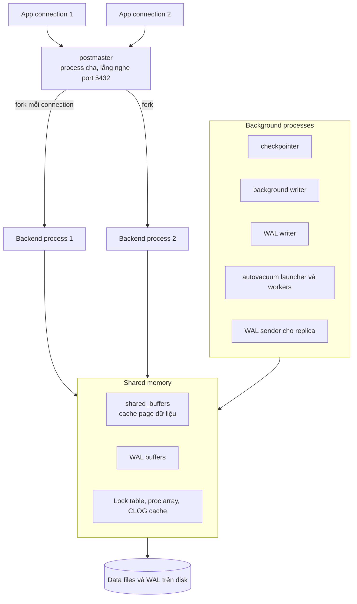
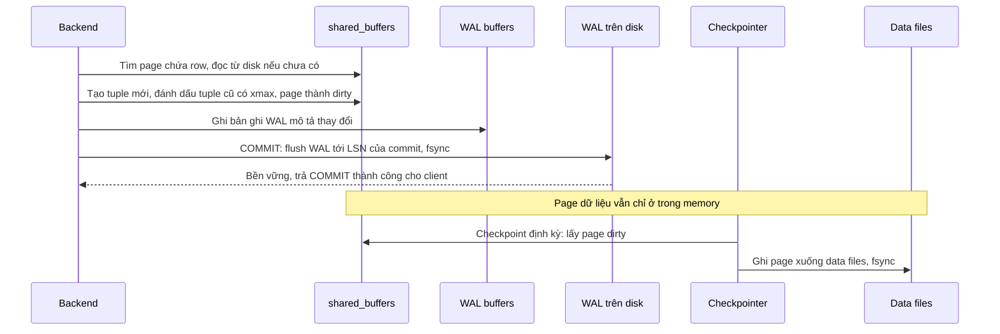

# PostgreSQL Fundamentals: process, memory, storage và WAL

## 1. Tổng quan

Trước khi tối ưu query hay chọn isolation level, cần một bức tranh về cách PostgreSQL được tổ chức bên trong: nó chạy những process nào, dùng memory ra sao, lưu dữ liệu trên disk dưới dạng gì, và làm thế nào để một `COMMIT` được đảm bảo không mất khi server mất điện.

Bốn câu hỏi này giải thích hàng loạt hành vi production:

- Vì sao mỗi connection đắt và cần [connection pool](connection-pooling.md)?
- Vì sao `UPDATE` làm bảng phình to và cần [VACUUM](vacuum-bloat.md)?
- Vì sao query "lúc nhanh lúc chậm" tùy dữ liệu có nằm trong cache không?
- Vì sao commit nhiều transaction nhỏ chậm hơn gom thành batch?

> **Ghi chú version:** Nội dung bám theo PostgreSQL 14–18. Một số chi tiết (async I/O từ 18, cơ chế vacuum từ 17) được ghi chú tại chỗ.

## 2. Mental Model

> PostgreSQL là một **nhóm process** chia sẻ một vùng memory chung. Dữ liệu nằm trên disk dưới dạng các **page 8 KB**. Mọi thay đổi được ghi vào **nhật ký (WAL)** trước, rồi mới được áp dụng dần vào page dữ liệu. Commit bền vững nghĩa là nhật ký đã xuống disk, không phải page dữ liệu đã xuống disk.

## 3. Kiến trúc process



Diễn giải:

1. **postmaster** là process cha. Mỗi khi có connection mới, nó `fork` ra một **backend process** riêng phục vụ connection đó suốt vòng đời kết nối.
2. Mọi backend dùng chung **shared memory**: cache page dữ liệu (`shared_buffers`), buffer WAL, bảng lock, danh sách transaction đang chạy.
3. Các **background process** làm việc nền: ghi page bẩn xuống disk (checkpointer, background writer), ghi WAL (WAL writer), dọn dẹp (autovacuum), gửi WAL cho replica (WAL sender).

### Hệ quả: connection là process

- Mở connection = fork process + xác thực + khởi tạo: vài ms tới hàng chục ms.
- Mỗi backend tiêu tốn memory riêng (vài MB tới hàng chục MB tùy workload, cộng `work_mem` cho mỗi thao tác sort/hash).
- Hàng nghìn backend làm tăng chi phí context switch và chi phí tính snapshot (đã được cải thiện ở PostgreSQL 14 nhưng vẫn tăng theo số connection).
- `max_connections` mặc định là 100. Đặt 5.000 không làm database mạnh hơn; nó làm database dễ bị quá tải hơn.

Đây là lý do mọi ứng dụng production cần connection pool, và thường cần thêm PgBouncer khi có nhiều instance ứng dụng. Xem [Connection Pooling](connection-pooling.md).

## 4. Memory

| Vùng | Phạm vi | Vai trò | Ghi chú |
|---|---|---|---|
| `shared_buffers` | Toàn server | Cache page dữ liệu và index | Thường 25% RAM làm điểm khởi đầu |
| OS page cache | Toàn máy | Kernel cache file | PostgreSQL dựa nhiều vào nó; page có thể nằm ở cả hai ("double buffering") |
| `work_mem` | Mỗi thao tác sort/hash **trong mỗi backend** | Bộ nhớ cho sort, hash join, hash aggregate | Vượt quá thì spill ra temp file trên disk |
| `maintenance_work_mem` | Mỗi thao tác bảo trì | VACUUM, CREATE INDEX | Lớn hơn giúp tạo index, vacuum nhanh hơn |
| WAL buffers | Toàn server | Đệm WAL trước khi ghi | Thường tự tính |

Cẩn thận với `work_mem`: một query có 4 node sort/hash, chạy song song 2 worker, trên 200 connection đồng thời có thể dùng `4 × 3 × 200 × work_mem`. Đặt `work_mem = 256MB` toàn cục dễ làm server hết RAM. Tăng `work_mem` theo session/role cho query báo cáo cụ thể thay vì toàn cục.

## 5. Storage: page, tuple, file

### File và page

Mỗi bảng và mỗi index là một **relation**, lưu thành một hoặc nhiều file (mỗi file tối đa 1 GB) trong thư mục dữ liệu. File chia thành **page** (block) kích thước cố định **8 KB**. Mọi I/O của PostgreSQL diễn ra theo đơn vị page: đọc một row 100 byte cũng đọc cả page 8 KB.

### Cấu trúc một heap page

```text
+-------------------------------------------------------------+
| Page header (LSN của lần sửa cuối, con trỏ free space...)   |
| Line pointers: [1][2][3][4] ... → trỏ tới vị trí tuple      |
|                                                             |
|                 free space                                  |
|                                                             |
|                     ... [tuple 4][tuple 3][tuple 2][tuple 1]|
+-------------------------------------------------------------+
```

- **Line pointer** (item id) là mảng con trỏ từ đầu page; tuple được xếp từ cuối page ngược lên.
- Một row được định danh bằng **TID/ctid** = `(số page, số line pointer)`, ví dụ `(42, 3)`. Index lưu TID để trỏ về heap.
- Line pointer cho phép di chuyển tuple trong page (khi dọn dẹp) mà không đổi TID.

### Tuple header

Mỗi tuple (một phiên bản của row) có header khoảng 23 byte chứa:

- `xmin`: ID transaction đã tạo phiên bản này.
- `xmax`: ID transaction đã xóa/cập nhật phiên bản này (0 nếu còn sống), hoặc đang khóa row.
- `ctid`: trỏ tới phiên bản mới hơn nếu row đã được cập nhật.
- Infomask: các bit trạng thái (hint bits: transaction tạo/xóa đã commit hay abort).
- Null bitmap.

`xmin`/`xmax` là nền tảng của [MVCC](mvcc.md): mỗi transaction dựa vào chúng để quyết định phiên bản nào nó được nhìn thấy.

### TOAST

Giá trị lớn (text, JSONB, bytea dài hơn khoảng 2 KB) được nén và/hoặc tách ra bảng phụ **TOAST**, heap chỉ giữ con trỏ. Hệ quả: `SELECT *` trên bảng có cột JSONB lớn phải đọc thêm bảng TOAST; chỉ chọn cột cần thiết giúp tránh việc này.

### Các file phụ

- **Free Space Map (FSM)**: page nào còn chỗ trống để insert.
- **Visibility Map (VM)**: page nào có mọi tuple đều visible với mọi transaction (all-visible) và đã được freeze (all-frozen). VACUUM dùng VM để bỏ qua page không cần dọn; index-only scan dùng VM để tránh đọc heap.

## 6. WAL: ghi nhật ký trước

### Nguyên tắc write-ahead

Nếu mỗi `COMMIT` phải ghi mọi page dữ liệu bị sửa xuống disk ngay, hiệu năng sẽ rất tệ: page nằm rải rác, ghi ngẫu nhiên. Thay vào đó PostgreSQL tuân theo nguyên tắc **Write-Ahead Logging**:

> Trước khi một page dữ liệu bẩn được ghi xuống disk, bản ghi WAL mô tả thay đổi đó phải đã nằm trên disk. Commit chỉ cần WAL của transaction được flush.

WAL là file ghi **tuần tự** (append-only), nhanh hơn nhiều so với ghi ngẫu nhiên. Mỗi bản ghi WAL có vị trí **LSN** (Log Sequence Number).

### Luồng ghi một UPDATE



Diễn giải:

1. Backend sửa page **trong shared_buffers**; page trở thành "dirty".
2. Thay đổi được mô tả trong bản ghi WAL.
3. Khi `COMMIT`, WAL được flush và `fsync` xuống disk. Chỉ sau bước này client mới nhận được thông báo thành công.
4. Page dữ liệu dirty có thể nằm trong memory rất lâu sau đó.
5. **Checkpoint** định kỳ (theo `checkpoint_timeout` hoặc khi WAL đạt `max_wal_size`) ghi mọi page dirty xuống data file.

### Crash recovery

Nếu server mất điện, data file có thể thiếu các thay đổi chưa được checkpoint. Khi khởi động lại, PostgreSQL đọc WAL từ checkpoint cuối và **replay** mọi thay đổi. Commit đã được flush WAL không bao giờ mất.

**Full-page writes**: lần đầu một page bị sửa sau mỗi checkpoint, toàn bộ page được ghi vào WAL, để phục hồi được cả khi page bị ghi dở (torn page). Đây là lý do WAL tăng vọt ngay sau checkpoint.

### WAL còn dùng cho

- **Replication**: replica nhận WAL từ primary và replay. Xem [Replication](replication.md).
- **Point-in-time recovery**: base backup + WAL lưu trữ cho phép khôi phục tới bất kỳ thời điểm nào.
- **Logical decoding / CDC**: đọc thay đổi từ WAL để đồng bộ sang hệ thống khác.

### Đánh đổi độ bền

`synchronous_commit = off` cho phép COMMIT trả về trước khi WAL được flush. Throughput ghi tăng mạnh, đổi lại có thể mất vài trăm ms giao dịch cuối cùng khi crash (dữ liệu vẫn nhất quán, không hỏng). Có thể đặt theo transaction cho dữ liệu kém quan trọng (log, analytics) và giữ `on` cho dữ liệu tài chính.

## 7. Bên trong hệ thống xảy ra gì khi đọc một row?

1. Backend nhận query, [lập kế hoạch](query-lifecycle.md), chọn index scan.
2. Duyệt index để tìm TID. Mỗi page index cần đọc được tra trong `shared_buffers`; nếu không có (**cache miss**), đọc từ OS — có thể từ OS page cache (nhanh) hoặc từ disk (chậm).
3. Theo TID đọc heap page, lấy tuple.
4. Kiểm tra visibility theo `xmin`/`xmax` và snapshot của transaction.
5. Trả row.

"Query lúc nhanh lúc chậm" thường là khác biệt giữa page đã nằm trong cache và page phải đọc từ disk. `EXPLAIN (ANALYZE, BUFFERS)` cho thấy `shared hit` (từ cache) và `shared read` (phải đọc). Xem [EXPLAIN ANALYZE](explain-analyze.md).

## 8. Hành vi trong production

- **Cache hit ratio** của `shared_buffers` thường nên trên 99% cho workload OLTP; dưới mức đó, dữ liệu nóng không vừa memory hoặc có query quét lớn đẩy dữ liệu nóng ra khỏi cache.
- **Checkpoint spike**: checkpoint ghi nhiều page cùng lúc gây I/O spike và làm latency tăng định kỳ. `checkpoint_completion_target` (mặc định 0.9) rải việc ghi ra khoảng thời gian dài hơn.
- **Commit rate giới hạn bởi fsync**: mỗi commit cần một lần flush WAL. Nhiều transaction nhỏ đồng thời được PostgreSQL gộp flush (group commit), nhưng vòng lặp insert từng row với commit mỗi row vẫn chậm. Gom thành batch.
- **WAL volume**: update nhiều, full-page writes, index nhiều đều làm WAL lớn — ảnh hưởng replication lag và dung lượng lưu trữ backup.

## 9. Khi scale lên thì chuyện gì xảy ra?

| Áp lực | Biểu hiện | Hướng xử lý |
|---|---|---|
| Nhiều connection | Memory, context switch, CPU tăng; lỗi `too many clients` | PgBouncer, pool nhỏ hơn mỗi instance |
| Dữ liệu nóng vượt RAM | Cache hit giảm, I/O read tăng | Thêm RAM, giảm dữ liệu nóng (partition, archive), index gọn |
| Ghi nhiều | WAL, checkpoint, I/O ghi, replication lag | Batch, giảm index thừa, tăng `max_wal_size`, disk nhanh hơn |
| Update nhiều | Dead tuple, bloat | Autovacuum tích cực hơn, HOT update, fillfactor |

## 10. Failure Modes

| Failure | Nguyên nhân | Dấu hiệu |
|---|---|---|
| `too many clients already` | Vượt `max_connections` | Lỗi kết nối từ app |
| OOM killer giết backend | `work_mem` × số thao tác × connection vượt RAM | Postmaster restart mọi backend, mọi connection bị ngắt |
| Latency spike định kỳ | Checkpoint dồn I/O | Spike trùng thời điểm checkpoint trong log |
| Disk đầy do WAL | Replication slot giữ WAL, archive lỗi | Thư mục `pg_wal` tăng không ngừng |
| Chậm sau restart | Cache nguội | Query chậm cho tới khi dữ liệu nóng được đọc lại |

## 11. Trade-offs

| Cấu hình | Lợi ích | Chi phí |
|---|---|---|
| `shared_buffers` lớn | Nhiều dữ liệu trong cache | Ít RAM cho OS cache và `work_mem`, checkpoint lớn hơn |
| `work_mem` lớn | Ít spill ra disk | Rủi ro hết RAM khi nhiều connection |
| `synchronous_commit = off` | Ghi nhanh hơn | Có thể mất giao dịch cuối khi crash |
| Checkpoint thưa (`max_wal_size` lớn) | Ít full-page write, ít spike | Recovery lâu hơn, WAL chiếm nhiều disk |

## 12. Sai lầm thường gặp

- Tăng `max_connections` thay vì dùng pool.
- Đặt `work_mem` rất lớn toàn cục.
- Nghĩ rằng COMMIT nghĩa là data file đã được ghi.
- Commit từng row trong vòng lặp import dữ liệu.
- `SELECT *` trên bảng có cột lớn được TOAST.

## 13. Cách debug

```sql
-- Connection đang mở và trạng thái
SELECT state, count(*) FROM pg_stat_activity GROUP BY state;

-- Cache hit ratio theo bảng
SELECT relname,
       heap_blks_hit::float / nullif(heap_blks_hit + heap_blks_read, 0) AS hit_ratio
FROM pg_statio_user_tables ORDER BY heap_blks_read DESC LIMIT 10;

-- Checkpoint (PostgreSQL 17+ dùng pg_stat_checkpointer, trước đó pg_stat_bgwriter)
SELECT * FROM pg_stat_checkpointer;

-- I/O theo loại backend và đối tượng (PostgreSQL 16+)
SELECT backend_type, object, context, reads, writes, hits FROM pg_stat_io;
```

Bật `log_checkpoints` (mặc định bật từ 15), `log_temp_files` để phát hiện spill, và theo dõi kích thước `pg_wal`.

## 14. Best Practices

- Luôn dùng connection pool; giữ số backend ở mức hàng chục tới vài trăm, không phải hàng nghìn.
- Cấu hình memory theo tổng ngân sách: `shared_buffers` + (`work_mem` × số thao tác đồng thời ước tính) + OS cache.
- Ghi theo batch; tránh commit từng row.
- Chỉ chọn cột cần thiết; tách dữ liệu lớn ít dùng ra bảng riêng hoặc object storage.
- Theo dõi cache hit ratio, checkpoint, WAL volume, temp file.

## 15. Tóm tắt

- PostgreSQL chạy một backend process cho mỗi connection; connection đắt nên cần pool.
- Dữ liệu lưu thành page 8 KB; row được định danh bằng TID; tuple header chứa `xmin`/`xmax` cho MVCC.
- `shared_buffers` cache page; `work_mem` là bộ nhớ cho mỗi thao tác sort/hash, vượt thì spill ra disk.
- WAL được ghi trước; COMMIT bền vững khi WAL đã flush, page dữ liệu được checkpoint sau.
- WAL là nền cho crash recovery, replication, PITR và CDC.

## Liên quan

- [Query Lifecycle](query-lifecycle.md)
- [MVCC](mvcc.md)
- [VACUUM và Bloat](vacuum-bloat.md)
- [Connection Pooling](connection-pooling.md)
- [Replication](replication.md)
