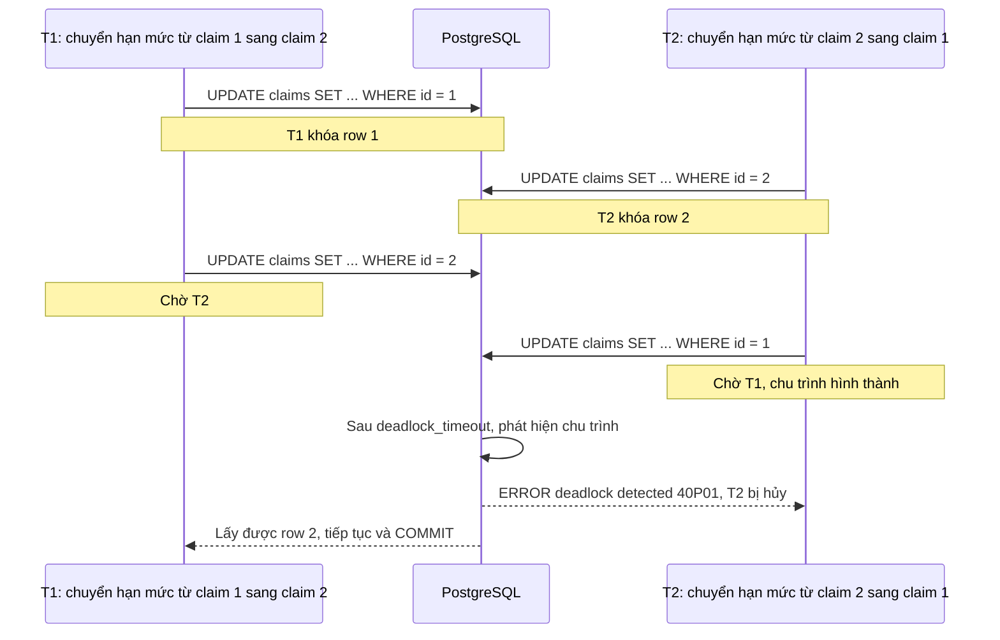

# Deadlock trong PostgreSQL

## 1. Tổng quan

Deadlock trong database xảy ra khi hai (hoặc nhiều) transaction **chờ lock của nhau theo vòng tròn**: T1 giữ lock A và chờ lock B, T2 giữ lock B và chờ lock A. Không transaction nào có thể tiếp tục.

Khác với deadlock trong process Python (không ai phát hiện, treo mãi — xem [Deadlock trong ứng dụng](../02-python-concurrency/deadlock.md)), PostgreSQL **tự phát hiện** deadlock và **hủy một transaction** để phá vòng:

```text
ERROR:  deadlock detected
DETAIL: Process 12345 waits for ShareLock on transaction 900; blocked by process 12346.
        Process 12346 waits for ShareLock on transaction 899; blocked by process 12345.
SQLSTATE: 40P01
```

Transaction bị hủy phải được ứng dụng **retry**. Deadlock không làm hỏng dữ liệu, nhưng nếu không xử lý, nó biến thành lỗi 500 ngẫu nhiên dưới tải.

## 2. Mental Model

> Deadlock là chu trình trong đồ thị "ai chờ ai". PostgreSQL định kỳ không kiểm tra đồ thị cho mọi lần chờ; nó chỉ kiểm tra khi một transaction đã chờ quá `deadlock_timeout`. Nếu tìm thấy chu trình, nó chọn một transaction trong chu trình để hủy.

## 3. Vì sao cần hiểu?

- Deadlock thường xuất hiện ở mức tải cao và biến mất ở môi trường test.
- Cách sửa hiếm khi là "thêm retry" đơn thuần; cần loại bỏ nguyên nhân bằng thứ tự khóa nhất quán.
- Cần phân biệt deadlock (có lỗi rõ ràng sau khoảng 1 giây) với chờ lock dài (không có lỗi, chỉ chậm).

## 4. Cơ chế phát hiện

1. Transaction T bắt đầu chờ một lock.
2. Nếu sau `deadlock_timeout` (mặc định **1 giây**) T vẫn chờ, backend của T chạy thuật toán kiểm tra: duyệt đồ thị chờ từ T xem có quay lại T không.
3. Nếu có chu trình, T (transaction đang kiểm tra) thường bị chọn làm nạn nhân: nhận lỗi `40P01`, transaction bị abort, mọi lock của nó được nhả.
4. Transaction còn lại lấy được lock và tiếp tục.

Kiểm tra deadlock tốn chi phí, nên PostgreSQL không kiểm tra ngay khi bắt đầu chờ (phần lớn lần chờ kết thúc tự nhiên trong vài ms). Hệ quả: mỗi deadlock làm transaction liên quan mất ít nhất khoảng `deadlock_timeout` trước khi được giải quyết.

## 5. Luồng xử lý: deadlock kinh điển



Diễn giải: cả hai transaction đều đúng logic riêng; vấn đề là chúng khóa **cùng tập row theo thứ tự ngược nhau**. Sửa bằng cách luôn khóa theo thứ tự cố định (ví dụ theo `id` tăng dần):

```sql
BEGIN;
SELECT id FROM claims WHERE id IN (1, 2) ORDER BY id FOR UPDATE;
UPDATE claims SET ... WHERE id = 1;
UPDATE claims SET ... WHERE id = 2;
COMMIT;
```

## 6. Các nguồn deadlock phổ biến

### Batch update không có thứ tự

```sql
-- Hai job cùng cập nhật tập row chồng nhau, thứ tự quét khác nhau
UPDATE claims SET status = 'expired' WHERE dealer_id = 5 AND created_at < ...;
UPDATE claims SET priority = 1 WHERE vin = ANY($1);
```

Thứ tự `UPDATE` khóa row phụ thuộc vào plan (seq scan theo thứ tự vật lý, index scan theo thứ tự index). Hai câu lệnh với plan khác nhau có thể khóa các row chung theo thứ tự khác nhau. Sửa: khóa trước bằng `SELECT ... ORDER BY id FOR UPDATE`, hoặc cập nhật theo batch nhỏ có sắp xếp.

### Bảng cha và bảng con

T1 insert `claim_lines` (lấy `FOR KEY SHARE` trên `claims` row 1) rồi update `claims` row 1. T2 làm tương tự trên cùng claim. Cả hai giữ key-share lock trên row cha, cả hai muốn nâng lên lock cập nhật → chờ nhau. Sửa: khóa row cha trước (`SELECT ... FOR UPDATE` trên `claims`) rồi mới thao tác trên bảng con.

### Upsert đồng thời trên unique index

Nhiều transaction `INSERT ... ON CONFLICT` với nhiều key theo thứ tự khác nhau có thể deadlock trên index unique. Sắp xếp key trước khi insert theo lô.

### Thứ tự thao tác khác nhau giữa các code path

Code path A: cập nhật `orders` rồi `inventory`. Code path B: cập nhật `inventory` rồi `orders`. Dưới tải, chúng deadlock. Quy ước thứ tự thao tác trên các bảng trong toàn hệ thống.

## 7. Xử lý ở ứng dụng

Deadlock (và serialization failure) là lỗi **có thể retry**: transaction bị hủy hoàn toàn, không để lại thay đổi nào. Retry **toàn bộ transaction** từ đầu, với backoff và jitter để hai transaction không va nhau lần nữa ở cùng thời điểm:

```python
RETRYABLE_SQLSTATES = {"40P01", "40001"}
```

Xem ví dụ retry đầy đủ ở [Isolation Level](isolation-level.md#8-ví-dụ-retry-transaction-trong-python).

Retry là **lưới an toàn**, không phải cách sửa. Deadlock thường xuyên nghĩa là mỗi lần xảy ra tốn ~1 giây chờ + chi phí làm lại; dưới tải cao, nó làm giảm throughput và tăng p99 đáng kể.

## 8. Deadlock hay chờ lock dài?

| | Deadlock | Chờ lock dài |
|---|---|---|
| Có chu trình | Có | Không — chỉ một chuỗi chờ |
| PostgreSQL xử lý | Hủy một transaction sau `deadlock_timeout` | Không làm gì; chờ tới khi lock được nhả hoặc timeout |
| Dấu hiệu | Lỗi `40P01` trong log | Query chậm, `wait_event_type = Lock`, không lỗi |
| Nguyên nhân thường gặp | Thứ tự khóa không nhất quán | Transaction dài, idle in transaction, DDL |
| Phòng ngừa | Thứ tự khóa nhất quán | Transaction ngắn, `lock_timeout`, `idle_in_transaction_session_timeout` |

## 9. Hành vi trong production

- Deadlock thường xuất hiện theo cụm khi tải tăng hoặc khi một job batch chạy đồng thời với traffic thường.
- Job xử lý nền (Celery worker) cập nhật cùng dữ liệu với API là nguồn deadlock phổ biến vì hai code path được viết độc lập.
- Log của PostgreSQL ghi đầy đủ câu lệnh của các transaction liên quan (`log_error_verbosity`) — thông tin quan trọng nhất để tìm thứ tự khóa sai.

## 10. Failure Modes

| Failure | Nguyên nhân | Dấu hiệu |
|---|---|---|
| 500 ngẫu nhiên | Deadlock không được retry | Lỗi `deadlock detected` trong log ứng dụng |
| p99 tăng | Nhiều deadlock, mỗi lần chờ 1 giây | Spike latency trùng với lỗi `40P01` |
| Retry storm | Retry không jitter, hai transaction va lại | Cùng cặp transaction deadlock lặp lại |
| Tác dụng phụ lặp | Retry transaction có gọi API bên ngoài | Thông báo/thanh toán lặp |

## 11. Trade-offs

| Cách | Lợi ích | Chi phí |
|---|---|---|
| Thứ tự khóa nhất quán | Loại bỏ nguyên nhân | Phải kỷ luật trên toàn codebase |
| Khóa trước tường minh (`FOR UPDATE` có `ORDER BY`) | Kiểm soát thứ tự | Khóa sớm hơn, lâu hơn |
| Transaction nhỏ hơn | Ít row bị khóa cùng lúc | Phải thiết kế trạng thái trung gian |
| Giảm `deadlock_timeout` | Phát hiện nhanh hơn | Nhiều lần kiểm tra hơn, tốn CPU |
| Retry | Người dùng không thấy lỗi | Che giấu vấn đề nếu không theo dõi tần suất |

## 12. Sai lầm thường gặp

- Chỉ thêm retry và bỏ qua nguyên nhân.
- Retry một câu lệnh thay vì cả transaction.
- Batch update lớn không sắp xếp chạy đồng thời với traffic.
- Nhầm chờ lock dài với deadlock và tìm lỗi `40P01` không tồn tại.

## 13. Cách debug

1. Tìm log PostgreSQL chứa `deadlock detected`: phần `DETAIL` liệt kê từng process, lock chờ, và câu lệnh.
2. Xác định **các code path** sinh ra các câu lệnh đó.
3. Vẽ thứ tự khóa của từng code path; tìm chỗ ngược nhau.
4. Kiểm tra số deadlock theo thời gian: `SELECT datname, deadlocks FROM pg_stat_database;`.
5. Bật `log_lock_waits = on` để thấy cả những lần chờ dài không phải deadlock.

## 14. Best Practices

- Quy ước thứ tự khóa toàn hệ thống (theo bảng và theo khóa chính tăng dần).
- Khóa trước bằng `SELECT ... ORDER BY ... FOR UPDATE` khi transaction cập nhật nhiều row.
- Giữ transaction ngắn, khóa ít row nhất có thể.
- Batch lớn chia nhỏ, sắp xếp theo khóa.
- Retry toàn bộ transaction cho `40P01` với giới hạn và jitter, và theo dõi tần suất như một metric.

## 15. Tóm tắt

- Deadlock là chu trình chờ lock; PostgreSQL phát hiện sau `deadlock_timeout` và hủy một transaction với `40P01`.
- Nguyên nhân chính là các transaction khóa cùng tập tài nguyên theo thứ tự khác nhau.
- Phòng ngừa bằng thứ tự khóa nhất quán, khóa trước có sắp xếp, transaction ngắn.
- Retry toàn bộ transaction là lưới an toàn, không phải cách sửa gốc.
- Phân biệt deadlock (có lỗi) với chờ lock dài (không lỗi, chỉ chậm).

## Liên quan

- [Locks](locks.md)
- [Transaction](transaction.md)
- [Isolation Level](isolation-level.md)
- [Deadlock trong ứng dụng Python](../02-python-concurrency/deadlock.md)
- [Database Deadlock (sự cố)](../20-production-incidents/database-deadlock.md)
