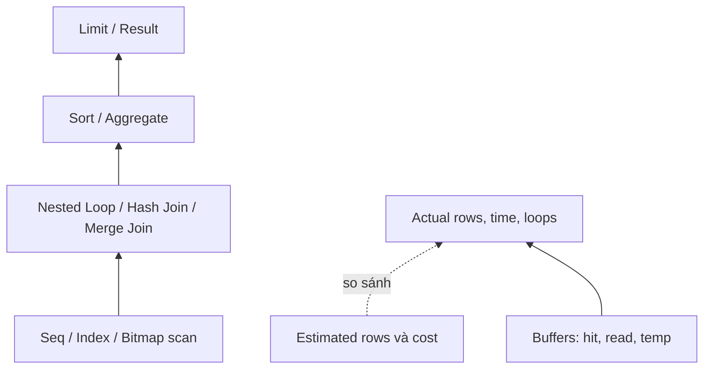

# EXPLAIN ANALYZE: đọc execution plan

## 1. Tổng quan

`EXPLAIN` in ra **execution plan** mà planner đã chọn cho một câu query: cây các node (scan, join, sort, aggregate...), kèm chi phí ước tính và số row dự đoán. `EXPLAIN ANALYZE` **thực sự chạy** query và bổ sung số liệu thật: thời gian, số row, số lần lặp. Thêm `BUFFERS` để thấy query đọc bao nhiêu page từ cache và từ disk.

```sql
EXPLAIN (ANALYZE, BUFFERS)
SELECT ...;
```

Đây là công cụ quan trọng nhất để hiểu vì sao một query chậm. Kỹ năng không nằm ở việc thuộc tên các node, mà ở việc biết **nhìn vào đâu**: chỗ ước tính lệch xa thực tế, chỗ đọc quá nhiều dữ liệu so với kết quả, chỗ spill ra disk.

## 2. Mental Model

> Plan là một cây; dữ liệu chảy **từ lá lên gốc**. Mỗi node nhận row từ node con, xử lý, và đưa lên node cha. Đọc plan từ node sâu nhất, tìm node đầu tiên mà "dự đoán" và "thực tế" bắt đầu khác nhau nhiều, hoặc nơi lượng dữ liệu đọc vượt xa lượng dữ liệu hữu ích.



Diễn giải:

1. Scan ở lá đọc dữ liệu từ bảng/index.
2. Join ghép dữ liệu từ hai nhánh.
3. Sort/Aggregate xử lý tập kết quả; Limit cắt bớt.
4. Với mỗi node, so sánh ước tính (planner) với thực tế (executor), và xem buffer để biết chi phí I/O thật.

## 3. Vì sao cần?

- Biết query **thực sự** làm gì, không phải bạn nghĩ nó làm gì.
- Phát hiện nguyên nhân gốc: thiếu index, thống kê sai, join sai thuật toán, spill ra disk.
- Kiểm chứng tối ưu: so sánh plan trước và sau khi thêm index hoặc viết lại query.

## 4. Các tùy chọn

| Tùy chọn | Tác dụng |
|---|---|
| `ANALYZE` | Chạy query, đo thời gian và số row thật |
| `BUFFERS` | Số page đọc từ cache (`hit`), từ OS/disk (`read`), bị làm bẩn, ghi, temp |
| `VERBOSE` | Cột output của từng node, tên schema đầy đủ |
| `SETTINGS` | Các tham số planner khác mặc định đang có hiệu lực |
| `WAL` | Lượng WAL sinh ra (với câu lệnh ghi) |
| `FORMAT JSON` | Output máy đọc được, dùng với công cụ trực quan hóa |
| `SERIALIZE` (17+) | Đo chi phí chuyển kết quả thành dạng gửi cho client |

> **Ghi chú version:** Từ PostgreSQL 18, `EXPLAIN ANALYZE` hiển thị `BUFFERS` mặc định. Với version cũ hơn, luôn thêm `BUFFERS` tường minh.

**Cảnh báo**: `EXPLAIN ANALYZE` **thực thi** câu lệnh. Với `UPDATE`/`DELETE`/`INSERT`, bọc trong transaction và rollback:

```sql
BEGIN;
EXPLAIN (ANALYZE, BUFFERS) UPDATE claims SET status = 'expired' WHERE ...;
ROLLBACK;
```

Ngay cả khi rollback, câu lệnh vẫn lấy lock và tạo WAL trong lúc chạy. Không chạy trên production với câu lệnh nặng nếu không cân nhắc.

## 5. Giải phẫu một dòng plan

```text
Index Scan using idx_claims_vin on claims c  (cost=0.43..8.45 rows=3 width=64) (actual time=0.021..0.030 rows=4 loops=1)
  Index Cond: (vin = 'WVW...'::text)
  Buffers: shared hit=5
```

| Thành phần | Ý nghĩa |
|---|---|
| `cost=0.43..8.45` | Chi phí ước tính: **startup** (trước khi trả row đầu tiên) .. **total** (trả hết row). Đơn vị tương đối, không phải ms |
| `rows=3` | Số row planner **dự đoán** node trả ra |
| `width=64` | Kích thước trung bình mỗi row (byte) |
| `actual time=0.021..0.030` | Thời gian thật (ms) tới row đầu tiên .. tới row cuối cùng, **tính trên mỗi loop** |
| `rows=4` | Số row thật, **trung bình mỗi loop** |
| `loops=1` | Node được chạy bao nhiêu lần |
| `Index Cond` | Điều kiện dùng để tìm trong index |
| `Filter` | Điều kiện áp dụng **sau** khi lấy row — row không thỏa bị loại |
| `Rows Removed by Filter` | Số row đọc rồi bỏ — dấu hiệu lãng phí |
| `Buffers: shared hit=5` | 5 page đọc từ `shared_buffers` |
| `shared read=N` | N page phải đọc từ OS (page cache hoặc disk) |
| `temp read/written` | Page tạm trên disk do sort/hash vượt `work_mem` |

### Quy tắc về `loops`

Với node bên trong Nested Loop, `actual time` và `rows` là **trung bình mỗi lần lặp**. Tổng thời gian ≈ `actual time (total) × loops`. Một node trông rẻ (`0.05 ms`) nhưng `loops=200000` thực tế tốn 10 giây.

Với parallel query, `loops` bao gồm leader và các worker (ví dụ `loops=3` với 2 worker); `rows` là trung bình mỗi process.

## 6. Ví dụ thực chiến: danh sách claim đang chờ duyệt

```sql
EXPLAIN (ANALYZE, BUFFERS)
SELECT c.id, c.status, c.created_at, d.name
FROM claims c
JOIN dealers d ON d.id = c.dealer_id
WHERE c.status = 'pending'
  AND c.created_at >= now() - interval '7 days'
ORDER BY c.created_at DESC
LIMIT 50;
```

### Plan trước khi tối ưu

```text
Limit  (cost=48210.55..48216.39 rows=50 width=48) (actual time=412.318..418.902 rows=50 loops=1)
  Buffers: shared hit=1204 read=38811
  ->  Gather Merge  (cost=48210.55..48489.12 rows=2388 width=48) (actual time=412.316..418.880 rows=50 loops=1)
        Workers Planned: 2
        Workers Launched: 2
        ->  Sort  (cost=47210.53..47213.51 rows=1194 width=48) (actual time=405.110..405.118 rows=38 loops=3)
              Sort Key: c.created_at DESC
              Sort Method: top-N heapsort  Memory: 31kB
              ->  Hash Join  (cost=38.50..47170.86 rows=1194 width=48) (actual time=3.2..403.7 rows=3610 loops=3)
                    Hash Cond: (c.dealer_id = d.id)
                    ->  Parallel Seq Scan on claims c  (cost=0.00..47120.00 rows=1194 width=24) (actual time=2.9..401.2 rows=3610 loops=3)
                          Filter: ((status = 'pending') AND (created_at >= (now() - '7 days'::interval)))
                          Rows Removed by Filter: 1662057
                          Buffers: shared hit=1100 read=38811
                    ->  Hash  (cost=26.00..26.00 rows=1000 width=28) (actual time=0.25..0.25 rows=1000 loops=3)
                          Buckets: 1024  Batches: 1  Memory Usage: 68kB
                          ->  Seq Scan on dealers d  (cost=0.00..26.00 rows=1000 width=28) (actual time=0.01..0.12 rows=1000 loops=3)
Planning Time: 0.412 ms
Execution Time: 419.055 ms
```

### Đọc từng bước, từ lá lên

1. **`Seq Scan on dealers`**: đọc 1.000 dealer, rất rẻ. Được đưa vào `Hash` (68 kB, 1 batch — vừa memory). Không có vấn đề.
2. **`Parallel Seq Scan on claims`** — đây là node quan trọng:
   - Mỗi process (3 process: `loops=3`) trả trung bình 3.610 row → tổng khoảng 10.800 row hữu ích.
   - `Rows Removed by Filter: 1662057` mỗi process → tổng khoảng **5 triệu row bị đọc rồi bỏ**.
   - `Buffers: read=38811` → khoảng 38.811 × 8 KB ≈ **300 MB đọc từ ngoài shared_buffers**.
   - Kết luận: để lấy 50 row, query đọc toàn bộ bảng.
3. **Ước tính vs thực tế**: planner dự đoán 1.194 row/process, thực tế 3.610 — lệch 3 lần. Không đủ lớn để là nguyên nhân chính; vấn đề chính là **không có đường truy cập tốt hơn** seq scan.
4. **`Hash Join`**: ghép 10.800 claim với dealer. Rẻ.
5. **`Sort` top-N heapsort**: chỉ giữ 50 phần tử tốt nhất, 31 kB memory. Rẻ, nhưng phải chờ **toàn bộ** input — node blocking.
6. **`Limit`**: lấy 50 row. Nhưng vì Sort là blocking, không có cách nào dừng sớm.
7. **Tổng**: 419 ms, gần như toàn bộ nằm ở bước 2.

### Tối ưu

Query luôn lọc `status = 'pending'` (hằng số) và sắp theo `created_at DESC`. Một partial index khớp chính xác:

```sql
CREATE INDEX CONCURRENTLY idx_claims_pending_created
ON claims (created_at DESC)
WHERE status = 'pending';
```

### Plan sau khi tối ưu

```text
Limit  (cost=0.71..95.33 rows=50 width=48) (actual time=0.051..0.412 rows=50 loops=1)
  Buffers: shared hit=156
  ->  Nested Loop  (cost=0.71..20512.44 rows=10835 width=48) (actual time=0.050..0.405 rows=50 loops=1)
        Buffers: shared hit=156
        ->  Index Scan using idx_claims_pending_created on claims c  (cost=0.43..8250.10 rows=10835 width=24) (actual time=0.031..0.140 rows=50 loops=1)
              Index Cond: (created_at >= (now() - '7 days'::interval))
              Buffers: shared hit=53
        ->  Index Scan using dealers_pkey on dealers d  (cost=0.28..1.13 rows=1 width=28) (actual time=0.004..0.004 rows=1 loops=50)
              Index Cond: (id = c.dealer_id)
              Buffers: shared hit=103
Planning Time: 0.380 ms
Execution Time: 0.451 ms
```

### Vì sao nhanh hơn gần 1.000 lần

1. `Index Scan` trên partial index trả claim `pending` **đã theo thứ tự** `created_at DESC`. Không còn node Sort.
2. Planner chọn `Nested Loop` thay vì Hash Join: với mỗi claim, tra dealer bằng primary key (`loops=50`, 0.004 ms mỗi lần).
3. Không còn node blocking, nên `Limit` **dừng sau 50 row**: index scan chỉ đọc 50 entry (`rows=50`) dù planner biết có khoảng 10.835 row thỏa điều kiện.
4. Chú ý `cost=0.71..95.33` của Limit: startup cost gần 0 — dấu hiệu plan streaming.
5. `Buffers: shared hit=156`, không có `read`: 156 page, tất cả từ cache.

## 7. Các dấu hiệu cần tìm

| Dấu hiệu trong plan | Ý nghĩa | Hướng xử lý |
|---|---|---|
| `rows` estimate khác actual ≥ 10 lần | Thống kê sai hoặc cột tương quan | `ANALYZE`, tăng statistics target, `CREATE STATISTICS` |
| `Rows Removed by Filter` rất lớn so với rows | Đọc nhiều bỏ nhiều | Index phù hợp, partial index |
| `Seq Scan` trên bảng lớn trả ít row | Thiếu index hoặc điều kiện không sargable | Index, viết lại điều kiện |
| Nested Loop với `loops` rất lớn | Ước tính outer quá thấp | Sửa thống kê; kiểm tra điều kiện join |
| `Sort Method: external merge Disk` | Sort vượt `work_mem` | Index cho thứ tự, tăng `work_mem` cho query đó |
| `Hash ... Batches: 16` | Hash join spill | Tăng `work_mem`, giảm cột trong hash, sửa ước tính |
| `Heap Fetches` lớn trong Index Only Scan | Visibility map chưa cập nhật | VACUUM bảng |
| `Heap Blocks: lossy=...` | Bitmap vượt `work_mem`, phải recheck cả page | Tăng `work_mem`, index chọn lọc hơn |
| `shared read` lớn | Dữ liệu không nằm trong cache | Giảm dữ liệu đọc; cache nguội sau restart |
| Planning Time lớn | Nhiều join, nhiều partition | Prepared statement, giảm partition phải xét |

## 8. Plan trong production khác plan khi test

`EXPLAIN ANALYZE` chạy một query đơn lẻ, thường với cache nóng. Trong production:

- **Concurrency**: hàng trăm query cùng lúc tranh CPU, I/O, lock.
- **Cache**: dữ liệu có thể không nằm trong cache.
- **Lock wait**: `EXPLAIN ANALYZE` không phân biệt thời gian chờ lock với thời gian xử lý.
- **Tham số khác**: prepared statement dùng generic plan; giá trị tham số lệch cho plan khác. Xem [Query Lifecycle](query-lifecycle.md#7-prepared-statement-và-plan-cache).
- **Dữ liệu khác**: staging nhỏ hơn cho plan khác.

Để thấy plan thật trong production, dùng `auto_explain`:

```text
shared_preload_libraries = 'auto_explain'
auto_explain.log_min_duration = '500ms'
auto_explain.log_analyze = on
auto_explain.log_buffers = on
auto_explain.sample_rate = 0.1
```

`log_analyze` tốn chi phí đo thời gian cho mọi query được lấy mẫu; dùng `sample_rate` để giới hạn.

## 9. Failure Modes

| Failure | Nguyên nhân | Dấu hiệu |
|---|---|---|
| Thay đổi dữ liệu ngoài ý muốn | `EXPLAIN ANALYZE` câu lệnh ghi không rollback | Dữ liệu bị cập nhật khi "chỉ kiểm tra plan" |
| Kết luận sai | Test trên dữ liệu nhỏ, cache nóng | Tối ưu không có tác dụng ở production |
| Đọc sai thời gian | Quên nhân với `loops` | Bỏ qua node thật sự tốn thời gian |
| Plan lệch production | Prepared statement dùng generic plan | Query chậm ở app nhưng nhanh khi chạy tay |

## 10. Sai lầm thường gặp

- Đọc `cost` như thời gian.
- Chỉ nhìn tổng Execution Time mà không tìm node gây tốn.
- Bỏ qua `BUFFERS`.
- Chạy `EXPLAIN` không `ANALYZE` rồi kết luận về thời gian.
- Thử query với giá trị literal trong khi app dùng tham số.

## 11. Cách debug: quy trình

1. Lấy query tốn nhiều nhất từ `pg_stat_statements` (theo `total_exec_time`, không chỉ `mean`).
2. Lấy giá trị tham số thật (từ log, `auto_explain`).
3. Chạy `EXPLAIN (ANALYZE, BUFFERS)` trên bản sao dữ liệu có kích thước thật, hoặc trên replica.
4. Từ lá lên gốc: tìm node đầu tiên có ước tính lệch lớn, `Rows Removed` lớn, `read` lớn, spill.
5. Đặt giả thuyết (thiếu index, thống kê sai, điều kiện không sargable), sửa **một** thứ.
6. Chạy lại, so sánh plan và buffers.
7. Theo dõi `pg_stat_statements` sau khi deploy.

Công cụ trực quan hóa (PEV2, explain.depesz.com) giúp đọc plan lớn bằng cách tô màu node tốn thời gian — hữu ích, nhưng không thay được hiểu biết về từng node.

## 12. Best Practices

- Luôn dùng `EXPLAIN (ANALYZE, BUFFERS)`; thêm `SETTINGS` khi so sánh môi trường.
- Bọc câu lệnh ghi trong `BEGIN ... ROLLBACK`.
- Kiểm tra trên dữ liệu có kích thước và phân phối giống production.
- Bật `auto_explain` có lấy mẫu để bắt plan chậm trong production.
- Giữ lại plan trước và sau mỗi tối ưu như bằng chứng.

## 13. Tóm tắt

- `EXPLAIN` hiển thị plan và ước tính; `ANALYZE` chạy thật và đo; `BUFFERS` cho biết I/O.
- Đọc từ lá lên gốc; tìm nơi ước tính lệch thực tế, nơi đọc nhiều bỏ nhiều, nơi spill.
- `actual time` và `rows` là trung bình mỗi loop; nhân với `loops` để có tổng.
- Node blocking (Sort, Hash) ngăn `Limit` dừng sớm; index cho thứ tự sẵn biến plan thành streaming.
- Plan khi test có thể khác production; `auto_explain` và `pg_stat_statements` cho thấy thực tế.

## Liên quan

- [Query Lifecycle](query-lifecycle.md)
- [Query Optimization](query-optimization.md)
- [Index](index.md)
- [Database High CPU](../20-production-incidents/database-high-cpu.md)
