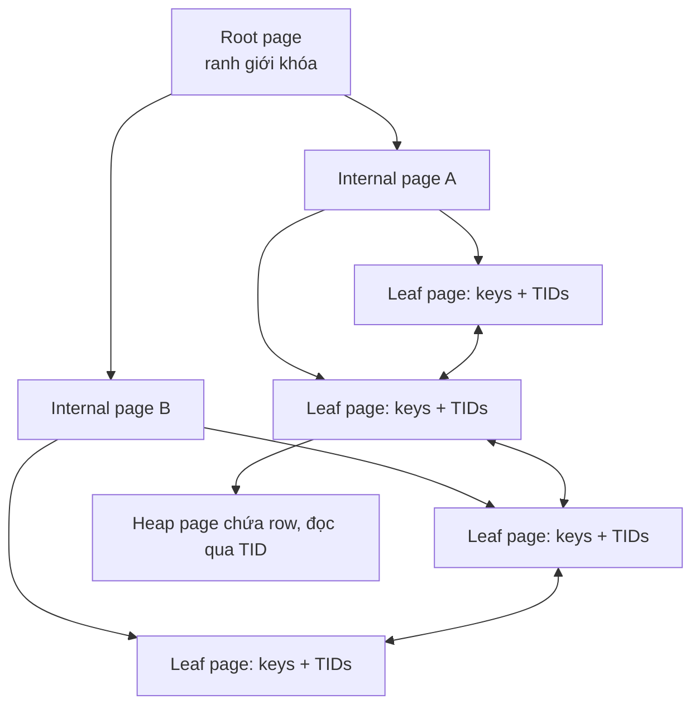
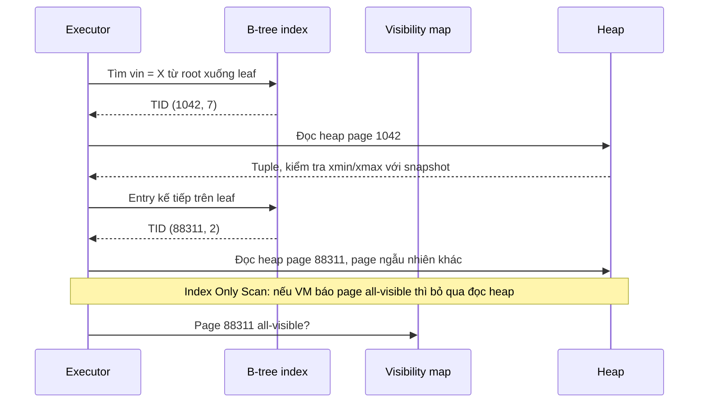

# Index trong PostgreSQL

## 1. Tổng quan

Index là một cấu trúc dữ liệu **phụ**, tách khỏi bảng, lưu các giá trị của một hoặc vài cột theo cách dễ tìm kiếm, kèm con trỏ (TID) về vị trí row trong bảng. Không có index, tìm `WHERE vin = 'X'` trong bảng 500 triệu row nghĩa là đọc toàn bộ bảng. Có index B-tree, PostgreSQL đọc khoảng 4–5 page index và 1 page bảng.

Nhưng index không miễn phí: mỗi `INSERT`, mỗi `UPDATE` (trong nhiều trường hợp), mỗi `DELETE` đều phải cập nhật **mọi** index của bảng. Index chiếm disk, chiếm cache, tăng WAL, tăng thời gian VACUUM.

Tài liệu này giải thích index B-tree (loại mặc định và phổ biến nhất) hoạt động thế nào, cách thiết kế index cho query, và cái giá của index. Các loại index khác (GIN, GiST, BRIN, Hash) ở [Các loại index](btree-hash-gin-gist-brin.md).

## 2. Mental Model

> Index giống mục lục cuối sách: các từ khóa được **sắp xếp**, mỗi từ khóa kèm số trang. Tìm từ khóa trong mục lục nhanh vì nó đã sắp xếp; sau đó vẫn phải lật tới trang đó để đọc nội dung. Mỗi khi thêm một trang mới vào sách, mục lục phải được cập nhật.

Hai hệ quả của mental model:

- Index chỉ giúp khi bạn tìm theo **thứ tự mà mục lục được sắp**. Mục lục sắp theo họ rồi tên không giúp tìm người theo tên riêng.
- Nếu cần đọc 40% số trang của sách, đọc thẳng từ đầu tới cuối còn nhanh hơn tra mục lục cho từng trang.

## 3. Vì sao cần index?

- Tìm kiếm theo điều kiện chọn lọc: `WHERE id = ?`, `WHERE vin = ?`.
- Lấy dữ liệu **đã sắp xếp**: `ORDER BY created_at DESC LIMIT 20` mà không phải sort cả bảng.
- Đảm bảo tính duy nhất: primary key, unique constraint được cài đặt bằng unique index.
- Hỗ trợ join: nested loop join dùng index trên cột join của bảng bên trong.
- Hỗ trợ foreign key: xóa/cập nhật row cha cần tìm row con theo cột FK.

## 4. Cơ chế hoạt động: B-tree



Diễn giải:

1. B-tree là cây **cân bằng**: mọi leaf cùng độ sâu. Mỗi page là 8 KB, chứa hàng trăm key, nên cây rất "thấp": bảng 500 triệu row thường chỉ có 4–5 tầng.
2. **Root và internal page** chứa key phân tách và con trỏ tới page con. Tìm kiếm bắt đầu từ root, tìm nhị phân trong page để chọn nhánh, đi xuống.
3. **Leaf page** chứa các index entry đã sắp xếp: `(key, TID)`. TID là `(số page, vị trí)` của row trong heap.
4. Các leaf page nối với nhau hai chiều, cho phép **range scan**: tìm key đầu tiên ≥ X, rồi đi ngang qua các leaf kế tiếp cho tới khi vượt Y.
5. Với mỗi entry khớp, executor theo TID đọc heap page để lấy row và kiểm tra visibility MVCC.

PostgreSQL cài đặt B-tree theo thuật toán Lehman–Yao, cho phép tìm kiếm đồng thời với việc chèn/tách page mà không khóa cả cây. Từ PostgreSQL 13, **deduplication** gộp các entry trùng key thành một entry với danh sách TID, giảm kích thước index với cột có nhiều giá trị lặp.

## 5. Bên trong hệ thống xảy ra gì khi Index Scan chạy?



Diễn giải:

1. Tìm trong index rất rẻ: vài page, thường đã nằm trong cache.
2. Chi phí thật nằm ở **đọc heap theo TID**: các row thỏa điều kiện thường nằm rải rác ở nhiều page → mỗi row có thể là một lần đọc page ngẫu nhiên.
3. Nếu query cần 5 row, chi phí nhỏ. Nếu cần 2 triệu row nằm rải rác, 2 triệu lần đọc ngẫu nhiên đắt hơn nhiều so với đọc tuần tự toàn bảng. Đó là lúc planner chọn **Seq Scan** hoặc **Bitmap Heap Scan** (gom TID theo page rồi đọc heap theo thứ tự vật lý). Xem [Query Optimization](query-optimization.md).
4. **Index Only Scan**: nếu mọi cột query cần đều có trong index **và** visibility map đánh dấu page heap là all-visible, executor không cần đọc heap. `Heap Fetches` trong EXPLAIN cho biết bao nhiêu lần vẫn phải đọc heap.

## 6. Thiết kế index cho query

### Composite index: thứ tự cột quyết định mọi thứ

Index trên `(dealer_id, status, created_at)` sắp xếp entry theo `dealer_id`, trong cùng `dealer_id` theo `status`, trong cùng `status` theo `created_at`:

| dealer_id | status | created_at |
|---|---|---|
| 10 | approved | 2026-01-03 |
| 10 | approved | 2026-02-11 |
| 10 | pending | 2026-01-20 |
| 10 | pending | 2026-03-02 |
| 11 | approved | 2026-01-05 |

Index này phục vụ tốt:

- `WHERE dealer_id = 10`
- `WHERE dealer_id = 10 AND status = 'pending'`
- `WHERE dealer_id = 10 AND status = 'pending' AND created_at > '2026-02-01'`
- `WHERE dealer_id = 10 AND status = 'pending' ORDER BY created_at DESC LIMIT 20` — không cần sort

Không phục vụ tốt (theo quy tắc cổ điển):

- `WHERE status = 'pending'` — thiếu cột đầu `dealer_id`.
- `WHERE dealer_id = 10 AND created_at > ...` — `status` ở giữa không có điều kiện; index chỉ dùng được phần `dealer_id`, `created_at` phải lọc từng entry.

Quy tắc thực hành: **cột so sánh bằng (=) trước, cột khoảng (range) hoặc sắp xếp sau**. Một khi gặp điều kiện range, các cột phía sau không còn được dùng để thu hẹp tìm kiếm.

> **Ghi chú version:** PostgreSQL 18 bổ sung **skip scan** cho B-tree nhiều cột: khi cột đầu có ít giá trị khác nhau, index vẫn có thể được dùng cho điều kiện trên cột sau (ví dụ `WHERE status = 'pending'` với index `(region, status)` khi `region` có ít giá trị). Quy tắc "cột đầu tiên" vẫn là nguyên tắc thiết kế đúng; skip scan chỉ là tối ưu thêm.

### Covering index với `INCLUDE`

```sql
CREATE INDEX idx_claims_vin_created
ON claims (vin, created_at DESC)
INCLUDE (status, total_amount);
```

Cột trong `INCLUDE` được lưu ở leaf nhưng không tham gia sắp xếp. Query `SELECT status, total_amount FROM claims WHERE vin = ? ORDER BY created_at DESC LIMIT 20` có thể thành Index Only Scan. Đổi lại index lớn hơn.

### Partial index

```sql
CREATE INDEX idx_claims_pending ON claims (created_at) WHERE status = 'pending';
```

Chỉ index các row `pending` — nếu chúng chỉ chiếm 1% bảng, index nhỏ 100 lần, nhanh hơn, ít tốn chi phí ghi (row không thỏa điều kiện không cần cập nhật index). Planner chỉ dùng khi chứng minh được điều kiện của query **suy ra** điều kiện của index (query phải có `status = 'pending'`, và thường cần là hằng số, không phải tham số).

### Expression index

```sql
CREATE INDEX idx_users_email_lower ON users (lower(email));
-- query phải dùng đúng biểu thức: WHERE lower(email) = lower($1)
```

### Unique index và constraint

Unique constraint được cài đặt bằng unique index. Đây là công cụ mạnh nhất chống [race condition](../02-python-concurrency/race-condition.md) kiểu kiểm tra-rồi-insert: database đảm bảo tính duy nhất bất kể bao nhiêu transaction đồng thời.

### Index trên cột foreign key

PostgreSQL **không** tự tạo index trên cột FK ở bảng con. Khi xóa một row cha (`DELETE FROM dealers WHERE id = 5`), PostgreSQL phải kiểm tra bảng con `claims` có row nào `dealer_id = 5` không. Không có index → seq scan bảng con cho mỗi row cha bị xóa, giữ lock trong suốt thời gian đó.

## 7. Cái giá của index

### Write amplification

Bảng có 6 index: mỗi `INSERT` ghi 1 heap tuple + 6 index entry + WAL cho cả 7. Mỗi `UPDATE` thông thường tạo phiên bản tuple mới ([MVCC](mvcc.md)) và phải thêm entry mới vào **mọi** index, kể cả index trên cột không đổi.

### HOT update

**Heap-Only Tuple (HOT)**: nếu `UPDATE` không thay đổi cột nào có index **và** page hiện tại còn đủ chỗ cho phiên bản mới, PostgreSQL đặt phiên bản mới trên cùng page và nối từ phiên bản cũ, **không cập nhật index nào**. HOT giảm mạnh chi phí update.

Hệ quả thiết kế:

- Tránh index trên cột bị update liên tục (`updated_at`, `last_seen_at`, counter) nếu không thực sự cần — chúng phá HOT.
- Đặt `fillfactor` < 100 (ví dụ 80–90) cho bảng update nhiều để page còn chỗ cho HOT.
- Theo dõi tỷ lệ HOT: `n_tup_hot_upd / n_tup_upd` trong `pg_stat_user_tables`.

### Chi phí khác

- Disk và cache: index lớn chiếm `shared_buffers`, đẩy dữ liệu khác ra khỏi cache.
- VACUUM phải quét mọi index để dọn entry trỏ tới tuple chết.
- Index bloat theo thời gian với update/delete nhiều; `REINDEX CONCURRENTLY` (PostgreSQL 12+) xây lại không khóa ghi.

## 8. Tạo index trên bảng đang chạy

```sql
CREATE INDEX CONCURRENTLY idx_claims_dealer ON claims (dealer_id);
```

- `CREATE INDEX` thường giữ lock SHARE trên bảng: chặn mọi INSERT/UPDATE/DELETE trong suốt thời gian tạo (có thể hàng chục phút với bảng lớn).
- `CONCURRENTLY` cho phép ghi tiếp, đổi lại: quét bảng hai lần, chậm hơn, phải chờ các transaction đang chạy kết thúc, không chạy được trong transaction block.
- Nếu thất bại giữa chừng, để lại index ở trạng thái `INVALID` — vẫn tốn chi phí ghi nhưng không được dùng để đọc. Phải `DROP INDEX CONCURRENTLY` rồi tạo lại.

## 9. Khi nào index không được dùng?

| Nguyên nhân | Ví dụ | Cách xử lý |
|---|---|---|
| Selectivity thấp | `WHERE status = 'done'` với 95% row là 'done' | Đúng là seq scan rẻ hơn; không cần sửa |
| Hàm trên cột | `WHERE date(created_at) = '2026-01-01'` | Viết thành khoảng: `created_at >= ... AND created_at < ...`, hoặc expression index |
| Ép kiểu ngầm | So sánh cột `text` với tham số kiểu khác | Dùng đúng kiểu tham số |
| `LIKE '%abc'` | Wildcard ở đầu | GIN với `pg_trgm` |
| Không có cột đầu của composite | Index `(a, b)`, điều kiện chỉ `b` | Index khác, hoặc đổi thứ tự cột |
| Thống kê cũ | Sau import lớn | `ANALYZE` |
| Bảng nhỏ | Vài page | Seq scan rẻ hơn; bình thường |
| `OR` giữa cột khác nhau | `WHERE a = 1 OR b = 2` | Planner có thể dùng BitmapOr; hoặc viết `UNION` |

## 10. Hành vi trong production

- **Index thừa** là chi phí vô hình: làm chậm mọi thao tác ghi, tăng WAL và replication lag, tăng thời gian vacuum. Rà soát định kỳ index không bao giờ được dùng.
- **Index trùng lặp**: `(a)` và `(a, b)` — index `(a, b)` đã phục vụ các query chỉ lọc `a`; `(a)` thường thừa (trừ khi cần nhỏ gọn cho một đường nóng).
- **Index trên bảng write-heavy** (log, event, telemetry) cần cân nhắc rất kỹ; BRIN thường phù hợp hơn cho cột thời gian.
- **Tạo index trong migration** phải `CONCURRENTLY` và có `lock_timeout`; thất bại để lại index INVALID cần dọn.

## 11. Trade-offs

| Lựa chọn | Lợi ích | Chi phí |
|---|---|---|
| Nhiều index | Nhiều query nhanh | Ghi chậm, WAL lớn, cache bị chia sẻ |
| Composite rộng | Một index phục vụ nhiều query | Index lớn, cập nhật nhiều hơn |
| Covering (`INCLUDE`) | Index Only Scan | Index lớn hơn |
| Partial | Nhỏ, rẻ khi ghi | Chỉ phục vụ query có đúng điều kiện |
| Expression | Hỗ trợ điều kiện có hàm | Query phải dùng đúng biểu thức |

## 12. Sai lầm thường gặp

- Tạo index riêng cho từng cột thay vì composite theo query thật.
- Đặt cột range trước cột equality trong composite.
- Quên index trên cột foreign key.
- Tạo index trên bảng lớn không dùng `CONCURRENTLY`.
- Index cột `updated_at` bị update mọi lúc, phá HOT update.
- Kết luận "index vô dụng" khi planner chọn seq scan với điều kiện ít chọn lọc.

## 13. Cách debug

```sql
-- Index nào không bao giờ được dùng (từ lần reset thống kê gần nhất)
SELECT schemaname, relname, indexrelname, idx_scan,
       pg_size_pretty(pg_relation_size(indexrelid)) AS size
FROM pg_stat_user_indexes
WHERE idx_scan = 0
ORDER BY pg_relation_size(indexrelid) DESC;

-- Tỷ lệ HOT update
SELECT relname, n_tup_upd, n_tup_hot_upd,
       round(100.0 * n_tup_hot_upd / nullif(n_tup_upd, 0), 1) AS hot_pct
FROM pg_stat_user_tables ORDER BY n_tup_upd DESC LIMIT 10;

-- Index INVALID
SELECT indexrelid::regclass FROM pg_index WHERE NOT indisvalid;
```

Luôn kiểm tra bằng `EXPLAIN (ANALYZE, BUFFERS)` trên dữ liệu thật trước và sau khi thêm index. Xem [EXPLAIN ANALYZE](explain-analyze.md).

## 14. Best Practices

- Thiết kế index từ **query thật** (lấy từ `pg_stat_statements`), không từ cấu trúc bảng.
- Composite: equality trước, range/sort sau; khớp với `ORDER BY` để bỏ sort.
- Index cột FK ở bảng con.
- Dùng partial index cho tập con nhỏ được truy vấn nhiều (hàng đợi `pending`).
- `CREATE INDEX CONCURRENTLY` với `lock_timeout` trong migration.
- Định kỳ loại bỏ index không dùng và index trùng lặp.
- Giữ HOT update bằng cách tránh index cột thay đổi liên tục và điều chỉnh `fillfactor`.

## 15. Tóm tắt

- B-tree là cây cân bằng thấp; leaf chứa key đã sắp xếp và TID trỏ về heap, leaf nối nhau cho range scan.
- Chi phí chính của index scan là đọc heap ngẫu nhiên theo TID; với nhiều row, seq scan hoặc bitmap scan rẻ hơn.
- Composite index sắp theo thứ tự cột: equality trước, range và sort sau.
- Covering, partial, expression index giải quyết các trường hợp riêng.
- Mỗi index làm ghi chậm hơn; HOT update tránh cập nhật index khi cột có index không đổi.

## Liên quan

- [Các loại index: B-tree, Hash, GIN, GiST, BRIN](btree-hash-gin-gist-brin.md)
- [Query Lifecycle](query-lifecycle.md)
- [EXPLAIN ANALYZE](explain-analyze.md)
- [Query Optimization](query-optimization.md)
- [MVCC](mvcc.md)
- [Large Table Design](large-table-design.md)
