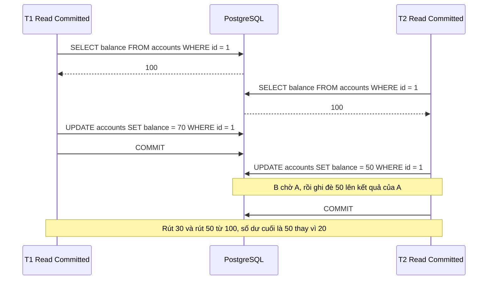
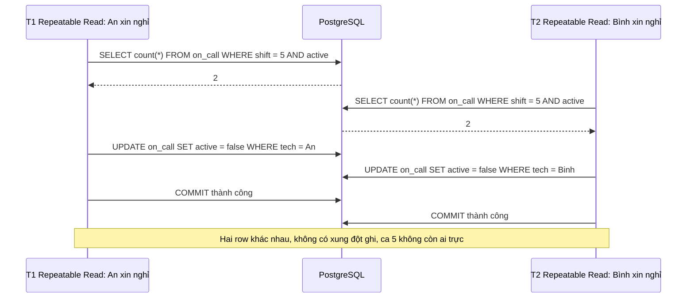

# Isolation Level

## 1. Tổng quan

Isolation level quyết định **mức độ một transaction nhìn thấy thay đổi của các transaction đồng thời**, và từ đó quyết định những **bất thường** (anomaly) nào có thể xảy ra. Mức càng cao, càng ít bất thường, nhưng càng nhiều xung đột phải xử lý (chờ hoặc retry).

PostgreSQL hỗ trợ bốn mức theo chuẩn SQL, nhưng thực tế chỉ có ba hành vi khác nhau:

| Mức | Hành vi trong PostgreSQL |
|---|---|
| Read Uncommitted | Giống Read Committed (PostgreSQL không bao giờ cho đọc dữ liệu chưa commit) |
| **Read Committed** (mặc định) | Snapshot mới cho mỗi câu lệnh |
| **Repeatable Read** | Một snapshot cho cả transaction (snapshot isolation) |
| **Serializable** | Snapshot isolation + phát hiện xung đột (SSI), đảm bảo kết quả như chạy tuần tự |

## 2. Mental Model

> Isolation level trả lời: "trong transaction của tôi, khi tôi đọc lại, tôi thấy thế giới ở thời điểm nào?" — ở mỗi câu lệnh (Read Committed), hay đóng băng từ đầu transaction (Repeatable Read). Serializable thêm một người trọng tài: nếu các transaction đồng thời tạo ra kết quả không thể có khi chạy tuần tự, một transaction bị hủy.

Isolation level không phải công tắc "an toàn/không an toàn". Việc chọn mức nào bắt đầu từ câu hỏi: **invariant nào cần bảo vệ, và bất thường nào có thể phá nó?**

## 3. Vì sao cần hiểu?

Với mặc định Read Committed, nhiều pattern phổ biến có race condition:

- Đọc số dư, kiểm tra đủ tiền, trừ tiền → mất cập nhật.
- Kiểm tra "còn ít nhất một người trực" rồi cho một người nghỉ → cả hai người cùng nghỉ.
- Đọc hai lần trong một báo cáo cho hai con số không khớp nhau.

Hiểu anomaly giúp chọn công cụ đúng: câu lệnh nguyên tử, lock, constraint, hoặc isolation cao hơn.

## 4. Các anomaly

| Anomaly | Mô tả | RC | RR | Serializable |
|---|---|---|---|---|
| Dirty read | Đọc dữ liệu chưa commit của transaction khác | Không | Không | Không |
| Non-repeatable read | Đọc lại một row, thấy giá trị khác (ai đó đã update và commit) | **Có** | Không | Không |
| Phantom read | Chạy lại cùng điều kiện, thấy tập row khác (ai đó insert/delete) | **Có** | Không (PostgreSQL chặt hơn chuẩn) | Không |
| Lost update | Hai transaction đọc-sửa-ghi cùng row, một cập nhật bị mất | **Có** (với pattern đọc rồi ghi giá trị tuyệt đối) | Không (lỗi serialization) | Không |
| Write skew | Hai transaction đọc tập dữ liệu chồng nhau, ghi vào row khác nhau, cùng nhau phá invariant | **Có** | **Có** | Không |
| Read-only anomaly | Transaction chỉ đọc thấy trạng thái không thể có trong mọi thứ tự tuần tự | Có | Có | Không |

## 5. Read Committed

Mỗi câu lệnh lấy snapshot mới tại thời điểm bắt đầu câu lệnh.

### Non-repeatable read

```sql
-- T1
BEGIN;
SELECT total FROM claims WHERE id = 1;   -- 100
                                          -- T2: UPDATE claims SET total = 150 WHERE id = 1; COMMIT;
SELECT total FROM claims WHERE id = 1;   -- 150
COMMIT;
```

Báo cáo đọc tổng rồi đọc chi tiết có thể thấy hai con số không khớp.

### UPDATE trong Read Committed: đọc lại phiên bản mới nhất

Khi `UPDATE ... WHERE` gặp row đang bị transaction khác sửa, nó **chờ**. Khi transaction kia commit, PostgreSQL lấy **phiên bản mới nhất** của row, **kiểm tra lại điều kiện WHERE** trên phiên bản đó, rồi mới cập nhật. Cơ chế này (EvalPlanQual) làm cho câu lệnh nguyên tử an toàn:

```sql
UPDATE products SET stock = stock - 1 WHERE id = 7 AND stock >= 1;
```

Hai transaction đồng thời: transaction thứ hai chờ, thấy `stock` đã giảm, kiểm tra lại `stock >= 1`, và hoặc cập nhật trên giá trị mới, hoặc không cập nhật row nào.

### Lost update trong Read Committed



Diễn giải: vấn đề không phải ở câu `UPDATE`, mà ở việc giá trị mới được **tính trong ứng dụng** từ lần đọc cũ. Database không biết `50` được tính từ `100`. Sửa bằng một trong các cách:

- `UPDATE accounts SET balance = balance - 50 WHERE id = 1 AND balance >= 50` (nguyên tử).
- `SELECT ... FOR UPDATE` trước khi đọc (khóa row, T2 phải chờ T1 và đọc giá trị mới).
- Optimistic locking với cột `version`.
- Repeatable Read (T2 nhận lỗi serialization và phải retry).

## 6. Repeatable Read (snapshot isolation)

Snapshot được lấy ở câu lệnh đầu tiên và dùng cho **cả transaction**. Mọi lần đọc đều thấy cùng một trạng thái.

Khi transaction RR cố cập nhật row đã bị transaction khác sửa và commit **sau** khi snapshot của nó được lấy, PostgreSQL không thể "đọc lại phiên bản mới" (vì như vậy phá vỡ snapshot), nên báo lỗi:

```text
ERROR: could not serialize access due to concurrent update
SQLSTATE 40001
```

Ứng dụng phải **retry toàn bộ transaction**. Đây là cách RR ngăn lost update.

### Write skew: RR vẫn chưa đủ

Invariant: mỗi ca phải có ít nhất một kỹ thuật viên trực.



Diễn giải: mỗi transaction đọc một tập dữ liệu (cả hai row), rồi ghi vào **row khác nhau**. Không có xung đột ghi-ghi, nên snapshot isolation không phát hiện. Kết quả cuối phá invariant dù mỗi transaction riêng lẻ đều đúng. Đây là **write skew**.

Sửa bằng:

- **Serializable** (phát hiện và hủy một transaction).
- **Khóa tập dữ liệu được đọc**: `SELECT ... FROM on_call WHERE shift = 5 FOR UPDATE` — cả hai transaction khóa cùng các row, transaction thứ hai phải chờ và thấy trạng thái mới.
- **Materialize xung đột**: một row đại diện cho ca (`shifts`), mọi thay đổi trực ca đều `UPDATE shifts SET ... WHERE id = 5` — biến write skew thành xung đột ghi trên cùng một row.
- **Constraint** nếu invariant diễn đạt được (exclusion constraint, trigger kiểm tra).

## 7. Serializable (SSI)

PostgreSQL cài đặt Serializable bằng **Serializable Snapshot Isolation** (từ 9.1):

1. Mỗi transaction chạy với snapshot isolation như RR.
2. Thêm vào đó, PostgreSQL theo dõi **quan hệ đọc-ghi** giữa các transaction đồng thời bằng predicate lock (`SIReadLock`) — ghi nhận "T1 đã đọc dữ liệu mà T2 sau đó ghi".
3. Khi phát hiện một cấu trúc nguy hiểm (hai cạnh đọc-ghi liên tiếp tạo thành vòng có thể dẫn tới kết quả không tuần tự hóa được), một transaction bị hủy với lỗi `40001`.

Predicate lock **không chặn** ai; chúng chỉ được dùng để phát hiện. Không có deadlock phát sinh từ chúng.

Đặc điểm:

- Đảm bảo: nếu mọi transaction đều chạy ở Serializable và commit thành công, kết quả tương đương một thứ tự tuần tự nào đó. Không cần suy nghĩ về từng anomaly.
- Chi phí: theo dõi predicate lock tốn memory và CPU; có **false positive** (hủy transaction dù thực ra không có vấn đề), tăng khi transaction đọc nhiều (seq scan khóa theo mức bảng/page).
- Bắt buộc: ứng dụng phải có **retry toàn bộ transaction** cho lỗi `40001`.
- Transaction chỉ đọc có thể khai báo `SERIALIZABLE READ ONLY DEFERRABLE` để chờ một snapshot an toàn và không bao giờ bị hủy — phù hợp cho báo cáo.

## 8. Ví dụ: retry transaction trong Python

```python
import asyncio
import random
from sqlalchemy.exc import DBAPIError

RETRYABLE = {"40001", "40P01"}   # serialization_failure, deadlock_detected

async def run_serializable(sessionmaker, work, attempts: int = 5):
    for attempt in range(1, attempts + 1):
        async with sessionmaker() as session:
            try:
                async with session.begin():
                    await session.connection(execution_options={"isolation_level": "SERIALIZABLE"})
                    return await work(session)
            except DBAPIError as exc:
                code = getattr(exc.orig, "sqlstate", None)
                if code not in RETRYABLE or attempt == attempts:
                    raise
        await asyncio.sleep(random.uniform(0, 0.05 * 2 ** attempt))   # backoff có jitter
```

- `work` phải chạy lại **toàn bộ** logic đọc và ghi, không dùng dữ liệu đọc từ lần thử trước.
- Không có tác dụng phụ bên ngoài (gọi API, gửi email) bên trong `work` — chúng sẽ lặp lại mỗi lần retry.
- Giới hạn số lần thử và dùng [backoff với jitter](../10-distributed-systems/retry.md).

## 9. Hành vi trong production

- **Phần lớn hệ thống chạy Read Committed** và bảo vệ invariant bằng câu lệnh nguyên tử, `FOR UPDATE`, constraint và optimistic version. Cách này dễ dự đoán hiệu năng.
- **Serializable** phù hợp khi invariant phức tạp, liên quan nhiều row, khó diễn đạt bằng lock; và khi team sẵn sàng xây dựng retry chuẩn. Tỷ lệ lỗi `40001` tăng theo mức độ tranh chấp.
- **Mức isolation được đặt theo transaction**, không nhất thiết toàn hệ thống: báo cáo nhất quán dùng RR read-only; nghiệp vụ nhạy cảm dùng Serializable; phần còn lại RC.
- **Retry không có giới hạn** khi tranh chấp cao có thể tạo livelock và tải tăng vọt.

## 10. Failure Modes

| Failure | Nguyên nhân | Dấu hiệu |
|---|---|---|
| Lost update | RC + đọc rồi ghi giá trị tính trong ứng dụng | Số liệu sai lệch, không có lỗi |
| Write skew | RC/RR + invariant trên nhiều row | Invariant bị phá hiếm khi, dưới tải |
| Lỗi 40001 không được xử lý | RR/Serializable không có retry | Request lỗi 500 ngẫu nhiên khi tranh chấp |
| Retry lặp tác dụng phụ | Gọi API bên ngoài trong transaction retry | Email/thanh toán lặp |
| Nhiều false positive | Serializable + seq scan lớn | Tỷ lệ 40001 cao dù ít xung đột thật |

## 11. Trade-offs

| Mức | Bảo vệ | Chi phí |
|---|---|---|
| Read Committed + lock/constraint tường minh | Invariant được chọn, rõ ràng | Phải nhận diện đúng mọi race; dễ sót |
| Repeatable Read | Snapshot nhất quán, chống lost update | Lỗi serialization cần retry; vẫn có write skew |
| Serializable | Mọi anomaly | Retry bắt buộc, overhead theo dõi, false positive |

## 12. Sai lầm thường gặp

- Nghĩ Repeatable Read chống được mọi race condition (còn write skew).
- Dùng RR/Serializable mà không có retry.
- Retry chỉ câu lệnh lỗi thay vì cả transaction.
- Đặt tác dụng phụ bên ngoài bên trong transaction có retry.
- Đổi isolation level toàn hệ thống mà không đo tỷ lệ lỗi và hiệu năng.

## 13. Cách debug

```sql
-- Isolation hiện tại
SHOW transaction_isolation;

-- Số lỗi serialization/deadlock theo database (PostgreSQL 14+ có thêm thống kê theo loại trong log)
SELECT datname, conflicts, deadlocks FROM pg_stat_database;
```

Log `SQLSTATE` của mọi exception database ở ứng dụng; metric số lần retry theo loại lỗi và theo endpoint.

## 14. Best Practices

- Bắt đầu từ invariant: xác định anomaly nào có thể phá nó.
- Ưu tiên câu lệnh nguyên tử và constraint; dùng `FOR UPDATE` khi cần đọc-sửa-ghi.
- Dùng Serializable cho nghiệp vụ có invariant phức tạp, luôn kèm retry toàn bộ transaction có giới hạn và jitter.
- Giữ transaction ngắn để giảm xung đột ở mọi mức.
- Báo cáo nhất quán dùng `REPEATABLE READ READ ONLY` hoặc `SERIALIZABLE READ ONLY DEFERRABLE`, tốt nhất trên replica.

## 15. Tóm tắt

- PostgreSQL có ba hành vi: Read Committed (snapshot mỗi câu lệnh), Repeatable Read (snapshot mỗi transaction), Serializable (SSI).
- RC cho phép non-repeatable read, phantom, lost update (với đọc-rồi-ghi) và write skew.
- RR chống lost update bằng lỗi serialization nhưng vẫn cho phép write skew.
- Serializable phát hiện mọi anomaly và hủy transaction; ứng dụng bắt buộc retry toàn bộ transaction.
- Chọn công cụ theo invariant: câu lệnh nguyên tử, lock, constraint, hoặc isolation cao hơn.

## Liên quan

- [MVCC](mvcc.md)
- [Transaction](transaction.md)
- [Locks](locks.md)
- [Race Condition](../02-python-concurrency/race-condition.md)
- [Data Consistency](../20-production-incidents/data-consistency.md)
