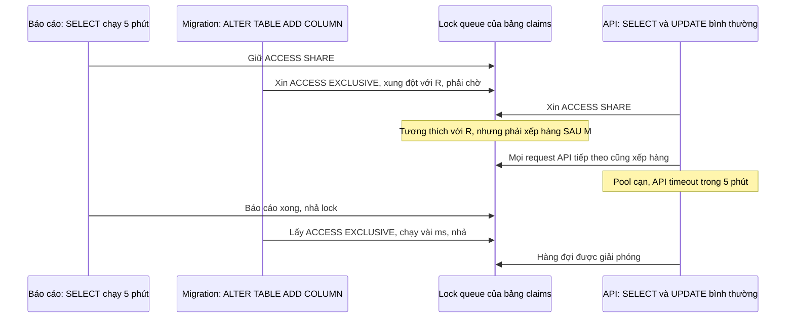

# Locks trong PostgreSQL

## 1. Tổng quan

[MVCC](mvcc.md) cho phép đọc và ghi không chặn nhau, nhưng không giải quyết mọi xung đột. PostgreSQL vẫn cần **lock** để:

- Ngăn hai transaction cùng sửa một row cùng lúc.
- Ngăn cấu trúc bảng bị thay đổi (`ALTER TABLE`, `DROP`) trong khi có người đang đọc/ghi.
- Cho phép ứng dụng tự khóa tường minh (`SELECT ... FOR UPDATE`, advisory lock).

Có ba nhóm lock chính:

| Nhóm | Đối tượng | Ví dụ |
|---|---|---|
| **Table-level lock** | Cả bảng (relation) | `ALTER TABLE` lấy `ACCESS EXCLUSIVE` |
| **Row-level lock** | Một row | `UPDATE`, `SELECT ... FOR UPDATE` |
| **Advisory lock** | Một số nguyên do ứng dụng định nghĩa | `pg_advisory_xact_lock(42)` |

Phần lớn sự cố liên quan tới lock trong production không phải là deadlock, mà là **chờ lock dây chuyền**: một câu lệnh vô hại chờ một lock, và vô số câu lệnh khác xếp hàng phía sau nó.

## 2. Mental Model

> Lock là hàng đợi trước một cánh cửa. Có những loại vé cho phép nhiều người vào cùng lúc (đọc) và những loại vé đòi hỏi phòng trống hoàn toàn (thay đổi cấu trúc). Người đến sau phải xếp hàng **sau** người đang chờ, kể cả khi vé của họ tương thích với người đang ở trong phòng.

Quy tắc "xếp hàng sau người đang chờ" là nguồn gốc của nhiều sự cố.

## 3. Vì sao cần hiểu lock?

- Migration `ALTER TABLE` nhỏ có thể làm đứng toàn bộ service.
- `SELECT ... FOR UPDATE` là công cụ chống [race condition](../02-python-concurrency/race-condition.md), nhưng dùng sai gây chờ đợi và [deadlock](deadlock.md).
- Job queue trong PostgreSQL cần `SKIP LOCKED` để nhiều worker không tranh nhau.
- Chẩn đoán "database không bận nhưng query chậm" thường là chờ lock.

## 4. Table-level lock

PostgreSQL có 8 mode lock mức bảng. Các câu lệnh thường gặp:

| Mode | Lấy bởi | Xung đột với |
|---|---|---|
| `ACCESS SHARE` | `SELECT` | Chỉ `ACCESS EXCLUSIVE` |
| `ROW SHARE` | `SELECT ... FOR UPDATE/SHARE` | `EXCLUSIVE`, `ACCESS EXCLUSIVE` |
| `ROW EXCLUSIVE` | `INSERT`, `UPDATE`, `DELETE`, `MERGE` | `SHARE` và các mode mạnh hơn |
| `SHARE UPDATE EXCLUSIVE` | `VACUUM`, `ANALYZE`, `CREATE INDEX CONCURRENTLY`, một số `ALTER TABLE` | Chính nó và các mode mạnh hơn |
| `SHARE` | `CREATE INDEX` (không concurrently) | `ROW EXCLUSIVE` — **chặn mọi ghi** |
| `SHARE ROW EXCLUSIVE` | `CREATE TRIGGER`, một số `ALTER TABLE` | Ghi và DDL |
| `EXCLUSIVE` | `REFRESH MATERIALIZED VIEW CONCURRENTLY` | Mọi thứ trừ `ACCESS SHARE` |
| `ACCESS EXCLUSIVE` | Phần lớn `ALTER TABLE`, `DROP`, `TRUNCATE`, `VACUUM FULL`, `REINDEX` (không concurrently) | **Mọi thứ**, kể cả `SELECT` |

Điểm cần nhớ: `SELECT` chỉ xung đột với `ACCESS EXCLUSIVE`; `INSERT/UPDATE/DELETE` không xung đột với nhau ở mức bảng (xung đột xảy ra ở mức row).

## 5. Bên trong hệ thống xảy ra gì: ALTER TABLE làm đứng service



Diễn giải:

1. Một query dài đang giữ `ACCESS SHARE` (chỉ đọc).
2. Migration xin `ACCESS EXCLUSIVE` — xung đột, nên chờ.
3. Request API bình thường xin `ACCESS SHARE`. Nó **tương thích** với báo cáo đang chạy, nhưng lock manager của PostgreSQL xếp nó **sau** yêu cầu `ACCESS EXCLUSIVE` đang chờ, để tránh migration chờ mãi (starvation).
4. Mọi request tiếp theo xếp hàng. Connection pool của API cạn, service ngừng phản hồi.
5. Bản thân `ALTER TABLE ADD COLUMN` (không default hoặc default không đổi từ PostgreSQL 11) chỉ cần vài ms — nhưng nó đã gây downtime 5 phút vì **chờ** lock.

Phòng tránh:

```sql
SET lock_timeout = '2s';
ALTER TABLE claims ADD COLUMN reviewed_at timestamptz;
```

Nếu không lấy được lock trong 2 giây, migration thất bại (và có thể retry sau), thay vì chặn mọi người. Đây là quy tắc bắt buộc cho migration trên bảng production.

## 6. Row-level lock

`UPDATE` và `DELETE` tự động khóa row bị sửa cho tới khi transaction kết thúc. Transaction khác muốn sửa cùng row phải chờ.

`SELECT` có thể khóa tường minh:

| Mode | Dùng khi | Chặn |
|---|---|---|
| `FOR UPDATE` | Sẽ cập nhật hoặc xóa row, kể cả cột khóa | Mọi row lock khác |
| `FOR NO KEY UPDATE` | Sẽ cập nhật cột không phải khóa (tự động dùng bởi `UPDATE` thông thường) | Mọi lock trừ `FOR KEY SHARE` |
| `FOR SHARE` | Cần row không bị đổi, nhiều người cùng giữ được | Update, delete |
| `FOR KEY SHARE` | Chỉ cần khóa không bị đổi/xóa (dùng bởi kiểm tra foreign key) | Delete và update cột khóa |

Row lock không được lưu trong bộ nhớ chung (sẽ tốn vô hạn với hàng triệu row); nó được ghi **vào chính tuple** qua trường `xmax` và bit trạng thái. Khi nhiều transaction cùng giữ lock chia sẻ trên một row, PostgreSQL tạo một **MultiXact** ID. Hệ quả: khóa nhiều row làm **ghi** vào page (sinh WAL, làm bẩn page).

### Foreign key và lock

Insert vào bảng con (`claim_lines` với FK tới `claims`) lấy `FOR KEY SHARE` trên row cha để đảm bảo row cha không bị xóa trong lúc đó. Nhiều transaction insert dòng con cho cùng một claim → nhiều key-share lock trên cùng row cha → MultiXact. Cập nhật cột không phải khóa trên row cha vẫn được (nhờ phân biệt `NO KEY UPDATE`), nhưng xóa row cha phải chờ.

### NOWAIT và SKIP LOCKED

```sql
-- Không chờ: lỗi ngay nếu row đang bị khóa
SELECT * FROM claims WHERE id = 1 FOR UPDATE NOWAIT;

-- Job queue: mỗi worker lấy job chưa bị ai khóa
WITH next_job AS (
    SELECT id FROM jobs
    WHERE status = 'queued'
    ORDER BY priority DESC, created_at
    LIMIT 10
    FOR UPDATE SKIP LOCKED
)
UPDATE jobs SET status = 'running', started_at = now(), worker = $1
FROM next_job WHERE jobs.id = next_job.id
RETURNING jobs.*;
```

`SKIP LOCKED` bỏ qua row đang bị transaction khác khóa. Nhiều worker chạy câu lệnh này đồng thời mà không lấy trùng job và không chờ nhau. Đây là nền tảng của các job queue dựa trên PostgreSQL. Cần partial index trên `(priority, created_at) WHERE status = 'queued'` và autovacuum tích cực vì bảng job có nhiều dead tuple.

## 7. Advisory lock

Lock trên một số nguyên (hoặc cặp số) do ứng dụng tự đặt ý nghĩa. PostgreSQL không gắn nó với row hay bảng nào.

```sql
-- Mức transaction: tự nhả khi transaction kết thúc
SELECT pg_advisory_xact_lock(hashtext('recompute-dealer-42'));

-- Thử lấy, không chờ
SELECT pg_try_advisory_xact_lock(hashtext('nightly-settlement'));
```

- **Mức transaction** (`pg_advisory_xact_lock`): an toàn, tự nhả.
- **Mức session** (`pg_advisory_lock`): giữ tới khi gọi unlock hoặc session đóng. Với connection pool (và đặc biệt PgBouncer transaction mode), session lock dễ bị "rò" sang request khác dùng lại connection. Tránh dùng với pool.

Advisory lock hữu ích để đảm bảo chỉ một instance chạy một job định kỳ, hoặc tuần tự hóa xử lý theo một khóa nghiệp vụ, **khi các bên đều dùng cùng một database**. Nó thường đáng tin cậy hơn distributed lock qua Redis cho phạm vi này vì gắn với vòng đời transaction/session của chính database lưu dữ liệu. Xem [Distributed Lock](../10-distributed-systems/distributed-lock.md).

## 8. Hành vi trong production

- **Chờ lock ẩn trong latency**: query "chậm" nhưng database không tốn CPU, không I/O — thường là chờ lock. `pg_stat_activity.wait_event_type = 'Lock'`.
- **Row nóng (hot row)**: một row được cập nhật bởi mọi request (counter toàn cục, số dư của một tài khoản tổng) tuần tự hóa toàn bộ throughput ghi. Giải pháp: chia counter thành nhiều row và cộng khi đọc, hoặc gom cập nhật qua queue.
- **Transaction dài giữ row lock**: mọi transaction muốn sửa các row đó phải chờ, dây chuyền.
- **DDL trong giờ cao điểm**: ngay cả câu lệnh DDL nhanh cũng có thể gây xếp hàng như mục 5.

## 9. Failure Modes

| Failure | Nguyên nhân | Dấu hiệu |
|---|---|---|
| Service đứng khi migration | DDL chờ `ACCESS EXCLUSIVE`, request xếp hàng sau | Nhiều backend chờ lock trên cùng bảng, một backend DDL ở đầu |
| Throughput ghi thấp | Hot row | Nhiều backend chờ `transactionid` |
| Chờ lâu không rõ lý do | Transaction `idle in transaction` giữ row lock | `pg_blocking_pids` trỏ tới session idle |
| Advisory lock không được nhả | Session lock với connection pool | Job không bao giờ chạy lại |
| Deadlock | Khóa row theo thứ tự khác nhau | Lỗi `40P01`, xem [Deadlock](deadlock.md) |

## 10. Trade-offs

| Cách | Lợi ích | Chi phí |
|---|---|---|
| Câu lệnh nguyên tử (`UPDATE ... WHERE`) | Khóa ngắn nhất | Chỉ cho logic đơn giản |
| `SELECT FOR UPDATE` | Logic đọc-sửa-ghi an toàn | Chờ đợi, rủi ro deadlock |
| `NOWAIT` | Fail nhanh, không treo | Ứng dụng phải xử lý lỗi và retry |
| `SKIP LOCKED` | Worker song song không tranh nhau | Không đảm bảo thứ tự tuyệt đối |
| Advisory lock | Điều phối theo khóa nghiệp vụ | Phải kỷ luật về quy ước key và phạm vi |

## 11. Sai lầm thường gặp

- Chạy migration không có `lock_timeout`.
- `CREATE INDEX` không `CONCURRENTLY` trên bảng đang ghi.
- `SELECT FOR UPDATE` rồi gọi dịch vụ bên ngoài trong khi giữ lock.
- Dùng session advisory lock qua connection pool.
- Thiết kế một row counter dùng chung cho mọi request.

## 12. Cách debug

```sql
-- Ai đang bị chặn, bởi ai, và câu lệnh gì
SELECT a.pid,
       pg_blocking_pids(a.pid) AS blocked_by,
       a.wait_event_type, a.wait_event,
       now() - a.query_start AS waiting,
       left(a.query, 80) AS query
FROM pg_stat_activity a
WHERE cardinality(pg_blocking_pids(a.pid)) > 0
ORDER BY waiting DESC;

-- Lock đang được giữ và đang chờ trên một bảng
SELECT l.pid, l.mode, l.granted, a.state, left(a.query, 60)
FROM pg_locks l JOIN pg_stat_activity a USING (pid)
WHERE l.relation = 'claims'::regclass
ORDER BY l.granted DESC;
```

Bật `log_lock_waits = on` để log mọi lần chờ lock vượt `deadlock_timeout` (mặc định 1 giây). Trong sự cố, kết thúc backend gây chặn bằng `pg_cancel_backend(pid)` (hủy câu lệnh) hoặc `pg_terminate_backend(pid)` (đóng session) — sau khi đã xác định đúng nó.

## 13. Best Practices

- Mọi migration đặt `lock_timeout` ngắn và retry; tạo index bằng `CONCURRENTLY`.
- Giữ transaction ngắn; không làm I/O bên ngoài khi giữ lock.
- Ưu tiên câu lệnh nguyên tử; dùng `FOR UPDATE` khi thực sự cần đọc-sửa-ghi.
- Dùng `SKIP LOCKED` cho hàng đợi công việc.
- Tránh hot row; phân tán hoặc gom cập nhật.
- Advisory lock mức transaction thay vì mức session khi có connection pool.

## 14. Tóm tắt

- MVCC tránh xung đột đọc-ghi; lock xử lý xung đột ghi-ghi và thay đổi cấu trúc.
- Table-level lock có 8 mode; `SELECT` chỉ xung đột với `ACCESS EXCLUSIVE`, thứ mà phần lớn `ALTER TABLE` cần.
- Yêu cầu lock đang chờ chặn cả những yêu cầu tương thích đến sau — nguồn gốc của downtime khi migration; `lock_timeout` là phòng thủ chính.
- Row lock được lưu trong tuple; `FOR UPDATE`, `NOWAIT`, `SKIP LOCKED` là công cụ cho ứng dụng.
- Advisory lock điều phối theo khóa nghiệp vụ, nên dùng mức transaction khi có pool.

## Liên quan

- [MVCC](mvcc.md)
- [Deadlock](deadlock.md)
- [Transaction](transaction.md)
- [Isolation Level](isolation-level.md)
- [Distributed Lock](../10-distributed-systems/distributed-lock.md)
