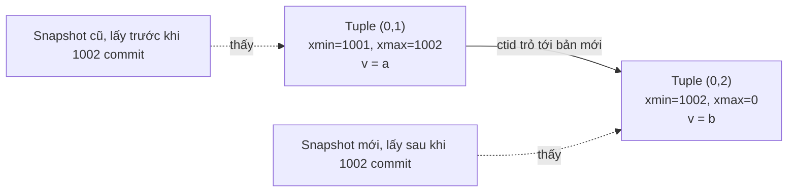
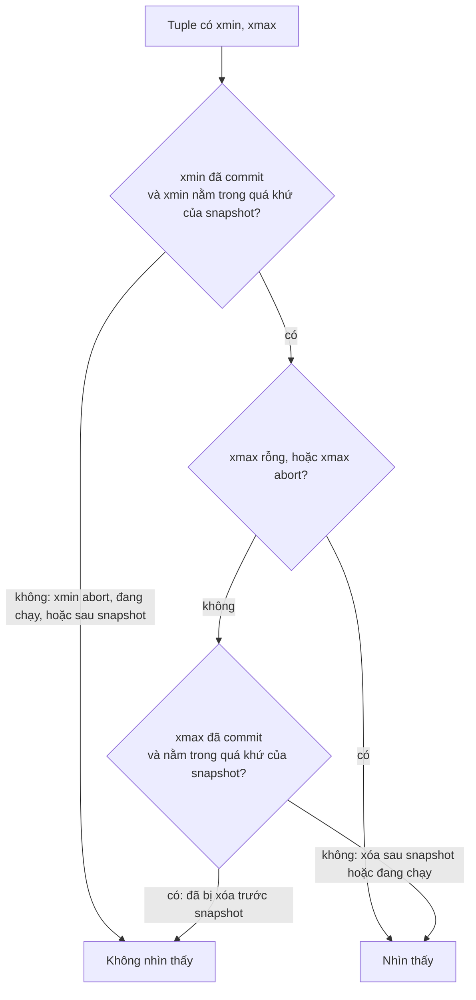
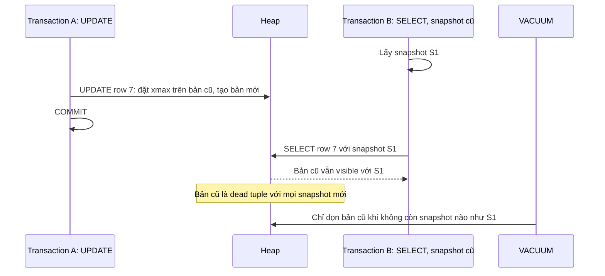
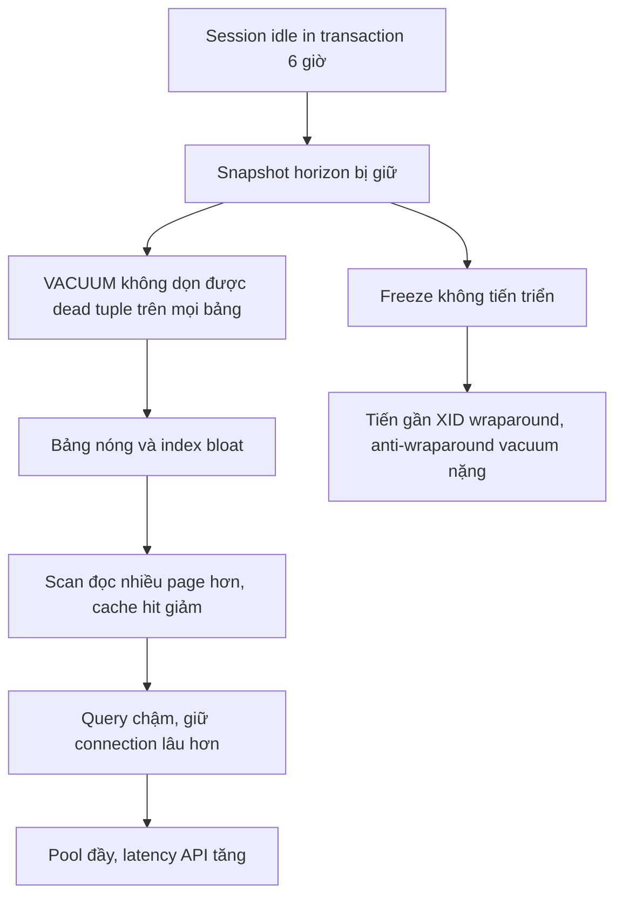

# MVCC trong PostgreSQL

## 1. Tổng quan

MVCC (Multi-Version Concurrency Control) là cơ chế PostgreSQL dùng để cho nhiều transaction đọc và ghi đồng thời mà **người đọc không chặn người ghi, người ghi không chặn người đọc**.

Ý tưởng cốt lõi: thay vì sửa trực tiếp một row tại chỗ (và bắt người đọc phải chờ), PostgreSQL giữ **nhiều phiên bản** của row. Mỗi transaction nhìn dữ liệu qua một **snapshot** — một "ảnh chụp" cho biết transaction nào đã commit tại thời điểm snapshot được lấy — và chỉ thấy các phiên bản phù hợp với snapshot đó.

MVCC giải thích hàng loạt hành vi của PostgreSQL: vì sao `SELECT` không bao giờ chờ `UPDATE`, vì sao `UPDATE` làm bảng phình to, vì sao cần [VACUUM](vacuum-bloat.md), vì sao transaction mở lâu gây hại, và cách các [isolation level](isolation-level.md) hoạt động.

## 2. Mental Model

> Thay vì sửa trực tiếp một row để mọi transaction cùng nhìn thấy giá trị mới, PostgreSQL tạo một **phiên bản mới** của row. Mỗi transaction dùng snapshot để quyết định phiên bản nào nó được phép nhìn thấy. Phiên bản cũ chỉ được dọn đi khi không còn snapshot nào cần nó.

Giống một tài liệu có lịch sử phiên bản: người đang đọc bản cũ tiếp tục đọc bản cũ; người sửa tạo bản mới; bản cũ chỉ bị xóa khi không còn ai đọc nó.

## 3. Vì sao cần MVCC?

Với cơ chế chỉ dùng lock (two-phase locking thuần), một `UPDATE` dài trên bảng sẽ chặn mọi `SELECT` đọc các row đó, và một báo cáo dài sẽ chặn mọi `UPDATE`. Hệ thống OLTP với nhiều đọc/ghi đồng thời sẽ tắc nghẽn.

MVCC cho phép:

- Báo cáo chạy 10 phút đọc dữ liệu nhất quán tại một thời điểm, không chặn ai.
- `UPDATE` không chờ các `SELECT` đang đọc.
- Snapshot nhất quán cho backup (`pg_dump`) trong khi hệ thống vẫn chạy.

Cái giá: phiên bản cũ tích tụ và cần được dọn; ghi-ghi vẫn cần lock.

## 4. Cơ chế hoạt động: tuple version, xmin, xmax

Mỗi phiên bản row (tuple) trong heap có header chứa:

- **`xmin`**: transaction ID (XID) đã **tạo** phiên bản này.
- **`xmax`**: XID đã **xóa** hoặc **thay thế** phiên bản này (0 nếu chưa bị xóa). Cũng được dùng để đánh dấu row đang bị khóa.
- **`ctid`**: vị trí của chính nó, hoặc của phiên bản mới hơn nếu đã bị update.

Các thao tác:

| Thao tác | Điều xảy ra |
|---|---|
| `INSERT` | Tạo tuple mới với `xmin = XID hiện tại`, `xmax = 0` |
| `DELETE` | Đặt `xmax = XID hiện tại` trên tuple hiện có. Tuple **không bị xóa vật lý** |
| `UPDATE` | = DELETE phiên bản cũ (đặt `xmax`) + INSERT phiên bản mới (`xmin = XID`). `ctid` của bản cũ trỏ tới bản mới |
| `ROLLBACK` | Không làm gì với tuple. Transaction được đánh dấu aborted trong commit log; mọi tuple nó tạo trở thành vô hình |

Có thể quan sát trực tiếp:

```sql
CREATE TABLE demo (id int, v text);
INSERT INTO demo VALUES (1, 'a');
SELECT ctid, xmin, xmax, * FROM demo;   -- (0,1) | 1001 | 0 | 1 | a
UPDATE demo SET v = 'b' WHERE id = 1;
SELECT ctid, xmin, xmax, * FROM demo;   -- (0,2) | 1002 | 0 | 1 | b
```

Phiên bản `(0,1)` vẫn nằm trong page với `xmax = 1002`, chỉ không còn được nhìn thấy.



Diễn giải: hai phiên bản cùng tồn tại. Transaction có snapshot lấy trước khi XID 1002 commit vẫn thấy `'a'`; snapshot lấy sau thấy `'b'`. Không ai phải chờ ai.

## 5. Internals: snapshot và quy tắc visibility

### Snapshot gồm gì?

Snapshot về cơ bản có ba phần:

- **`xmin`** của snapshot: XID nhỏ nhất còn đang chạy tại thời điểm lấy snapshot. Mọi XID nhỏ hơn đã kết thúc (commit hoặc abort).
- **`xmax`** của snapshot: XID tiếp theo sẽ được cấp. Mọi XID lớn hơn hoặc bằng là "tương lai" — vô hình.
- **`xip`**: danh sách XID đang chạy (in-progress) tại thời điểm lấy snapshot.

Xem snapshot hiện tại: `SELECT pg_current_snapshot();` (PostgreSQL 13+).

### Quy tắc visibility (giản lược)



Diễn giải:

1. Tuple chỉ có thể thấy nếu transaction **tạo** nó đã commit **trước** khi snapshot được lấy (hoặc là chính transaction hiện tại).
2. Nếu tuple chưa bị ai xóa (hoặc người xóa đã abort) → thấy.
3. Nếu người xóa đã commit trước snapshot → không thấy (row đã bị xóa từ góc nhìn này).
4. Nếu người xóa commit sau snapshot hoặc chưa commit → vẫn thấy (từ góc nhìn của snapshot, row chưa bị xóa).

"Trong quá khứ của snapshot" nghĩa là XID nhỏ hơn `xmax` của snapshot và không nằm trong danh sách `xip`.

### Commit log và hint bits

Để biết một XID đã commit hay abort, PostgreSQL tra **commit log** (`pg_xact`, trước đây gọi là CLOG) — mỗi XID 2 bit trạng thái. Tra CLOG cho mọi tuple rất tốn, nên lần đầu một tuple được kiểm tra, PostgreSQL ghi kết quả vào **hint bits** trong header tuple ("xmin committed", "xmax aborted"...). Lần sau không cần tra lại.

Hệ quả bất ngờ: một `SELECT` đầu tiên sau một đợt insert lớn có thể **ghi** page (đặt hint bits), sinh I/O ghi và WAL (nếu bật checksum). Đây là lý do `SELECT` sau bulk load đôi khi chậm hơn dự kiến.

### Snapshot được lấy khi nào?

Phụ thuộc isolation level:

- **Read Committed** (mặc định): snapshot mới cho **mỗi câu lệnh**.
- **Repeatable Read** và **Serializable**: một snapshot cho **toàn transaction**, lấy ở câu lệnh đầu tiên.

Chi tiết hệ quả ở [Isolation Level](isolation-level.md).

## 6. Luồng xử lý: đọc và ghi đồng thời



Diễn giải:

1. B lấy snapshot trước khi A commit.
2. A cập nhật và commit — không chờ B.
3. B đọc row: snapshot S1 không bao gồm commit của A, nên B thấy bản cũ. Không chờ A.
4. Bản cũ trở thành **dead tuple** với mọi snapshot mới, nhưng vẫn phải giữ lại vì B còn cần.
5. VACUUM chỉ dọn được khi B (và mọi snapshot cũ khác) kết thúc.

### Ghi–ghi vẫn phải chờ

MVCC không giúp hai transaction cùng **ghi** một row. Nếu A đang update row 7 (chưa commit) và C cũng update row 7, C phải **chờ** A kết thúc (lock trên row được thể hiện bằng `xmax` của A). Khi A commit:

- Ở Read Committed: C đọc lại phiên bản mới nhất của row, kiểm tra lại điều kiện `WHERE`, rồi update trên phiên bản đó.
- Ở Repeatable Read/Serializable: C nhận lỗi `could not serialize access due to concurrent update` và phải retry toàn bộ transaction.

## 7. HOT update và visibility map

- **HOT (Heap-Only Tuple)**: nếu update không đổi cột nào có index và page còn chỗ, bản mới nằm cùng page, index không cần cập nhật; chuỗi HOT được dọn nhanh ngay trong page (page pruning) mà không cần VACUUM đầy đủ. Xem [Index](index.md#7-cái-giá-của-index).
- **Visibility map**: một bit mỗi page cho biết "mọi tuple trên page này visible với mọi transaction". VACUUM đặt bit; bất kỳ thay đổi nào trên page xóa bit. Index Only Scan chỉ tránh được đọc heap khi bit được đặt.

## 8. Hành vi trong production

### Dead tuple và bloat

Mỗi `UPDATE` tạo một dead tuple; mỗi `DELETE` biến một tuple thành dead. Bảng update 1.000 lần/giây tạo 86 triệu dead tuple mỗi ngày. Nếu VACUUM không theo kịp, bảng và index **phình to** (bloat): cùng dữ liệu nhưng chiếm nhiều page hơn → scan chậm hơn, cache kém hiệu quả hơn.

### Transaction dài là kẻ thù

Một transaction mở (kể cả chỉ đọc, kể cả `idle in transaction`) giữ snapshot cũ. Mọi dead tuple sinh ra sau thời điểm đó **không thể được dọn** trên **toàn database** (horizon là toàn cục, không chỉ bảng transaction đó đọc). Một session quên commit trong 6 giờ có thể làm mọi bảng nóng bloat nghiêm trọng.

Nguồn giữ horizon cũ phổ biến:

- Transaction ứng dụng không đóng (exception không rollback, session bị giữ).
- Báo cáo/ETL chạy hàng giờ trên primary.
- Replication slot không được tiêu thụ.
- Replica với `hot_standby_feedback = on` đang chạy query dài.
- Prepared transaction (2PC) bị bỏ quên.

### Transaction ID wraparound

XID là số 32-bit, so sánh theo vòng tròn (khoảng 2 tỷ trong quá khứ, 2 tỷ trong tương lai). Tuple rất cũ phải được **freeze** (đánh dấu "luôn visible") trước khi XID quay vòng, nếu không chúng sẽ đột ngột trở thành "tương lai" và biến mất. VACUUM làm việc freeze; nếu bị chặn quá lâu, PostgreSQL buộc chạy anti-wraparound vacuum và cuối cùng từ chối cấp XID mới (dừng mọi thao tác ghi) để bảo vệ dữ liệu. Xem [VACUUM và Bloat](vacuum-bloat.md).

## 9. Failure Modes và Failure Chain



Diễn giải: một transaction bị bỏ quên không gây lỗi trực tiếp nào, nhưng từ từ làm suy giảm toàn bộ database. Đây là lý do cần `idle_in_transaction_session_timeout` và giám sát tuổi transaction.

| Failure | Nguyên nhân | Dấu hiệu |
|---|---|---|
| Bloat | Update/delete nhiều, VACUUM không theo kịp hoặc bị chặn | Kích thước bảng tăng nhanh hơn dữ liệu, `n_dead_tup` cao |
| Horizon bị giữ | Transaction dài, replication slot | `backend_xmin` cũ trong `pg_stat_activity` |
| Serialization failure | Hai transaction RR/Serializable cùng ghi | Lỗi `40001` |
| Wraparound | Freeze không kịp | Cảnh báo trong log, `age(datfrozenxid)` tiến gần 2 tỷ |
| SELECT sinh I/O ghi | Đặt hint bits sau bulk load | Đọc chậm bất thường sau import |

## 10. Trade-offs

| MVCC của PostgreSQL | Lợi ích | Chi phí |
|---|---|---|
| Phiên bản mới nằm trong heap (không có undo log riêng) | Rollback tức thì, đọc bản cũ nhanh | Bloat, cần VACUUM |
| Snapshot theo câu lệnh (RC) | Luôn thấy dữ liệu mới nhất đã commit | Hai câu lệnh trong cùng transaction có thể thấy dữ liệu khác nhau |
| Snapshot theo transaction (RR) | Nhất quán trong transaction | Lỗi serialization khi ghi đồng thời |

So với database dùng undo log (Oracle, MySQL InnoDB): ở đó phiên bản mới được ghi đè tại chỗ, phiên bản cũ được đưa vào vùng undo. Bảng không bloat như PostgreSQL, nhưng rollback dài và đọc phiên bản cũ phải dựng lại từ undo.

## 11. Sai lầm thường gặp

- Nghĩ `DELETE` giải phóng dung lượng ngay.
- Nghĩ rollback tốn công "hoàn tác".
- Mở transaction rồi gọi API bên ngoài, chờ người dùng, hoặc xử lý file lớn.
- Chạy báo cáo nhiều giờ trên primary.
- Nghĩ MVCC loại bỏ mọi xung đột — ghi-ghi vẫn chờ nhau.

## 12. Cách debug

```sql
-- Transaction mở lâu nhất và snapshot đang giữ
SELECT pid, state, xact_start, now() - xact_start AS xact_age,
       backend_xmin, left(query, 60)
FROM pg_stat_activity
WHERE backend_xmin IS NOT NULL
ORDER BY age(backend_xmin) DESC LIMIT 10;

-- Dead tuple theo bảng
SELECT relname, n_live_tup, n_dead_tup, last_autovacuum
FROM pg_stat_user_tables ORDER BY n_dead_tup DESC LIMIT 10;

-- Replication slot giữ horizon
SELECT slot_name, active, xmin, catalog_xmin FROM pg_replication_slots;

-- Tuổi XID của database (khoảng cách tới wraparound)
SELECT datname, age(datfrozenxid) FROM pg_database ORDER BY 2 DESC;
```

## 13. Best Practices

- Giữ transaction ngắn; không làm I/O bên ngoài database trong transaction.
- Đặt `idle_in_transaction_session_timeout` (ví dụ 1–5 phút) và `statement_timeout` phù hợp.
- Chạy báo cáo dài trên replica hoặc hệ thống phân tích riêng.
- Giám sát tuổi transaction lâu nhất, `n_dead_tup`, và tuổi XID.
- Giúp HOT update: tránh index cột thay đổi liên tục, cân nhắc `fillfactor`.
- Xóa replication slot không còn dùng.

## 14. Tóm tắt

- MVCC giữ nhiều phiên bản row; mỗi phiên bản có `xmin` (người tạo) và `xmax` (người xóa).
- UPDATE = đánh dấu bản cũ bằng `xmax` + tạo bản mới; DELETE chỉ đặt `xmax`; ROLLBACK không đụng tới tuple.
- Snapshot quyết định phiên bản nào visible; RC lấy snapshot mỗi câu lệnh, RR/Serializable mỗi transaction.
- Người đọc không chặn người ghi và ngược lại; ghi-ghi trên cùng row vẫn phải chờ.
- Dead tuple chỉ được dọn khi không còn snapshot nào cần; transaction dài gây bloat toàn database.

## Liên quan

- [Transaction](transaction.md)
- [Isolation Level](isolation-level.md)
- [VACUUM và Bloat](vacuum-bloat.md)
- [Locks](locks.md)
- [PostgreSQL Fundamentals](database-fundamentals.md)
