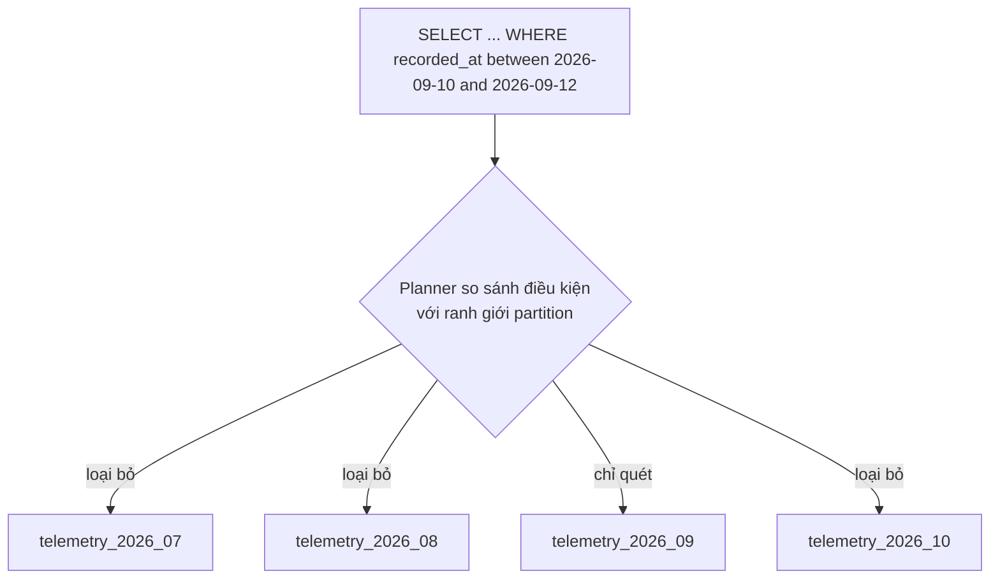

# Partitioning

## 1. Tổng quan

Partitioning chia một bảng logic lớn thành nhiều bảng vật lý nhỏ hơn (**partition**) theo giá trị của một cột (**partition key**). Ứng dụng vẫn truy vấn một bảng duy nhất; PostgreSQL tự định tuyến dữ liệu vào partition đúng khi ghi, và chỉ đọc các partition liên quan khi truy vấn.

```sql
CREATE TABLE telemetry (
    vehicle_id bigint NOT NULL,
    recorded_at timestamptz NOT NULL,
    payload jsonb NOT NULL
) PARTITION BY RANGE (recorded_at);

CREATE TABLE telemetry_2026_09 PARTITION OF telemetry
    FOR VALUES FROM ('2026-09-01') TO ('2026-10-01');
```

Partitioning là công cụ **quản lý dữ liệu** trước khi là công cụ hiệu năng: nó làm cho việc xóa dữ liệu cũ, bảo trì, và giới hạn phạm vi quét trở nên rẻ.

## 2. Mental Model

> Thay vì một cuốn sổ khổng lồ, dữ liệu được chia thành nhiều cuốn sổ theo tháng. Muốn xem tháng 9 thì chỉ mở cuốn tháng 9. Muốn bỏ dữ liệu năm 2023 thì vứt cả cuốn đi, không cần gạch từng dòng.

## 3. Vì sao cần partitioning?

| Vấn đề của bảng khổng lồ | Partitioning giúp thế nào |
|---|---|
| Xóa dữ liệu cũ bằng `DELETE` tạo hàng trăm triệu dead tuple, WAL khổng lồ, bloat | `DETACH`/`DROP` partition: tức thì, không dead tuple |
| VACUUM bảng 2 TB mất nhiều giờ | Mỗi partition vacuum độc lập; partition cũ không đổi thì gần như không cần |
| Index khổng lồ không vừa memory | Index mỗi partition nhỏ; partition nóng (gần đây) nằm trong cache |
| Query theo khoảng thời gian quét cả bảng | **Partition pruning**: chỉ quét partition liên quan |
| Tạo index mới mất nhiều giờ | Tạo theo từng partition |

## 4. Cơ chế hoạt động

### Ba kiểu partition

| Kiểu | Chia theo | Phù hợp |
|---|---|---|
| **Range** | Khoảng giá trị | Thời gian (log, event, telemetry, giao dịch) |
| **List** | Danh sách giá trị rời rạc | Vùng, tenant lớn, loại dữ liệu |
| **Hash** | Mã băm của key mod N | Phân tán đều khi không có key tự nhiên để chia |

Có thể lồng nhau (sub-partition): range theo tháng, rồi hash theo `tenant_id`.

### Định tuyến khi ghi

`INSERT` vào bảng cha được PostgreSQL chuyển vào partition có khoảng chứa giá trị key. Không có partition phù hợp và không có **default partition** → lỗi. Phải tạo partition cho tương lai trước (thường bằng job định kỳ hoặc extension `pg_partman`).

### Partition pruning



Diễn giải:

1. Planner đọc ranh giới của từng partition và so với điều kiện `WHERE` trên partition key.
2. Partition không thể chứa row phù hợp bị loại khỏi plan.
3. Chỉ partition tháng 9 (và index của nó) được quét.
4. Pruning cũng xảy ra **lúc thực thi** (execution-time pruning) với giá trị tham số hoặc giá trị từ subquery.

Điều kiện: query phải có điều kiện trên **partition key**. Query `WHERE vehicle_id = 42` không có điều kiện thời gian sẽ quét **mọi** partition — có thể chậm hơn một bảng không partition với một index trên `vehicle_id`.

## 5. Ràng buộc và hạn chế

- **Unique constraint và primary key phải bao gồm partition key.** Không thể đảm bảo `claim_id` duy nhất toàn cục trên bảng partition theo `created_at` trừ khi PK là `(claim_id, created_at)`. Tính duy nhất toàn cục phải đảm bảo bằng cách khác (ID sinh duy nhất, bảng tra riêng).
- **Index được tạo trên bảng cha** sẽ tự tạo trên mọi partition (index "partitioned"). Không có index toàn cục xuyên partition.
- **Foreign key** trỏ **tới** bảng partition được hỗ trợ từ PostgreSQL 12, nhưng cần unique key bao gồm partition key.
- **Update làm thay đổi partition key** di chuyển row sang partition khác (xóa + insert) — tốn kém hơn update thường.
- **Quá nhiều partition** (hàng nghìn) làm planning chậm, tốn memory metadata, tăng số file và lock. Hàng chục tới vài trăm partition thường là vùng an toàn; con số cụ thể phụ thuộc version và workload.

## 6. Ví dụ: vòng đời dữ liệu theo tháng

```sql
-- Tạo partition tháng tới trước khi cần (job chạy hằng ngày)
CREATE TABLE IF NOT EXISTS telemetry_2026_10 PARTITION OF telemetry
    FOR VALUES FROM ('2026-10-01') TO ('2026-11-01');

-- Retention: bỏ dữ liệu cũ hơn 12 tháng
ALTER TABLE telemetry DETACH PARTITION telemetry_2025_09 CONCURRENTLY;   -- PostgreSQL 14+
-- Lưu trữ ra object storage nếu cần, rồi:
DROP TABLE telemetry_2025_09;
```

`DETACH ... CONCURRENTLY` (14+) tách partition mà không cần khóa `ACCESS EXCLUSIVE` trên bảng cha trong suốt quá trình. `DROP TABLE` trên partition đã tách là thao tác xóa file — tức thì, không dead tuple, không WAL lớn.

## 7. Chọn partition key

| Câu hỏi | Ảnh hưởng |
|---|---|
| Query phổ biến nhất lọc theo cột nào? | Cột đó nên là partition key để pruning có tác dụng |
| Dữ liệu cũ được xóa theo tiêu chí nào? | Thường là thời gian → range theo thời gian |
| Dữ liệu có phân bố đều không? | Partition lệch (một tenant chiếm 70%) làm mất lợi ích |
| Unique constraint cần gì? | Phải chứa partition key |
| Mỗi partition lớn bao nhiêu? | Quá nhỏ → quá nhiều partition; quá lớn → mất lợi ích |

## 8. Hành vi trong production

- **Partition tương lai bị thiếu**: job tạo partition lỗi → insert thất bại lúc nửa đêm ngày đầu tháng. Giám sát sự tồn tại của partition cho N kỳ tới; cân nhắc default partition (nhưng dữ liệu rơi vào default gây khó khăn khi tạo partition sau này).
- **Query không có partition key** trên bảng nhiều partition chậm hơn dự kiến; review query khi chuyển sang partition.
- **Migration từ bảng thường sang bảng partition** không thể làm tại chỗ: phải tạo bảng partition mới, di chuyển dữ liệu theo lô (hoặc attach bảng cũ làm một partition), chuyển đổi ghi, rồi dọn dẹp — một dự án cần kế hoạch.
- **Autovacuum theo partition**: partition nóng (tháng hiện tại) cần vacuum thường xuyên; partition cũ gần như không.

## 9. Partitioning khác sharding

| | Partitioning | Sharding |
|---|---|---|
| Phạm vi | Một database server | Nhiều server |
| Giải quyết | Quản lý dữ liệu, pruning, bảo trì | Giới hạn CPU/IO/storage của một server |
| Transaction | Bình thường | Xuyên shard phức tạp |
| Độ phức tạp | Thấp tới trung bình | Cao |

Partitioning không tăng tổng capacity ghi của một server. Khi một server không còn đủ, xem [Sharding](../11-system-design/sharding.md) và [Database Scaling](../11-system-design/database-scaling.md).

## 10. Failure Modes

| Failure | Nguyên nhân | Dấu hiệu |
|---|---|---|
| Insert lỗi | Không có partition cho giá trị | `no partition of relation found for row` |
| Query chậm hơn trước | Không có điều kiện trên partition key | EXPLAIN quét mọi partition |
| Planning chậm | Quá nhiều partition | Planning Time lớn |
| Trùng dữ liệu | Không thể có unique toàn cục không chứa key | ID trùng giữa partition |
| Partition lệch | Key phân bố không đều | Một partition chiếm phần lớn dữ liệu |

## 11. Trade-offs

| Lựa chọn | Lợi ích | Chi phí |
|---|---|---|
| Partition theo thời gian | Retention rẻ, pruning cho query theo thời gian | Query không theo thời gian quét nhiều partition |
| Partition nhỏ (ngày) | Pruning chặt, xóa mịn | Nhiều partition, planning chậm |
| Partition lớn (năm) | Ít partition | Ít lợi ích bảo trì |
| Không partition + BRIN | Đơn giản | Retention vẫn bằng DELETE |

## 12. Sai lầm thường gặp

- Partition bảng vài triệu row "cho nhanh" — thường không cần, thêm phức tạp.
- Chọn partition key không xuất hiện trong phần lớn query.
- Quên rằng PK/unique phải chứa partition key.
- Không tự động hóa tạo partition tương lai.
- Kỳ vọng partitioning tăng throughput ghi của server.

## 13. Cách debug

```sql
-- Danh sách partition và kích thước
SELECT c.relname, pg_size_pretty(pg_total_relation_size(c.oid))
FROM pg_inherits i JOIN pg_class c ON c.oid = i.inhrelid
WHERE i.inhparent = 'telemetry'::regclass ORDER BY c.relname;

-- Kiểm tra pruning
EXPLAIN SELECT * FROM telemetry WHERE recorded_at >= '2026-09-10' AND recorded_at < '2026-09-12';
```

Trong EXPLAIN, chỉ partition liên quan xuất hiện; với execution-time pruning có dòng `Subplans Removed: N`.

## 14. Best Practices

- Partition khi có nhu cầu rõ: retention, bảng rất lớn, bảo trì nặng, query tự nhiên theo key.
- Chọn key theo query và vòng đời dữ liệu, thường là thời gian.
- Tự động tạo partition trước và giám sát.
- Dùng `DETACH CONCURRENTLY` + `DROP` cho retention.
- Giữ số partition ở mức vừa phải.
- Kiểm tra mọi query quan trọng có điều kiện trên partition key.

## 15. Tóm tắt

- Partitioning chia bảng logic thành nhiều bảng vật lý theo partition key; range, list, hash.
- Lợi ích chính: retention bằng drop partition, bảo trì theo phần, pruning khi query có điều kiện trên key.
- PK/unique phải chứa partition key; không có index toàn cục.
- Query không có điều kiện trên key có thể chậm hơn bảng thường.
- Partitioning không mở rộng capacity của một server; đó là việc của sharding.

## Liên quan

- [Large Table Design](large-table-design.md)
- [VACUUM và Bloat](vacuum-bloat.md)
- [Các loại index](btree-hash-gin-gist-brin.md)
- [Sharding](../11-system-design/sharding.md)
