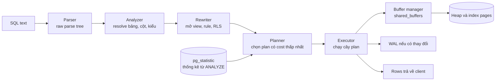
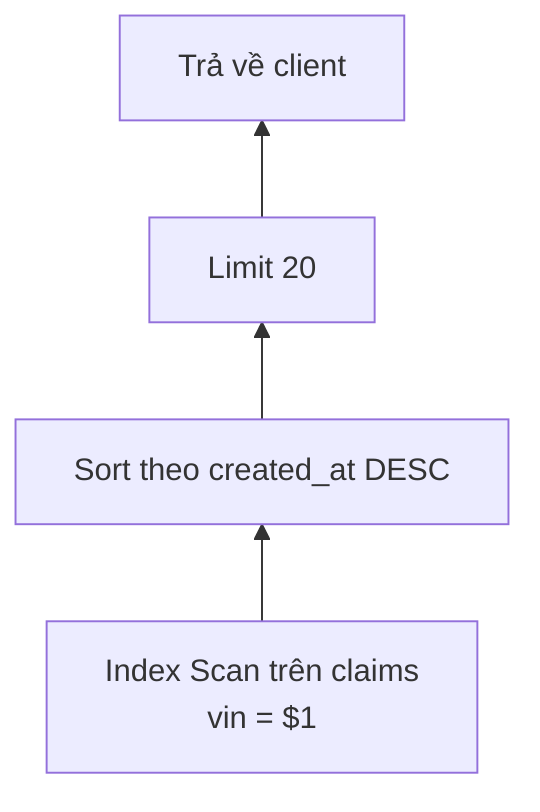

# Query Lifecycle: từ câu SQL tới kết quả

## 1. Tổng quan

Khi ứng dụng gửi `SELECT * FROM claims WHERE vin = $1 ORDER BY created_at DESC LIMIT 20`, PostgreSQL không "chạy câu SQL" theo nghĩa đen. Câu SQL là **khai báo** kết quả mong muốn; PostgreSQL phải tự quyết định **cách** lấy kết quả đó: đọc bảng nào trước, dùng index nào, join bằng thuật toán gì, sort ở đâu.

Quá trình đi qua năm giai đoạn:

```text
Parser → Analyzer → Rewriter → Planner/Optimizer → Executor
```

Hiểu từng giai đoạn giải thích vì sao một query nhanh ở môi trường này lại chậm ở môi trường khác, vì sao thêm index mà planner không dùng, và vì sao prepared statement đôi khi làm query chậm đi.

## 2. Mental Model

> Planner là người lập lộ trình, executor là người lái xe. Planner không biết chắc đường nào kẹt; nó ước lượng dựa trên **thống kê** về dữ liệu. Thống kê sai thì lộ trình sai, dù người lái xe giỏi đến đâu.

Và executor hoạt động theo kiểu **kéo** (pull): node trên cùng hỏi node con "cho tôi một row", node con hỏi node con của nó, cứ thế xuống tới tầng đọc dữ liệu.

## 3. Vì sao cần hiểu lifecycle?

- Đọc được [EXPLAIN](explain-analyze.md): plan là đầu ra của planner, số liệu actual là của executor.
- Biết lỗi nào xảy ra ở đâu: lỗi cú pháp (parser), cột không tồn tại (analyzer), plan tệ (planner), chờ lock (executor).
- Hiểu vai trò của `ANALYZE` (thống kê) và cost model.
- Hiểu prepared statement, generic plan, và vấn đề với PgBouncer.

## 4. Luồng xử lý



Các bước:

1. **Parser** kiểm tra cú pháp và dựng cây cú pháp thô. Chưa biết bảng có tồn tại không.
2. **Analyzer** tra system catalog: bảng `claims` có tồn tại không, cột `vin` kiểu gì, `$1` nên có kiểu gì, user có quyền không. Kết quả là **query tree** đã được giải nghĩa.
3. **Rewriter** áp dụng quy tắc viết lại: thay view bằng định nghĩa của nó, áp dụng rule, thêm điều kiện của Row-Level Security.
4. **Planner/Optimizer** sinh các cách thực thi có thể, ước lượng chi phí mỗi cách dựa trên thống kê, chọn cách rẻ nhất. Kết quả là **plan tree**.
5. **Executor** thực thi plan tree, đọc page qua buffer manager, kiểm tra visibility MVCC, trả row cho client.

## 5. Planner: cost model và thống kê

### Cost là gì?

Cost là đơn vị **tương đối**, không phải millisecond. Các tham số cơ bản:

| Tham số | Mặc định | Ý nghĩa |
|---|---|---|
| `seq_page_cost` | 1.0 | Chi phí đọc một page tuần tự |
| `random_page_cost` | 4.0 | Chi phí đọc một page ngẫu nhiên |
| `cpu_tuple_cost` | 0.01 | Xử lý một row |
| `cpu_index_tuple_cost` | 0.005 | Xử lý một index entry |
| `cpu_operator_cost` | 0.0025 | Đánh giá một toán tử/hàm |

`random_page_cost = 4` phản ánh ổ quay cơ học. Trên SSD/NVMe, đọc ngẫu nhiên gần bằng tuần tự; nhiều hệ thống hạ xuống 1.1–1.5 để planner mạnh dạn dùng index hơn.

### Thống kê

`ANALYZE` (chạy thủ công hoặc bởi autovacuum) lấy mẫu dữ liệu và lưu vào `pg_statistic` (xem qua view `pg_stats`):

| Thống kê | Ý nghĩa | Planner dùng để |
|---|---|---|
| `reltuples`, `relpages` | Số row và page ước tính | Chi phí quét toàn bảng |
| `null_frac` | Tỷ lệ NULL | Ước lượng `IS NULL` |
| `n_distinct` | Số giá trị khác nhau | Ước lượng `=`, `GROUP BY` |
| `most_common_vals` + `most_common_freqs` | Giá trị phổ biến và tần suất | Ước lượng chính xác với giá trị lệch |
| `histogram_bounds` | Phân phối các giá trị còn lại | Ước lượng điều kiện khoảng (`>`, `BETWEEN`) |
| `correlation` | Thứ tự vật lý khớp thứ tự logic bao nhiêu | Chi phí index scan (đọc heap tuần tự hay ngẫu nhiên) |

Từ đó planner tính **selectivity**: tỷ lệ row thỏa điều kiện. `status = 'pending'` với `most_common_freqs` cho 'pending' là 2% → ước lượng 2% số row.

### Vấn đề của giả định độc lập

Mặc định planner coi các điều kiện là **độc lập**: `city = 'Hanoi' AND district = 'Ba Dinh'` được ước lượng là selectivity(city) × selectivity(district). Nhưng hai cột tương quan chặt (mọi 'Ba Dinh' đều ở 'Hanoi'), nên ước lượng thấp hơn thực tế nhiều lần. `CREATE STATISTICS ... (dependencies, ndistinct, mcv) ON city, district FROM addresses` cho planner biết về tương quan.

### Chọn plan

Với mỗi bảng, planner sinh các **access path** (seq scan, index scan trên từng index phù hợp, bitmap scan). Với nhiều bảng, nó thử các **thứ tự join** và **thuật toán join** (nested loop, hash, merge) bằng quy hoạch động. Số cách tăng theo cấp số nhân: với nhiều hơn `join_collapse_limit` (mặc định 8) bảng, planner giữ thứ tự join theo cách viết; với nhiều hơn `geqo_threshold` (mặc định 12) bảng, nó dùng thuật toán di truyền (GEQO) — nhanh hơn nhưng không đảm bảo tối ưu.

Chi tiết cách planner chọn scan và join ở [Query Optimization](query-optimization.md).

## 6. Executor: mô hình kéo (iterator)



Diễn giải:

1. Executor gọi node gốc `Limit`: "cho tôi một row".
2. `Limit` gọi `Sort`. `Sort` là node **chặn** (blocking): nó phải kéo **toàn bộ** row từ `Index Scan` và sắp xếp xong mới trả được row đầu tiên.
3. `Index Scan` trả từng row thỏa `vin = $1`.
4. Sau khi `Limit` nhận đủ 20 row, nó ngừng kéo. Nếu node con không phải node chặn, phần dữ liệu còn lại không bao giờ được đọc.

Nếu có index trên `(vin, created_at DESC)`, planner bỏ được node `Sort`: index scan trả row **đã theo thứ tự**, `Limit` dừng sau 20 row — chỉ đọc đúng 20 entry thay vì mọi claim của VIN đó. Đây là lý do index composite hợp lý có thể biến query từ hàng trăm ms thành dưới 1 ms.

Node **streaming** (Index Scan, Nested Loop, Limit) trả row ngay; node **blocking** (Sort, Hash build, HashAggregate) phải tiêu thụ hết input trước. Trong EXPLAIN, "startup cost" cao là dấu hiệu node blocking.

### Parallel query và JIT

- **Parallel query**: với bảng lớn, planner có thể thêm node `Gather` và chia seq scan/aggregate/hash join cho nhiều worker process (`max_parallel_workers_per_gather`). Hữu ích cho báo cáo, ít có ý nghĩa cho OLTP ngắn.
- **JIT** (LLVM): với query có cost vượt `jit_above_cost`, PostgreSQL compile biểu thức thành mã máy. Có ích cho query phân tích nặng; với query vừa phải, thời gian compile có thể lớn hơn lợi ích — nếu thấy "JIT" chiếm nhiều thời gian trong EXPLAIN, cân nhắc tắt hoặc nâng ngưỡng.

## 7. Prepared statement và plan cache

Giao thức mở rộng (extended query protocol) chia query thành các bước: **Parse** (parse + analyze + rewrite, lưu lại), **Bind** (gắn giá trị tham số), **Execute**. Driver như asyncpg, psycopg 3 dùng giao thức này và thường cache prepared statement.

Với prepared statement, PostgreSQL chọn giữa:

- **Custom plan**: lập kế hoạch lại mỗi lần với giá trị tham số thật — chính xác nhưng tốn thời gian planning.
- **Generic plan**: một plan dùng cho mọi giá trị tham số — không tốn planning nhưng có thể tệ với giá trị lệch.

Mặc định (`plan_cache_mode = auto`), 5 lần đầu dùng custom plan; sau đó nếu generic plan không đắt hơn đáng kể so với trung bình custom plan, PostgreSQL chuyển sang generic.

Vấn đề: cột `status` có 99% 'done' và 1% 'pending'. 5 lần đầu tham số là 'pending' → custom plan dùng index, rẻ. Generic plan ước lượng theo trung bình — có thể chọn seq scan. Khi chuyển sang generic, query với 'pending' đột nhiên chậm. Giải pháp: `plan_cache_mode = force_custom_plan` cho session/role đó, hoặc viết query tách trường hợp.

### Prepared statement và PgBouncer

Prepared statement gắn với **một backend process**. PgBouncer ở transaction mode có thể đưa các transaction liên tiếp của cùng một client tới các backend khác nhau → "prepared statement does not exist". PgBouncer 1.21+ hỗ trợ prepared statement ở mức giao thức (`max_prepared_statements`); với version cũ hơn phải tắt statement cache của driver. Xem [Connection Pooling](connection-pooling.md).

## 8. Bên trong hệ thống xảy ra gì khi query chậm?

Thời gian của một query = **planning time** + **execution time**, trong đó execution có thể chia thành:

1. **CPU**: đánh giá điều kiện, sort, hash, tính toán.
2. **I/O**: đọc page không có trong `shared_buffers`.
3. **Chờ lock**: row hoặc bảng đang bị transaction khác giữ. Xem [Locks](locks.md).
4. **Chờ khác**: WAL flush khi commit, I/O ghi, client đọc kết quả chậm.

`EXPLAIN ANALYZE` chỉ đo 1 và 2 cho một lần chạy đơn lẻ. `pg_stat_activity.wait_event` cho biết một backend **đang** chờ gì tại thời điểm hiện tại — công cụ chính để phát hiện 3 và 4.

## 9. Hành vi trong production

- **Thống kê cũ**: sau một đợt import lớn hoặc xóa lớn, thống kê chưa được cập nhật → plan dựa trên dữ liệu không còn đúng. Chạy `ANALYZE` sau thay đổi dữ liệu lớn.
- **Plan thay đổi đột ngột**: dữ liệu tăng dần, tới một ngưỡng planner chuyển từ index scan sang seq scan (hoặc đổi thứ tự join). Latency nhảy vọt mà không có deploy nào. `pg_stat_statements` và `auto_explain` giúp phát hiện.
- **Planning time đáng kể**: query join nhiều bảng hoặc bảng có rất nhiều partition có thể tốn nhiều ms chỉ để lập kế hoạch. Prepared statement giúp giảm chi phí này.
- **Môi trường khác nhau cho plan khác nhau**: staging với 1.000 row cho plan khác production với 100 triệu row. Kiểm tra plan trên dữ liệu có kích thước và phân phối tương tự.

## 10. Failure Modes

| Failure | Giai đoạn | Dấu hiệu |
|---|---|---|
| Ước lượng row sai lớn | Planner | EXPLAIN: `rows` estimate khác actual hàng chục lần trở lên |
| Generic plan tệ | Plan cache | Query nhanh vài lần đầu rồi chậm hẳn cùng tham số |
| Không dùng index | Planner | Seq scan dù có index; điều kiện không sargable hoặc selectivity thấp |
| Spill ra disk | Executor | `Sort Method: external merge Disk`, `temp written` |
| Chờ lock | Executor | `wait_event_type = Lock` trong `pg_stat_activity` |
| JIT tốn thời gian | Executor | EXPLAIN hiển thị JIT timing lớn so với execution |

## 11. Trade-offs

| Lựa chọn | Lợi ích | Chi phí |
|---|---|---|
| Prepared statement | Bỏ parse/plan lặp lại | Rủi ro generic plan tệ; vấn đề với pooler |
| `default_statistics_target` cao | Ước lượng chính xác hơn | `ANALYZE` chậm hơn, planning chậm hơn một chút |
| Extended statistics | Xử lý cột tương quan | Phải biết tạo cho cặp cột nào |
| Hạ `random_page_cost` trên SSD | Planner dùng index hợp lý hơn | Có thể chọn index scan khi seq scan tốt hơn nếu đặt quá thấp |
| Parallel query | Báo cáo nhanh hơn | Tốn nhiều worker process, cạnh tranh tài nguyên với OLTP |

## 12. Sai lầm thường gặp

- Đọc `cost` như millisecond.
- Kết luận "PostgreSQL không dùng index" mà không xem selectivity và thống kê.
- Test plan trên dữ liệu nhỏ.
- Bỏ qua planning time với query nhiều join hoặc nhiều partition.
- Dùng PgBouncer transaction mode với driver cache prepared statement mà không cấu hình tương thích.

## 13. Cách debug

```sql
-- Thống kê của một cột
SELECT null_frac, n_distinct, most_common_vals, most_common_freqs, correlation
FROM pg_stats WHERE tablename = 'claims' AND attname = 'status';

-- Lần cuối ANALYZE
SELECT relname, last_analyze, last_autoanalyze, n_mod_since_analyze
FROM pg_stat_user_tables WHERE relname = 'claims';

-- Query tốn thời gian nhất (cần extension pg_stat_statements)
SELECT query, calls, mean_exec_time, total_exec_time, rows
FROM pg_stat_statements ORDER BY total_exec_time DESC LIMIT 10;

-- Backend đang chờ gì
SELECT pid, state, wait_event_type, wait_event, now() - query_start AS running, query
FROM pg_stat_activity WHERE state <> 'idle' ORDER BY running DESC;
```

Bật `auto_explain` với `log_min_duration` để tự động ghi plan của query chậm trong production.

## 14. Best Practices

- Để autovacuum/analyze hoạt động; chạy `ANALYZE` tường minh sau thay đổi dữ liệu lớn.
- Kiểm tra plan trên dữ liệu có kích thước thật.
- Dùng `pg_stat_statements` làm nguồn sự thật về query nào tốn tài nguyên nhất.
- Tạo extended statistics cho cột tương quan xuất hiện cùng nhau trong điều kiện.
- Điều chỉnh `random_page_cost` phù hợp với loại disk.
- Hiểu hành vi plan cache khi dùng prepared statement với dữ liệu lệch.

## 15. Tóm tắt

- Query đi qua parser → analyzer → rewriter → planner → executor.
- Planner chọn plan rẻ nhất theo cost model tương đối và thống kê từ `ANALYZE`; thống kê sai dẫn tới plan sai.
- Executor chạy cây plan theo mô hình kéo; node blocking (Sort, Hash) phải tiêu thụ hết input trước.
- Index cho thứ tự sẵn có thể loại bỏ Sort và cho phép Limit dừng sớm.
- Prepared statement dùng custom hoặc generic plan; generic plan có thể tệ với dữ liệu lệch.

## Liên quan

- [PostgreSQL Fundamentals](database-fundamentals.md)
- [EXPLAIN ANALYZE](explain-analyze.md)
- [Query Optimization](query-optimization.md)
- [Index](index.md)
- [Connection Pooling](connection-pooling.md)
