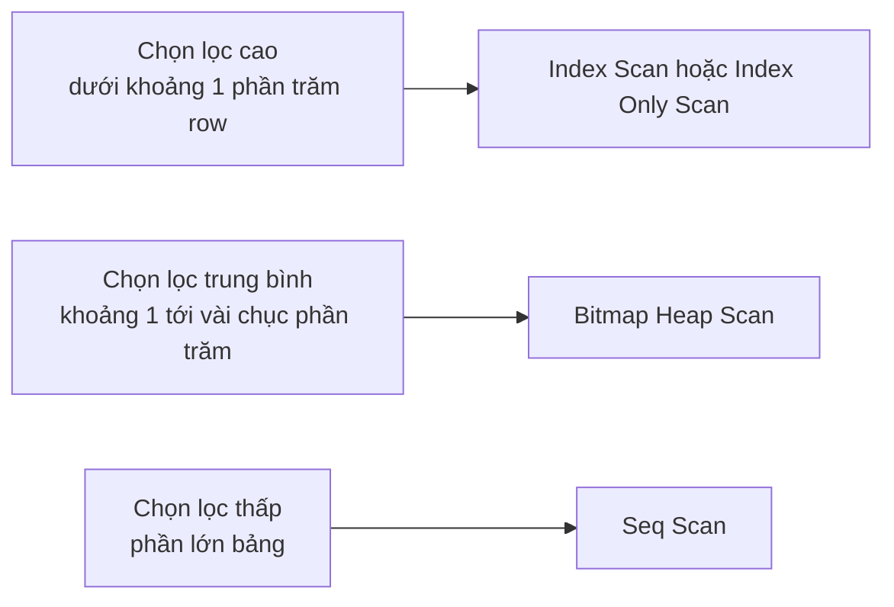
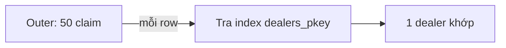
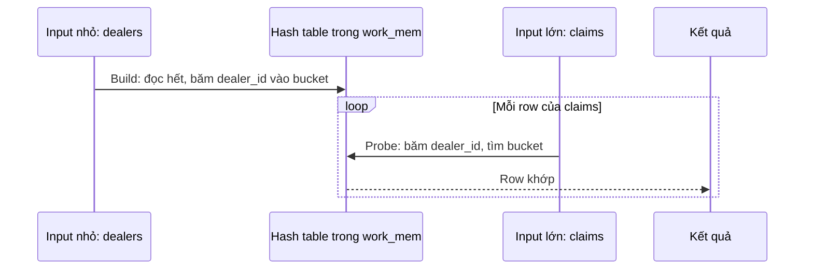
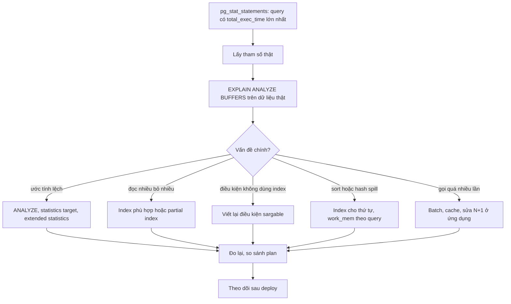

# Query Optimization

## 1. Tổng quan

Tối ưu query là làm cho database **làm ít việc hơn** để trả cùng một kết quả: đọc ít page hơn, xử lý ít row hơn, tránh sort và hash không cần thiết, chọn thuật toán join phù hợp với kích thước dữ liệu.

Phần lớn công việc tối ưu thuộc một trong ba nhóm:

1. **Cho planner đường đi tốt hơn**: index phù hợp.
2. **Cho planner thông tin đúng hơn**: thống kê chính xác.
3. **Cho planner câu hỏi dễ hơn**: viết lại query để điều kiện có thể dùng index, giảm dữ liệu cần xử lý.

Để làm được, cần hiểu planner chọn giữa các cách **scan** và các thuật toán **join** như thế nào.

## 2. Mental Model

> Planner so sánh chi phí của các cách làm dựa trên **số row dự đoán**. Mọi quyết định (scan nào, join nào, thứ tự nào) đều bắt nguồn từ câu hỏi: "bước này sẽ xử lý bao nhiêu row?". Ước tính số row sai là nguồn gốc của phần lớn plan tệ.

## 3. Vì sao cần hiểu cách planner quyết định?

- Không phải cứ có index là nhanh; với điều kiện ít chọn lọc, seq scan là lựa chọn đúng.
- Nested Loop cực nhanh với vài row và thảm họa với hàng triệu row.
- Viết lại một điều kiện (bỏ hàm trên cột) có thể biến seq scan thành index scan.

## 4. Planner chọn cách scan như thế nào?

| Scan | Cách làm | Khi planner chọn |
|---|---|---|
| **Seq Scan** | Đọc mọi page của bảng theo thứ tự vật lý | Bảng nhỏ; điều kiện trả tỷ lệ lớn row; không có index phù hợp |
| **Index Scan** | Duyệt index, với mỗi entry đọc heap theo TID | Ít row (selectivity cao); cần thứ tự của index; heap tương quan với index |
| **Index Only Scan** | Duyệt index, đọc heap chỉ khi page không all-visible | Mọi cột cần đều có trong index và bảng đã được vacuum tốt |
| **Bitmap Heap Scan** | Duyệt index để tạo bitmap các page chứa row khớp, rồi đọc heap theo thứ tự page | Số row trung bình (quá nhiều cho index scan, quá ít cho seq scan); kết hợp nhiều index bằng BitmapAnd/BitmapOr |

### Chi phí theo selectivity



Diễn giải:

1. **Index Scan** có chi phí tỷ lệ với số row: mỗi row có thể là một lần đọc page ngẫu nhiên. Rất rẻ với vài row, đắt nhanh khi row tăng.
2. **Seq Scan** có chi phí gần như cố định: đọc mọi page tuần tự, dù điều kiện trả 1 row hay tất cả.
3. **Bitmap Heap Scan** ở giữa: thu thập mọi TID trước, sắp xếp theo page, đọc mỗi page cần thiết **một lần** theo thứ tự vật lý. Mất khả năng trả row theo thứ tự của index.
4. Ngưỡng chính xác phụ thuộc kích thước row, `random_page_cost`, và **correlation**: nếu thứ tự vật lý của heap khớp với thứ tự index, index scan đọc heap gần như tuần tự và vẫn rẻ ở selectivity thấp hơn.

`Bitmap Heap Scan` hiển thị `Recheck Cond`: khi bitmap quá lớn so với `work_mem`, nó chuyển sang mức page (lossy) và phải kiểm tra lại điều kiện cho mọi row trong page (`Heap Blocks: lossy=...`).

## 5. Planner chọn thuật toán join như thế nào?

### Nested Loop



- Với **mỗi** row của input ngoài (outer), tìm row khớp trong input trong (inner) — thường bằng index.
- Chi phí ≈ số row outer × chi phí một lần tra inner.
- **Tốt khi**: outer nhỏ, inner có index trên cột join. Không cần bộ nhớ, trả row ngay (streaming) — hợp với `LIMIT`.
- **Tệ khi**: outer lớn. Planner ước tính outer 10 row nhưng thực tế 1 triệu → 1 triệu lần tra index. Đây là dạng plan tệ phổ biến nhất do ước tính sai.
- Là thuật toán duy nhất xử lý được điều kiện join không phải equality (`a.x < b.y`).
- Từ PostgreSQL 14, node **Memoize** có thể cache kết quả tra inner khi outer có nhiều giá trị lặp lại.

### Hash Join



- **Build**: đọc toàn bộ input nhỏ hơn, dựng hash table trên cột join.
- **Probe**: duyệt input lớn, với mỗi row băm và tra hash table.
- Chi phí ≈ tuyến tính theo tổng kích thước hai input. Chỉ dùng cho điều kiện equality.
- Cần bộ nhớ: `work_mem × hash_mem_multiplier` (multiplier mặc định 2.0 từ PostgreSQL 15). Không đủ → chia **batch** và spill ra disk.
- Node build là blocking: không trả row nào cho tới khi build xong.
- **Tốt khi**: hai input đều lớn, không có index phù hợp, hoặc join không có `LIMIT`.

### Merge Join

- Cả hai input được **sắp xếp** theo cột join (bằng index hoặc node Sort), rồi duyệt song song như trộn hai danh sách đã sắp.
- Chi phí ≈ tuyến tính nếu input đã sắp sẵn; thêm chi phí sort nếu chưa.
- **Tốt khi**: hai input lớn đã có thứ tự (index trên cột join ở cả hai bảng), hoặc kết quả cần theo thứ tự đó.

### Tóm tắt lựa chọn join

| Tình huống | Join thường được chọn |
|---|---|
| Outer nhỏ, inner có index | Nested Loop |
| Hai input lớn, equality, không sắp sẵn | Hash Join |
| Hai input lớn đã sắp theo cột join | Merge Join |
| Điều kiện không phải equality | Nested Loop |
| Có `LIMIT` nhỏ và đường streaming | Nested Loop |

## 6. Ước tính sai: nguyên nhân và cách sửa

| Nguyên nhân | Ví dụ | Cách sửa |
|---|---|---|
| Thống kê cũ | Sau import 10 triệu row | `ANALYZE table` |
| Phân phối lệch không được mẫu bắt | Vài tenant chiếm phần lớn dữ liệu | Tăng `ALTER TABLE ... ALTER COLUMN ... SET STATISTICS 1000` |
| Cột tương quan | `country` và `city`, `model` và `brand` | `CREATE STATISTICS s ON country, city FROM t; ANALYZE t;` |
| Hàm, biểu thức | `WHERE lower(email) = ...` không có thống kê cho biểu thức | Expression index (có thống kê riêng) |
| Generic plan | Prepared statement với giá trị lệch | `plan_cache_mode = force_custom_plan` cho query đó |
| Điều kiện trên kết quả join/CTE | Planner không có thống kê cho kết quả trung gian | Viết lại, tách query |

## 7. Các kỹ thuật viết lại query

### Điều kiện sargable

Điều kiện dùng được index là điều kiện so sánh **trực tiếp cột** với giá trị:

```sql
-- Không dùng được index trên created_at
WHERE date_trunc('day', created_at) = '2026-09-01'
WHERE created_at + interval '7 days' > now()

-- Dùng được
WHERE created_at >= '2026-09-01' AND created_at < '2026-09-02'
WHERE created_at > now() - interval '7 days'
```

### Keyset pagination thay OFFSET

```sql
-- OFFSET 100000: đọc và bỏ 100.000 row mỗi lần
SELECT * FROM claims ORDER BY created_at DESC, id DESC LIMIT 50 OFFSET 100000;

-- Keyset: bắt đầu ngay tại vị trí trang trước dừng
SELECT * FROM claims
WHERE (created_at, id) < ($1, $2)
ORDER BY created_at DESC, id DESC
LIMIT 50;
```

Với index `(created_at DESC, id DESC)`, keyset có chi phí không đổi dù ở trang thứ bao nhiêu. Xem [Pagination](../08-api-design/pagination.md).

### Batch thay vì N query

```sql
-- N+1: một query cho mỗi claim
SELECT * FROM claim_lines WHERE claim_id = $1;

-- Một query cho cả lô
SELECT * FROM claim_lines WHERE claim_id = ANY($1::bigint[]);
```

Xem [N+1 Query](../05-sqlalchemy/n-plus-one.md).

### EXISTS và NOT EXISTS

```sql
-- Semi-join: dừng ngay khi tìm thấy một row khớp
SELECT d.* FROM dealers d
WHERE EXISTS (SELECT 1 FROM claims c WHERE c.dealer_id = d.id AND c.status = 'pending');

-- NOT IN nguy hiểm: nếu subquery có NULL, kết quả luôn rỗng
SELECT * FROM vehicles WHERE vin NOT IN (SELECT vin FROM recalls);   -- sai nếu recalls.vin có NULL
SELECT * FROM vehicles v WHERE NOT EXISTS (SELECT 1 FROM recalls r WHERE r.vin = v.vin);   -- đúng
```

### OR giữa các cột khác nhau

```sql
-- Có thể thành seq scan
WHERE customer_phone = $1 OR customer_email = $2

-- Mỗi nhánh dùng index riêng
SELECT ... WHERE customer_phone = $1
UNION
SELECT ... WHERE customer_email = $2
```

Planner đôi khi tự dùng BitmapOr; kiểm tra plan trước khi viết lại.

### Top-N mỗi nhóm với LATERAL

```sql
-- 3 claim mới nhất của mỗi dealer, dùng index (dealer_id, created_at DESC)
SELECT d.id, c.*
FROM dealers d
CROSS JOIN LATERAL (
    SELECT * FROM claims c
    WHERE c.dealer_id = d.id
    ORDER BY c.created_at DESC
    LIMIT 3
) c;
```

### Chỉ chọn cột cần thiết

`SELECT *` ngăn Index Only Scan, kéo theo cột TOAST lớn, tăng băng thông và chi phí serialize.

### COUNT trên bảng lớn

`SELECT count(*) FROM claims` phải duyệt mọi row visible (MVCC không cho phép lưu sẵn một con số chính xác cho mọi snapshot). Với con số hiển thị gần đúng, dùng `reltuples` từ `pg_class` hoặc bảng đếm được cập nhật riêng.

## 8. Quy trình tối ưu



Diễn giải: bắt đầu từ **tổng** thời gian (một query 5 ms gọi 10 triệu lần/ngày quan trọng hơn một query 2 giây gọi 10 lần/ngày). Mỗi vòng chỉ sửa một thứ và đo lại.

## 9. Hành vi trong production

- **Tối ưu cho tổng tải, không cho một query**: thêm index giúp một query đọc có thể làm chậm mọi thao tác ghi.
- **Plan thay đổi khi dữ liệu tăng**: query ổn định nhiều tháng có thể đột ngột đổi plan khi bảng vượt một ngưỡng. Theo dõi `mean_exec_time` theo thời gian.
- **Tối ưu ở ứng dụng thường hiệu quả hơn**: bỏ query không cần thiết, cache, batch — trước khi tinh chỉnh SQL.
- **`work_mem` theo query**: `SET LOCAL work_mem = '256MB'` trong transaction của báo cáo nặng, thay vì tăng toàn cục.

## 10. Khi scale lên thì chuyện gì xảy ra?

| Kích thước bảng | Điều thay đổi |
|---|---|
| Vài nghìn row | Mọi plan đều nhanh; seq scan là bình thường |
| Vài triệu row | Thiếu index lộ rõ; N+1 bắt đầu đáng kể |
| Hàng trăm triệu row | Index phải chính xác; OFFSET không dùng được; count(*) đắt; VACUUM và tạo index mất nhiều giờ |
| Hàng tỷ row | Partition, BRIN, archive dữ liệu cũ, tổng hợp trước |

Xem [Large Table Design](large-table-design.md) và [Partitioning](partitioning.md).

## 11. Trade-offs

| Tối ưu | Lợi ích | Chi phí |
|---|---|---|
| Thêm index | Đọc nhanh | Ghi chậm, dung lượng, VACUUM lâu hơn |
| Tăng `work_mem` | Ít spill | Rủi ro hết memory khi nhiều connection |
| Denormalize, bảng tổng hợp | Đọc rất nhanh | Phải giữ đồng bộ, dữ liệu có thể trễ |
| Materialized view | Tính trước query nặng | Refresh tốn kém, dữ liệu trễ |
| Viết lại query | Không thêm chi phí ghi | Code phức tạp hơn, cần kiểm thử |

## 12. Sai lầm thường gặp

- Tối ưu query chậm nhất thay vì query tốn tổng thời gian nhất.
- Thêm index mà không xem query có dùng không.
- Dùng hint/tắt tham số planner (`enable_seqscan = off`) trong production thay vì sửa nguyên nhân.
- Tin rằng CTE luôn là "optimization fence" — từ PostgreSQL 12, CTE không đệ quy được inline trừ khi dùng `MATERIALIZED`.
- Dùng `NOT IN` với subquery có thể có NULL.

## 13. Cách debug

```sql
-- Top query theo tổng thời gian
SELECT left(query, 80) AS q, calls, round(total_exec_time) AS total_ms,
       round(mean_exec_time::numeric, 2) AS mean_ms, rows,
       shared_blks_read, temp_blks_written
FROM pg_stat_statements ORDER BY total_exec_time DESC LIMIT 15;

-- Bảng bị seq scan nhiều
SELECT relname, seq_scan, seq_tup_read, idx_scan
FROM pg_stat_user_tables ORDER BY seq_tup_read DESC LIMIT 10;
```

`temp_blks_written` lớn → spill; `shared_blks_read` lớn → đọc nhiều từ ngoài cache.

## 14. Best Practices

- Đo trước, tối ưu sau; bắt đầu từ `pg_stat_statements`.
- Thiết kế index theo query thật; giữ điều kiện sargable.
- Giữ thống kê chính xác; dùng extended statistics cho cột tương quan.
- Keyset pagination, batch query, chỉ chọn cột cần thiết.
- Kiểm tra mọi thay đổi bằng `EXPLAIN (ANALYZE, BUFFERS)` trên dữ liệu thật.
- Cân nhắc chi phí ghi của mỗi index mới.

## 15. Tóm tắt

- Planner chọn scan theo selectivity và correlation: Index Scan cho ít row, Bitmap Heap Scan cho lượng vừa, Seq Scan cho phần lớn bảng.
- Nested Loop tốt khi outer nhỏ và inner có index; Hash Join cho hai input lớn với equality; Merge Join khi hai input đã sắp theo cột join.
- Ước tính số row sai là nguyên nhân chính của plan tệ; thống kê và extended statistics sửa được phần lớn.
- Viết lại query để điều kiện sargable, dùng keyset pagination, batch, EXISTS thay NOT IN.
- Tối ưu theo tổng tải và đo lại sau mỗi thay đổi.

## Liên quan

- [EXPLAIN ANALYZE](explain-analyze.md)
- [Index](index.md)
- [Query Lifecycle](query-lifecycle.md)
- [SQL nâng cao](sql-advanced.md)
- [N+1 Query](../05-sqlalchemy/n-plus-one.md)
- [API Slow](../20-production-incidents/api-slow.md)
