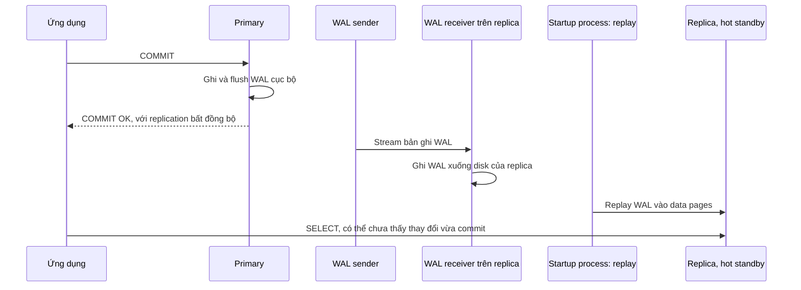
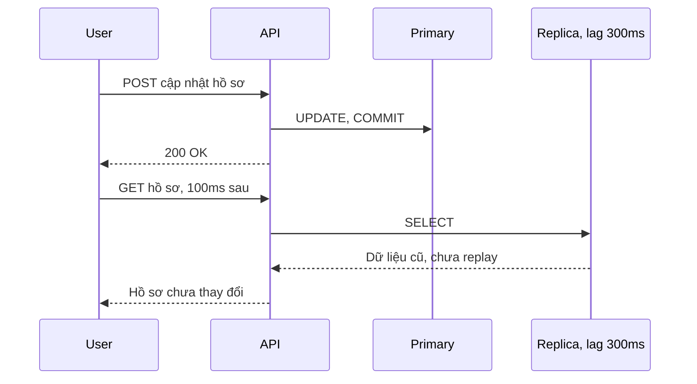
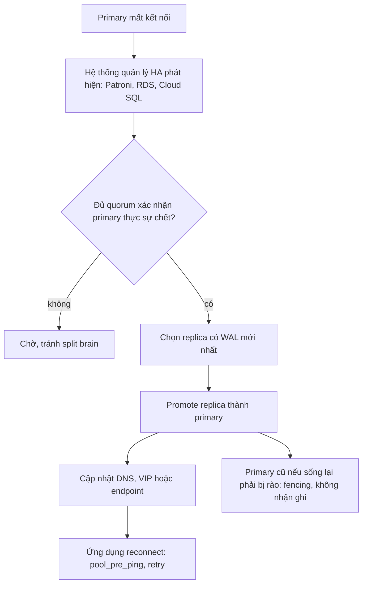

# Replication

## 1. Tổng quan

Replication là việc duy trì một hoặc nhiều bản sao của database trên server khác. PostgreSQL có hai loại chính:

| Loại | Sao chép gì | Dùng cho |
|---|---|---|
| **Physical (streaming) replication** | WAL — thay đổi ở mức byte của page | High availability, read replica, bản sao giống hệt primary |
| **Logical replication** | Thay đổi ở mức row (INSERT/UPDATE/DELETE) được giải mã từ WAL | Đồng bộ một phần bảng, nâng cấp version, CDC sang hệ thống khác |

Replication giải quyết hai bài toán khác nhau: **sống sót khi primary chết** (HA) và **chia tải đọc** (scale read). Nó không giải quyết bài toán chia tải **ghi** — mọi ghi vẫn đi qua một primary.

## 2. Mental Model

> Primary ghi nhật ký (WAL) cho mọi thay đổi. Replica là người chép lại nhật ký đó và áp dụng từng dòng, luôn đi sau primary một khoảng. Khoảng cách đó — **replication lag** — là nguồn gốc của mọi hành vi "lạ" khi đọc từ replica.

## 3. Vì sao cần replication?

- **High availability**: primary hỏng phần cứng, zone mất điện — replica được thăng cấp (promote) thành primary mới trong vài giây tới vài phút.
- **Scale đọc**: báo cáo, dashboard, API đọc chấp nhận dữ liệu hơi cũ chạy trên replica, giảm tải primary.
- **Cô lập workload**: query phân tích nặng không làm chậm OLTP.
- **Backup và disaster recovery**: replica ở region khác.

## 4. Cơ chế hoạt động: streaming replication



Diễn giải:

1. Primary ghi WAL như bình thường ([PostgreSQL Fundamentals](database-fundamentals.md#6-wal-ghi-nhật-ký-trước)).
2. Process **WAL sender** trên primary stream bản ghi WAL qua kết nối replication tới replica.
3. **WAL receiver** trên replica nhận và ghi WAL xuống disk.
4. **Startup process** replay WAL, áp dụng thay đổi vào data page — replica là bản sao vật lý chính xác của primary.
5. Replica ở chế độ **hot standby** phục vụ query chỉ đọc trong lúc replay.

Lag có ba thành phần, xem trong `pg_stat_replication` trên primary:

- `write_lag`: WAL đã tới và được ghi (chưa flush) trên replica.
- `flush_lag`: WAL đã được flush trên replica.
- `replay_lag`: WAL đã được **áp dụng** — chỉ từ đây query trên replica mới thấy thay đổi.

## 5. Đồng bộ và bất đồng bộ

`synchronous_commit` kết hợp với `synchronous_standby_names` quyết định COMMIT chờ tới đâu:

| Mức | COMMIT chờ | Mất dữ liệu khi primary chết đột ngột | Latency |
|---|---|---|---|
| `off` | Không chờ flush cục bộ | Có thể mất giao dịch cuối trên chính primary | Thấp nhất |
| `local` | Flush WAL cục bộ | Có thể mất giao dịch chưa tới replica | Thấp |
| `remote_write` | Replica đã nhận và ghi (chưa flush) | Chỉ khi cả primary và OS của replica cùng chết | Thêm một round trip |
| `on` (có standby đồng bộ) | Replica đã flush WAL | Không | Thêm round trip + fsync trên replica |
| `remote_apply` | Replica đã replay | Không; và đọc trên replica ngay sau commit thấy dữ liệu | Cao nhất |

Replication bất đồng bộ là mặc định phổ biến: nhanh, nhưng failover có thể mất vài giao dịch cuối (RPO > 0). Replication đồng bộ cho RPO = 0, đổi lại mỗi commit chậm thêm một round trip mạng, và nếu replica đồng bộ chết mà không có dự phòng, primary **ngừng commit**. Thường cấu hình quorum (`ANY 1 (replica_a, replica_b)`) để một replica chết không làm dừng hệ thống.

## 6. Đọc từ replica: vấn đề read-your-writes



Diễn giải: người dùng vừa lưu thành công nhưng thấy dữ liệu cũ. Đây không phải bug của database mà là hệ quả của lag. Các cách xử lý:

- **Đọc từ primary sau khi ghi**: trong N giây sau khi user ghi, định tuyến đọc của user đó về primary (lưu dấu thời gian ghi trong session/cookie).
- **Theo LSN**: sau khi ghi, lấy `pg_current_wal_lsn()`; khi đọc từ replica, chỉ dùng replica đã replay tới LSN đó (`pg_last_wal_replay_lsn()`), không thì đọc primary.
- **Chỉ gửi truy vấn chấp nhận dữ liệu cũ** tới replica: báo cáo, danh sách, tìm kiếm.
- **`remote_apply`** cho một số transaction quan trọng (chấp nhận latency ghi cao hơn).

Đây là một dạng [eventual consistency](../10-distributed-systems/eventual-consistency.md) cần được thiết kế ở tầng ứng dụng.

## 7. Xung đột trên replica: hot_standby_feedback

Query dài trên replica đang đọc một phiên bản row. Trong khi đó primary chạy VACUUM, xóa phiên bản đó (vì trên primary không ai cần nó), WAL của việc xóa tới replica. Replica phải chọn:

- Hủy query đang chạy (`canceling statement due to conflict with recovery`), hoặc
- Tạm dừng replay (tăng lag), tối đa `max_standby_streaming_delay`.

`hot_standby_feedback = on` khiến replica báo cho primary biết snapshot cũ nhất nó cần → primary không dọn các phiên bản đó. Query trên replica không bị hủy, **nhưng** query dài trên replica giữ horizon của primary → [bloat trên primary](vacuum-bloat.md). Đánh đổi giữa "báo cáo trên replica bị hủy" và "primary bị bloat".

## 8. Replication slot

Replication slot đảm bảo primary **giữ lại WAL** cho tới khi replica (hoặc consumer logical) xác nhận đã nhận. Không có slot, replica bị ngắt lâu có thể không bắt kịp vì WAL cần thiết đã bị xóa.

Rủi ro: slot của một replica/consumer đã chết hoặc bị bỏ quên khiến primary giữ WAL **vô hạn** → thư mục `pg_wal` đầy disk → primary dừng. Slot logical còn giữ horizon (`catalog_xmin`). Từ PostgreSQL 13 có `max_slot_wal_keep_size` để giới hạn. Giám sát slot không active là bắt buộc.

## 9. Logical replication và CDC

Logical replication giải mã WAL thành thay đổi mức row:

- **Publication/Subscription** giữa hai PostgreSQL: sao chép một số bảng, nâng cấp major version với downtime thấp, gộp dữ liệu.
- **CDC** (Change Data Capture) với Debezium hoặc tương tự: stream thay đổi vào Kafka cho search index, cache invalidation, data warehouse. Đây là một cách cài đặt relay cho [Outbox Pattern](../10-distributed-systems/outbox-pattern.md).

Hạn chế: không sao chép DDL, sequence cần xử lý riêng, bảng cần primary key hoặc replica identity.

## 10. Failover



Diễn giải:

1. Phát hiện lỗi cần đủ chắc chắn — failover nhầm do mạng chập chờn gây gián đoạn không cần thiết.
2. Chọn replica ít lag nhất để giảm dữ liệu mất.
3. Sau promote, endpoint phải trỏ tới primary mới; connection cũ trong pool của ứng dụng trỏ tới server chết và phải được làm mới.
4. **Split brain**: nếu primary cũ sống lại và vẫn nhận ghi, hai primary cùng tồn tại, dữ liệu phân nhánh. Hệ thống HA phải rào (fence) primary cũ.

Trong ứng dụng: failover biểu hiện như vài giây tới vài chục giây lỗi kết nối. Retry có backoff cho thao tác idempotent, `pool_pre_ping`, và timeout hợp lý giúp phục hồi tự động.

## 11. Hành vi trong production

- **Lag tăng khi có ghi lớn**: batch update/delete lớn, tạo index, `VACUUM FULL` sinh WAL khổng lồ; replica tụt lại hàng phút.
- **Replica không phải backup**: `DROP TABLE` nhầm được replicate ngay lập tức. Cần backup với point-in-time recovery.
- **Đọc từ replica cần routing tường minh**: ORM/driver không tự biết query nào an toàn để đọc từ replica.
- **Replica cũng cần tài nguyên**: replay WAL là đơn luồng trong phần lớn trường hợp; replica yếu hơn primary có thể không theo kịp tốc độ ghi.

## 12. Failure Modes

| Failure | Nguyên nhân | Dấu hiệu |
|---|---|---|
| Đọc dữ liệu cũ | Lag, đọc replica ngay sau ghi | User thấy thay đổi "biến mất" |
| Disk đầy trên primary | Replication slot bị bỏ quên | `pg_wal` tăng liên tục |
| Query trên replica bị hủy | Xung đột với recovery | `canceling statement due to conflict with recovery` |
| Primary bloat | `hot_standby_feedback` + query dài trên replica | Dead tuple không được dọn |
| Mất dữ liệu khi failover | Replication bất đồng bộ | Giao dịch cuối không có trên primary mới |
| Split brain | Failover không có fencing | Dữ liệu phân nhánh |
| Primary dừng commit | Replica đồng bộ duy nhất chết | Mọi COMMIT treo |

## 13. Trade-offs

| Lựa chọn | Lợi ích | Chi phí |
|---|---|---|
| Async replication | Latency ghi thấp | RPO > 0 |
| Sync replication (quorum) | RPO = 0 | Latency commit, phụ thuộc replica |
| Đọc từ replica | Giảm tải primary | Dữ liệu cũ, logic routing |
| `hot_standby_feedback = on` | Query replica không bị hủy | Bloat trên primary |
| Logical replication | Linh hoạt, xuyên version | Phức tạp, không sao chép DDL |

## 14. Sai lầm thường gặp

- Coi replica là backup.
- Gửi mọi `SELECT` tới replica, kể cả đọc ngay sau ghi.
- Không giám sát replication slot.
- Dùng một replica đồng bộ duy nhất.
- Không test failover và hành vi reconnect của ứng dụng.

## 15. Cách debug

```sql
-- Trên primary: trạng thái và lag của từng replica
SELECT application_name, state, sync_state, write_lag, flush_lag, replay_lag
FROM pg_stat_replication;

-- Replication slot và WAL bị giữ
SELECT slot_name, slot_type, active,
       pg_size_pretty(pg_wal_lsn_diff(pg_current_wal_lsn(), restart_lsn)) AS retained_wal
FROM pg_replication_slots;

-- Trên replica: độ trễ replay theo thời gian
SELECT now() - pg_last_xact_replay_timestamp() AS replay_delay;
```

Lưu ý: `replay_delay` tăng khi primary không có ghi nào (không có gì để replay) — kết hợp với LSN diff để đánh giá đúng.

## 16. Best Practices

- Ít nhất một replica ở zone khác cho HA; dùng hệ thống quản lý HA có fencing.
- Chọn sync/async theo RPO của nghiệp vụ; dùng quorum nếu sync.
- Định tuyến đọc tường minh; xử lý read-your-writes cho luồng người dùng.
- Giám sát lag, slot, và xung đột recovery.
- Backup với PITR độc lập với replication.
- Diễn tập failover định kỳ, bao gồm kiểm tra ứng dụng tự phục hồi.

## 17. Tóm tắt

- Streaming replication gửi WAL từ primary sang replica để replay thành bản sao vật lý.
- Lag gồm write, flush, replay; chỉ sau replay, replica mới thấy thay đổi.
- Sync replication đổi latency lấy RPO = 0; async nhanh nhưng có thể mất giao dịch cuối khi failover.
- Đọc từ replica gây vấn đề read-your-writes; cần routing theo thời gian hoặc LSN.
- Replication slot, `hot_standby_feedback` và split brain là các rủi ro vận hành chính.

## Liên quan

- [PostgreSQL Fundamentals](database-fundamentals.md)
- [VACUUM và Bloat](vacuum-bloat.md)
- [Database Scaling](../11-system-design/database-scaling.md)
- [Eventual Consistency](../10-distributed-systems/eventual-consistency.md)
- [High Availability](../17-performance-reliability/high-availability.md)
- [RDS](../14-cloud/rds.md)
