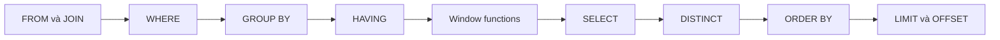

# SQL nâng cao cho backend

## 1. Tổng quan

Nhiều logic backend được viết bằng vòng lặp Python trên dữ liệu đã tải về có thể được diễn đạt ngắn hơn, đúng hơn và nhanh hơn bằng SQL: phân trang, xếp hạng, top-N mỗi nhóm, upsert không race condition, tổng lũy kế, so sánh với row trước. Tài liệu này tập trung vào **ngữ nghĩa** của các cấu trúc SQL mà backend engineer dùng hằng ngày, và những cái bẫy dẫn tới kết quả sai lặng lẽ.

## 2. Mental Model

> SQL là **khai báo trên tập hợp**: bạn mô tả kết quả, database chọn cách tính. Thứ tự bạn viết mệnh đề không phải thứ tự chúng được đánh giá.

## 3. Thứ tự đánh giá logic



Diễn giải và hệ quả:

1. `FROM`/`JOIN` tạo tập row ban đầu.
2. `WHERE` lọc row — **không** dùng được alias của `SELECT` và không dùng được aggregate hay window function (chúng chưa được tính).
3. `GROUP BY` gom nhóm; `HAVING` lọc **nhóm** (dùng được aggregate).
4. Window function được tính **sau** `WHERE`/`GROUP BY` — muốn lọc theo kết quả window function phải bọc trong subquery/CTE.
5. `SELECT` tính biểu thức và alias; `ORDER BY` dùng được alias.
6. `LIMIT` áp dụng cuối cùng.

Đây là thứ tự **logic**; planner có thể thực thi khác (đẩy điều kiện xuống, dùng index cho ORDER BY) miễn kết quả tương đương.

## 4. NULL và logic ba giá trị

`NULL` nghĩa là "không biết". So sánh với NULL cho kết quả `NULL` (không phải `TRUE` hay `FALSE`), và `WHERE` chỉ giữ row có điều kiện `TRUE`.

| Biểu thức | Kết quả |
|---|---|
| `NULL = NULL` | `NULL` |
| `NULL <> 1` | `NULL` |
| `NULL IS NULL` | `TRUE` |
| `a IS DISTINCT FROM b` | So sánh coi NULL như một giá trị |
| `count(*)` | Đếm mọi row |
| `count(col)` | Bỏ qua NULL |
| `sum(col)` trên tập rỗng | `NULL`, không phải 0 — dùng `coalesce(sum(col), 0)` |

### Bẫy `NOT IN`

```sql
SELECT * FROM vehicles WHERE vin NOT IN (SELECT vin FROM recalls);
```

Nếu `recalls.vin` có **một** giá trị NULL, `vin NOT IN (..., NULL)` là `NULL` cho mọi row → kết quả **rỗng**, không có lỗi. Dùng `NOT EXISTS`:

```sql
SELECT * FROM vehicles v
WHERE NOT EXISTS (SELECT 1 FROM recalls r WHERE r.vin = v.vin);
```

## 5. JOIN, semi-join, anti-join

| Nhu cầu | Cách viết | Ghi chú |
|---|---|---|
| Row khớp ở cả hai bên | `INNER JOIN` | Có thể nhân bản row nếu bên kia có nhiều match |
| Giữ mọi row bên trái | `LEFT JOIN` | Điều kiện trên bảng phải đặt trong `ON`, không trong `WHERE` |
| "Có tồn tại ít nhất một" | `EXISTS` (semi-join) | Không nhân bản row, dừng ở match đầu tiên |
| "Không tồn tại" | `NOT EXISTS` (anti-join) | An toàn với NULL |

Bẫy `LEFT JOIN`:

```sql
-- Biến LEFT JOIN thành INNER JOIN ngầm: dealer không có claim bị loại
SELECT d.id, c.id FROM dealers d
LEFT JOIN claims c ON c.dealer_id = d.id
WHERE c.status = 'pending';

-- Đúng ý: giữ mọi dealer, chỉ ghép claim pending
SELECT d.id, c.id FROM dealers d
LEFT JOIN claims c ON c.dealer_id = d.id AND c.status = 'pending';
```

Bẫy nhân bản khi aggregate qua join:

```sql
-- Sai: mỗi claim bị đếm lặp theo số dòng chi tiết
SELECT d.id, count(c.id), sum(l.amount)
FROM dealers d JOIN claims c ON ... JOIN claim_lines l ON ...
GROUP BY d.id;
```

Aggregate từng tầng trong subquery trước khi join, hoặc dùng `count(DISTINCT c.id)`.

## 6. Aggregate có điều kiện với FILTER

```sql
SELECT dealer_id,
       count(*) AS total,
       count(*) FILTER (WHERE status = 'approved') AS approved,
       sum(amount) FILTER (WHERE status = 'approved') AS approved_amount
FROM claims
WHERE created_at >= date_trunc('month', now())
GROUP BY dealer_id;
```

Một lần quét cho nhiều chỉ số thay vì nhiều query.

## 7. Window function

Window function tính giá trị trên một "cửa sổ" các row liên quan **mà không gộp row** như `GROUP BY`.

```sql
SELECT vin, serviced_at, odometer,
       odometer - lag(odometer) OVER w AS km_since_last,
       row_number() OVER w AS visit_no,
       sum(cost) OVER (PARTITION BY vin ORDER BY serviced_at
                       ROWS BETWEEN UNBOUNDED PRECEDING AND CURRENT ROW) AS cumulative_cost
FROM service_records
WINDOW w AS (PARTITION BY vin ORDER BY serviced_at);
```

| Hàm | Dùng cho |
|---|---|
| `row_number()` | Đánh số duy nhất trong nhóm (top-N, loại trùng) |
| `rank()`, `dense_rank()` | Xếp hạng có đồng hạng |
| `lag()`, `lead()` | So sánh với row trước/sau (phát hiện đồng hồ công tơ mét quay ngược) |
| `sum() OVER (...)` | Tổng lũy kế, trung bình trượt |
| `first_value()`, `last_value()` | Giá trị đầu/cuối cửa sổ (chú ý frame mặc định) |

Frame mặc định khi có `ORDER BY` là `RANGE BETWEEN UNBOUNDED PRECEDING AND CURRENT ROW` — `last_value()` với frame mặc định trả về **row hiện tại**, không phải row cuối nhóm. Khai báo frame tường minh.

### Lọc theo kết quả window function

```sql
-- Loại trùng: giữ bản ghi mới nhất cho mỗi (vin, fault_code)
SELECT * FROM (
    SELECT *, row_number() OVER (PARTITION BY vin, fault_code ORDER BY reported_at DESC) AS rn
    FROM fault_reports
) t
WHERE rn = 1;
```

PostgreSQL có cú pháp riêng ngắn hơn cho trường hợp này: `SELECT DISTINCT ON (vin, fault_code) * FROM fault_reports ORDER BY vin, fault_code, reported_at DESC;`.

## 8. CTE và CTE đệ quy

```sql
WITH pending AS (
    SELECT id, dealer_id FROM claims WHERE status = 'pending'
)
SELECT d.name, count(*) FROM pending p JOIN dealers d ON d.id = p.dealer_id GROUP BY d.name;
```

> **Ghi chú version:** Trước PostgreSQL 12, CTE luôn được "materialize" (tính riêng, là rào chắn tối ưu hóa). Từ 12, CTE không đệ quy, không có tác dụng phụ, được tham chiếu một lần sẽ được **inline** vào query chính. Dùng `WITH x AS MATERIALIZED (...)` hoặc `NOT MATERIALIZED` để điều khiển tường minh.

CTE đệ quy cho dữ liệu cây (danh mục phụ tùng, cấp tổ chức đại lý):

```sql
WITH RECURSIVE tree AS (
    SELECT id, parent_id, name, 1 AS depth FROM part_categories WHERE id = $1
    UNION ALL
    SELECT c.id, c.parent_id, c.name, t.depth + 1
    FROM part_categories c JOIN tree t ON c.parent_id = t.id
    WHERE t.depth < 20                      -- chặn vòng lặp vô hạn nếu dữ liệu có chu trình
)
SELECT * FROM tree;
```

## 9. UPSERT: INSERT ... ON CONFLICT

```sql
INSERT INTO idempotency_keys (tenant_id, key, request_hash, status)
VALUES ($1, $2, $3, 'processing')
ON CONFLICT (tenant_id, key) DO NOTHING
RETURNING id;
```

- Dựa trên **unique index** để phát hiện xung đột một cách nguyên tử — không có khoảng hở như "SELECT rồi INSERT".
- `DO NOTHING`: không trả về row khi xung đột → biết request đã tồn tại. Đây là nền tảng của [idempotency](../10-distributed-systems/idempotency.md).
- `DO UPDATE SET ... = EXCLUDED....`: cập nhật row hiện có bằng giá trị từ row định insert (`EXCLUDED`).

```sql
INSERT INTO vehicle_last_seen (vin, seen_at, odometer)
VALUES ($1, $2, $3)
ON CONFLICT (vin) DO UPDATE
SET seen_at = EXCLUDED.seen_at, odometer = EXCLUDED.odometer
WHERE vehicle_last_seen.seen_at < EXCLUDED.seen_at;    -- bỏ qua event đến muộn
```

Mệnh đề `WHERE` trong `DO UPDATE` giúp xử lý event không theo thứ tự: chỉ cập nhật nếu dữ liệu mới hơn.

`MERGE` (PostgreSQL 15+) diễn đạt được logic insert/update/delete có điều kiện phức tạp hơn, nhưng không có đảm bảo nguyên tử với xung đột đồng thời như `ON CONFLICT` — với upsert đồng thời, `ON CONFLICT` vẫn là lựa chọn an toàn.

## 10. RETURNING

`INSERT`, `UPDATE`, `DELETE` trả về row bị ảnh hưởng, tránh một round trip đọc lại:

```sql
UPDATE jobs SET status = 'running', started_at = now()
WHERE id = $1 AND status = 'queued'
RETURNING id, payload;
```

Nếu không có row trả về, job đã được người khác lấy — kiểm tra và cập nhật trong **một** câu lệnh nguyên tử.

## 11. LATERAL

`LATERAL` cho phép subquery trong `FROM` tham chiếu tới cột của bảng đứng trước nó — như một vòng lặp "với mỗi row bên trái, chạy subquery này":

```sql
SELECT v.vin, s.*
FROM vehicles v
CROSS JOIN LATERAL (
    SELECT serviced_at, odometer FROM service_records r
    WHERE r.vin = v.vin ORDER BY serviced_at DESC LIMIT 3
) s
WHERE v.fleet_id = $1;
```

Với index `(vin, serviced_at DESC)`, mỗi lần subquery chỉ đọc 3 entry — hiệu quả hơn nhiều so với window function trên toàn bảng rồi lọc.

## 12. Hành vi trong production

- Đẩy tính toán tập hợp xuống database giảm dữ liệu truyền qua mạng và số round trip — thường là cải thiện hiệu năng lớn nhất.
- Nhưng SQL phức tạp khó test và khó review. Giữ logic nghiệp vụ quan trọng có test tích hợp chạy trên PostgreSQL thật (không phải SQLite).
- Window function trên toàn bảng lớn tốn bộ nhớ (`work_mem`) và có thể spill; lọc trước bằng `WHERE`.
- `ON CONFLICT` cần đúng unique index; thiếu index → lỗi `there is no unique or exclusion constraint matching the ON CONFLICT specification`.

## 13. Failure Modes

| Failure | Nguyên nhân | Dấu hiệu |
|---|---|---|
| Kết quả rỗng bất ngờ | `NOT IN` với NULL | Query trả 0 row, không lỗi |
| Mất row của LEFT JOIN | Điều kiện bảng phải đặt trong `WHERE` | Nhóm không có dữ liệu biến mất |
| Tổng bị nhân | Aggregate qua join nhiều tầng | Số liệu lớn gấp nhiều lần |
| `last_value` sai | Frame mặc định | Giá trị bằng row hiện tại |
| Race khi upsert | SELECT rồi INSERT thay vì `ON CONFLICT` | Lỗi unique violation hoặc bản ghi trùng |
| Đệ quy vô hạn | Dữ liệu cây có chu trình | Query không kết thúc |

## 14. Best Practices

- Hiểu thứ tự đánh giá logic để đặt điều kiện đúng chỗ.
- Dùng `NOT EXISTS` thay `NOT IN` với subquery.
- Aggregate trước khi join nhiều tầng; dùng `FILTER` cho aggregate có điều kiện.
- Dùng `ON CONFLICT` cho upsert và idempotency; `RETURNING` để tránh round trip.
- `LATERAL` + index cho top-N mỗi nhóm.
- Test SQL phức tạp trên PostgreSQL thật với dữ liệu biên (NULL, rỗng, trùng).

## 15. Tóm tắt

- Thứ tự đánh giá logic: FROM → WHERE → GROUP BY → HAVING → window → SELECT → ORDER BY → LIMIT.
- NULL tạo logic ba giá trị; `NOT IN` với NULL cho kết quả rỗng.
- Window function tính trên cửa sổ mà không gộp row; khai báo frame tường minh.
- `ON CONFLICT` là upsert nguyên tử dựa trên unique index — nền tảng cho idempotency.
- `LATERAL`, `DISTINCT ON`, `FILTER`, `RETURNING` giúp diễn đạt logic backend phổ biến gọn và hiệu quả.

## Liên quan

- [Query Optimization](query-optimization.md)
- [Index](index.md)
- [Idempotency](../10-distributed-systems/idempotency.md)
- [ORM và Raw SQL](../05-sqlalchemy/orm-vs-raw-sql.md)
