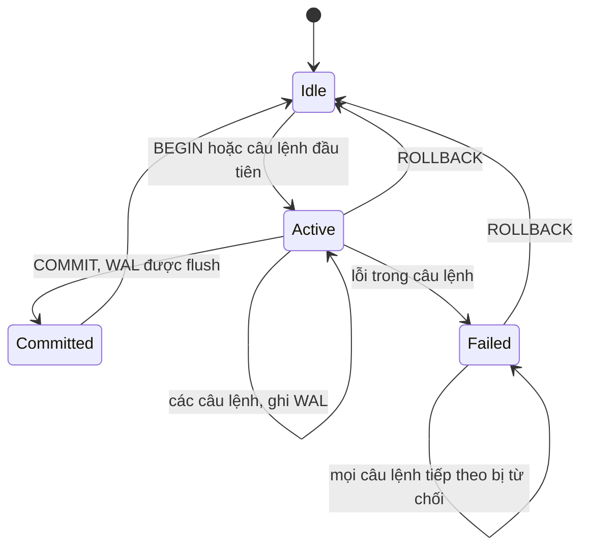
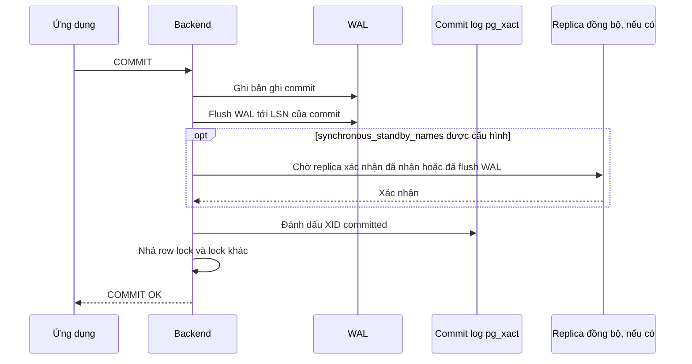

# Transaction trong PostgreSQL

## 1. Tổng quan

Transaction là một nhóm thao tác được database đối xử như **một đơn vị**: hoặc tất cả có hiệu lực, hoặc không thao tác nào có hiệu lực. Nó là công cụ chính để bảo vệ **invariant** của dữ liệu — những điều luôn phải đúng, như "tổng tiền các dòng bằng tổng tiền claim" hay "một VIN chỉ có một claim đang mở cho cùng một lỗi".

Bốn đảm bảo ACID trong PostgreSQL:

| Thuộc tính | Nghĩa | PostgreSQL thực hiện bằng |
|---|---|---|
| **Atomicity** | Tất cả hoặc không gì | Trạng thái transaction trong commit log; tuple của transaction abort trở nên vô hình |
| **Consistency** | Chuyển từ trạng thái hợp lệ sang trạng thái hợp lệ | Constraint (PK, FK, unique, check, exclusion) được kiểm tra |
| **Isolation** | Transaction đồng thời không thấy trạng thái dở dang của nhau | [MVCC](mvcc.md), lock, [isolation level](isolation-level.md) |
| **Durability** | Đã commit thì không mất | WAL được flush trước khi báo commit thành công |

## 2. Mental Model

> Transaction là ranh giới all-or-nothing và isolation cho một invariant cục bộ trong database. Nó **không** phải là một cái bọc "càng rộng càng an toàn". Transaction càng dài càng giữ nhiều tài nguyên (lock, snapshot, connection) và càng tạo nhiều xung đột.

## 3. Vì sao cần transaction?

Tạo một claim gồm: insert claim, insert 5 dòng chi tiết, cập nhật hạn mức bảo hành còn lại, insert một event vào outbox. Nếu process chết sau khi insert claim nhưng trước khi cập nhật hạn mức, không có transaction thì dữ liệu ở trạng thái vô nghĩa. Transaction đảm bảo hoặc mọi thứ xảy ra, hoặc không gì xảy ra.

## 4. Cơ chế hoạt động

### Vòng đời



Diễn giải:

1. Không có `BEGIN` tường minh, mỗi câu lệnh là một transaction riêng (autocommit).
2. Trong transaction, mỗi câu lệnh ghi WAL và thay đổi tuple, nhưng chưa ai khác thấy.
3. `COMMIT`: WAL được flush xuống disk (với `synchronous_commit = on`), trạng thái transaction được ghi là committed. Từ đó các snapshot mới thấy thay đổi.
4. Nếu một câu lệnh lỗi, transaction chuyển sang trạng thái **failed**: mọi câu lệnh tiếp theo nhận lỗi `current transaction is aborted, commands ignored until end of transaction block` cho tới khi `ROLLBACK`.
5. `ROLLBACK` chỉ đánh dấu transaction là aborted — không có công việc "hoàn tác" nào. Tuple đã tạo trở thành dead và được VACUUM dọn sau.

### Transaction ID

PostgreSQL chỉ cấp XID thật khi transaction **ghi** lần đầu. Transaction chỉ đọc dùng "virtual XID" rẻ hơn. Điều này giảm tiêu thụ XID (liên quan tới wraparound) cho workload đọc nhiều.

### Savepoint

```sql
BEGIN;
INSERT INTO claims ...;
SAVEPOINT before_lines;
INSERT INTO claim_lines ...;         -- lỗi
ROLLBACK TO SAVEPOINT before_lines;  -- transaction không bị failed hoàn toàn
COMMIT;
```

Savepoint tạo subtransaction, cho phép rollback một phần. SQLAlchemy dùng savepoint cho `session.begin_nested()`. Dùng quá nhiều subtransaction trong một transaction dài (hàng trăm+) có thể gây vấn đề hiệu năng (bộ nhớ đệm subtransaction bị tràn) — tránh savepoint trong vòng lặp lớn.

## 5. Durability và chi phí commit

`COMMIT` phải đợi WAL được `fsync` xuống disk — thường 0.1–few ms trên SSD, lâu hơn trên disk mạng. Đây là giới hạn cứng cho số commit tuần tự mỗi giây của một connection.

| Cách ghi 10.000 row | Số commit | Chi phí |
|---|---|---|
| Mỗi row một transaction | 10.000 | 10.000 lần fsync — chậm |
| Một transaction cho cả lô | 1 | Nhanh, nhưng lock/snapshot giữ lâu hơn |
| Batch 500–1.000 row mỗi transaction | 10–20 | Cân bằng |

PostgreSQL gộp flush WAL cho các commit đồng thời (group commit), nên nhiều connection commit song song hiệu quả hơn một connection commit tuần tự.

`synchronous_commit = off` (theo transaction: `SET LOCAL synchronous_commit = off`) cho phép commit trả về trước khi flush — nhanh hơn nhiều, rủi ro mất các giao dịch cuối cùng (vài trăm ms) khi crash, nhưng không làm hỏng dữ liệu. Phù hợp cho log, metric, dữ liệu có thể tái tạo.

## 6. Transaction trong ứng dụng

### Ranh giới đúng

```python
async def approve_claim(session: AsyncSession, claim_id: int, reviewer_id: int):
    async with session.begin():
        claim = await session.get(Claim, claim_id, with_for_update=True)
        if claim.status != "pending":
            raise ClaimNotPending(claim_id)
        claim.status = "approved"
        claim.approved_by = reviewer_id
        session.add(OutboxEvent(type="ClaimApproved", aggregate_id=claim_id, payload={...}))
    # COMMIT tại đây: cập nhật claim và outbox event cùng thành công hoặc cùng thất bại

    # Gửi thông báo NGOÀI transaction, thông qua outbox relay, không gọi trực tiếp ở đây
```

### Sai lầm kinh điển: I/O bên ngoài trong transaction

```python
async with session.begin():
    claim = await session.get(Claim, claim_id, with_for_update=True)   # khóa row
    result = await payment_client.charge(claim.total)                  # 2 giây gọi mạng
    claim.payment_ref = result.ref
```

Trong 2 giây đó:

- Row claim bị khóa — transaction khác cập nhật claim này phải chờ.
- Connection bị giữ khỏi pool.
- Snapshot bị giữ (ảnh hưởng VACUUM).
- Nếu payment thành công nhưng commit thất bại (DB failover), tiền đã bị trừ nhưng database không biết. Nếu payment timeout, không biết tiền đã bị trừ chưa.

Transaction database **không bao được** tác dụng phụ bên ngoài. Hướng đúng: ghi trạng thái "đang thanh toán" + outbox trong một transaction ngắn; gọi payment ngoài transaction với [idempotency key](../10-distributed-systems/idempotency.md); ghi kết quả trong transaction thứ hai; reconciliation cho trường hợp không rõ. Xem [Saga](../10-distributed-systems/saga.md) và [Outbox Pattern](../10-distributed-systems/outbox-pattern.md).

## 7. Bên trong hệ thống xảy ra gì khi COMMIT?



Diễn giải:

1. Bản ghi commit được thêm vào WAL và flush xuống disk — từ thời điểm này commit là bền vững.
2. Với replication đồng bộ, backend chờ replica xác nhận — thêm một round trip mạng vào mỗi commit.
3. Trạng thái XID được cập nhật; các snapshot lấy từ bây giờ sẽ thấy thay đổi.
4. Mọi lock được nhả; transaction đang chờ được đánh thức.

"Lỗi mạng ngay sau khi gửi COMMIT" là trường hợp không rõ: commit có thể đã thành công hoặc chưa. Ứng dụng cần idempotency hoặc kiểm tra lại trạng thái, không được giả định thất bại.

## 8. Hành vi trong production

- **`idle in transaction`**: connection đang mở transaction nhưng không làm gì. Thường do code quên commit/rollback khi có exception, hoặc session ORM mở transaction ngầm rồi giữ. Nó giữ lock, snapshot, connection. Đặt `idle_in_transaction_session_timeout`.
- **Lock chờ dây chuyền**: transaction A khóa row X rồi làm việc chậm; B, C, D chờ X; mỗi cái lại khóa row khác mà E, F chờ. Transaction ngắn là cách phòng ngừa chính.
- **Transaction lớn**: xóa 50 triệu row trong một transaction tạo WAL khổng lồ, giữ lock lâu, gây replication lag, và rollback nếu lỗi ở cuối. Chia thành batch.
- **Retry**: lỗi serialization (`40001`) và deadlock (`40P01`) là lỗi **có thể retry** — retry **toàn bộ** transaction từ đầu, không chỉ câu lệnh lỗi.

## 9. Failure Modes

| Failure | Nguyên nhân | Dấu hiệu |
|---|---|---|
| Transaction failed state | Tiếp tục dùng session sau lỗi mà không rollback | `current transaction is aborted` |
| Idle in transaction | Không commit/rollback | `state = 'idle in transaction'` lâu trong `pg_stat_activity` |
| Lock contention | Transaction dài giữ row lock | Nhiều backend `wait_event_type = Lock` |
| Tác dụng phụ không nhất quán | Gọi dịch vụ ngoài trong transaction | Tiền trừ nhưng không có bản ghi, hoặc ngược lại |
| Replication lag | Transaction ghi khổng lồ | Lag tăng vọt khi job chạy |
| Commit không rõ kết quả | Mất kết nối sau khi gửi COMMIT | Không biết dữ liệu đã lưu chưa |

## 10. Trade-offs

| Lựa chọn | Lợi ích | Chi phí |
|---|---|---|
| Transaction rộng | Nhiều invariant được bảo vệ cùng lúc | Giữ tài nguyên lâu, xung đột nhiều |
| Transaction hẹp | Ít xung đột, throughput cao | Phải thiết kế trạng thái trung gian hợp lệ |
| Batch lớn | Ít commit, nhanh | Lock và WAL dồn cục, rollback tốn kém |
| `synchronous_commit = off` | Ghi nhanh | Có thể mất giao dịch cuối khi crash |
| Replication đồng bộ | Không mất dữ liệu khi primary chết | Latency commit tăng, phụ thuộc replica |

## 11. Sai lầm thường gặp

- Bọc cả request (kể cả gọi HTTP, xử lý file) trong một transaction.
- Retry chỉ câu lệnh lỗi thay vì cả transaction.
- Commit từng row trong vòng lặp import.
- Không rollback khi có exception, để session ở trạng thái failed.
- Tin rằng transaction bảo vệ được thao tác trên hệ thống khác.

## 12. Cách debug

```sql
-- Transaction mở lâu và trạng thái
SELECT pid, usename, state, now() - xact_start AS xact_age,
       now() - state_change AS state_age, wait_event_type, left(query, 80)
FROM pg_stat_activity
WHERE xact_start IS NOT NULL
ORDER BY xact_start LIMIT 20;

-- Ai đang chặn ai
SELECT pid, pg_blocking_pids(pid) AS blocked_by, left(query, 60)
FROM pg_stat_activity WHERE cardinality(pg_blocking_pids(pid)) > 0;
```

Ở phía ứng dụng: log thời lượng transaction; cảnh báo khi transaction vượt ngưỡng (ví dụ 1 giây).

## 13. Best Practices

- Transaction bao đúng một invariant cục bộ và ngắn nhất có thể.
- Không làm I/O bên ngoài database trong transaction; dùng outbox cho tác dụng phụ.
- Retry toàn bộ transaction khi gặp `40001`/`40P01`, có giới hạn số lần và jitter.
- Đặt `idle_in_transaction_session_timeout`, `statement_timeout`, `lock_timeout`.
- Batch thao tác ghi lớn thành các transaction vừa phải.
- Dùng constraint để database tự bảo vệ invariant, không chỉ dựa vào logic ứng dụng.

## 14. Tóm tắt

- Transaction đảm bảo ACID; PostgreSQL thực hiện bằng WAL, commit log, MVCC, lock và constraint.
- COMMIT bền vững khi WAL được flush; ROLLBACK không hoàn tác gì, chỉ đánh dấu aborted.
- Lỗi trong transaction đưa nó vào trạng thái failed cho tới khi rollback.
- Transaction dài giữ lock, snapshot và connection; không bao được tác dụng phụ bên ngoài.
- Lỗi serialization và deadlock cần retry toàn bộ transaction.

## Liên quan

- [MVCC](mvcc.md)
- [Isolation Level](isolation-level.md)
- [Locks](locks.md)
- [Transaction trong SQLAlchemy](../05-sqlalchemy/transaction.md)
- [Outbox Pattern](../10-distributed-systems/outbox-pattern.md)
