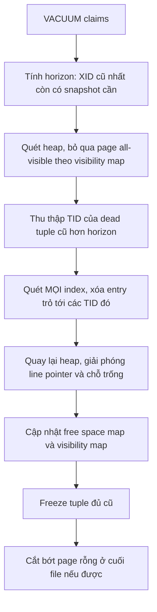
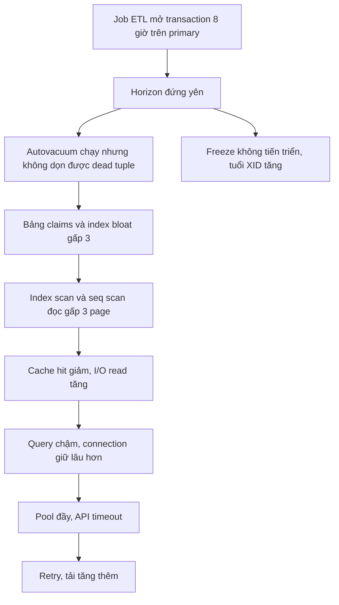

# VACUUM, ANALYZE và Bloat

## 1. Tổng quan

Vì [MVCC](mvcc.md), mỗi `UPDATE` và `DELETE` trong PostgreSQL để lại **dead tuple** — phiên bản row cũ không còn transaction nào cần. Dead tuple vẫn chiếm chỗ trong page và trong index. Không ai dọn, bảng và index phình to mãi (**bloat**), query đọc nhiều page hơn, cache kém hiệu quả hơn.

**VACUUM** là quá trình dọn dẹp đó. Nó còn làm ba việc quan trọng khác: cập nhật visibility map (cho index-only scan), cập nhật free space map (để insert tái sử dụng chỗ trống), và **freeze** tuple cũ để tránh transaction ID wraparound.

**ANALYZE** thu thập thống kê cho planner. Cả hai được **autovacuum** chạy tự động.

VACUUM thường bị coi là "việc nền tự lo". Trong hệ thống ghi nhiều, nó là một trong những yếu tố quyết định sức khỏe dài hạn của database.

## 2. Mental Model

> MVCC là cách PostgreSQL "vay" để đọc ghi không chặn nhau; VACUUM là cách nó "trả nợ". Nợ tích tụ khi ghi nhanh hơn dọn, hoặc khi có ai đó (transaction dài) ngăn không cho dọn. Nợ để lâu thành bloat; nợ để quá lâu thành nguy cơ wraparound.

## 3. Vì sao cần VACUUM?

| Việc | Nếu không làm |
|---|---|
| Dọn dead tuple trong heap và index | Bloat: bảng/index lớn dần, scan chậm |
| Cập nhật free space map | Insert luôn ghi vào page mới ở cuối bảng, bảng phình |
| Cập nhật visibility map | Index Only Scan vẫn phải đọc heap (`Heap Fetches` cao) |
| Freeze tuple cũ | Tới giới hạn XID, database ngừng nhận ghi |
| (ANALYZE) Cập nhật thống kê | Planner chọn plan sai |

## 4. Cơ chế hoạt động

### VACUUM thường (không FULL)



Diễn giải:

1. VACUUM chỉ dọn tuple chết **trước horizon** — XID cũ nhất mà còn snapshot nào đó có thể cần. Transaction dài làm horizon đứng yên, VACUUM không dọn được gì mới.
2. Page đã all-visible được bỏ qua — nhờ đó vacuum bảng lớn ít thay đổi rất nhanh.
3. Với dead tuple thu thập được, VACUUM phải quét **toàn bộ mỗi index** để xóa entry tương ứng. Bảng có nhiều index và lớn → bước này tốn nhất. Nếu bộ nhớ chứa TID (`maintenance_work_mem`) đầy, phải quét index nhiều lượt.
4. Chỗ trống trong heap được đánh dấu tái sử dụng — **không trả lại cho hệ điều hành** (trừ page rỗng ở cuối file). Kích thước file thường không giảm.
5. VACUUM thường chỉ cần lock `SHARE UPDATE EXCLUSIVE`: không chặn đọc/ghi thông thường.

> **Ghi chú version:** PostgreSQL 17 thay cấu trúc lưu TID của VACUUM bằng TidStore, dùng ít bộ nhớ hơn nhiều và bỏ giới hạn 1 GB — giảm số lượt quét index trên bảng lớn. PostgreSQL 13 cho phép VACUUM xử lý index song song (`VACUUM (PARALLEL n)` thủ công).

### VACUUM FULL

Ghi lại **toàn bộ bảng** sang file mới, gọn chặt, rồi xây lại mọi index. Trả dung lượng cho OS. Nhưng cần lock `ACCESS EXCLUSIVE` suốt thời gian chạy — **chặn cả SELECT**. Với bảng lớn trong production, đây là downtime. Thay thế trực tuyến: extension `pg_repack` (xây bảng mới trong nền, chỉ khóa ngắn lúc chuyển đổi).

### ANALYZE

Lấy mẫu (mặc định 300 × `default_statistics_target` = 30.000 row) để tính thống kê cho [planner](query-lifecycle.md#5-planner-cost-model-và-thống-kê). Nhanh, lock nhẹ.

## 5. Autovacuum

Autovacuum launcher định kỳ kiểm tra mọi bảng và cấp worker (mặc định tối đa 3) khi ngưỡng bị vượt:

```text
vacuum khi:   n_dead_tup > autovacuum_vacuum_threshold (50)
                            + autovacuum_vacuum_scale_factor (0.2) × reltuples
analyze khi:  n_mod_since_analyze > 50 + 0.1 × reltuples
insert vacuum (13+): n_ins_since_vacuum > 1000 + 0.2 × reltuples
```

Vấn đề của scale factor 0.2 với bảng lớn: bảng 500 triệu row chỉ được vacuum khi có **100 triệu** dead tuple. Tới lúc đó, bloat đã lớn và mỗi lần vacuum rất nặng. Với bảng lớn, đặt riêng:

```sql
ALTER TABLE claims SET (
    autovacuum_vacuum_scale_factor = 0.01,
    autovacuum_analyze_scale_factor = 0.005
);
```

### Throttling

Autovacuum tự giới hạn tốc độ để không chiếm I/O của workload: mỗi khi tích lũy đủ "chi phí" (`autovacuum_vacuum_cost_limit`), nó ngủ `autovacuum_vacuum_cost_delay` (mặc định 2 ms từ PostgreSQL 12). Trên disk hiện đại và bảng ghi nhiều, giới hạn mặc định có thể quá chậm — autovacuum chạy mãi không xong, dead tuple tích tụ nhanh hơn tốc độ dọn. Tăng `cost_limit` (toàn cục hoặc theo bảng) là điều chỉnh thường gặp.

## 6. Transaction ID wraparound và freeze

XID là số 32-bit. PostgreSQL so sánh XID theo vòng tròn: mỗi XID coi khoảng 2 tỷ XID trước nó là quá khứ và 2 tỷ sau là tương lai. Tuple có `xmin` quá cũ, nếu không xử lý, sẽ đột ngột bị coi là "tương lai" → biến mất.

**Freeze** đánh dấu tuple là "đã commit từ rất lâu, visible với mọi transaction", không còn phụ thuộc giá trị XID. VACUUM freeze tuple có tuổi vượt `vacuum_freeze_min_age`.

Các mốc:

| Tham số | Mặc định | Ý nghĩa |
|---|---|---|
| `autovacuum_freeze_max_age` | 200 triệu | Khi tuổi bảng vượt mức này, autovacuum **bắt buộc** chạy vacuum chống wraparound, kể cả khi đã tắt autovacuum cho bảng |
| Cảnh báo | ~40 triệu XID trước giới hạn | Log cảnh báo liên tục |
| Giới hạn cứng | ~3 triệu XID trước giới hạn | Database từ chối cấp XID mới — **mọi thao tác ghi dừng** cho tới khi vacuum xong |

Vacuum chống wraparound phải quét toàn bảng (với page chưa all-frozen), không bị hủy khi có xung đột lock, và có thể rất nặng với bảng lớn. Hệ thống ghi nhiều (hàng nghìn transaction/giây) tiêu thụ 200 triệu XID trong vài ngày.

Multixact ID (dùng khi nhiều transaction cùng khóa chia sẻ một row, ví dụ kiểm tra FK) có cơ chế wraparound tương tự.

## 7. Bloat: nguyên nhân và hệ quả

### Nguyên nhân

- Update/delete nhiều, autovacuum không theo kịp (ngưỡng cao, throttling chậm, ít worker).
- **Horizon bị giữ**: transaction dài, `idle in transaction`, replication slot không tiêu thụ, replica với `hot_standby_feedback = on` chạy query dài, prepared transaction bị bỏ quên.
- Mẫu xóa hàng loạt: xóa 80% bảng rồi insert lại — chỗ trống được tái sử dụng nhưng file không co lại.
- Index bloat: B-tree không tái sử dụng chỗ trống tốt như heap với một số mẫu cập nhật; page gần rỗng vẫn chiếm chỗ.

### Failure chain



Diễn giải: vấn đề bắt đầu ở một transaction không liên quan tới bảng `claims`, nhưng horizon là toàn cục. Khi job kết thúc, VACUUM dọn được dead tuple nhưng file không co lại — bloat còn đó cho tới khi `pg_repack` hoặc dữ liệu mới lấp đầy chỗ trống.

## 8. Hành vi trong production

- **Bảng hàng đợi** (job queue trong PostgreSQL, bảng outbox) có mẫu insert–update–delete liên tục: rất dễ bloat. Cần autovacuum tích cực cho riêng bảng đó, và giữ transaction của consumer ngắn.
- **Sau bulk load**: chạy `VACUUM (ANALYZE)` để đặt visibility map, hint bits và thống kê ngay, thay vì để query đầu tiên chịu chi phí.
- **Sau xóa hàng loạt**: VACUUM không co file. Nếu cần trả dung lượng, dùng `pg_repack`, hoặc thiết kế bằng [partitioning](partitioning.md) để xóa dữ liệu cũ bằng `DROP`/`DETACH` partition — không sinh dead tuple.
- **Autovacuum bị hủy**: autovacuum thường tự nhường khi có câu lệnh cần lock xung đột (ví dụ `ALTER TABLE`). Migration chạy thường xuyên có thể làm autovacuum trên bảng đó không bao giờ hoàn tất.

## 9. Failure Modes

| Failure | Nguyên nhân | Dấu hiệu |
|---|---|---|
| Bloat nặng | Autovacuum không kịp hoặc bị chặn | Kích thước bảng/index tăng nhanh hơn số row sống |
| Autovacuum chạy mãi | Throttling quá chặt, bảng quá lớn | `pg_stat_progress_vacuum` cho thấy tiến độ chậm |
| Wraparound | Freeze không tiến triển | Cảnh báo trong log, `age(datfrozenxid)` gần 2 tỷ |
| Index Only Scan chậm | Visibility map chưa cập nhật | `Heap Fetches` cao trong EXPLAIN |
| Plan sai sau import | ANALYZE chưa chạy | Ước tính row lệch lớn |
| Downtime do VACUUM FULL | Dùng FULL trên bảng production | Mọi query trên bảng bị chặn |

## 10. Trade-offs

| Lựa chọn | Lợi ích | Chi phí |
|---|---|---|
| Autovacuum tích cực (scale factor nhỏ, cost limit cao) | Ít bloat, thống kê mới | Nhiều I/O nền |
| Autovacuum mặc định | Ít I/O nền | Bảng lớn bị bloat trước khi được dọn |
| `VACUUM FULL` | Trả dung lượng ngay | Khóa toàn bảng |
| `pg_repack` | Trả dung lượng trực tuyến | Cần gấp đôi dung lượng tạm thời, extension ngoài |
| Partition + drop | Xóa dữ liệu cũ không tạo dead tuple | Thiết kế phức tạp hơn |

## 11. Sai lầm thường gặp

- Tắt autovacuum vì "nó làm chậm hệ thống".
- Dùng `VACUUM FULL` trong giờ cao điểm.
- Để scale factor mặc định cho bảng hàng trăm triệu row.
- Bỏ qua transaction `idle in transaction` và replication slot bị bỏ quên.
- Nghĩ `DELETE` hàng loạt sẽ làm file nhỏ lại.

## 12. Cách debug

```sql
-- Bảng có nhiều dead tuple và lần vacuum gần nhất
SELECT relname, n_live_tup, n_dead_tup,
       round(100.0 * n_dead_tup / nullif(n_live_tup + n_dead_tup, 0), 1) AS dead_pct,
       last_autovacuum, last_autoanalyze, autovacuum_count
FROM pg_stat_user_tables ORDER BY n_dead_tup DESC LIMIT 15;

-- Vacuum đang chạy và tiến độ
SELECT pid, relid::regclass, phase, heap_blks_total, heap_blks_scanned, index_vacuum_count
FROM pg_stat_progress_vacuum;

-- Tuổi XID của từng bảng
SELECT c.oid::regclass, age(c.relfrozenxid) AS xid_age,
       pg_size_pretty(pg_total_relation_size(c.oid))
FROM pg_class c WHERE c.relkind = 'r' ORDER BY 2 DESC LIMIT 10;

-- Ai đang giữ horizon
SELECT pid, state, now() - xact_start AS age, backend_xmin
FROM pg_stat_activity WHERE backend_xmin IS NOT NULL ORDER BY age(backend_xmin) DESC LIMIT 5;
SELECT slot_name, active, xmin FROM pg_replication_slots;
```

Để đo bloat chính xác: extension `pgstattuple` (`pgstattuple('claims')`, `pgstatindex('idx')`) — tốn I/O, chạy ngoài giờ cao điểm. Bật `log_autovacuum_min_duration` để ghi log các lần autovacuum chạy lâu.

## 13. Best Practices

- Không tắt autovacuum; điều chỉnh nó theo bảng.
- Scale factor nhỏ cho bảng lớn; tăng cost limit khi disk cho phép.
- Giới hạn transaction dài: `idle_in_transaction_session_timeout`, chạy báo cáo trên replica.
- Giám sát: dead tuple, tuổi XID, transaction lâu nhất, replication slot, thời lượng autovacuum.
- `VACUUM (ANALYZE)` sau bulk load; dùng partition để xóa dữ liệu cũ.
- Dùng `pg_repack` thay `VACUUM FULL` để thu hồi dung lượng trực tuyến.

## 14. Tóm tắt

- VACUUM dọn dead tuple do MVCC để lại, cập nhật free space map và visibility map, và freeze tuple cũ.
- VACUUM chỉ dọn được tuple cũ hơn horizon; transaction dài và replication slot làm horizon đứng yên trên toàn database.
- VACUUM thường không khóa đọc/ghi nhưng không trả dung lượng cho OS; VACUUM FULL trả dung lượng nhưng khóa toàn bảng.
- Autovacuum với ngưỡng mặc định quá chậm cho bảng lớn; cần điều chỉnh theo bảng.
- Freeze ngăn XID wraparound; nếu để tới giới hạn, database ngừng nhận ghi.

## Liên quan

- [MVCC](mvcc.md)
- [Transaction](transaction.md)
- [Index](index.md)
- [Partitioning](partitioning.md)
- [Replication](replication.md)
- [Database High CPU](../20-production-incidents/database-high-cpu.md)
