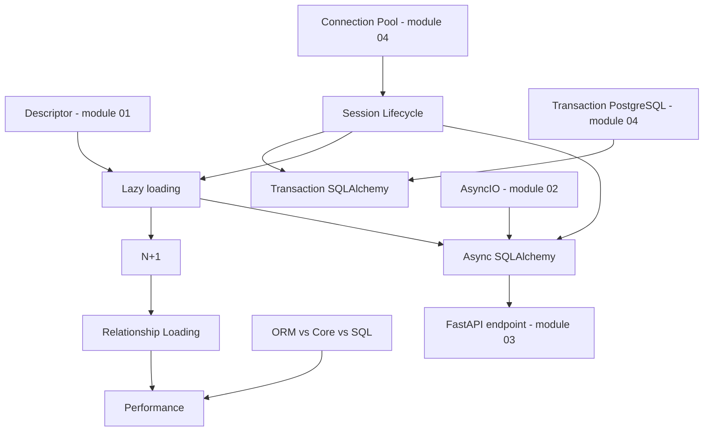

# 05 — SQLAlchemy

## Module này học gì?

SQLAlchemy 2.0 như một lớp nằm giữa code Python và PostgreSQL: Engine và pool, Session và unit of work, vòng đời object, ranh giới transaction, loading strategy và N+1, async SQLAlchemy với cầu nối greenlet, khi nào dùng ORM, Core hay SQL thuần, và các nguồn chi phí hiệu năng phía Python.

## Tại sao cần học?

ORM che giấu SQL — cả mặt tốt lẫn mặt xấu. Nhiều sự cố production có gốc rễ ở đây: N+1 làm endpoint danh sách chậm và cạn pool, Session giữ transaction trong lúc gọi API ngoài, `MissingGreenlet` khi chuyển sang async, job batch hết memory vì identity map, commit rải rác làm dữ liệu nửa vời. Hiểu SQLAlchemy làm gì bên dưới là điều kiện để dùng nó an toàn dưới tải.

## Thứ tự nên đọc

1. [Session Lifecycle](session-lifecycle.md) — Engine, Session, trạng thái object, flush/commit, expire.
2. [Transaction](transaction.md) — ai sở hữu ranh giới transaction, savepoint, locking, retry.
3. [N+1 Query](n-plus-one.md)
4. [Relationship Loading](relationship-loading.md) — strategy, cột deferred, `yield_per`.
5. [Async SQLAlchemy](async-sqlalchemy.md) — greenlet, `MissingGreenlet`, AsyncSession.
6. [ORM, Core và Raw SQL](orm-vs-raw-sql.md)
7. [Performance](performance.md)

## Các concept phụ thuộc nhau thế nào?

Cách đọc diagram:

1. Session lifecycle nối connection pool (module 04) với code ứng dụng: thời gian Session giữ transaction là thời gian giữ connection.
2. Lazy loading dựa trên descriptor (module 01) và là nguồn của N+1; relationship loading là cách kiểm soát nó.
3. Async SQLAlchemy kết hợp AsyncIO (module 02), Session và vấn đề lazy loading — lazy load ngầm trở thành `MissingGreenlet`.
4. Performance tổng hợp: số query, hydration, lựa chọn ORM/Core.

## File quan trọng nhất

[Session Lifecycle](session-lifecycle.md), [N+1 Query](n-plus-one.md) và [Async SQLAlchemy](async-sqlalchemy.md).

---

[← PostgreSQL](../04-database-postgresql/README.md) · [Knowledge map](../../README.md) · [Redis →](../06-redis/README.md)
