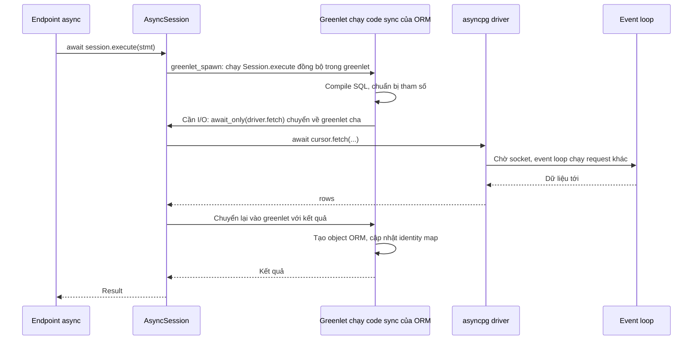

# Async SQLAlchemy

## 1. Tổng quan

SQLAlchemy hỗ trợ asyncio qua `sqlalchemy.ext.asyncio`: `AsyncEngine`, `AsyncConnection`, `AsyncSession`. Kết hợp với driver async như **asyncpg** hoặc **psycopg (async)**, ứng dụng FastAPI có thể chờ database mà không block event loop.

Điểm đặc biệt: SQLAlchemy **không viết lại** toàn bộ ORM thành async. Phần lõi (ORM, unit of work, Core) vẫn là code đồng bộ; async được thêm vào bằng một **cầu nối dựa trên greenlet**. Hiểu cầu nối này giải thích lỗi nổi tiếng nhất của async SQLAlchemy: `MissingGreenlet`.

## 2. Mental Model

> AsyncSession là một lớp vỏ async bọc quanh Session đồng bộ. Khi bạn `await session.execute(...)`, SQLAlchemy chạy code đồng bộ bên trong một greenlet; mỗi khi code đó cần I/O, nó "nhảy ra" khỏi greenlet để `await` driver async, rồi "nhảy vào" lại. Cầu nối chỉ tồn tại **bên trong** các lời gọi có `await`. Bất kỳ I/O nào bị kích hoạt **bên ngoài** — như đọc một attribute lazy — không có cầu nối, và lỗi.

## 3. Vì sao cần async SQLAlchemy?

Trong endpoint `async def`, gọi Session đồng bộ với driver đồng bộ (psycopg2) sẽ **block event loop** trong suốt thời gian chờ database — mọi request khác trên worker đứng yên. Xem [Sync vs Async Endpoint](../03-fastapi/sync-vs-async-endpoint.md). Có hai lựa chọn đúng:

1. Endpoint `def` + Session đồng bộ (chạy trong threadpool).
2. Endpoint `async def` + `AsyncSession` + driver async.

Lựa chọn 2 cho concurrency cao hơn (không bị giới hạn 40 thread) khi toàn bộ đường xử lý là async.

## 4. Cơ chế hoạt động: cầu nối greenlet

**Greenlet** là coroutine cấp thấp (thư viện C) cho phép chuyển qua lại giữa các stack mà không cần `async/await` ở mọi tầng.



Diễn giải:

1. `await session.execute()` gọi `greenlet_spawn`, chạy phương thức đồng bộ `Session.execute` bên trong một greenlet con.
2. Code đồng bộ của ORM chạy bình thường cho tới khi cần I/O. Adapter của driver gọi `await_only(coroutine)`: hàm này **chuyển quyền** từ greenlet con về greenlet cha (nơi đang ở trong một coroutine thật), mang theo coroutine của driver.
3. Greenlet cha `await` coroutine đó — event loop được giải phóng để chạy việc khác trong lúc chờ database.
4. Khi có kết quả, greenlet cha chuyển lại vào greenlet con với kết quả; code đồng bộ tiếp tục như thể lời gọi I/O vừa trả về.
5. Khi code đồng bộ xong, kết quả được trả ra ngoài.

Với người dùng, mọi thứ trông như async thuần. Chi phí của greenlet nhỏ so với I/O mạng.

## 5. `MissingGreenlet`: vì sao và khi nào?

```text
sqlalchemy.exc.MissingGreenlet: greenlet_spawn has not been called;
can't call await_only() here. Was IO attempted in an unexpected place?
```

Lỗi xảy ra khi code đồng bộ của SQLAlchemy cần I/O nhưng **không đang chạy trong greenlet** do `greenlet_spawn` tạo ra — tức là I/O bị kích hoạt từ một thao tác không phải `await`. Các trường hợp phổ biến:

| Tình huống | Vì sao cần I/O |
|---|---|
| Truy cập relationship chưa load: `claim.lines` | Lazy loading phát sinh SELECT từ việc đọc attribute |
| Truy cập attribute sau commit với `expire_on_commit=True` | Attribute expired phải được tải lại |
| Truy cập attribute có `deferred` chưa load | Tải cột bị hoãn |
| Pydantic serialize ORM object có relationship chưa load | Serializer đọc attribute → lazy load |

Cách xử lý:

1. **Eager load** mọi relationship sẽ dùng: `selectinload`, `joinedload`. Xem [N+1](n-plus-one.md).
2. **`expire_on_commit=False`** trong `async_sessionmaker`.
3. **`lazy="raise"`** trên relationship để lỗi rõ ràng hơn và buộc eager load tường minh.
4. Khi thực sự cần lazy load một relationship: `await session.refresh(claim, ["lines"])`, hoặc mixin `AsyncAttrs` rồi `await claim.awaitable_attrs.lines`.
5. Chạy một đoạn code ORM đồng bộ phức tạp: `await session.run_sync(fn)` — `fn` nhận Session đồng bộ và chạy bên trong greenlet, lazy load bên trong nó hoạt động.

## 6. Ví dụ: cấu hình và sử dụng

```python
from contextlib import asynccontextmanager
from sqlalchemy import select
from sqlalchemy.ext.asyncio import AsyncSession, async_sessionmaker, create_async_engine
from sqlalchemy.orm import selectinload

@asynccontextmanager
async def lifespan(app):
    engine = create_async_engine(
        "postgresql+asyncpg://app@db/warranty",
        pool_size=10,
        max_overflow=5,
        pool_timeout=3,
        pool_pre_ping=True,
        connect_args={"command_timeout": 5},        # timeout mỗi câu lệnh phía asyncpg
    )
    app.state.sessionmaker = async_sessionmaker(engine, expire_on_commit=False)
    yield
    await engine.dispose()

async def list_pending(session: AsyncSession, limit: int = 50) -> list[Claim]:
    stmt = (
        select(Claim)
        .where(Claim.status == "pending")
        .options(selectinload(Claim.lines), selectinload(Claim.dealer))
        .order_by(Claim.created_at.desc())
        .limit(limit)
    )
    return list((await session.scalars(stmt)).all())
```

## 7. Không dùng một AsyncSession đồng thời

```python
# SAI: hai task cùng dùng một session
async with asyncio.TaskGroup() as tg:
    tg.create_task(session.execute(q1))
    tg.create_task(session.execute(q2))
```

Một AsyncSession (và connection bên dưới) chỉ xử lý **một thao tác tại một thời điểm**. Dùng đồng thời gây lỗi kiểu "This session is provisioning a new connection; concurrent operations are not permitted" hoặc lỗi từ driver ("another operation is in progress"). Muốn query song song, mỗi task dùng Session riêng (và vì vậy mỗi task một connection riêng từ pool):

```python
async def load(q):
    async with sessionmaker() as s:
        return (await s.execute(q)).all()

async with asyncio.TaskGroup() as tg:
    t1 = tg.create_task(load(q1))
    t2 = tg.create_task(load(q2))
```

Cân nhắc: song song hóa nhân số connection mỗi request. Với tải cao, nó có thể làm cạn pool nhanh hơn là giảm latency.

## 8. Engine, pool và event loop

- Pool của AsyncEngine chứa connection asyncpg gắn với **event loop** đã tạo chúng. Không dùng một AsyncEngine qua nhiều event loop (ví dụ tạo engine ở module level rồi chạy trong test framework tạo loop mới cho mỗi test) — lỗi "attached to a different loop" hoặc treo. Tạo engine trong lifespan/fixture của đúng loop.
- Mỗi worker process có loop riêng và engine riêng.
- asyncpg dùng **prepared statement** và cache chúng theo connection. Với PgBouncer transaction mode (bản cũ không hỗ trợ prepared statement), phải tắt cache: `connect_args={"statement_cache_size": 0, "prepared_statement_cache_size": 0}` (tham số cụ thể theo version driver/dialect). Xem [Connection Pooling](../04-database-postgresql/connection-pooling.md).

## 9. Cancellation và timeout

Khi request bị cancel (client ngắt kết nối, `asyncio.timeout` hết hạn) trong lúc đang chờ query:

1. `CancelledError` được ném vào tại điểm `await` trong driver.
2. asyncpg cố gắng gửi yêu cầu hủy query tới PostgreSQL; connection có thể được đánh dấu không dùng được và bị loại khỏi pool.
3. Transaction bị rollback khi Session đóng.

Hệ quả: timeout ở tầng ứng dụng giải phóng coroutine, nhưng query có thể vẫn chạy trên PostgreSQL một lúc. Đặt thêm `statement_timeout` phía database để đảm bảo query dài bị dừng ở đó. Xem [Timeout](../10-distributed-systems/timeout.md).

## 10. Hành vi trong production

- **Lazy load bị chặn là điều tốt**: trong code sync, lazy load âm thầm gây N+1; trong async, nó thành lỗi — buộc eager load tường minh.
- **Serialize ORM object**: Pydantic đọc attribute; mọi relationship trong response model phải được eager load trước khi return.
- **Pool nhỏ vẫn đủ** nếu transaction ngắn: coroutine chỉ giữ connection trong lúc có transaction.
- **CPU của event loop**: tạo object ORM (hydration) cho hàng nghìn row tốn CPU trên loop. Endpoint trả nhiều row nên select cột thay vì object đầy đủ.
- **Trộn sync và async**: code cũ dùng Session sync trong endpoint async sẽ block loop. Kiểm tra mọi đường truy cập database khi chuyển sang async.

## 11. Failure Modes

| Failure | Nguyên nhân | Dấu hiệu |
|---|---|---|
| `MissingGreenlet` | Lazy load, attribute expired, deferred column | Exception khi đọc attribute hoặc serialize |
| Concurrent operations error | Một AsyncSession dùng trong nhiều task | Lỗi từ SQLAlchemy/asyncpg khi gather |
| Different loop | Engine tạo trên loop khác | Lỗi trong test, treo khi khởi động |
| `prepared statement does not exist` | asyncpg cache + PgBouncer transaction mode cũ | Lỗi ngẫu nhiên sau khi thêm PgBouncer |
| Event loop block | Dùng Session sync hoặc hydration nặng trong async | Loop lag cao |
| Query tiếp tục chạy sau timeout | Không có `statement_timeout` | Load database cao dù client đã timeout |

## 12. Trade-offs

| Lựa chọn | Lợi ích | Chi phí |
|---|---|---|
| AsyncSession + asyncpg | Concurrency cao, không block loop | Phải eager load tường minh, không lazy load |
| Session sync trong endpoint `def` | Quen thuộc, lazy load hoạt động | Giới hạn bởi threadpool |
| `run_sync` | Tái sử dụng code ORM sync | Code trong đó vẫn phải ngắn |
| `AsyncAttrs.awaitable_attrs` | Lazy load tường minh bằng `await` | Mỗi lần là một query — dễ tái tạo N+1 |

## 13. Sai lầm thường gặp

- Để `expire_on_commit=True` với AsyncSession.
- Trả ORM object có relationship chưa load làm response.
- Dùng `asyncio.gather` với cùng một AsyncSession.
- Tạo AsyncEngine ở module level trong code chạy nhiều event loop.
- Dùng driver sync (psycopg2) với `create_async_engine`.

## 14. Cách debug

- Traceback của `MissingGreenlet` chỉ ra attribute nào kích hoạt I/O; đó là relationship/cột cần eager load.
- `sqlalchemy.inspect(obj).unloaded` liệt kê attribute chưa được tải.
- Bật log SQL để xác nhận eager loading sinh đúng số query.
- Loop lag metric để phát hiện đoạn đồng bộ nặng.

## 15. Best Practices

- `async_sessionmaker(engine, expire_on_commit=False)`; engine tạo trong lifespan.
- Eager load mọi relationship được dùng; `lazy="raise"` để phát hiện sớm.
- Một AsyncSession cho một task tại một thời điểm.
- Timeout ở cả hai phía: `command_timeout` của driver và `statement_timeout` của PostgreSQL.
- Endpoint trả nhiều dữ liệu: select cột thay vì object ORM.

## 16. Tóm tắt

- Async SQLAlchemy bọc ORM đồng bộ bằng cầu nối greenlet: code sync chạy trong greenlet, nhảy ra để `await` driver async khi cần I/O.
- `MissingGreenlet` xuất hiện khi I/O bị kích hoạt ngoài `await` — thường là lazy load hoặc attribute expired.
- Giải pháp: eager load, `expire_on_commit=False`, `lazy="raise"`, `run_sync` hoặc `awaitable_attrs` khi cần.
- Một AsyncSession không dùng đồng thời; engine gắn với event loop đã tạo nó.
- Cancel ở ứng dụng không đảm bảo query dừng ở database; cần `statement_timeout`.

## Liên quan

- [Session Lifecycle](session-lifecycle.md)
- [N+1 Query](n-plus-one.md)
- [AsyncIO](../02-python-concurrency/asyncio.md)
- [Sync vs Async Endpoint](../03-fastapi/sync-vs-async-endpoint.md)
- [Connection Pooling](../04-database-postgresql/connection-pooling.md)
