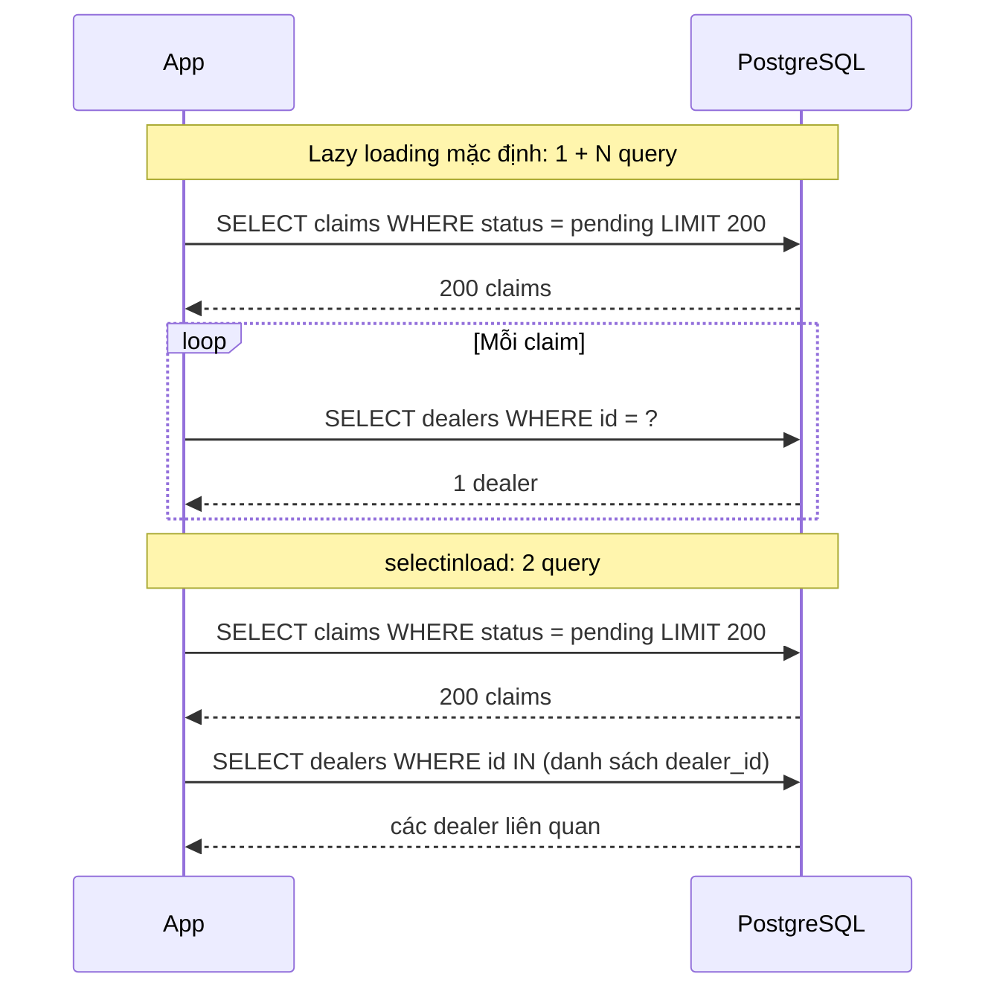
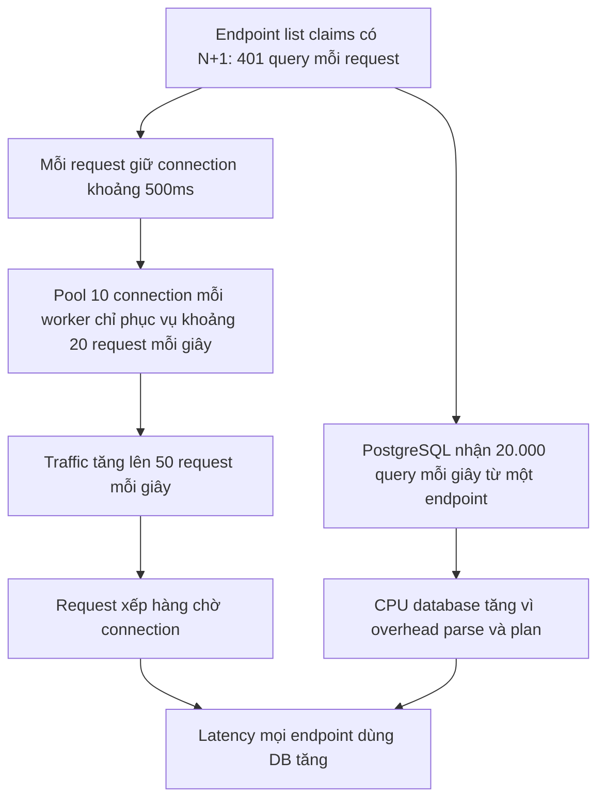

# N+1 Query

## 1. Tổng quan

N+1 query là khi code chạy **1 query** để lấy danh sách N object, rồi chạy thêm **N query** — mỗi object một query — để lấy dữ liệu liên quan của từng object.

```python
claims = (await session.scalars(select(Claim).where(Claim.status == "pending").limit(200))).all()   # 1 query
for claim in claims:
    print(claim.dealer.name)          # mỗi lần: SELECT ... FROM dealers WHERE id = ?   → 200 query
```

Mỗi query riêng lẻ đều nhanh (1–2 ms). Nhưng 201 query tuần tự, mỗi cái một round trip mạng tới database, cộng lại thành hàng trăm ms và chiếm connection suốt thời gian đó. N+1 là nguyên nhân phổ biến nhất khiến endpoint "chỉ lấy một danh sách" lại chậm.

## 2. Mental Model

> Đi chợ mua 200 món, mỗi lần chỉ mua một món rồi về nhà, rồi lại đi. Mỗi chuyến nhanh, nhưng 200 chuyến thì chậm. Cách đúng là mang danh sách đi một lần.

Chi phí của N+1 không nằm ở database làm việc nặng, mà ở **số round trip** và **overhead cố định mỗi query** (gửi, parse, plan, trả kết quả, chuyển thành object).

## 3. Vì sao ORM làm N+1 dễ xảy ra?

Relationship của SQLAlchemy mặc định là **lazy loading**: attribute `claim.dealer` là một [descriptor](../01-python-core/descriptors.md#9-bên-trong-orm-descriptor-làm-gì-với-orderitems). Lần đầu truy cập, descriptor thấy dữ liệu chưa được tải và **phát sinh một query ngay tại dòng đọc attribute**. Code trông như đọc field bình thường; không có dấu hiệu nào của I/O.

N+1 thường ẩn ở nơi xa code truy vấn:

- Pydantic serialize response đọc `claim.dealer.name` cho từng claim.
- Template, serializer, hàm helper tính toán trên từng object.
- Vòng lặp nghiệp vụ gọi method của domain object, method đó đọc relationship.

## 4. Luồng xử lý: N+1 và cách sửa



Diễn giải:

1. Với lazy loading, số query tỷ lệ với số row: 200 claim → 201 query. Thêm một relationship nữa (`claim.lines`) → 401 query.
2. Với `selectinload`, SQLAlchemy chạy query thứ hai lấy **mọi** dealer cần thiết bằng một `IN`, rồi gắn vào từng claim. Số query cố định: 2, bất kể 200 hay 2.000 claim.

## 5. Chi phí thực tế

Giả sử mỗi round trip 1 ms (cùng datacenter), mỗi query đơn giản 0.3 ms thực thi:

| Số claim | Query (lazy, 2 relationship) | Thời gian ước tính | Với eager loading |
|---|---|---|---|
| 20 | 41 | ~55 ms | 3 query, ~5 ms |
| 200 | 401 | ~520 ms | 3 query, ~12 ms |
| 2.000 | 4.001 | ~5 giây | 3 query, ~60 ms |

Thêm vào đó: mỗi query là một lần qua event loop (với async), một lần tạo object, một span trong tracing. Và connection bị giữ trong toàn bộ thời gian — trực tiếp làm giảm throughput của pool. Xem [Connection Pooling](../04-database-postgresql/connection-pooling.md).

## 6. Cách sửa: eager loading

### `selectinload` — thường là lựa chọn mặc định tốt

```python
from sqlalchemy.orm import selectinload

stmt = (
    select(Claim)
    .where(Claim.status == "pending")
    .options(selectinload(Claim.dealer), selectinload(Claim.lines))
    .limit(200)
)
claims = (await session.scalars(stmt)).all()
```

Query chính chạy trước; với mỗi relationship, một query `SELECT ... WHERE parent_id IN (...)` lấy dữ liệu liên quan (chia batch nếu danh sách dài). Phù hợp cho cả many-to-one và collection (one-to-many).

### `joinedload` — một query với JOIN

```python
stmt = select(Claim).options(joinedload(Claim.dealer)).where(...)
```

Dùng `LEFT OUTER JOIN` trong cùng query. Tốt cho **many-to-one** (mỗi claim một dealer). Với **collection**, JOIN nhân bản row của bảng cha theo số phần tử con; hai collection cùng lúc tạo tích Descartes (100 claim × 10 lines × 5 attachments = 5.000 row). Với joined eager load collection, SQLAlchemy 2.0 yêu cầu gọi `.unique()` trên kết quả.

### `contains_eager` — khi đã tự viết JOIN

```python
stmt = (
    select(Claim)
    .join(Claim.dealer)
    .where(Dealer.region == "north")
    .options(contains_eager(Claim.dealer))
)
```

JOIN đã có sẵn để lọc; `contains_eager` bảo ORM dùng luôn dữ liệu từ JOIN đó để điền relationship.

### Chỉ lấy cột cần thiết

Nếu endpoint chỉ cần vài field, không cần object ORM đầy đủ:

```python
stmt = (
    select(Claim.id, Claim.status, Dealer.name.label("dealer_name"))
    .join(Dealer, Dealer.id == Claim.dealer_id)
    .where(Claim.status == "pending")
    .limit(200)
)
rows = (await session.execute(stmt)).all()
```

Một query, không lazy load, không tạo object ORM — nhanh nhất cho endpoint đọc.

## 7. Ngăn N+1 xuất hiện lại

### `raiseload`

```python
class Claim(Base):
    dealer: Mapped["Dealer"] = relationship(lazy="raise")
    lines: Mapped[list["ClaimLine"]] = relationship(lazy="raise")
```

Hoặc theo query: `.options(raiseload("*"))`. Truy cập relationship chưa được eager load sẽ **raise exception** thay vì âm thầm query. N+1 trở thành lỗi rõ ràng trong test thay vì chậm dần trong production. Với async SQLAlchemy, lazy loading ngầm vốn đã không hoạt động (lỗi `MissingGreenlet`), nên `lazy="raise"` làm thông báo lỗi rõ hơn.

### Test đếm số query

```python
from sqlalchemy import event

class QueryCounter:
    def __init__(self, engine):
        self.count = 0
        self.engine = engine

    def __enter__(self):
        event.listen(self.engine, "before_cursor_execute", self._inc)
        return self

    def __exit__(self, *exc):
        event.remove(self.engine, "before_cursor_execute", self._inc)

    def _inc(self, *args, **kwargs):
        self.count += 1

def test_list_claims_query_count(client, sync_engine):
    with QueryCounter(sync_engine) as counter:
        client.get("/claims?status=pending&limit=50")
    assert counter.count <= 3
```

Test này phát hiện khi ai đó thêm một field vào response khiến lazy load xuất hiện.

## 8. Bên trong hệ thống xảy ra gì khi N+1 xảy ra dưới tải?



Diễn giải: N+1 không chỉ làm chậm một endpoint. Nó làm giảm throughput của pool (connection bị giữ lâu) và tăng tải CPU database (hàng chục nghìn query nhỏ), ảnh hưởng tới mọi endpoint khác. Xem [API Slow](../20-production-incidents/api-slow.md).

## 9. Failure Modes

| Failure | Nguyên nhân | Dấu hiệu |
|---|---|---|
| Endpoint list chậm | Lazy load trong vòng lặp hoặc serializer | Trace có hàng trăm span SQL giống nhau |
| Tích Descartes | `joinedload` nhiều collection | Một query trả số row lớn bất thường, memory spike |
| `MissingGreenlet` | Lazy load trong async | Exception khi truy cập relationship |
| N+1 tái xuất | Thêm field vào response mà quên eager load | Số query mỗi request tăng sau deploy |
| Query `IN` quá lớn | `selectinload` trên hàng chục nghìn object | Query chậm, tham số khổng lồ |

## 10. Trade-offs

| Chiến lược | Số query | Ưu điểm | Nhược điểm |
|---|---|---|---|
| Lazy (mặc định) | 1 + N | Chỉ tải khi cần | N+1 |
| `selectinload` | 1 + số relationship | Ổn định, không nhân row | Thêm round trip; danh sách `IN` dài với N rất lớn |
| `joinedload` | 1 | Một round trip | Nhân row với collection, tích Descartes |
| Select cột + JOIN | 1 | Nhanh nhất, ít memory | Không có object ORM, không change tracking |
| `raiseload` | — | Ngăn N+1 ngầm | Phải khai báo eager load tường minh ở mọi nơi |

## 11. Sai lầm thường gặp

- Tin rằng "database nhanh nên nhiều query nhỏ không sao".
- Dùng `joinedload` cho nhiều collection cùng lúc.
- Trả ORM object trực tiếp làm response và để serializer tự đọc relationship.
- Sửa N+1 ở một endpoint bằng eager load nhưng không có test ngăn nó quay lại.
- Eager load mọi relationship "cho chắc" — tải dữ liệu không cần.

## 12. Cách debug

- **Log SQL** trong dev (`echo=True`): nhìn thấy cùng một câu query lặp lại với tham số khác.
- **Tracing** (OpenTelemetry SQLAlchemy instrumentation): một request có hàng trăm span `SELECT dealers` là dấu hiệu rõ nhất trong production.
- **`pg_stat_statements`**: query rất nhanh nhưng `calls` cực lớn.
- **Test đếm query** cho endpoint danh sách.
- `sqlalchemy.inspect(obj).unloaded` để biết relationship nào chưa được tải.

## 13. Best Practices

- Với endpoint danh sách, luôn khai báo eager loading tường minh cho mọi relationship được dùng.
- `selectinload` cho collection, `joinedload` cho many-to-one, select cột cho endpoint chỉ đọc.
- Đặt `lazy="raise"` làm mặc định cho relationship trong codebase lớn, đặc biệt với async.
- Viết test giới hạn số query cho endpoint quan trọng.
- Tách model response (Pydantic) khỏi ORM model để kiểm soát dữ liệu được đọc.

## 14. Tóm tắt

- N+1: 1 query lấy danh sách, N query lấy dữ liệu liên quan cho từng phần tử.
- ORM gây N+1 dễ dàng vì lazy loading qua descriptor biến việc đọc attribute thành query ẩn.
- Chi phí đến từ số round trip và overhead mỗi query; dưới tải, nó làm cạn pool và tăng CPU database.
- Sửa bằng `selectinload`, `joinedload`, `contains_eager`, hoặc select đúng cột cần thiết.
- Ngăn tái diễn bằng `raiseload` và test đếm số query.

## Liên quan

- [Relationship Loading](relationship-loading.md)
- [Descriptors](../01-python-core/descriptors.md)
- [Async SQLAlchemy](async-sqlalchemy.md)
- [Query Optimization](../04-database-postgresql/query-optimization.md)
- [API Slow](../20-production-incidents/api-slow.md)
