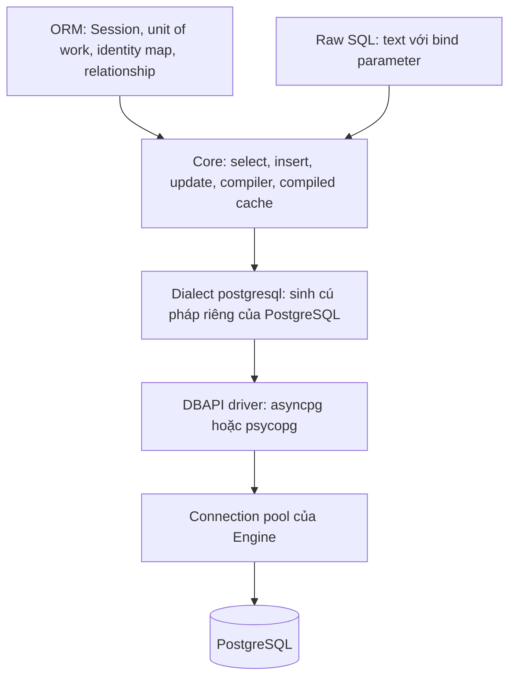

# ORM, Core và Raw SQL

## 1. Tổng quan

SQLAlchemy cung cấp ba mức trừu tượng để làm việc với database:

| Mức | Là gì | Ví dụ |
|---|---|---|
| **ORM** | Ánh xạ class Python ↔ bảng; Session theo dõi object và sinh SQL | `session.get(Claim, 1)`, `claim.status = "approved"` |
| **Core** | Ngôn ngữ biểu thức SQL bằng Python; không có object tracking | `select(claims.c.id).where(claims.c.status == "pending")` |
| **Raw SQL** | Chuỗi SQL với tham số được bind | `text("SELECT ... WHERE id = :id")` |

Ba mức này không loại trừ nhau. Một ứng dụng tốt thường dùng ORM cho logic nghiệp vụ ghi dữ liệu, Core/ORM `select` cho truy vấn đọc, và SQL thuần cho vài truy vấn đặc thù.

## 2. Mental Model

> ORM là trợ lý quản lý hồ sơ: bạn làm việc với hồ sơ (object), trợ lý lo việc ghi sổ (SQL). Core là bàn phím SQL có kiểm tra cú pháp. Raw SQL là viết tay. Càng lên cao, càng tiện và an toàn cho logic nghiệp vụ; càng xuống thấp, càng kiểm soát được chính xác database làm gì.



Diễn giải:

1. ORM không nói chuyện trực tiếp với database: nó chuyển thao tác trên object thành biểu thức Core.
2. Raw SQL qua `text()` cũng đi qua Core để bind tham số và thực thi.
3. Dialect chuyển biểu thức thành cú pháp PostgreSQL cụ thể (`RETURNING`, `ON CONFLICT`, kiểu dữ liệu).
4. Driver gửi câu lệnh qua connection lấy từ pool của Engine.

Mỗi tầng đi xuống bỏ bớt một lớp trừu tượng — và bỏ bớt chi phí của lớp đó.

## 3. Vì sao cần hiểu các mức?

- ORM tiện nhưng có chi phí: tạo object, identity map, change tracking, lazy loading ẩn.
- Truy vấn phân tích, báo cáo, thao tác hàng loạt thường nhanh hơn nhiều khi không qua object.
- Raw SQL ghép chuỗi sai cách mở ra SQL injection.

## 4. ORM: điểm mạnh

- **Unit of work**: sửa nhiều object, commit một lần; ORM sinh INSERT/UPDATE/DELETE đúng thứ tự phụ thuộc.
- **Identity map**: mỗi row một object trong Session — tránh mâu thuẫn.
- **Relationship**: điều hướng giữa object, cascade khi xóa.
- **Domain model**: đặt quy tắc nghiệp vụ trong method của class (`claim.approve(...)`).
- **Optimistic locking** (`version_id_col`), event hook, type mapping.

## 5. Core: truy vấn tường minh không cần object

```python
from sqlalchemy import func, select

stmt = (
    select(Claim.dealer_id, func.count().label("pending"), func.sum(Claim.total).label("amount"))
    .where(Claim.status == "pending")
    .group_by(Claim.dealer_id)
    .order_by(func.sum(Claim.total).desc())
    .limit(20)
)
rows = (await session.execute(stmt)).all()      # Row tuple, không phải object Claim
```

Cú pháp `select()` của SQLAlchemy 2.0 dùng chung cho ORM và Core. Chọn **entity** (`select(Claim)`) → nhận object ORM; chọn **cột/biểu thức** → nhận `Row` nhẹ.

Core hỗ trợ CTE, window function, `INSERT ... ON CONFLICT` (qua `sqlalchemy.dialects.postgresql.insert`), `RETURNING`, `LATERAL` — đủ cho phần lớn nhu cầu mà không cần viết chuỗi SQL.

## 6. Raw SQL: khi nào và cách an toàn

```python
from sqlalchemy import text

stmt = text("""
    SELECT d.id, d.name, t.claims_7d
    FROM dealers d
    CROSS JOIN LATERAL (
        SELECT count(*) AS claims_7d FROM claims c
        WHERE c.dealer_id = d.id AND c.created_at > now() - interval '7 days'
    ) t
    WHERE d.region = :region
""")
rows = (await session.execute(stmt, {"region": region})).all()
```

- **Luôn** dùng tham số bind (`:region`) — giá trị được driver gửi tách biệt với câu SQL.
- **Không bao giờ** ghép chuỗi hoặc f-string với dữ liệu người dùng: `text(f"... WHERE region = '{region}'")` là [SQL injection](../16-security/sql-injection.md).
- Tên cột/bảng động (sắp xếp theo cột người dùng chọn) không bind được — dùng whitelist.

Dùng raw SQL khi: truy vấn phức tạp dễ đọc hơn ở dạng SQL, cần tính năng đặc thù PostgreSQL mà Core không có sẵn, hoặc đã tối ưu bằng tay và muốn giữ nguyên chính xác.

## 7. Bulk operations

### Insert nhiều row

```python
from sqlalchemy import insert

await session.execute(insert(ClaimLine), [
    {"claim_id": 1, "part_code": "A1", "quantity": 2},
    {"claim_id": 1, "part_code": "B7", "quantity": 1},
    # ... hàng nghìn dict
])
```

SQLAlchemy 2.0 dùng cơ chế "insertmanyvalues": gom nhiều row thành các câu `INSERT ... VALUES (...), (...), ...` theo lô, nhanh hơn nhiều so với `session.add()` từng object rồi flush (vốn phải theo dõi từng object).

### Update/delete hàng loạt

```python
from sqlalchemy import update

await session.execute(
    update(Claim)
    .where(Claim.status == "pending", Claim.created_at < cutoff)
    .values(status="expired")
)
```

Một câu `UPDATE` thay vì tải mọi object rồi sửa từng cái. Lưu ý: object tương ứng đang nằm trong Session có thể không phản ánh thay đổi (SQLAlchemy có tùy chọn `synchronize_session` để đồng bộ trong phạm vi hạn chế). Với bảng lớn, chia theo lô ([Large Table Design](../04-database-postgresql/large-table-design.md#8-quyết-định-5-backfill-và-thao-tác-hàng-loạt)).

## 8. Bên trong hệ thống xảy ra gì: chi phí của ORM

Tải 10.000 row bằng `select(Claim)`:

1. Driver nhận row từ PostgreSQL.
2. Với mỗi row, ORM tra identity map bằng primary key.
3. Nếu chưa có, tạo instance, gán mọi attribute, khởi tạo state tracking (`InstanceState`).
4. Thêm vào identity map.

Bước 2–4 là Python thuần, lặp 10.000 lần. Tải cùng dữ liệu dưới dạng `Row` (chọn cột) bỏ qua phần lớn công việc này — nhanh hơn nhiều lần và ít memory hơn. Với endpoint async, đây là CPU chạy trên event loop. Xem [Performance](performance.md).

## 9. Hành vi trong production

- Đường **ghi** nghiệp vụ (tạo claim, duyệt, đổi trạng thái): ORM phù hợp — logic phức tạp, số object nhỏ, cần nhất quán.
- Đường **đọc** danh sách và báo cáo: select cột, hoặc ORM với `load_only`, eager load tường minh.
- **Batch/ETL**: Core bulk insert/update, `yield_per`, raw SQL cho logic tập hợp.
- Nhiều team gói truy cập dữ liệu sau **repository**: ORM hay SQL là chi tiết bên trong; tầng service không quan tâm.

## 10. Failure Modes

| Failure | Nguyên nhân | Dấu hiệu |
|---|---|---|
| SQL injection | Ghép chuỗi vào `text()` | Lỗ hổng bảo mật; query bất thường trong log |
| Chậm khi tải nhiều | Tạo object ORM cho hàng chục nghìn row | CPU cao ở hydration, memory tăng |
| Session không đồng bộ sau bulk update | Object trong identity map giữ giá trị cũ | Logic đọc thấy trạng thái cũ sau update |
| Query ẩn | Lazy loading, attribute expire | N+1, `MissingGreenlet` |
| SQL khó bảo trì | Raw SQL dài không test | Lỗi khi đổi schema |

## 11. Trade-offs

| Tiêu chí | ORM | Core | Raw SQL |
|---|---|---|---|
| Năng suất với logic nghiệp vụ | Cao | Trung bình | Thấp |
| Kiểm soát SQL chính xác | Trung bình | Cao | Cao nhất |
| Hiệu năng đọc tập lớn | Thấp | Cao | Cao |
| An toàn trước injection | Cao | Cao | Phụ thuộc kỷ luật |
| Refactor khi đổi schema | Dễ (type, IDE) | Dễ | Khó |
| Chi phí ẩn | Lazy load, hydration | Ít | Không |

## 12. Sai lầm thường gặp

- "ORM chậm nên dùng raw SQL cho mọi thứ" — mất lợi ích unit of work và an toàn kiểu.
- "Luôn dùng ORM object" — kể cả cho export hàng triệu row.
- f-string trong `text()`.
- `session.add()` hàng trăm nghìn object để import.
- Update hàng loạt bằng vòng lặp load-modify-flush.

## 13. Cách debug

- Log SQL để xem ORM thực sự sinh ra gì.
- `str(stmt.compile(dialect=postgresql.dialect(), compile_kwargs={"literal_binds": True}))` để xem SQL cuối cùng (chỉ dùng để debug).
- Profile (`py-spy`) để tách thời gian chờ database khỏi thời gian tạo object.

## 14. Best Practices

- ORM cho đường ghi nghiệp vụ; select cột hoặc Core cho đường đọc nặng và báo cáo.
- Bulk insert/update bằng `insert()`/`update()` của 2.0.
- Raw SQL chỉ với tham số bind; tên động qua whitelist.
- Đóng gói truy cập dữ liệu trong repository để có thể đổi cách cài đặt mà không ảnh hưởng nghiệp vụ.
- Test truy vấn quan trọng trên PostgreSQL thật.

## 15. Tóm tắt

- SQLAlchemy có ba mức: ORM (object + unit of work), Core (biểu thức SQL), raw SQL (`text()`).
- ORM tiện cho logic ghi nghiệp vụ; chi phí là tạo object và query ẩn.
- Core/select cột nhanh hơn nhiều cho đọc tập lớn và báo cáo.
- Bulk operation của 2.0 thay cho vòng lặp add/load-modify.
- Raw SQL luôn dùng tham số bind để tránh SQL injection.

## Liên quan

- [Performance](performance.md)
- [Session Lifecycle](session-lifecycle.md)
- [SQL nâng cao](../04-database-postgresql/sql-advanced.md)
- [SQL Injection](../16-security/sql-injection.md)
- [Hexagonal Architecture](../09-software-architecture/hexagonal-architecture.md)
