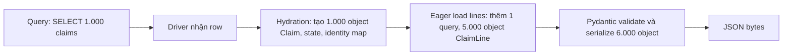

# Hiệu năng SQLAlchemy

## 1. Tổng quan

Thời gian của một thao tác database qua SQLAlchemy gồm hai phần:

1. **Thời gian database**: PostgreSQL thực thi query, cộng round trip mạng.
2. **Thời gian Python**: compile câu SQL, bind tham số, chờ pool, nhận row, tạo object ORM, theo dõi thay đổi, flush.

Phần 1 được tối ưu bằng index và query tốt ([Query Optimization](../04-database-postgresql/query-optimization.md)). Tài liệu này tập trung vào phần 2 và vào cách ứng dụng **dùng** database: số query, số round trip, lượng dữ liệu, thời gian giữ connection.

## 2. Mental Model

> Mỗi query có một chi phí cố định (round trip, compile, overhead của driver) và một chi phí tỷ lệ với số row (truyền dữ liệu, tạo object). Tối ưu là giảm **số query** và giảm **công việc trên mỗi row** mà ứng dụng không cần.

## 3. Các nguồn chi phí

| Nguồn | Mô tả | Cách giảm |
|---|---|---|
| Số query | Mỗi query một round trip | Eager load, batch, gộp query |
| Hydration | Tạo object ORM, identity map, state | Select cột, `load_only`, Core rows |
| Compile SQL | Chuyển biểu thức thành chuỗi SQL | Compiled cache (tự động từ 1.4) |
| Flush | Duyệt object thay đổi, sinh câu lệnh | Session nhỏ, bulk operation |
| Chờ pool | Không có connection rảnh | Giữ connection ngắn |
| Dữ liệu thừa | `SELECT *`, cột lớn | `load_only`, `deferred` |
| Logging | `echo=True` ở production | Tắt; dùng tracing có sampling |

## 4. Cơ chế: compiled cache

Từ SQLAlchemy 1.4, câu lệnh được **cache sau khi compile** dựa trên cấu trúc của nó (không phụ thuộc giá trị tham số). Lần chạy thứ hai của cùng một `select(Claim).where(Claim.id == x)` với `x` khác không cần compile lại.

Cache có thể bị vô hiệu khi:

- Câu lệnh được dựng động với cấu trúc khác nhau mỗi lần (số điều kiện thay đổi, `IN` với danh sách literal thay vì tham số).
- Dùng literal thay vì tham số bind.

`IN` với danh sách thay đổi độ dài: SQLAlchemy dùng "expanding bind parameter" nên cấu trúc vẫn được cache. Kiểm tra hiệu quả cache qua log (`[cached since ...]` khi `echo=True`).

## 5. Bên trong hệ thống xảy ra gì khi endpoint trả 1.000 object?



Diễn giải:

1. Database trả dữ liệu nhanh (vài ms với index tốt).
2. Hydration tạo hàng nghìn object Python với state tracking — CPU thuần.
3. Eager load tạo thêm object con.
4. Pydantic đọc attribute từng object và serialize.
5. Toàn bộ bước 2–4 chạy trên event loop (nếu async) và có thể tốn hàng chục tới hàng trăm ms.

Nếu endpoint chỉ cần hiển thị bảng tóm tắt, select đúng cột và trả `Row` bỏ qua bước 2–3 và làm bước 4 nhẹ hơn nhiều.

## 6. Các kỹ thuật chính

### Giảm số query

- [Eager loading](relationship-loading.md) đúng strategy để tránh [N+1](n-plus-one.md).
- Batch tra cứu: `select(Dealer).where(Dealer.id.in_(ids))` thay vì `session.get` trong vòng lặp.
- `RETURNING` để không phải đọc lại sau khi ghi.

### Giảm công việc mỗi row

```python
# Đọc danh sách: không cần object ORM
stmt = select(Claim.id, Claim.status, Claim.total).where(Claim.dealer_id == dealer_id)
rows = (await session.execute(stmt)).mappings().all()     # list[dict-like]
```

### Ghi hàng loạt

```python
# Chậm: theo dõi từng object
for item in items:
    session.add(ClaimLine(**item))
await session.flush()

# Nhanh: bulk insert của 2.0 (insertmanyvalues)
await session.execute(insert(ClaimLine), items)
```

### Session nhỏ

Flush phải duyệt object trong Session để tìm thay đổi. Session chứa hàng chục nghìn object làm mỗi flush (kể cả autoflush trước mỗi query) chậm đi. Job dài dùng Session mới theo lô.

### Giữ connection ngắn

Thời gian giữ connection quyết định throughput của pool nhiều hơn tốc độ query. Commit sớm, không làm việc khác trong transaction. Xem [Connection Pooling](../04-database-postgresql/connection-pooling.md).

## 7. Đo lường

```python
import time
from sqlalchemy import event

@event.listens_for(engine.sync_engine, "before_cursor_execute")
def _start(conn, cursor, statement, params, context, executemany):
    context._t0 = time.perf_counter()

@event.listens_for(engine.sync_engine, "after_cursor_execute")
def _end(conn, cursor, statement, params, context, executemany):
    elapsed = time.perf_counter() - context._t0
    DB_QUERY_SECONDS.observe(elapsed)           # histogram theo loại query
```

- Metric thời gian query **phía client** (bao gồm mạng) so với `pg_stat_statements` (phía server) cho biết overhead mạng và driver.
- Đếm số query mỗi request (qua middleware + event) để phát hiện N+1.
- Pool: event `checkout`/`checkin` đo thời gian giữ; `pool.status()` cho snapshot.
- OpenTelemetry instrumentation cho SQLAlchemy tạo span mỗi query.
- Profiler (`py-spy`) cho thấy thời gian nằm ở hydration hay ở chờ I/O.

## 8. Hành vi trong production

- **Endpoint danh sách** là nơi chi phí hydration và N+1 lộ rõ nhất; tối ưu chúng trước.
- **Worker Celery xử lý batch** thường chạy nhanh hơn nhiều lần khi chuyển từ ORM object sang Core bulk operation.
- **`echo=True` bị bật nhầm** trên production làm chậm và sinh log khổng lồ.
- **`pool_pre_ping`** thêm một round trip nhỏ mỗi lần checkout; thường đáng để tránh lỗi connection chết, nhưng nên biết chi phí này tồn tại.

## 9. Khi scale lên thì chuyện gì xảy ra?

| Tải | Vấn đề thường lộ ra |
|---|---|
| Vài chục RPS | Hầu như không có; N+1 chưa đau |
| Vài trăm RPS | N+1 và hydration chiếm CPU worker; pool bắt đầu có hàng đợi |
| Vài nghìn RPS | Tổng connection, CPU database do query nhỏ lặp lại; cần cache và select cột |
| Job xử lý hàng triệu row | Memory của identity map, tốc độ bulk ghi, replication lag |

## 10. Failure Modes

| Failure | Nguyên nhân | Dấu hiệu |
|---|---|---|
| CPU worker cao | Hydration nhiều object | Profiler: thời gian trong `loading.py`, `instances` |
| Nhiều query nhỏ | N+1, vòng lặp `session.get` | `calls` rất cao trong `pg_stat_statements` |
| Flush chậm dần | Session chứa quá nhiều object | Job chậm dần theo thời gian |
| Pool wait | Transaction dài | Latency cao, DB rảnh |
| Log khổng lồ | `echo=True` ở production | I/O log tăng, latency tăng |

## 11. Trade-offs

| Kỹ thuật | Lợi ích | Chi phí |
|---|---|---|
| Select cột | Nhanh, ít memory | Không có object, không change tracking |
| Bulk insert/update | Nhanh hơn nhiều | Bỏ qua event/validation ở mức object |
| Eager load | Ít query | Có thể tải dữ liệu không dùng |
| Cache kết quả (Redis) | Bỏ qua database | Stale data, invalidation |

## 12. Sai lầm thường gặp

- Tối ưu query SQL trong khi vấn đề là 400 query mỗi request.
- Trả ORM object cho endpoint danh sách lớn.
- Import dữ liệu bằng `session.add()` từng object.
- Session sống suốt job batch.
- Đo thời gian query chỉ ở phía database và bỏ qua thời gian hydration.

## 13. Best Practices

- Đo trước: số query mỗi request, thời gian query phía client, thời gian giữ connection, profile CPU.
- Eager load tường minh; test giới hạn số query.
- Select cột cho đường đọc lớn; ORM object cho đường ghi nghiệp vụ.
- Bulk operation cho ghi hàng loạt; Session theo lô cho job dài.
- Giữ transaction ngắn; tắt `echo` ở production.

## 14. Tóm tắt

- Thời gian qua SQLAlchemy = thời gian database + thời gian Python (compile, hydration, flush, chờ pool).
- Giảm số query (eager load, batch) và công việc mỗi row (select cột, bulk operation).
- Compiled cache tránh compile lại câu lệnh cùng cấu trúc.
- Session nhỏ giữ flush nhanh và memory ổn định.
- Đo bằng event của engine/pool, tracing và profiler để biết thời gian thực sự nằm ở đâu.

## Liên quan

- [N+1 Query](n-plus-one.md)
- [Relationship Loading](relationship-loading.md)
- [ORM, Core và Raw SQL](orm-vs-raw-sql.md)
- [FastAPI Performance](../03-fastapi/performance.md)
- [Profiling Python](../17-performance-reliability/profiling-python.md)
