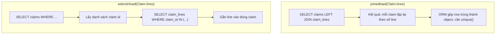

# Relationship Loading và tải dữ liệu lớn

## 1. Tổng quan

Khi một object ORM có quan hệ với object khác (`Claim.dealer`, `Claim.lines`), SQLAlchemy phải quyết định **khi nào** và **bằng cách nào** tải dữ liệu liên quan. Quyết định này gọi là **loading strategy**. Chọn sai dẫn tới [N+1](n-plus-one.md), tích Descartes, tải dữ liệu thừa, hoặc hết memory.

Tài liệu này mô tả các strategy cho relationship, cách hoãn tải cột lớn, và cách đọc tập dữ liệu lớn hơn memory.

## 2. Mental Model

> Loading strategy trả lời hai câu hỏi: dữ liệu liên quan được tải **lúc nào** (ngay cùng query chính, hay khi có người truy cập), và **bằng bao nhiêu query** (JOIN chung, query phụ với IN, hay một query mỗi object).

## 3. Các strategy cho relationship

| Strategy | Khi tải | Số query | Cách làm |
|---|---|---|---|
| `select` (lazy, mặc định) | Khi truy cập attribute | 1 mỗi object | `SELECT ... WHERE id = ?` |
| `joined` | Cùng query chính | 0 thêm | `LEFT OUTER JOIN` |
| `selectin` | Ngay sau query chính | 1 mỗi relationship (chia batch) | `SELECT ... WHERE parent_id IN (...)` |
| `subquery` | Ngay sau query chính | 1 mỗi relationship | Lặp lại query gốc làm subquery — legacy, thường thay bằng `selectin` |
| `immediate` | Ngay khi load object | 1 mỗi object | Như lazy nhưng tải ngay |
| `raise` | Không bao giờ ngầm | — | Truy cập chưa load → exception |
| `noload` | Không bao giờ | — | Attribute rỗng |
| `write_only` (2.0) | Không tải collection | — | Chỉ cho phép thêm/xóa và query tường minh — cho collection rất lớn |

Strategy có thể đặt **mặc định** trên `relationship(lazy=...)` và **ghi đè theo query** bằng `.options(...)`. Thực hành tốt: mặc định `raise` hoặc `select`, và mỗi query khai báo eager load mình cần.

## 4. Luồng xử lý: joined và selectin



Diễn giải:

1. **joined**: một round trip. Nhưng mỗi claim có 10 line → mỗi claim xuất hiện 10 lần trong kết quả. Hai collection (10 lines, 5 attachments) → 50 row mỗi claim. Dữ liệu truyền qua mạng và công việc gộp tăng nhanh.
2. **selectin**: hai round trip, không nhân row. Danh sách `IN` được chia batch (mặc định 500 khóa mỗi query) khi có nhiều object.

Quy tắc thực hành:

| Quan hệ | Strategy thường phù hợp |
|---|---|
| Many-to-one (`claim.dealer`) | `joinedload` (inner join nếu non-null: `innerjoin=True`) hoặc `selectinload` |
| One-to-many nhỏ (`claim.lines`) | `selectinload` |
| Nhiều collection cùng lúc | `selectinload` cho từng cái |
| Collection rất lớn (`dealer.claims`) | `write_only`/`dynamic`, query tường minh có phân trang |
| Chỉ cần vài cột | Select cột, không load object |

### Eager load lồng nhau

```python
stmt = select(Dealer).options(
    selectinload(Dealer.claims).selectinload(Claim.lines),
    joinedload(Dealer.region),
)
```

Mỗi tầng một query `IN`. Kiểm tra bằng log SQL rằng số query đúng như dự kiến.

## 5. Hoãn tải cột lớn

Bảng có cột lớn ít dùng (JSONB payload, text mô tả dài):

```python
from sqlalchemy.orm import deferred, load_only, undefer

class Claim(Base):
    ...
    raw_payload: Mapped[dict] = mapped_column(JSONB, deferred=True)   # không tải mặc định

# Chỉ tải vài cột
stmt = select(Claim).options(load_only(Claim.id, Claim.status, Claim.created_at))

# Tải cột deferred khi cần
stmt = select(Claim).options(undefer(Claim.raw_payload)).where(Claim.id == claim_id)
```

Truy cập cột deferred chưa được tải sẽ phát sinh query (lazy) — cũng gây `MissingGreenlet` với async. Kết hợp với `raiseload` cho cột: `load_only(..., raiseload=True)`.

## 6. Đọc tập dữ liệu lớn

Mặc định, `session.execute(stmt).all()` tải **toàn bộ** kết quả vào memory: driver đọc hết row, ORM tạo mọi object, identity map giữ tất cả. Với 5 triệu row, process hết memory.

### `yield_per`: stream theo batch

```python
stmt = select(Claim).where(Claim.created_at < cutoff).execution_options(yield_per=1_000)
for partition in session.execute(stmt).scalars().partitions():
    process(partition)        # mỗi lần 1.000 object
```

- `yield_per` bật **server-side cursor** (với driver hỗ trợ): PostgreSQL gửi row theo từng batch thay vì một lần.
- ORM tạo object theo batch.
- Với async: `await session.stream_scalars(stmt.execution_options(yield_per=1000))` và `async for`.

Lưu ý:

- Cursor mở giữ **connection và transaction** trong suốt quá trình duyệt. Duyệt chậm (gọi API cho mỗi batch) → giữ connection lâu, giữ snapshot (ảnh hưởng VACUUM). Xem [MVCC](../04-database-postgresql/mvcc.md).
- Identity map vẫn giữ object đã tải; với job rất dài, xử lý theo khoảng khóa chính và Session mới mỗi lô thường an toàn hơn. Xem [Session Lifecycle](session-lifecycle.md#7-scope-của-session).
- Eager load collection với `yield_per`: `selectinload` hoạt động theo từng batch; `joinedload` collection không tương thích.

### Không cần object: dùng Core

Export 5 triệu row ra CSV không cần change tracking hay identity map:

```python
stmt = select(Claim.id, Claim.vin, Claim.total).where(...).execution_options(yield_per=5_000)
for row in session.execute(stmt):
    writer.writerow(row)
```

Nhanh hơn nhiều lần so với tạo object ORM.

## 7. Làm mới dữ liệu đã có trong identity map

Identity map trả về object đã có trong Session thay vì tạo lại từ row mới. Query lại cùng row **không cập nhật** attribute đã load (trừ khi đã expire). Khi cần dữ liệu mới nhất:

- `await session.refresh(obj)` — tải lại object.
- `.execution_options(populate_existing=True)` — ghi đè attribute của object có sẵn bằng dữ liệu từ query.
- Session ngắn (mỗi request) tránh được phần lớn vấn đề này.

## 8. Hành vi trong production

- Endpoint danh sách thay đổi theo thời gian (thêm field vào response) — strategy loading phải được cập nhật theo; test đếm query giữ chúng đồng bộ.
- `joinedload` trên collection trong query có `LIMIT` từng là nguồn kết quả sai trong ORM cũ (LIMIT áp dụng lên row đã join); SQLAlchemy bọc query chính trong subquery để xử lý, nhưng plan có thể kém hiệu quả. `selectinload` tránh được vấn đề.
- Collection hàng chục nghìn phần tử (`dealer.claims`) **không bao giờ** nên được load toàn bộ vào một object.

## 9. Failure Modes

| Failure | Nguyên nhân | Dấu hiệu |
|---|---|---|
| N+1 | Lazy mặc định trong vòng lặp | Hàng trăm query giống nhau |
| Tích Descartes | `joinedload` nhiều collection | Query trả số row khổng lồ, memory spike |
| OOM | `.all()` trên tập lớn | Worker bị kill khi chạy job |
| Giữ connection lâu | `yield_per` + xử lý chậm | Pool wait, `idle in transaction` |
| Dữ liệu cũ | Identity map trong Session dài | Giá trị không phản ánh thay đổi mới |
| Collection khổng lồ | Load `dealer.claims` | Endpoint chậm, memory tăng |

## 10. Trade-offs

| Lựa chọn | Lợi ích | Chi phí |
|---|---|---|
| Lazy | Không tải thứ không dùng | N+1 |
| joined | Một round trip | Nhân row |
| selectin | Không nhân row, ổn định | Thêm round trip mỗi relationship |
| deferred/load_only | Ít dữ liệu truyền | Truy cập cột chưa load gây query hoặc lỗi |
| yield_per | Memory cố định | Giữ connection/transaction lâu |
| Core rows | Nhanh nhất | Không có object ORM |

## 11. Sai lầm thường gặp

- Đặt `lazy="joined"` mặc định cho mọi relationship — mọi query đều JOIN, kể cả khi không cần.
- Load collection lớn qua relationship thay vì query có phân trang.
- Dùng `.all()` cho job xử lý hàng triệu row.
- Duyệt `yield_per` trong khi gọi dịch vụ ngoài cho từng row.

## 12. Cách debug

- Log SQL để xem số query và hình dạng JOIN.
- `EXPLAIN ANALYZE` cho query `IN` lớn của `selectinload`.
- Theo dõi RSS của worker khi chạy job đọc lớn.
- `sqlalchemy.inspect(obj).unloaded` để kiểm tra attribute nào chưa được tải.

## 13. Best Practices

- Mặc định relationship `lazy="raise"` (hoặc `select` với kỷ luật), eager load theo từng query.
- `selectinload` cho collection, `joinedload` cho many-to-one.
- `write_only` cho collection lớn; query tường minh có phân trang.
- `load_only`/`deferred` cho cột lớn ít dùng.
- `yield_per` hoặc Core rows cho tập dữ liệu lớn; Session theo lô cho job dài.

## 14. Tóm tắt

- Loading strategy quyết định khi nào và bằng bao nhiêu query dữ liệu liên quan được tải.
- `selectinload` là lựa chọn an toàn cho collection; `joinedload` cho many-to-one; lazy gây N+1.
- `deferred`, `load_only` giảm dữ liệu cột; `write_only` cho collection lớn.
- `yield_per` stream dữ liệu lớn theo batch nhưng giữ connection và transaction suốt quá trình.
- Identity map trả object có sẵn; dùng `refresh` hoặc `populate_existing` khi cần dữ liệu mới.

## Liên quan

- [N+1 Query](n-plus-one.md)
- [Session Lifecycle](session-lifecycle.md)
- [Async SQLAlchemy](async-sqlalchemy.md)
- [Iterators và Generators](../01-python-core/generators-iterators.md)
- [Performance](performance.md)
