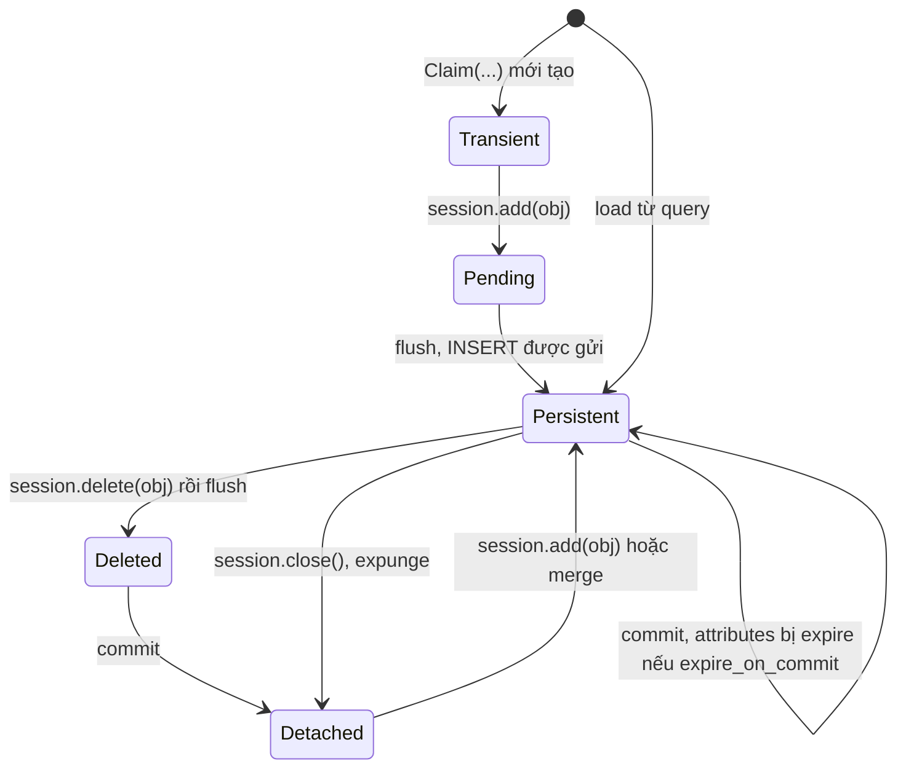
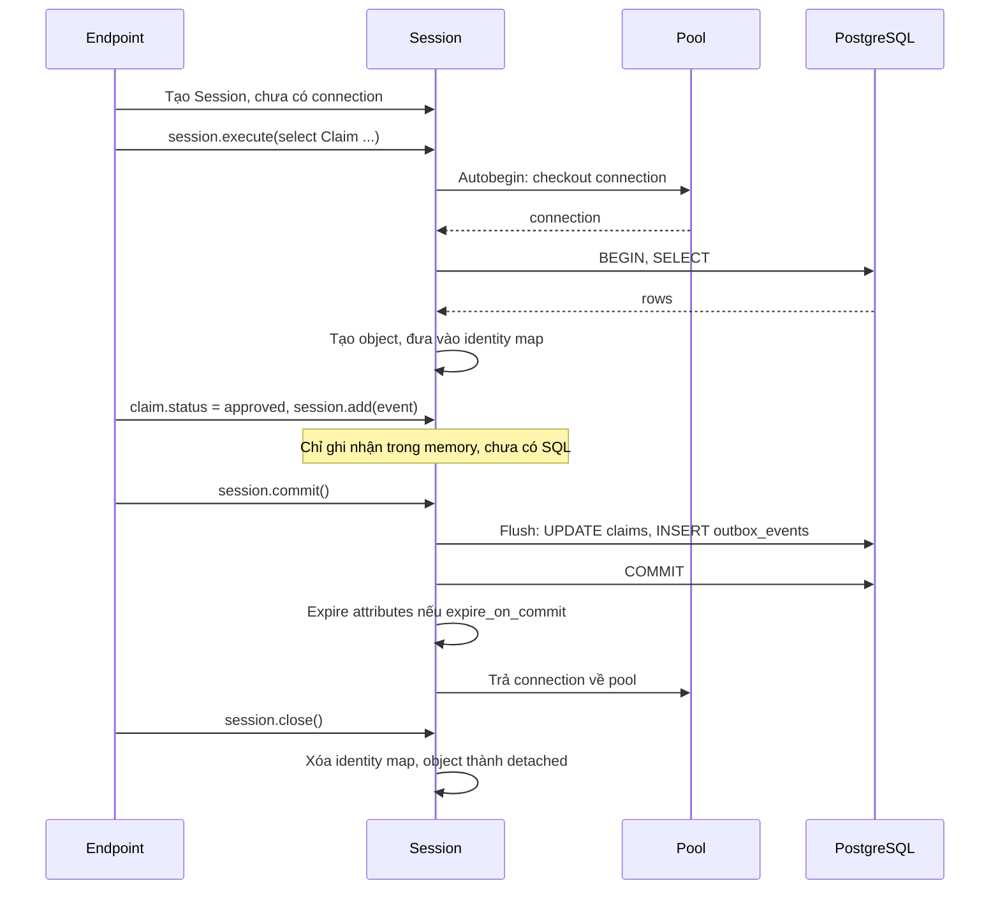

# Session Lifecycle trong SQLAlchemy

## 1. Tổng quan

SQLAlchemy có ba tầng object với vòng đời khác nhau:

| Object | Là gì | Vòng đời điển hình |
|---|---|---|
| **Engine** | Điểm vào database: chứa **connection pool** và **dialect** (cách nói chuyện với PostgreSQL qua driver) | Một cho mỗi database, sống suốt process |
| **Connection** | Một connection DBAPI thật lấy từ pool | Mượn khi cần, trả khi transaction kết thúc |
| **Session** | **Unit of work** của ORM: theo dõi object đã tải và thay đổi, quyết định khi nào ghi xuống database | Một cho mỗi request hoặc mỗi đơn vị công việc |

Phần lớn lỗi khi dùng SQLAlchemy trong production — pool cạn, dữ liệu cũ, `DetachedInstanceError`, `MissingGreenlet`, memory tăng trong job batch — đều đến từ hiểu sai vòng đời của Session.

> **Ghi chú version:** Nội dung theo SQLAlchemy 2.0 (API `select()`, autobegin, `Session.execute`). API 1.x kiểu `session.query()` vẫn chạy nhưng là legacy.

## 2. Mental Model

> Session là một **bàn làm việc tạm thời**. Bạn lấy hồ sơ (object) từ kho (database) đặt lên bàn, sửa chúng, và khi xong thì nộp lại một lần (commit). Bàn chỉ mượn một đường dây tới kho (connection) trong lúc đang có giao dịch mở. Bàn không được hai người dùng cùng lúc, và phải được dọn sạch sau mỗi công việc.

## 3. Vì sao cần Session (unit of work)?

Không có Session, mỗi thay đổi trên object phải được bạn tự viết thành `UPDATE`. Session làm ba việc:

1. **Identity map**: trong một Session, mỗi row (theo primary key) chỉ tương ứng với **một** Python object. Đọc cùng claim hai lần trả về cùng object — thay đổi ở chỗ này thấy ở chỗ kia, và không có hai bản mâu thuẫn.
2. **Change tracking**: Session ghi nhận attribute nào đã bị sửa, object nào mới thêm, object nào bị xóa.
3. **Unit of work**: khi **flush**, Session sắp xếp các thay đổi theo đúng thứ tự phụ thuộc (insert cha trước con, xóa con trước cha) và sinh câu SQL tương ứng.

## 4. Trạng thái của object



Diễn giải:

1. **Transient**: object Python bình thường, Session không biết đến.
2. **Pending**: đã `add` vào Session nhưng chưa có INSERT nào được gửi.
3. **Persistent**: gắn với Session và có row tương ứng trong database (đã flush hoặc được load). Mọi thay đổi được theo dõi.
4. **Deleted**: đã đánh dấu xóa và DELETE đã được flush; sau commit trở thành detached.
5. **Detached**: có dữ liệu nhưng không còn gắn với Session nào. Truy cập attribute chưa được load (lazy relationship, attribute đã expire) trên object detached → `DetachedInstanceError`.

Xem trạng thái: `sqlalchemy.inspect(obj)` với `.transient`, `.pending`, `.persistent`, `.detached`.

## 5. Cơ chế: flush, commit, autobegin, expire

### Autobegin

Session (2.0) tự **bắt đầu transaction** ở thao tác đầu tiên cần database (query, flush). Đây cũng là lúc Session **mượn connection** từ pool. Connection được giữ cho tới khi transaction kết thúc bằng `commit()`, `rollback()` hoặc `close()`.

Hệ quả: một Session đã chạy một query và sau đó "để đó" trong khi code gọi HTTP bên ngoài vẫn **đang giữ connection và transaction mở** trên PostgreSQL (`idle in transaction`).

### Flush và commit khác nhau

| | Flush | Commit |
|---|---|---|
| Làm gì | Gửi các câu INSERT/UPDATE/DELETE đang chờ xuống database | Flush (nếu cần) rồi `COMMIT` transaction |
| Transaction | Vẫn mở | Kết thúc; connection trả về pool |
| Thay đổi có thấy được bởi người khác | Không | Có |
| Có thể rollback | Có | Không |

**Autoflush** (mặc định bật): trước mỗi query, Session tự flush thay đổi đang chờ để query thấy dữ liệu nhất quán với những gì bạn đã sửa trong Session. Tiện, nhưng có thể làm lỗi constraint xuất hiện ở một dòng `select` không liên quan.

### Expire on commit

Mặc định `expire_on_commit=True`: sau commit, mọi attribute của mọi object trong Session bị đánh dấu **expired**. Lần truy cập tiếp theo sẽ **tải lại từ database** (vì sau commit, người khác có thể đã sửa row).

Hệ quả:

- Trả object ORM làm response sau khi commit → serialize truy cập attribute → một query `SELECT` cho mỗi object (một dạng N+1 ẩn).
- Nếu Session đã đóng → `DetachedInstanceError`.
- Với AsyncSession: truy cập attribute expired kích hoạt I/O đồng bộ → `MissingGreenlet`. Xem [Async SQLAlchemy](async-sqlalchemy.md).

Phổ biến trong web app: đặt `expire_on_commit=False` khi tạo sessionmaker, chấp nhận object mang dữ liệu tại thời điểm commit.

## 6. Bên trong hệ thống xảy ra gì trong một request?



Diễn giải:

1. Tạo Session không tốn gì và chưa mượn connection.
2. Query đầu tiên kích hoạt autobegin: mượn connection, `BEGIN`.
3. Row được chuyển thành object và lưu vào identity map.
4. Sửa attribute và `add` chỉ thay đổi trạng thái trong memory.
5. `commit()` flush mọi thay đổi theo đúng thứ tự, rồi `COMMIT`.
6. Connection được trả về pool **ngay khi commit** — không phải khi `close()`.
7. `close()` giải phóng identity map; object trở thành detached.

Khoảng thời gian giữa bước 2 và bước 6 là thời gian **giữ connection**. Đó là con số quyết định kích thước pool cần thiết. Xem [Connection Pooling](../04-database-postgresql/connection-pooling.md).

## 7. Scope của Session

### Web request: một Session mỗi request

```python
from sqlalchemy.ext.asyncio import async_sessionmaker, create_async_engine

engine = create_async_engine(DB_URL, pool_size=10, max_overflow=5, pool_pre_ping=True)
SessionLocal = async_sessionmaker(engine, expire_on_commit=False)

async def get_session():
    async with SessionLocal() as session:        # close() khi request kết thúc
        yield session
```

- Engine tạo một lần (trong lifespan); `sessionmaker` là factory.
- Mỗi request một Session mới qua dependency có `yield`. Xem [Dependency Injection](../03-fastapi/dependency-injection.md).
- Session **không thread-safe** và **không an toàn khi dùng đồng thời** từ nhiều coroutine. Không chia sẻ Session giữa request, giữa thread, giữa task trong `asyncio.gather`.

### Job batch: Session ngắn theo lô

Một Session sống suốt job xử lý 5 triệu row sẽ giữ 5 triệu object trong identity map — memory tăng không giới hạn, và flush ngày càng chậm vì Session phải kiểm tra nhiều object hơn.

```python
for batch in iter_id_ranges(batch_size=1_000):
    with SessionLocal() as session, session.begin():
        rows = session.scalars(select(Claim).where(Claim.id.between(*batch))).all()
        for claim in rows:
            claim.region = resolve_region(claim)
    # commit, đóng Session, giải phóng memory sau mỗi lô
```

Với chỉ đọc số lượng lớn: `execution_options(yield_per=1000)` để stream kết quả thay vì tải hết. Xem [Relationship Loading](relationship-loading.md).

## 8. Hành vi trong production

- **Idle in transaction**: Session mở transaction bằng một query, rồi code làm việc khác lâu (gọi API, xử lý file) trước khi commit. Connection bị giữ, snapshot bị giữ. Commit/đóng sớm, hoặc tách phần đọc và phần gọi bên ngoài.
- **PendingRollbackError**: flush thất bại (vi phạm constraint) đưa transaction vào trạng thái lỗi; mọi thao tác tiếp theo trên Session báo lỗi cho tới khi `rollback()`. Trong dependency, bắt exception và rollback.
- **Dữ liệu cũ trong identity map**: Session sống lâu trả về object đã load từ trước, không phải dữ liệu mới nhất trong database. `session.refresh(obj)` hoặc `populate_existing` khi cần dữ liệu mới.
- **Session leak**: không đóng Session (không dùng context manager) → connection không trả về pool khi có exception giữa chừng.

## 9. Failure Modes

| Failure | Nguyên nhân | Dấu hiệu |
|---|---|---|
| Pool cạn | Session giữ transaction trong lúc làm I/O khác | Pool wait cao, `idle in transaction` trong `pg_stat_activity` |
| `DetachedInstanceError` | Truy cập lazy attribute sau khi Session đóng | Lỗi khi serialize response |
| Query thừa sau commit | `expire_on_commit=True`, truy cập attribute | Mỗi object sinh một SELECT sau commit |
| `MissingGreenlet` | Lazy load/expire trong AsyncSession | Lỗi khi truy cập relationship hoặc attribute |
| Memory tăng | Session sống lâu trong job | RSS tăng tuyến tính theo số row đã xử lý |
| Race dữ liệu | Chia sẻ Session giữa coroutine/thread | Lỗi ngẫu nhiên "concurrent operations", dữ liệu lẫn lộn |
| `PendingRollbackError` | Tiếp tục dùng Session sau flush lỗi | Mọi thao tác tiếp theo lỗi |

## 10. Trade-offs

| Lựa chọn | Lợi ích | Chi phí |
|---|---|---|
| `expire_on_commit=True` | Luôn đọc dữ liệu mới sau commit | Query thừa, lỗi với async/detached |
| `expire_on_commit=False` | Object dùng được sau commit | Có thể dùng dữ liệu cũ nếu người khác sửa |
| Autoflush bật | Query thấy thay đổi chưa commit | Lỗi xuất hiện ở chỗ bất ngờ; flush thừa |
| Session dài | Tận dụng identity map | Memory, dữ liệu cũ, giữ connection |
| Session ngắn | Tài nguyên giải phóng sớm | Phải quản lý ranh giới rõ ràng |

## 11. Sai lầm thường gặp

- Tạo Engine mỗi request (tạo pool mới mỗi request).
- Dùng một Session toàn cục cho mọi request.
- Dùng cùng Session trong nhiều task `asyncio.gather`.
- Nghĩ `flush()` là commit.
- Trả ORM object ra ngoài Session rồi truy cập relationship chưa load.
- Session sống suốt job batch lớn.

## 12. Cách debug

- `create_engine(..., echo=True)` hoặc logger `sqlalchemy.engine` ở mức INFO trong môi trường dev để thấy mọi SQL, BEGIN, COMMIT.
- Event `checkout`/`checkin` của pool để đo thời gian giữ connection.
- `sqlalchemy.inspect(obj)` để xem trạng thái và attribute chưa load (`.unloaded`).
- `len(session.identity_map)` để phát hiện Session phình to.
- Phía PostgreSQL: `pg_stat_activity` với `state = 'idle in transaction'` và `application_name` của service.

## 13. Best Practices

- Một Engine mỗi database mỗi process, tạo trong lifespan; dùng `sessionmaker`.
- Một Session mỗi request/đơn vị công việc; luôn dùng context manager.
- Không chia sẻ Session giữa thread hoặc coroutine đồng thời.
- `expire_on_commit=False` cho web app, đặc biệt với async.
- Commit sớm; không giữ transaction khi làm I/O bên ngoài database.
- Job lớn: Session theo lô, `yield_per` cho đọc lớn.

## 14. Tóm tắt

- Engine giữ pool; Session là unit of work với identity map và change tracking.
- Object đi qua các trạng thái transient → pending → persistent → detached/deleted.
- Autobegin mượn connection ở thao tác đầu tiên; commit/rollback trả connection về pool.
- Flush gửi SQL nhưng chưa kết thúc transaction; commit mới làm thay đổi bền vững.
- `expire_on_commit` làm attribute bị tải lại sau commit — nguồn query thừa và lỗi với async/detached object.

## Liên quan

- [Transaction trong SQLAlchemy](transaction.md)
- [Async SQLAlchemy](async-sqlalchemy.md)
- [N+1 Query](n-plus-one.md)
- [Connection Pooling](../04-database-postgresql/connection-pooling.md)
- [Descriptors](../01-python-core/descriptors.md)
