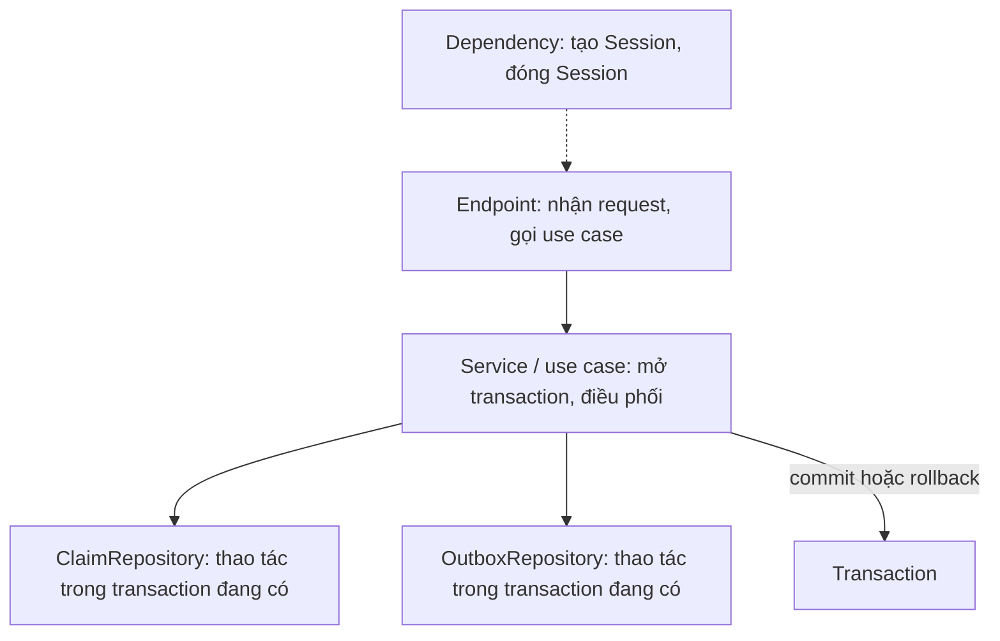
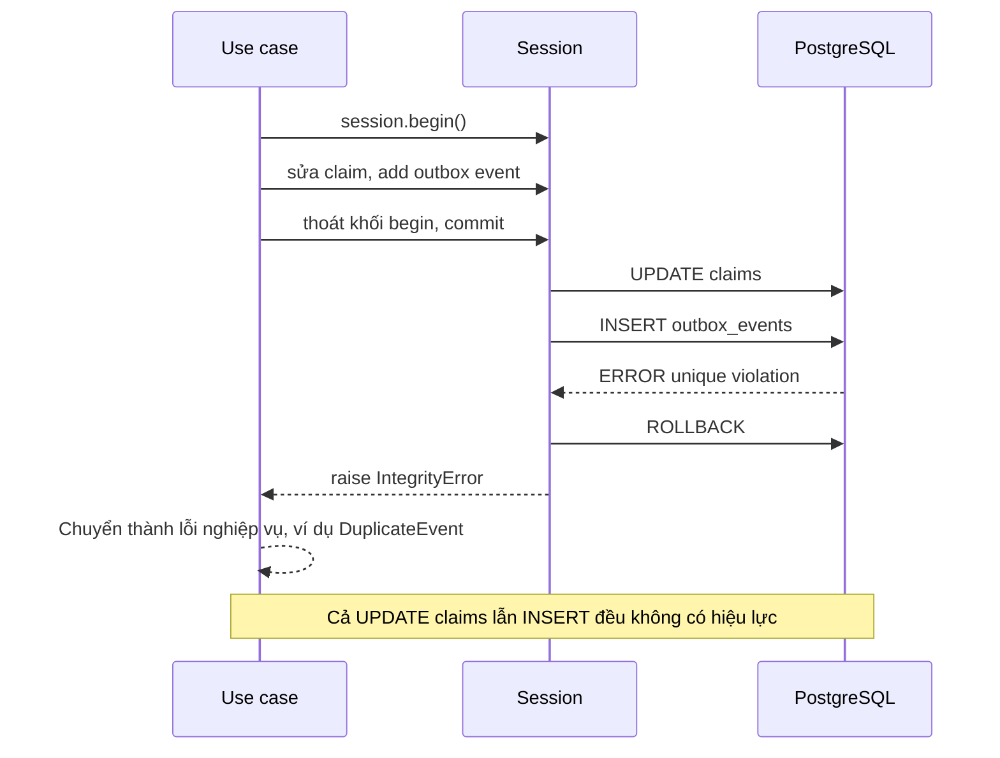

# Transaction trong SQLAlchemy

## 1. Tổng quan

SQLAlchemy không tự tạo ra transaction; nó điều khiển transaction của database ([Transaction trong PostgreSQL](../04-database-postgresql/transaction.md)) thông qua connection. Tài liệu này tập trung vào **cách ứng dụng Python quản lý ranh giới transaction**: bắt đầu ở đâu, commit ở đâu, rollback thế nào khi có lỗi, xử lý savepoint, isolation level, khóa row, optimistic locking, và retry.

Câu hỏi thiết kế trung tâm: **tầng nào sở hữu ranh giới transaction?**

## 2. Mental Model

> Transaction bao quanh **một đơn vị nghiệp vụ** — thứ phải thành công hoặc thất bại cùng nhau. Tầng hiểu đơn vị nghiệp vụ đó (service/use case) nên quyết định ranh giới; tầng web chỉ cung cấp Session, tầng repository chỉ thao tác dữ liệu trong transaction đã có.

## 3. Vì sao cần quản lý tường minh?

- Commit rải rác trong repository làm mất tính nguyên tử: nửa use case đã commit, nửa còn lại lỗi.
- Commit ngầm trong cleanup của dependency có thể thất bại **sau khi** response 200 đã gửi.
- Retry lỗi serialization/deadlock cần biết chính xác transaction bắt đầu từ đâu để chạy lại.

## 4. Cơ chế: các cách mở và kết thúc transaction

### "Begin once" với context manager

```python
async with SessionLocal() as session:
    async with session.begin():              # BEGIN
        claim = await session.get(Claim, claim_id)
        claim.status = "approved"
        session.add(OutboxEvent(...))
    # thoát khối: COMMIT nếu không có exception, ROLLBACK nếu có
```

Hoặc gộp: `async with SessionLocal.begin() as session:`.

### "Commit as you go"

```python
async with SessionLocal() as session:
    session.add(obj)
    await session.commit()                   # autobegin ở thao tác đầu tiên, commit tường minh
    ...
    await session.commit()                   # transaction mới đã autobegin, commit lần nữa
```

Linh hoạt nhưng dễ để transaction mở lâu hơn dự định hoặc commit từng phần.

### Rollback khi lỗi

Nếu flush thất bại (vi phạm unique constraint), transaction trên PostgreSQL ở trạng thái lỗi. Session chuyển sang trạng thái cần rollback; mọi thao tác tiếp theo nhận `PendingRollbackError` cho tới khi `rollback()` được gọi. Context manager `session.begin()` tự rollback khi có exception.

## 5. Ai sở hữu transaction?



Diễn giải:

1. **Dependency** tạo Session cho request và đảm bảo đóng nó; không commit.
2. **Service/use case** mở transaction bằng `session.begin()` quanh đúng các bước của use case, và là nơi duy nhất commit.
3. **Repository** nhận Session, thực hiện query/thay đổi, **không** commit — nhờ vậy nhiều repository tham gia cùng một transaction.

```python
class ApproveClaim:
    def __init__(self, session: AsyncSession):
        self.session = session
        self.claims = ClaimRepository(session)
        self.outbox = OutboxRepository(session)

    async def __call__(self, claim_id: int, reviewer_id: int) -> Claim:
        async with self.session.begin():
            claim = await self.claims.get_for_update(claim_id)
            claim.approve(reviewer_id)                       # quy tắc nghiệp vụ trong domain
            self.outbox.add(ClaimApproved(claim_id=claim.id))
        return claim
```

Lỗi commit trở thành exception của use case → handler trả lỗi phù hợp, thay vì trả 200 cho thao tác không được lưu. Xem [Clean Architecture](../09-software-architecture/clean-architecture.md).

## 6. Savepoint: `begin_nested`

```python
async with session.begin():
    session.add(claim)
    for line in lines:
        try:
            async with session.begin_nested():       # SAVEPOINT
                session.add(line)
                await session.flush()                # có thể lỗi constraint
        except IntegrityError:
            skipped.append(line)                     # ROLLBACK TO SAVEPOINT, transaction ngoài vẫn sống
```

Savepoint cho phép một phần thất bại mà không hủy cả transaction. Dùng hạn chế: mỗi savepoint là một subtransaction trên PostgreSQL; hàng trăm savepoint trong một transaction dài có chi phí. Với import lớn, thường tốt hơn là validate trước hoặc dùng `INSERT ... ON CONFLICT DO NOTHING`.

Savepoint cũng là cơ chế phổ biến cho **test**: mỗi test chạy trong transaction/savepoint và rollback ở cuối, giữ database sạch mà không phải xóa dữ liệu.

## 7. Isolation level

```python
# Toàn engine
engine = create_async_engine(DB_URL, isolation_level="REPEATABLE READ")

# Theo transaction cụ thể
async with session.begin():
    await session.connection(execution_options={"isolation_level": "SERIALIZABLE"})
    ...
```

`execution_options` trên connection phải được đặt **trước** câu lệnh đầu tiên của transaction. Mặc định của PostgreSQL là Read Committed. Xem [Isolation Level](../04-database-postgresql/isolation-level.md).

## 8. Khóa row và optimistic locking

### Pessimistic: `with_for_update`

```python
stmt = select(Claim).where(Claim.id == claim_id).with_for_update()
claim = (await session.execute(stmt)).scalar_one()
# SELECT ... FOR UPDATE: transaction khác muốn khóa row này phải chờ tới khi commit
```

Các biến thể: `with_for_update(nowait=True)`, `with_for_update(skip_locked=True)` (hàng đợi job), `with_for_update(of=Claim)` khi query có join. Xem [Locks](../04-database-postgresql/locks.md).

### Optimistic: `version_id_col`

```python
class Claim(Base):
    __tablename__ = "claims"
    id: Mapped[int] = mapped_column(primary_key=True)
    status: Mapped[str]
    version: Mapped[int] = mapped_column(nullable=False)
    __mapper_args__ = {"version_id_col": version}
```

Mỗi UPDATE do ORM sinh ra có dạng `UPDATE claims SET ..., version = 6 WHERE id = ? AND version = 5`. Nếu 0 row bị ảnh hưởng (ai đó đã sửa trước), SQLAlchemy raise `StaleDataError`. Không giữ lock, phù hợp khi xung đột hiếm — ví dụ hai người duyệt cùng mở một claim trên giao diện.

## 9. Retry transaction

Lỗi `40001` (serialization) và `40P01` (deadlock) có thể retry. Retry phải:

1. Tạo transaction **mới** (rollback transaction cũ, thường tạo Session mới).
2. Chạy lại **toàn bộ** logic đọc và ghi — không dùng object đã load từ lần thử trước (chúng có dữ liệu cũ).
3. Không chứa tác dụng phụ bên ngoài database.
4. Có giới hạn số lần và backoff với jitter.

Ví dụ đầy đủ ở [Isolation Level](../04-database-postgresql/isolation-level.md#8-ví-dụ-retry-transaction-trong-python).

## 10. Bên trong hệ thống xảy ra gì khi commit thất bại?



Diễn giải: flush gửi các câu lệnh theo thứ tự; lỗi ở bất kỳ câu nào hủy cả transaction. Vì hai thay đổi nằm trong cùng transaction, không có trạng thái "claim đã duyệt nhưng không có event". Đây chính là lý do outbox phải ghi trong cùng transaction với dữ liệu nghiệp vụ. Xem [Outbox Pattern](../10-distributed-systems/outbox-pattern.md).

## 11. Hành vi trong production

- **Commit trong repository** làm mất nguyên tử và làm khó retry; gom commit về tầng use case.
- **Commit trong cleanup của dependency** chạy có thể sau khi response đã gửi (tùy version FastAPI) — lỗi commit không thể biến thành response lỗi.
- **Transaction bao lời gọi ngoài**: `async with session.begin(): await http_client.post(...)` giữ connection và lock. Tách lời gọi ngoài ra khỏi transaction.
- **Lazy load trong transaction đã commit** (với `expire_on_commit=True`) tự mở transaction mới ngầm — connection lại bị mượn.

## 12. Failure Modes

| Failure | Nguyên nhân | Dấu hiệu |
|---|---|---|
| Cập nhật một nửa | Commit trong từng repository | Dữ liệu không nhất quán sau lỗi giữa use case |
| 200 nhưng không lưu | Commit sau khi gửi response | Client thấy thành công, database không có |
| `PendingRollbackError` | Dùng Session sau flush lỗi | Mọi thao tác tiếp theo lỗi |
| `StaleDataError` không xử lý | Optimistic lock xung đột | 500 thay vì 409 |
| Retry dùng dữ liệu cũ | Tái sử dụng object từ lần thử trước | Ghi đè bằng dữ liệu cũ |
| Deadlock thường xuyên | Khóa row theo thứ tự khác nhau | Lỗi `40P01` |

## 13. Trade-offs

| Lựa chọn | Lợi ích | Chi phí |
|---|---|---|
| Transaction ở use case | Nguyên tử theo nghiệp vụ, dễ retry | Cần kỷ luật kiến trúc |
| Transaction ở dependency (mỗi request) | Đơn giản, tự động | Rộng hơn cần thiết, lỗi commit muộn |
| `with_for_update` | Đơn giản, chắc chắn | Chờ lock, deadlock |
| `version_id_col` | Không lock | Phải xử lý xung đột (409, reload) |
| Savepoint | Lỗi cục bộ không hủy tất cả | Chi phí subtransaction |

## 14. Sai lầm thường gặp

- Gọi `commit()` trong repository.
- Bắt exception của flush rồi tiếp tục dùng Session mà không rollback.
- Retry chỉ câu lệnh lỗi.
- Đặt isolation level sau khi transaction đã chạy câu lệnh đầu tiên.
- Dùng savepoint trong vòng lặp hàng nghìn phần tử.

## 15. Cách debug

- Log SQL (`echo`) để thấy `BEGIN`, `SAVEPOINT`, `COMMIT`, `ROLLBACK` thực tế.
- Event `after_begin`, `after_commit`, `after_rollback` trên Session để đo thời lượng transaction.
- Phía database: `pg_stat_activity` (`xact_start`, `state`) và log lỗi constraint/deadlock.

## 16. Best Practices

- Use case sở hữu ranh giới transaction; repository không commit; dependency chỉ tạo và đóng Session.
- Dùng `async with session.begin()` để commit/rollback tự động và rõ ràng.
- Transaction không chứa I/O ngoài database; tác dụng phụ đi qua outbox.
- Chọn pessimistic hoặc optimistic locking theo mức độ xung đột; map `StaleDataError` thành 409.
- Retry toàn bộ use case cho `40001`/`40P01`, có giới hạn và jitter.

## 17. Tóm tắt

- SQLAlchemy điều khiển transaction của database qua Session; `session.begin()` commit hoặc rollback tự động.
- Use case nên sở hữu ranh giới transaction; repository chỉ thao tác trong transaction đang có.
- Flush lỗi đưa Session vào trạng thái cần rollback.
- `with_for_update` cho pessimistic locking; `version_id_col` cho optimistic locking.
- Retry phải chạy lại toàn bộ transaction với Session và dữ liệu mới.

## Liên quan

- [Session Lifecycle](session-lifecycle.md)
- [Transaction trong PostgreSQL](../04-database-postgresql/transaction.md)
- [Isolation Level](../04-database-postgresql/isolation-level.md)
- [Outbox Pattern](../10-distributed-systems/outbox-pattern.md)
- [Clean Architecture](../09-software-architecture/clean-architecture.md)
