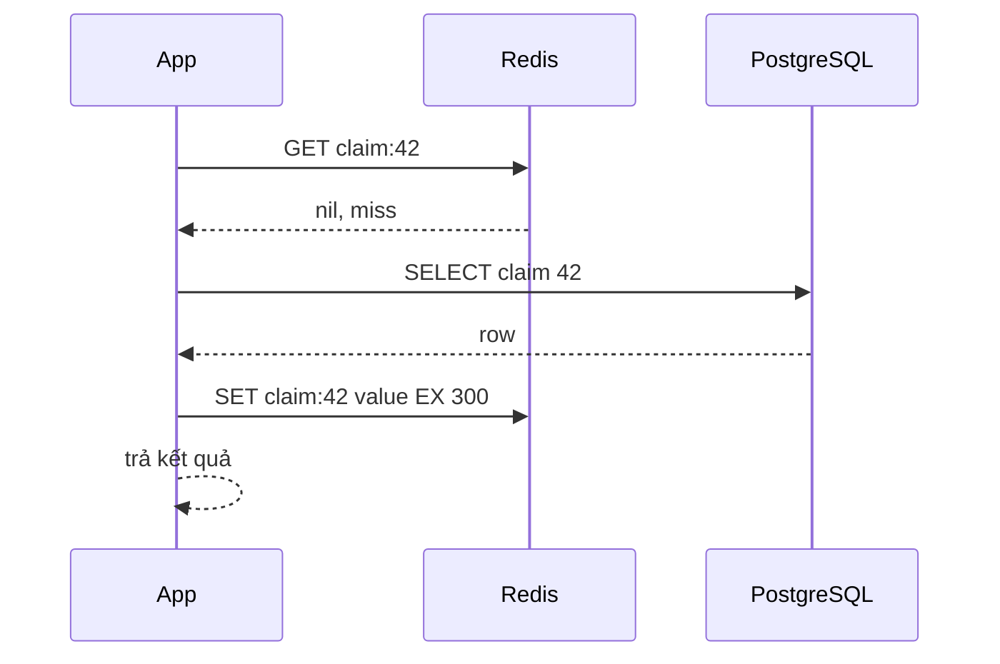
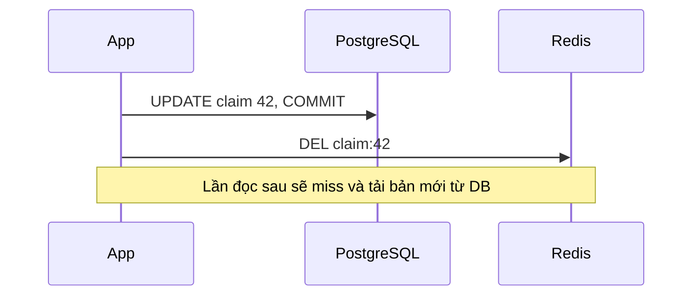
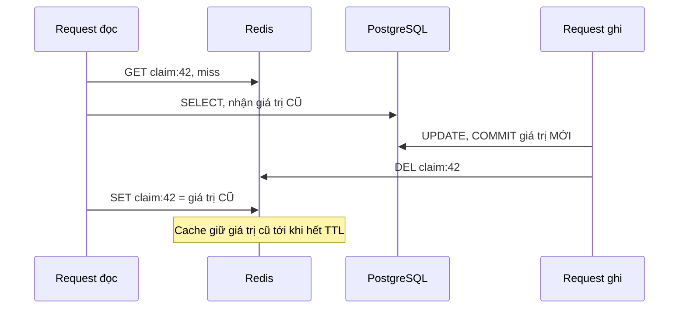

# Cache Patterns và Cache Invalidation

## 1. Tổng quan

Cache pattern mô tả **ai** đọc/ghi cache và source of truth, **theo thứ tự nào**. Mỗi pattern cho một mức độ nhất quán, độ phức tạp và rủi ro khác nhau.

| Pattern | Đọc | Ghi |
|---|---|---|
| **Cache-aside** (lazy loading) | App đọc cache; miss thì app đọc DB rồi ghi cache | App ghi DB rồi xóa (hoặc cập nhật) cache |
| **Read-through** | App chỉ hỏi cache; cache tự tải từ DB khi miss | — |
| **Write-through** | — | App ghi qua cache; cache ghi đồng bộ xuống DB |
| **Write-behind** (write-back) | — | App ghi vào cache; cache ghi xuống DB sau, bất đồng bộ |
| **Write-around** | — | App ghi thẳng DB, bỏ qua cache |
| **Refresh-ahead** | Cache tự làm mới key sắp hết hạn trước khi bị hỏi | — |

Với Redis trong backend Python, **cache-aside** là pattern mặc định — Redis không có cơ chế tự tải dữ liệu từ PostgreSQL, nên "read-through" thực chất là cache-aside được đóng gói trong một lớp thư viện.

Phần khó nhất của caching không phải là đặt dữ liệu vào cache, mà là **invalidation**: làm sao cache không trả dữ liệu cũ sau khi source of truth thay đổi.

## 2. Mental Model

> Có hai sự thật: database (chính thức) và cache (bản sao). Mọi pattern là quy tắc để giữ khoảng cách giữa hai sự thật trong giới hạn chấp nhận được. Không pattern nào làm khoảng cách bằng 0 mà không có cái giá — vì cache và database là hai hệ thống, không có transaction chung.

## 3. Cache-aside chi tiết

### Đọc



### Ghi: xóa cache thay vì cập nhật



Diễn giải: sau khi commit thay đổi vào database, **xóa** key cache. Lần đọc kế tiếp miss và tải giá trị mới. Vì sao xóa thay vì `SET` giá trị mới?

- Hai request ghi đồng thời có thể `SET` cache theo thứ tự ngược với thứ tự commit vào DB → cache giữ giá trị cũ vĩnh viễn (tới TTL).
- Giá trị trong cache có thể là kết quả tổng hợp từ nhiều bảng; tính lại khi ghi tốn công và dễ sai.
- Xóa là thao tác idempotent, an toàn khi retry.

Luôn ghi DB **trước**, xóa cache **sau**. Nếu xóa trước rồi mới ghi DB, một request đọc chen giữa sẽ nạp lại giá trị cũ vào cache.

## 4. Race condition của cache-aside

Ngay cả với "ghi DB rồi xóa cache", vẫn có cửa sổ race:



Diễn giải:

1. Request đọc miss và đọc DB — nhận giá trị cũ.
2. Trước khi nó kịp ghi vào cache, request ghi cập nhật DB và xóa cache (lúc này cache vốn đang trống).
3. Request đọc ghi giá trị cũ vào cache **sau** lần xóa.
4. Cache sai tới hết TTL.

Cửa sổ này hẹp (đọc DB phải chậm hơn cả ghi DB + xóa cache), nhưng dưới tải cao và với query đọc chậm, nó xảy ra thật. Các cách giảm thiểu:

| Kỹ thuật | Cách làm | Đánh đổi |
|---|---|---|
| **TTL** | Giới hạn thời gian sai | Không loại bỏ, chỉ giới hạn |
| **Delayed double delete** | Xóa ngay sau commit, và xóa lần nữa sau vài trăm ms | Giảm mạnh xác suất; thêm tác vụ trễ |
| **Version trong giá trị** | Lưu `updated_at`/`version` cùng dữ liệu; chỉ `SET` nếu version mới hơn (Lua script so sánh) | Cần version đơn điệu từ DB |
| **Lease** | Khi miss, cache cấp một "lease token"; lần xóa làm lease vô hiệu; `SET` chỉ thành công nếu lease còn hiệu lực | Cần logic Lua; là cách Memcache của Facebook xử lý |
| **Invalidation từ CDC** | Đọc thay đổi từ WAL của PostgreSQL (Debezium), xóa cache theo thứ tự commit | Hạ tầng thêm; độ trễ nhỏ |

Với phần lớn dữ liệu, **TTL hợp lý + xóa sau commit** là đủ. Dữ liệu mà sai vài phút gây hậu quả thật cần một trong các kỹ thuật mạnh hơn, hoặc không nên cache.

## 5. Cache và transaction

Xóa cache **bên trong** transaction database là sai thứ tự:

```python
async with session.begin():
    claim.status = "approved"
    await redis.delete(f"claim:{claim.id}")    # xóa trước khi COMMIT
# nếu commit thất bại: cache đã bị xóa (vô hại)
# nếu commit thành công nhưng chậm: request đọc chen giữa nạp lại giá trị cũ
```

Xóa **sau** khi commit thành công. Nếu process chết giữa commit và xóa, cache giữ giá trị cũ tới TTL. Để đảm bảo invalidation không bị mất, ghi sự kiện invalidation vào **outbox** trong cùng transaction và xử lý bất đồng bộ — xem [Outbox Pattern](../10-distributed-systems/outbox-pattern.md).

## 6. Các pattern khác

### Read-through

Đóng gói logic cache-aside trong một lớp: caller chỉ gọi `cache.get(key, loader)`. Lợi ích: một nơi xử lý stampede, serialize, metric, lỗi Redis.

```python
class ReadThroughCache:
    def __init__(self, redis, ttl: int):
        self.redis, self.ttl = redis, ttl

    async def get(self, key: str, loader):
        raw = await self.redis.get(key)
        if raw is not None:
            return json.loads(raw)
        value = await loader()
        await self.redis.set(key, json.dumps(value), ex=self.ttl)
        return value
```

### Write-through

Ghi DB và cache cùng lúc (đồng bộ). Cache luôn có dữ liệu mới cho key vừa ghi. Vẫn có vấn đề thứ tự với ghi đồng thời, và cache chứa cả dữ liệu ít đọc.

### Write-behind

Ghi vào cache, xác nhận ngay; một tiến trình nền ghi xuống DB sau (thường theo lô). Latency ghi rất thấp, gộp nhiều ghi vào một. Nhưng **Redis trở thành nơi lưu dữ liệu chưa bền vững**: Redis mất dữ liệu trước khi flush → mất ghi. Chỉ phù hợp cho dữ liệu chấp nhận mất (counter lượt xem, analytics) hoặc khi Redis được cấu hình bền vững cẩn thận.

### Refresh-ahead

Làm mới key nóng **trước khi** hết hạn (dựa trên TTL còn lại hoặc thời điểm truy cập). Tránh latency miss cho key nóng, và là một cách chống [cache stampede](cache-problems.md).

## 7. Chiến lược invalidation

| Chiến lược | Khi dùng |
|---|---|
| Chỉ TTL | Dữ liệu chấp nhận cũ tới N phút; không ai tự sửa (tỷ giá, danh mục) |
| Xóa sau ghi (cache-aside) | Dữ liệu người dùng tự sửa, cần thấy thay đổi gần ngay |
| Version trong key | Thay đổi hàng loạt (đổi schema, đổi quy tắc) — tăng version, key cũ tự hết hạn |
| Event/CDC | Nhiều service cache cùng dữ liệu; cần invalidation đáng tin cậy |
| Tag/nhóm | Xóa mọi key liên quan tới một entity (lưu set các key theo tag) — cẩn thận với set lớn |

"Có hai việc khó trong khoa học máy tính: cache invalidation và đặt tên." Invalidation khó vì nó là bài toán nhất quán giữa hai hệ thống không chung transaction — cùng loại bài toán với [dual write](../10-distributed-systems/outbox-pattern.md).

## 8. Hành vi trong production

- **Nhiều nơi ghi**: API, worker Celery, job batch, admin tool, migration — mọi nơi ghi dữ liệu phải invalidate cache tương ứng. Quên một nơi → dữ liệu cũ khó truy vết. Tập trung logic ghi vào repository/service có hook invalidation, hoặc dùng CDC.
- **Cache dẫn xuất nhiều cấp**: cache "tổng hợp theo đại lý" phụ thuộc vào nhiều claim; mỗi thay đổi claim phải invalidate cache tổng hợp. Cân nhắc TTL ngắn thay vì invalidation chính xác.
- **Deploy thay đổi format**: code mới đọc dữ liệu format cũ trong cache → lỗi deserialize. Version trong key giải quyết.

## 9. Failure Modes

| Failure | Nguyên nhân | Dấu hiệu |
|---|---|---|
| Stale sau update | Race đọc-ghi, quên invalidate ở một đường ghi | Dữ liệu cũ tới hết TTL |
| Cache bị xóa nhưng DB không đổi | Xóa trong transaction bị rollback | Vô hại nhưng tăng miss |
| Mất ghi | Write-behind + Redis mất dữ liệu | Dữ liệu biến mất sau sự cố Redis |
| Lỗi deserialize sau deploy | Format thay đổi, key không có version | Exception khi đọc cache |
| Invalidation storm | Một thay đổi xóa hàng triệu key | Redis bận, miss hàng loạt |

## 10. Trade-offs

| Pattern | Nhất quán | Latency ghi | Độ phức tạp | Rủi ro |
|---|---|---|---|---|
| Cache-aside + delete | Tốt, cửa sổ race nhỏ | Không đổi | Thấp | Quên invalidate |
| Write-through | Tốt cho key vừa ghi | Tăng | Trung bình | Thứ tự ghi đồng thời |
| Write-behind | Cache đi trước DB | Rất thấp | Cao | Mất dữ liệu |
| Chỉ TTL | Cũ tới TTL | Không đổi | Rất thấp | Stale |
| CDC invalidation | Rất tốt, theo thứ tự commit | Không đổi | Cao (hạ tầng) | Độ trễ pipeline |

## 11. Sai lầm thường gặp

- Cập nhật cache (`SET`) khi ghi thay vì xóa.
- Xóa cache trước khi ghi database.
- Xóa cache trong transaction trước commit.
- Dùng write-behind cho dữ liệu quan trọng.
- Nghĩ TTL ngắn thay thế hoàn toàn invalidation cho dữ liệu người dùng tự sửa.

## 12. Cách debug

- Log (hoặc trace) cả thao tác ghi DB và xóa cache với correlation ID để kiểm tra thứ tự.
- So sánh định kỳ mẫu key cache với DB (job kiểm tra nhất quán) cho dữ liệu quan trọng.
- Metric số lần invalidate theo loại key; đột biến có thể là invalidation storm.

## 13. Best Practices

- Mặc định: cache-aside, ghi DB rồi xóa cache sau commit, TTL làm lưới an toàn.
- Tập trung logic ghi và invalidation; mọi đường ghi đều đi qua đó hoặc qua CDC.
- Version trong key để thay đổi format an toàn.
- Dùng version/lease hoặc delayed double delete khi cửa sổ race gây hậu quả thật.
- Không dùng write-behind cho dữ liệu không được phép mất.

## 14. Tóm tắt

- Cache-aside là pattern mặc định với Redis: đọc cache, miss thì đọc DB và ghi cache; ghi DB rồi xóa cache.
- Xóa thay vì cập nhật cache khi ghi; ghi DB trước, xóa sau commit.
- Cache-aside có cửa sổ race nhỏ giữa đọc-miss và ghi-xóa; TTL, version, lease, double delete, CDC là các cách giảm thiểu.
- Write-through, write-behind, read-through, refresh-ahead phù hợp các tình huống riêng; write-behind có rủi ro mất dữ liệu.
- Invalidation là bài toán nhất quán giữa hai hệ thống không chung transaction.

## Liên quan

- [Caching: nền tảng](caching.md)
- [Cache Problems](cache-problems.md)
- [Outbox Pattern](../10-distributed-systems/outbox-pattern.md)
- [Eventual Consistency](../10-distributed-systems/eventual-consistency.md)
- [Race Condition](../02-python-concurrency/race-condition.md)
