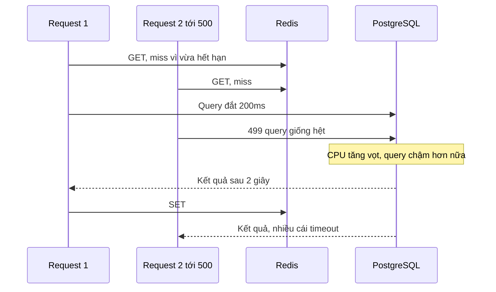
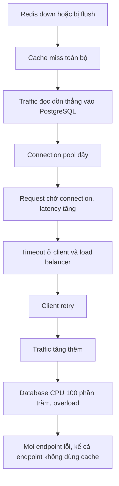

# Cache Problems: stampede, avalanche, penetration, hot key, large key

## 1. Tổng quan

Cache làm hệ thống nhanh hơn trong điều kiện bình thường — và tạo ra những kiểu sự cố riêng khi điều kiện không bình thường. Các sự cố này có điểm chung: **tải đột ngột dồn về source of truth** (database) hoặc **dồn vào một điểm** của hệ thống cache.

| Sự cố | Hiện tượng | Nguyên nhân |
|---|---|---|
| **Cache stampede** (thundering herd, cache breakdown) | Nhiều request cùng tải lại một key vừa hết hạn | Một key nóng hết hạn |
| **Cache avalanche** | Rất nhiều key cùng miss trong một thời điểm | Nhiều key hết hạn cùng lúc, cache restart/flush/sập |
| **Cache penetration** | Request cho dữ liệu không tồn tại luôn đi thẳng tới DB | Không cache kết quả rỗng; tấn công bằng ID ngẫu nhiên |
| **Hot key** | Một key nhận phần lớn traffic, một node Redis quá tải | Phân phối truy cập cực lệch |
| **Large key** | Một key rất lớn làm chậm Redis và mạng | Collection hoặc value không giới hạn |

## 2. Mental Model

> Cache giống con đê chắn nước cho database. Stampede là một lỗ thủng ở đúng chỗ nước chảy mạnh nhất. Avalanche là cả đoạn đê biến mất cùng lúc. Penetration là nước tìm được đường đi vòng qua đê. Hot key là mọi dòng nước dồn vào một cửa cống. Large key là một khối đá chặn cả dòng chảy.

## 3. Cache stampede

### Cơ chế

Key `product:hot` được đọc 5.000 lần/giây, TTL 5 phút. Tại thời điểm hết hạn:



Diễn giải: trong khoảng thời gian từ khi key hết hạn tới khi request đầu tiên nạp lại xong (200 ms query), khoảng 1.000 request đều miss và đều truy vấn database. Query đắt nhân 1.000 lần làm database chậm đi, kéo dài chính khoảng thời gian đó → càng nhiều request miss hơn. Với key có query tính toán nặng, một lần hết hạn có thể làm sập database.

### Cách xử lý

**1. Single-flight / request coalescing**: chỉ một request được nạp lại, số còn lại chờ kết quả đó.

- Trong một process: dùng Future/Task như [SingleFlight](../02-python-concurrency/synchronization.md#8-ví-dụ-single-flight-cho-cache-trong-asyncio).
- Giữa nhiều process/pod: lock ngắn trong Redis.

```python
import asyncio
import json
import uuid

async def get_with_lock(r, key: str, loader, ttl: int, lock_ttl_ms: int = 3000):
    raw = await r.get(key)
    if raw is not None:
        return json.loads(raw)
    token = uuid.uuid4().hex
    if await r.set(f"lock:{key}", token, nx=True, px=lock_ttl_ms):
        try:
            value = await loader()
            await r.set(key, json.dumps(value), ex=ttl)
            return value
        finally:
            await release_lock(r, f"lock:{key}", token)   # compare-and-delete bằng Lua
    for _ in range(30):                                   # không có lock: chờ người khác nạp
        await asyncio.sleep(0.05)
        raw = await r.get(key)
        if raw is not None:
            return json.loads(raw)
    return await loader()                                 # hết chờ: fallback có giới hạn
```

**2. Stale-while-revalidate**: lưu giá trị với hai mốc — "hạn mềm" (nên làm mới) và "hạn cứng" (TTL thật của Redis, dài hơn). Sau hạn mềm, request vẫn nhận giá trị cũ ngay, và **một** request (dùng lock) làm mới ở nền. Người dùng không bao giờ chờ nạp lại cho key nóng.

**3. Probabilistic early expiration**: mỗi request, với xác suất tăng dần khi gần hết hạn, tự quyết định làm mới sớm (thuật toán XFetch). Các request khác nhau làm mới ở thời điểm khác nhau → không có "vách đá" hết hạn.

**4. Refresh-ahead**: job nền làm mới key nóng định kỳ trước khi hết hạn.

## 4. Cache avalanche

### Cơ chế

- **Hết hạn đồng loạt**: warm-up cache lúc 9:00 với TTL 3600 → 10:00 mọi key cùng hết hạn.
- **Cache biến mất**: Redis restart không có persistence, `FLUSHALL`, failover sang replica rỗng, đổi version key cho mọi thứ trong một lần deploy.

Khác với stampede (một key), avalanche là **toàn bộ** hit ratio sụp đổ. Theo [công thức tải](caching.md#4-hit-ratio-con-số-quan-trọng-nhất), hit ratio từ 99% xuống 0% nghĩa là tải database tăng 100 lần.

### Failure chain: Redis down



Diễn giải:

1. Cache mất tác dụng; mọi request đọc đi thẳng tới database.
2. Database được dimension cho tải **sau** cache (vài phần trăm tải thật), không chịu nổi 100%.
3. Pool cạn, request xếp hàng; latency vượt timeout.
4. Retry của client khuếch đại tải.
5. Database quá tải ảnh hưởng mọi chức năng, kể cả các ghi quan trọng không liên quan tới cache.

### Cách xử lý

| Biện pháp | Tác dụng |
|---|---|
| **TTL jitter**: `ttl = base + random(0, 0.2 × base)` | Rải thời điểm hết hạn, tránh đồng loạt |
| **Circuit breaker cho Redis** | Redis lỗi → không chờ timeout mỗi request; quyết định nhanh |
| **Rate limit / bulkhead đường fallback về DB** | Chỉ một phần request được phép đọc DB khi cache mất; phần còn lại nhận lỗi nhanh hoặc dữ liệu cũ |
| **Cache hai tầng** (L1 in-process) | L1 vẫn phục vụ key nóng trong vài giây khi Redis mất |
| **Warm-up có kiểm soát** sau restart | Nạp key nóng trước khi mở traffic |
| **HA cho Redis** (replica, [Sentinel/Cluster](sentinel-cluster.md)), persistence phù hợp | Giảm khả năng mất toàn bộ cache |
| **Degrade có chủ đích** | Tắt tính năng không thiết yếu dùng cache khi cache mất |

Chi tiết xử lý sự cố ở [Redis Down](../20-production-incidents/redis-down.md).

## 5. Cache penetration

### Cơ chế

Request hỏi dữ liệu **không tồn tại**: `GET /vehicles/INVALID-VIN-123`. Cache miss → DB trả rỗng → không có gì để cache → request sau cũng miss. Kẻ tấn công (hoặc client bị lỗi) gửi hàng nghìn ID ngẫu nhiên mỗi giây → toàn bộ đi thẳng vào database, cache hoàn toàn vô dụng.

### Cách xử lý

1. **Negative caching**: cache kết quả "không tồn tại" với TTL ngắn (30–60 giây) và một giá trị đặc biệt.
   ```python
   MISSING = "__missing__"
   if coverage is None:
       await r.set(key, MISSING, ex=60)
   ```
   TTL ngắn để khi dữ liệu được tạo, nó xuất hiện sớm (hoặc xóa key negative khi tạo).
2. **Validate input** trước khi chạm cache/DB: VIN phải đúng định dạng 17 ký tự hợp lệ; ID phải trong khoảng hợp lệ. Loại bỏ phần lớn request rác rẻ nhất.
3. **Bloom filter** chứa mọi ID tồn tại: nếu Bloom filter nói "chắc chắn không tồn tại" → trả 404 ngay. Bloom filter có false positive (nói "có thể tồn tại" khi không), không có false negative. Phải cập nhật khi thêm dữ liệu; xóa phần tử cần biến thể (counting Bloom filter) hoặc xây lại định kỳ.
4. **Rate limit** theo client cho endpoint tra cứu. Xem [Rate Limiting](../08-api-design/rate-limiting.md).

## 6. Hot key

### Cơ chế

Một key nhận phần lớn traffic: sản phẩm khuyến mãi, cấu hình toàn cục, bảng giá được mọi request đọc. Vì Redis thực thi đơn luồng và mỗi key nằm trên **một** node (trong Cluster, một key thuộc một hash slot của một master), key đó bị giới hạn bởi throughput của **một core trên một node**. Thêm node vào Cluster không giúp gì.

Dấu hiệu: một node Redis CPU 100% trong khi các node khác rảnh; băng thông mạng của node đó bão hòa (nếu value lớn).

### Cách xử lý

| Biện pháp | Cách làm | Đánh đổi |
|---|---|---|
| **Cache in-process (L1)** | Mỗi worker giữ bản sao vài giây | Stale trong vài giây; nhân bản memory |
| **Nhân bản key** | Ghi `price:hot:{0..N-1}`, đọc ngẫu nhiên một bản | Ghi N lần; invalidate N key |
| **Đọc từ replica** | Phân tải đọc sang replica | Replication lag |
| **Giảm kích thước value** | Chỉ cache field cần thiết, nén | Thêm CPU nén/giải nén |
| **Phát hiện sớm** | `redis-cli --hotkeys` (cần LFU policy), metric theo key phía ứng dụng | — |

## 7. Large key (big key)

### Cơ chế

Key có value rất lớn (string vài MB) hoặc collection rất nhiều phần tử (hash triệu field, list triệu phần tử):

- Command O(N) trên key giữ main thread lâu → **mọi** client chờ.
- Đọc value vài MB chiếm băng thông mạng, tăng latency của node.
- `DEL` đồng bộ giải phóng hàng triệu phần tử → block (dùng `UNLINK`).
- Key hết hạn cũng phải được giải phóng — nếu không bật `lazyfree-lazy-expire`, việc giải phóng block main thread.
- Trong Cluster: không thể di chuyển slot mượt khi resharding; node chứa key lớn mất cân bằng memory.
- Replication và persistence: sửa một phần key lớn vẫn nhanh, nhưng full resync gửi cả key.

### Cách xử lý

- **Chia nhỏ**: `leaderboard:2026-09` thay vì một leaderboard mọi thời đại; hash theo bucket `user_prefs:{user_id % 1024}`.
- **Giới hạn kích thước**: `LTRIM` list, xóa phần tử cũ khỏi sorted set, TTL cho collection.
- **Chỉ đọc phần cần**: `HMGET` thay `HGETALL`, `ZRANGE` có giới hạn, `SCAN`-family thay vì lấy hết.
- **Value lớn**: lưu ở object storage, Redis chỉ giữ tham chiếu; hoặc nén.
- **Giải phóng không block**: `UNLINK`, `lazyfree-lazy-eviction`, `lazyfree-lazy-expire`, `lazyfree-lazy-user-del`.
- **Phát hiện**: `redis-cli --bigkeys`, `--memkeys`, `MEMORY USAGE`.

## 8. Hành vi trong production

- Các sự cố này thường **kết hợp**: một deploy đổi version key (avalanche) đúng lúc có sự kiện khuyến mãi (hot key) với query nạp lại đắt (stampede).
- Kiểm thử bằng chaos: tắt Redis trong staging dưới tải để xem hệ thống có degrade đúng thiết kế hay sụp đổ.
- Capacity planning database phải tính tới trường hợp mất một phần cache, không chỉ trạng thái hit ratio bình thường.

## 9. Trade-offs

| Biện pháp | Lợi ích | Chi phí |
|---|---|---|
| Lock single-flight | Chỉ một lần nạp | Request chờ; lock có thể hết hạn trước khi nạp xong |
| Stale-while-revalidate | Không ai chờ | Trả dữ liệu cũ sau hạn mềm |
| TTL jitter | Rải thời điểm hết hạn | Dữ liệu hết hạn không đều |
| Negative cache | Chặn penetration | Dữ liệu mới tạo xuất hiện trễ |
| Bloom filter | Chặn penetration hiệu quả | Hạ tầng thêm, false positive, khó xóa |
| L1 cache | Giảm hot key, chịu Redis down ngắn | Stale, invalidate phức tạp |

## 10. Sai lầm thường gặp

- TTL cố định cho mọi key được nạp cùng lúc.
- Không có kế hoạch khi Redis không có mặt; timeout Redis dài.
- Không cache kết quả rỗng; không validate input.
- Nghĩ thêm node Redis Cluster giải quyết hot key.
- Để collection trong Redis tăng không giới hạn.

## 11. Cách debug

- **Stampede**: spike query giống nhau trong `pg_stat_statements`/trace trùng thời điểm key nóng hết hạn; metric miss theo key.
- **Avalanche**: hit ratio sụp đổ đồng thời với tải DB tăng; kiểm tra sự kiện restart/flush/deploy.
- **Penetration**: tỷ lệ miss cao với key không có trong DB; phân bố ID bất thường; tỷ lệ 404 cao.
- **Hot key**: CPU không đều giữa node; `--hotkeys`; metric theo key phía ứng dụng.
- **Large key**: `SLOWLOG`, `--bigkeys`, latency spike khi đọc/xóa key cụ thể.

## 12. Best Practices

- TTL có jitter cho mọi key nạp theo lô.
- Single-flight hoặc stale-while-revalidate cho key nóng có chi phí nạp cao.
- Negative cache TTL ngắn + validate input + rate limit cho endpoint tra cứu.
- L1 cache ngắn hạn cho key cực nóng.
- Giới hạn kích thước mọi key; chia nhỏ collection.
- Thiết kế đường fallback khi Redis mất: circuit breaker, giới hạn tải về DB, degrade có chủ đích.

## 13. Tóm tắt

- Stampede: nhiều request cùng nạp lại một key vừa hết hạn; xử lý bằng single-flight, stale-while-revalidate, làm mới sớm.
- Avalanche: hit ratio sụp đổ vì nhiều key hết hạn cùng lúc hoặc cache mất; xử lý bằng jitter, circuit breaker, giới hạn fallback, warm-up.
- Penetration: request cho dữ liệu không tồn tại vượt qua cache; xử lý bằng negative cache, validate, Bloom filter.
- Hot key giới hạn bởi một core của một node; xử lý bằng L1 cache, nhân bản key.
- Large key chặn main thread và làm mất cân bằng; chia nhỏ và giới hạn.

## Liên quan

- [Caching: nền tảng](caching.md)
- [Cache Patterns](cache-patterns.md)
- [Redis Internals](redis-internals.md)
- [Redis Down](../20-production-incidents/redis-down.md)
- [Circuit Breaker](../10-distributed-systems/circuit-breaker.md)
- [Failure Scenarios trong hệ thống phân tán](../10-distributed-systems/failure-scenarios.md)
