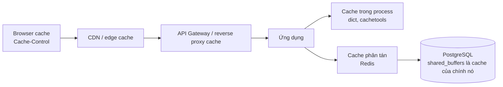
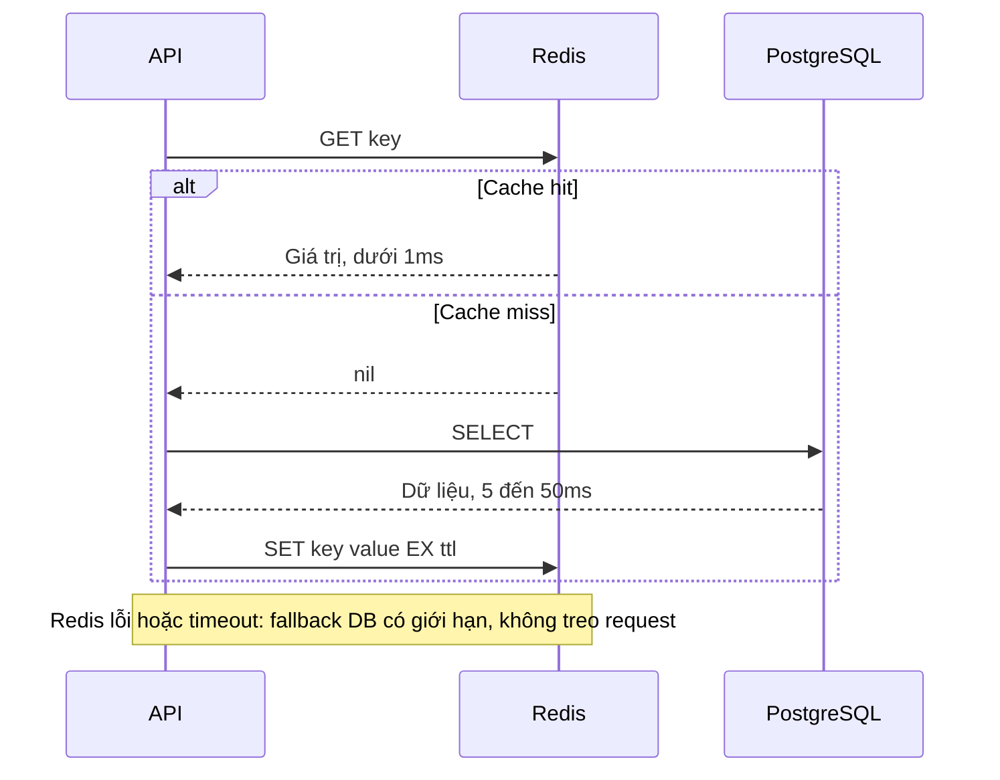

# Caching: nền tảng

## 1. Tổng quan

Cache là một bản sao **tạm thời, có thể mất** của dữ liệu, đặt ở nơi truy cập nhanh hơn nguồn gốc. Mục đích: giảm latency cho người dùng và giảm tải cho nguồn dữ liệu đắt (database, service khác, tính toán nặng).

Cache là **derived state**: nó phải luôn có thể bị xóa và dựng lại từ **source of truth**. Nếu không chỉ ra được source of truth và chính sách chấp nhận dữ liệu cũ (staleness), cache đã âm thầm trở thành một database thứ hai — với độ bền và tính nhất quán kém hơn.

Tài liệu này mô tả nguyên lý chung. Các pattern đọc/ghi ở [Cache Patterns](cache-patterns.md); các sự cố đặc trưng ở [Cache Problems](cache-problems.md); cache ở mức kiến trúc hệ thống ở [Caching trong System Design](../11-system-design/caching.md).

## 2. Mental Model

> Cache là cuốn sổ tay ghi lại câu trả lời cho những câu hỏi hay gặp. Tra sổ tay nhanh hơn nhiều so với đi hỏi (database). Nhưng câu trả lời trong sổ có thể đã lỗi thời, và sổ có thể bị mất bất cứ lúc nào — bạn phải luôn biết cách đi hỏi lại.

## 3. Vì sao cần cache?

| Không có cache | Có cache |
|---|---|
| Mỗi request đọc database: 5–50 ms | Cache hit: dưới 1 ms |
| Database nhận toàn bộ tải đọc | Database chỉ nhận cache miss |
| Tính toán lặp lại cho cùng input | Tính một lần, dùng nhiều lần |
| Service phụ thuộc chậm/đắt gọi mỗi request | Gọi theo chu kỳ TTL |

## 4. Hit ratio: con số quan trọng nhất

Với `h` là hit ratio:

```text
latency trung bình ≈ h × t_cache + (1 − h) × (t_cache + t_source)
tải lên source     = (1 − h) × RPS
```

Ví dụ 10.000 RPS đọc:

| Hit ratio | Request tới database mỗi giây |
|---|---|
| 90% | 1.000 |
| 95% | 500 |
| 99% | 100 |
| 99.9% | 10 |

Từ 95% lên 99% giảm tải database **5 lần**. Ngược lại, hit ratio tụt từ 99% xuống 90% (vì deploy xóa cache, vì key hết hạn đồng loạt) làm tải database tăng **10 lần** ngay lập tức. Database được dimension theo tải **sau cache** sẽ sụp đổ khi cache mất tác dụng. Đây là gốc rễ của nhiều sự cố — xem [Redis Down](../20-production-incidents/redis-down.md).

## 5. Cache nằm ở đâu?



Diễn giải: mỗi tầng chặn bớt request trước khi chúng đi sâu hơn. Tầng càng gần người dùng càng nhanh và càng giảm tải nhiều, nhưng càng khó invalidate (không thể xóa cache trong trình duyệt của người dùng).

| Tầng | Latency | Chia sẻ giữa | Invalidate |
|---|---|---|---|
| In-process (L1) | Nanosecond–micro giây | Một worker process | Chỉ worker đó; N worker = N bản |
| Redis (L2) | Dưới 1 ms qua mạng | Mọi instance | Một nơi, xóa được tức thì |
| CDN | Gần người dùng | Mọi người dùng một vùng | Purge API, có độ trễ |
| Browser | Không qua mạng | Một người dùng | Chỉ bằng TTL hoặc đổi URL |

### Cache hai tầng

Kết hợp L1 (in-process, TTL rất ngắn, vài giây) với L2 (Redis, TTL dài hơn) giảm cả latency lẫn tải lên Redis — đặc biệt hiệu quả cho [hot key](cache-problems.md#6-hot-key). Cái giá: L1 ở mỗi worker có thể cũ hơn L2 trong khoảng TTL của L1.

## 6. Cái gì nên cache?

Nên cache khi dữ liệu:

- **Đọc nhiều hơn ghi rất nhiều** (danh mục sản phẩm, cấu hình, quy tắc bảo hành).
- **Đắt để tính hoặc lấy** (tổng hợp, gọi service ngoài, query join nhiều bảng).
- **Chấp nhận được việc cũ** trong một khoảng thời gian xác định.
- **Có phân phối truy cập lệch** — một phần nhỏ key nhận phần lớn traffic, nên cache nhỏ đạt hit ratio cao.

Không nên cache (hoặc phải rất cẩn thận):

- Dữ liệu yêu cầu đọc chính xác tuyệt đối tại thời điểm quyết định (số dư khi trừ tiền, tồn kho khi đặt hàng) — quyết định phải dựa trên source of truth.
- Dữ liệu thay đổi liên tục mà hit ratio thấp.
- Dữ liệu cá nhân nhạy cảm mà không có kiểm soát truy cập và mã hóa phù hợp.

## 7. Thiết kế cache key

```text
{service}:{entity}:{version}:{tenant}:{id}[:{variant}]
warranty:coverage:v3:t42:vin:WVWZZZ1KZAW000001
```

- **Namespace** theo service/entity để tránh va chạm và để xóa theo nhóm.
- **Version** trong key: đổi format dữ liệu hoặc logic → tăng version, key cũ tự hết hạn, không đọc nhầm dữ liệu format cũ trong lúc rolling deploy.
- **Tenant** trong key cho hệ thống multi-tenant — thiếu nó là rò rỉ dữ liệu giữa tenant.
- **Mọi input ảnh hưởng tới kết quả** phải nằm trong key (ngôn ngữ, quyền của người xem, tham số lọc). Thiếu một input → trả dữ liệu của người này cho người khác.
- Giữ key ngắn vừa phải; key cũng tốn memory.

## 8. Ví dụ: cache-aside cơ bản

```python
import json
import redis.asyncio as redis

async def get_coverage(r: redis.Redis, repo, tenant_id: int, vin: str) -> dict:
    key = f"warranty:coverage:v3:t{tenant_id}:vin:{vin}"
    cached = await r.get(key)
    if cached is not None:
        return json.loads(cached)                        # hit
    coverage = await repo.load_coverage(tenant_id, vin)  # miss: đọc source of truth
    await r.set(key, json.dumps(coverage), ex=300)       # TTL 5 phút
    return coverage
```

Đây là pattern phổ biến nhất; chi tiết, các biến thể và các race condition của nó ở [Cache Patterns](cache-patterns.md). Code production cần thêm: xử lý Redis lỗi (fallback về DB có giới hạn), single-flight chống stampede, TTL jitter.

## 9. Bên trong hệ thống xảy ra gì với một request đọc?



Diễn giải: cache miss tốn **nhiều hơn** không có cache (thêm một round trip tới Redis). Cache chỉ có lợi khi hit ratio đủ cao. Khi Redis lỗi, request không được treo chờ Redis — timeout ngắn và quyết định rõ ràng: fallback về database (có rate limit để không làm sập database) hoặc trả lỗi.

## 10. Hành vi trong production

- **Cache lạnh sau deploy/restart**: hit ratio 0%, database nhận toàn bộ tải. Warm-up các key nóng trước khi nhận traffic, hoặc tăng dần traffic.
- **Memory đầy**: Redis bắt đầu evict theo policy. Hit ratio giảm từ từ, không có lỗi rõ ràng. Theo dõi `evicted_keys`. Xem [TTL và Eviction](ttl.md).
- **Tính nhất quán**: người dùng sửa dữ liệu rồi thấy dữ liệu cũ — cần invalidation khi ghi, không chỉ TTL.
- **Serialize tốn CPU**: object lớn serialize/deserialize mỗi request có thể tốn hơn cả query database nhanh.

## 11. Failure Modes

| Failure | Nguyên nhân | Dấu hiệu |
|---|---|---|
| Database quá tải khi cache mất | DB dimension theo tải sau cache | Redis down/flush → DB CPU 100% |
| Dữ liệu sai người | Key thiếu tenant/quyền/tham số | Người dùng thấy dữ liệu người khác |
| Dữ liệu cũ kéo dài | Không invalidate khi ghi, TTL dài | Khiếu nại "đã sửa mà không thấy" |
| Cache vô dụng | Hit ratio thấp (key quá cụ thể, TTL quá ngắn) | Latency tăng thay vì giảm |
| Request treo | Không timeout cho Redis | Latency tăng khi Redis chậm |

## 12. Trade-offs

| Lựa chọn | Lợi ích | Chi phí |
|---|---|---|
| TTL dài | Hit ratio cao | Dữ liệu cũ lâu hơn |
| TTL ngắn | Dữ liệu mới hơn | Nhiều miss, nhiều tải DB |
| Invalidate khi ghi | Dữ liệu mới gần tức thì | Code phức tạp, race condition |
| In-process cache | Nhanh nhất, không mạng | N bản, khó invalidate, tốn memory worker |
| Redis cache | Chia sẻ, invalidate một nơi | Round trip mạng, thêm dependency |

## 13. Sai lầm thường gặp

- Dùng cache để che giấu query chậm thay vì sửa query.
- Cache dữ liệu dùng để ra quyết định cần chính xác tuyệt đối.
- Không có kế hoạch khi cache không có mặt.
- Thiếu tenant hoặc tham số trong key.
- Không đo hit ratio.

## 14. Cách debug

- Hit ratio: `keyspace_hits / (keyspace_hits + keyspace_misses)` từ `INFO stats` (toàn server); tốt hơn là metric hit/miss theo **loại key** ở ứng dụng.
- `evicted_keys`, `expired_keys` theo thời gian.
- Tải database tương quan với hit ratio: nếu DB tăng khi hit ratio giảm, cache đang che tải thật.
- Latency của Redis từ phía client (histogram), không chỉ từ `INFO`.

## 15. Best Practices

- Xác định source of truth và cửa sổ staleness chấp nhận được cho mỗi loại dữ liệu cache.
- Key có namespace, version, tenant và mọi input ảnh hưởng tới kết quả.
- Đo hit ratio theo loại key; capacity plan database cho trường hợp cache mất tác dụng một phần.
- Timeout ngắn cho Redis; fallback có giới hạn.
- Kết hợp TTL với invalidate khi ghi cho dữ liệu người dùng tự sửa.

## 16. Tóm tắt

- Cache là bản sao tạm thời, có thể mất, của source of truth; phải luôn dựng lại được.
- Hit ratio quyết định tải lên source: 99% so với 95% là chênh lệch 5 lần tải database.
- Cache tồn tại ở nhiều tầng: browser, CDN, gateway, in-process, Redis.
- Key phải chứa mọi input ảnh hưởng tới kết quả, cùng namespace, version và tenant.
- Hệ thống phải được thiết kế cho lúc cache lạnh hoặc không có mặt.

## Liên quan

- [Cache Patterns](cache-patterns.md)
- [Cache Problems](cache-problems.md)
- [TTL, Expiration và Eviction](ttl.md)
- [Caching trong System Design](../11-system-design/caching.md)
- [Redis Down](../20-production-incidents/redis-down.md)
