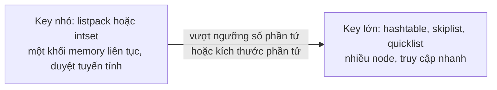
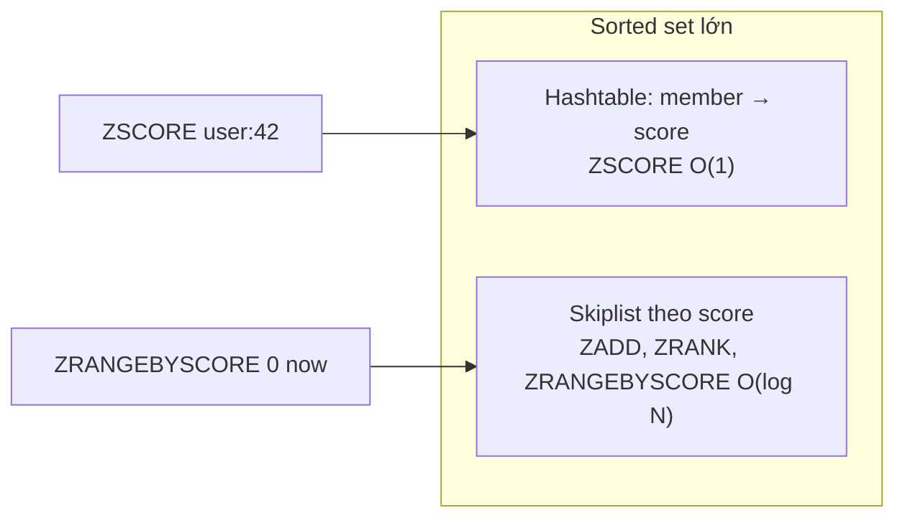

# Cấu trúc dữ liệu của Redis

## 1. Tổng quan

Redis không phải key-value store đơn thuần lưu chuỗi byte. Mỗi key trỏ tới một **cấu trúc dữ liệu** có tập command riêng, độ phức tạp riêng, và **encoding** bên trong thay đổi theo kích thước để tiết kiệm memory.

Chọn đúng cấu trúc biến bài toán khó thành một command nguyên tử: rate limit bằng sorted set, hàng đợi trễ bằng sorted set theo timestamp, đếm unique visitor bằng HyperLogLog, leaderboard bằng sorted set, trạng thái đối tượng bằng hash.

## 2. Mental Model

> Mỗi kiểu dữ liệu là một cấu trúc quen thuộc từ khoa học máy tính (mảng động, danh sách liên kết, bảng băm, skip list, radix tree) được Redis cài đặt hai lần: một bản **gọn** cho dữ liệu nhỏ (lưu liền mạch, duyệt tuyến tính) và một bản **nhanh** cho dữ liệu lớn (con trỏ, truy cập O(1) hoặc O(log N)). Redis tự chuyển từ bản gọn sang bản nhanh khi dữ liệu vượt ngưỡng.



Diễn giải: dữ liệu nhỏ lưu dạng mảng nén (listpack) — ít overhead, thân thiện cache CPU; duyệt tuyến tính trên vài chục phần tử vẫn rất nhanh. Khi số phần tử hoặc kích thước phần tử vượt ngưỡng cấu hình, Redis chuyển sang cấu trúc dùng con trỏ. Chuyển đổi chỉ theo một chiều (không tự chuyển ngược khi dữ liệu nhỏ lại).

> **Ghi chú version:** Từ Redis 7.0, `listpack` thay thế `ziplist` cho hash, list, sorted set nhỏ. Tên tham số cấu hình tương ứng đổi từ `*-ziplist-*` sang `*-listpack-*` (tên cũ vẫn được chấp nhận làm alias).

## 3. Vì sao cần hiểu encoding?

- Ước lượng memory: 1 triệu hash nhỏ dạng listpack tốn ít hơn nhiều so với 1 triệu hash dạng hashtable.
- Hiểu vì sao thêm một field dài vào hash làm memory của key đó tăng vọt.
- Biết command nào O(1), O(log N), O(N) — tránh chặn main thread. Xem [Redis Internals](redis-internals.md#5-tính-nguyên-tử-và-command-chậm).

## 4. String

- Chuỗi byte an toàn nhị phân tới 512 MB; cài đặt bằng SDS (Simple Dynamic String) có lưu độ dài.
- Encoding: `int` (giá trị là số nguyên 64-bit), `embstr` (chuỗi ngắn, cấp phát liền với object header), `raw`.
- Command chính: `GET`, `SET` (với `EX`/`PX`/`NX`/`XX`/`GET`), `MGET`, `INCR`/`INCRBY` (counter nguyên tử), `APPEND`, `GETRANGE`.
- **Bitmap**: `SETBIT`/`GETBIT`/`BITCOUNT` trên string — một bit mỗi ID (đánh dấu user đã hoạt động trong ngày: 100 triệu user ≈ 12 MB).

Dùng cho: cache giá trị đã serialize, counter, lock (`SET NX PX`), cờ trạng thái.

## 5. Hash

- Map field → value trong một key.
- Encoding: `listpack` khi số field ≤ `hash-max-listpack-entries` (mặc định 128) và mỗi value ≤ `hash-max-listpack-value` (64 byte); vượt thì `hashtable`.
- Command: `HSET`, `HGET`, `HMGET`, `HINCRBY`, `HDEL`, `HGETALL` (O(N)), `HSCAN`.
- > **Ghi chú version:** Redis 7.4 thêm TTL cho từng field (`HEXPIRE`, `HPEXPIRE`...).

Dùng cho: object có nhiều thuộc tính cập nhật riêng lẻ (trạng thái job, profile), gom nhiều key nhỏ để tiết kiệm overhead.

## 6. List

- Danh sách có thứ tự, thêm/lấy ở hai đầu O(1).
- Encoding: `quicklist` — danh sách liên kết hai chiều mà mỗi node là một listpack (cân bằng giữa memory và tốc độ); list rất nhỏ là một listpack đơn.
- Command: `LPUSH`/`RPUSH`, `LPOP`/`RPOP`, `BLPOP`/`BRPOP` (chờ có phần tử), `LMOVE`/`BLMOVE` (chuyển nguyên tử sang list khác), `LRANGE`, `LTRIM`. Truy cập giữa list (`LINDEX`, `LINSERT`) là O(N).

Dùng cho: hàng đợi đơn giản (producer `LPUSH`, consumer `BRPOP`), danh sách N mục gần nhất (`LPUSH` + `LTRIM`). Celery dùng list làm queue khi broker là Redis. Lưu ý: `BRPOP` lấy phần tử ra khỏi list — nếu consumer chết sau khi lấy, message mất; pattern "reliable queue" dùng `BLMOVE` sang list "processing". [Streams](streams.md) giải quyết vấn đề này tốt hơn.

## 7. Set

- Tập hợp không thứ tự, phần tử duy nhất.
- Encoding: `intset` (mảng số nguyên đã sắp xếp) khi mọi phần tử là số nguyên và số lượng ≤ `set-max-intset-entries`; `listpack` cho tập nhỏ (7.2+); `hashtable` khi lớn.
- Command: `SADD`, `SREM`, `SISMEMBER` (O(1)), `SMEMBERS` (O(N)), `SINTER`/`SUNION`/`SDIFF`, `SCARD`, `SRANDMEMBER`.

Dùng cho: tập tag, tập user đã xử lý (dedup), quan hệ, kiểm tra membership.

## 8. Sorted Set

- Tập phần tử duy nhất, mỗi phần tử có **score** (số thực), được sắp theo score.
- Encoding: `listpack` khi nhỏ (`zset-max-listpack-entries` 128); khi lớn dùng **skiplist + hashtable**.



Diễn giải: hai cấu trúc cùng trỏ tới một tập phần tử. Hashtable trả lời "score của phần tử X là gì" trong O(1). Skiplist — danh sách liên kết nhiều tầng, cho phép tìm kiếm như cây cân bằng với O(log N) — trả lời "các phần tử có score trong khoảng này" và "phần tử X đứng thứ mấy".

Command: `ZADD`, `ZINCRBY`, `ZSCORE`, `ZRANK`, `ZRANGE ... BYSCORE`/`BYLEX`/`REV`, `ZREMRANGEBYSCORE`, `ZPOPMIN`/`BZPOPMIN`, `ZCARD`, `ZCOUNT`.

Dùng cho:

- **Leaderboard**: score = điểm.
- **Sliding window rate limit**: score = timestamp mỗi request; xóa phần tử cũ hơn cửa sổ, đếm phần còn lại. Xem [Rate Limiting với Redis](rate-limiting.md).
- **Delayed queue / scheduler**: score = thời điểm cần chạy; worker lấy phần tử có score ≤ now.
- **Index phụ**: sắp xếp ID theo thời gian cập nhật.

## 9. Stream

Log append-only với ID tăng dần theo thời gian, hỗ trợ **consumer group** (nhiều consumer chia nhau message, có acknowledgment và danh sách pending). Encoding: radix tree mà mỗi node chứa listpack các entry. Chi tiết ở [Streams](streams.md).

## 10. Cấu trúc chuyên dụng

| Cấu trúc | Làm gì | Đánh đổi |
|---|---|---|
| **HyperLogLog** (`PFADD`, `PFCOUNT`) | Đếm số phần tử khác nhau | Tối đa ~12 KB mỗi key, sai số chuẩn ~0.81%; không liệt kê được phần tử |
| **Geo** (`GEOADD`, `GEOSEARCH`) | Tìm điểm trong bán kính | Cài đặt trên sorted set với geohash |
| **Bitfield** | Nhiều counter nhỏ trong một string | Phải quản lý offset |
| **JSON, Search, Bloom filter, Time series** | Module (Redis Stack; tích hợp sẵn trong Redis 8) | Phụ thuộc bản phân phối và dịch vụ managed hỗ trợ |

## 11. Bảng chọn cấu trúc

| Nhu cầu | Cấu trúc | Command chính |
|---|---|---|
| Cache một object đã serialize | String | `SET key val EX 300`, `GET` |
| Object cập nhật từng field | Hash | `HSET`, `HINCRBY`, `HMGET` |
| Counter toàn cục | String | `INCR` |
| Hàng đợi FIFO đơn giản | List | `LPUSH` / `BRPOP` |
| Hàng đợi tin cậy, nhiều consumer | Stream | `XADD` / `XREADGROUP` / `XACK` |
| Dedup, membership | Set | `SADD` (trả về 0 nếu đã có) |
| Xếp hạng, theo thời gian | Sorted set | `ZADD`, `ZRANGE ... BYSCORE` |
| Đếm unique gần đúng | HyperLogLog | `PFADD`, `PFCOUNT` |
| Cờ theo ID số nguyên dày đặc | Bitmap | `SETBIT`, `BITCOUNT` |

## 12. Hành vi trong production

- **Key lớn**: sorted set 10 triệu phần tử, hash 5 triệu field. Command O(N) chặn; xóa chặn (nếu không `UNLINK`); trong cluster không thể chia nhỏ một key qua nhiều node → node chứa nó quá tải. Chia key theo bucket (`leaderboard:{shard}` hoặc theo thời gian).
- **Memory tăng đột ngột** khi một key vượt ngưỡng encoding (listpack → hashtable). Hash với vài field có value dài > 64 byte đã là hashtable.
- **Tràn số và kiểu**: `INCR` trên key chứa chuỗi không phải số → lỗi. `INCRBYFLOAT` có sai số dấu phẩy động — không dùng cho tiền.
- **Serialize**: lưu object Python bằng pickle vào Redis gắn chặt với code và có rủi ro bảo mật khi dữ liệu không đáng tin; ưu tiên JSON/msgpack với schema rõ ràng.

## 13. Failure Modes

| Failure | Nguyên nhân | Dấu hiệu |
|---|---|---|
| Main thread bị chặn | `HGETALL`/`SMEMBERS`/`ZRANGE 0 -1` trên key lớn | SLOWLOG, latency spike toàn server |
| Memory cao hơn dự kiến | Encoding chuyển sang dạng lớn, overhead nhiều key nhỏ | `MEMORY USAGE`, `OBJECT ENCODING` |
| Hot key | Một key nhận phần lớn traffic | Một node cluster CPU 100% |
| Mất message | List + `BRPOP`, consumer chết | Job biến mất không có lỗi |

## 14. Trade-offs

| Lựa chọn | Lợi ích | Chi phí |
|---|---|---|
| Nhiều key string nhỏ | Đơn giản, TTL từng key | Overhead mỗi key lớn |
| Gom vào hash | Gọn memory (listpack) | TTL theo key (hoặc theo field từ 7.4) |
| Sorted set cho rate limit | Chính xác theo cửa sổ trượt | Memory tỷ lệ số request trong cửa sổ |
| HyperLogLog | Memory cố định | Chỉ gần đúng |

## 15. Sai lầm thường gặp

- Lưu mọi thứ thành string JSON rồi đọc/ghi cả object để sửa một field.
- Dùng list làm queue quan trọng mà không có cơ chế chống mất.
- Để collection tăng không giới hạn (không trim, không TTL).
- Dùng `KEYS` hoặc `SMEMBERS` để liệt kê dữ liệu lớn.

## 16. Cách debug

```bash
redis-cli TYPE mykey
redis-cli OBJECT ENCODING mykey     # listpack, hashtable, skiplist, intset, quicklist, embstr, int, raw
redis-cli MEMORY USAGE mykey
redis-cli --bigkeys                 # key lớn nhất theo từng kiểu
redis-cli CONFIG GET '*-listpack-*'
```

## 17. Best Practices

- Chọn cấu trúc theo thao tác cần làm, để Redis làm việc nguyên tử thay vì đọc-sửa-ghi phía client.
- Giữ key nhỏ và có giới hạn; chia key lớn theo bucket.
- Dùng hash để gom dữ liệu nhỏ liên quan; theo dõi ngưỡng encoding.
- Dùng Stream thay List cho hàng đợi cần độ tin cậy.
- Serialize bằng định dạng có schema (JSON, msgpack), có version.

## 18. Tóm tắt

- Redis cung cấp string, hash, list, set, sorted set, stream và các cấu trúc chuyên dụng, mỗi loại có command nguyên tử riêng.
- Dữ liệu nhỏ dùng encoding gọn (listpack, intset); vượt ngưỡng chuyển sang cấu trúc nhanh (hashtable, skiplist, quicklist).
- Sorted set dùng skiplist + hashtable, là nền cho leaderboard, rate limit cửa sổ trượt, delayed queue.
- Key lớn làm chậm mọi client và không chia được trong cluster.

## Liên quan

- [Redis Internals](redis-internals.md)
- [Streams](streams.md)
- [Rate Limiting với Redis](rate-limiting.md)
- [Cache Problems](cache-problems.md)
- [Hashmap trong Python](../19-data-structures-algorithms/hashmap.md)
