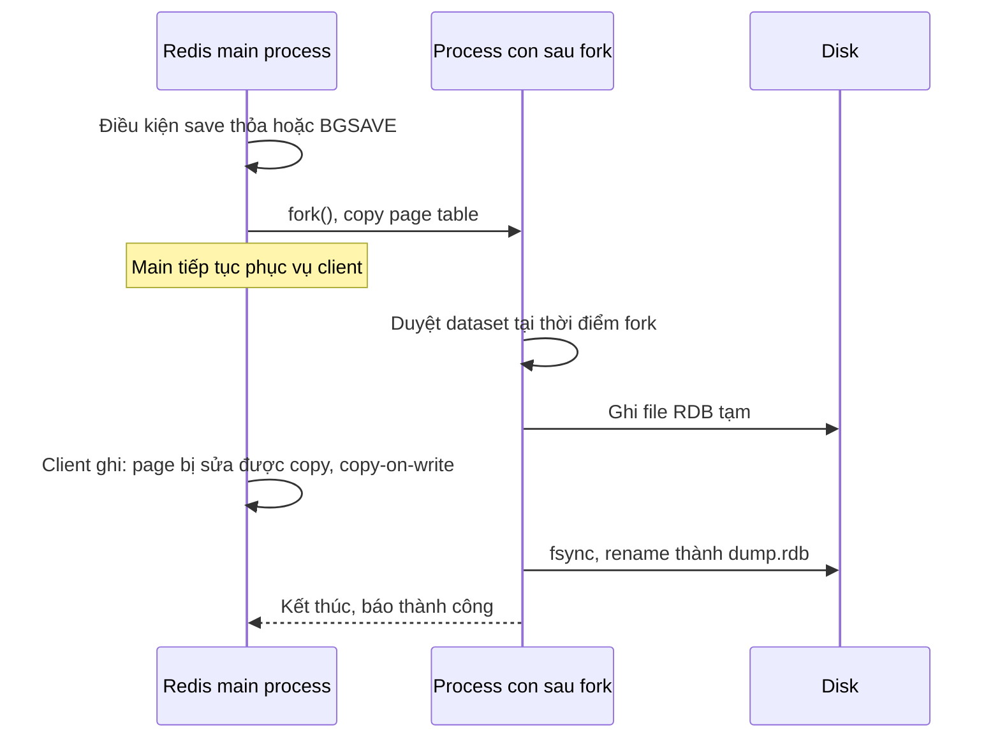

# Redis Persistence: RDB và AOF

## 1. Tổng quan

Redis giữ dữ liệu trong RAM. Persistence là cách Redis ghi dữ liệu xuống disk để **khôi phục sau khi restart**. Có hai cơ chế, dùng riêng hoặc kết hợp:

| Cơ chế | Ghi gì | Khi nào |
|---|---|---|
| **RDB** (snapshot) | Toàn bộ dataset tại một thời điểm, dạng nhị phân nén | Định kỳ theo điều kiện, hoặc khi gọi `BGSAVE` |
| **AOF** (Append Only File) | Nhật ký mọi command ghi | Liên tục; `fsync` theo chính sách |

Câu hỏi quan trọng không phải "bật persistence hay không", mà là: **Redis đang giữ vai trò gì, và mất bao nhiêu dữ liệu thì chấp nhận được?** Cache thuần có thể không cần persistence. Broker Celery, session, rate limit counter, queue cần mức độ bền khác nhau.

## 2. Mental Model

> RDB là chụp ảnh căn phòng định kỳ: khôi phục nhanh, nhưng mất mọi thay đổi sau lần chụp cuối. AOF là camera ghi lại mọi hành động: khôi phục bằng cách phát lại, mất ít hơn, nhưng file lớn hơn và phát lại lâu hơn.

## 3. Vì sao cần hiểu persistence?

- Restart Redis không persistence → cache lạnh hoàn toàn → [cache avalanche](cache-problems.md#4-cache-avalanche).
- Broker không persistence → mất task đang chờ khi Redis restart.
- Persistence dùng `fork()` → memory có thể tăng gần gấp đôi và latency spike — nguồn gốc của nhiều sự cố "Redis bị OOM kill lúc nửa đêm".

## 4. RDB: snapshot bằng fork



Diễn giải:

1. Main process gọi `fork()`. Process con có góc nhìn **đóng băng** của memory tại thời điểm fork.
2. Main process tiếp tục phục vụ client ngay.
3. Process con duyệt dataset và ghi file RDB — không ảnh hưởng tới main thread.
4. Khi client ghi dữ liệu, OS copy page bị sửa (copy-on-write) để process con vẫn thấy dữ liệu cũ. Workload ghi nhiều → nhiều page bị copy → memory tăng.
5. File mới được ghi xong và rename thay file cũ một cách nguyên tử.

Cấu hình điển hình: `save 3600 1 300 100 60 10000` — snapshot nếu có ít nhất 1 thay đổi trong 3600 giây, hoặc 100 thay đổi trong 300 giây, hoặc 10.000 thay đổi trong 60 giây.

| Ưu điểm | Nhược điểm |
|---|---|
| File gọn, khôi phục rất nhanh | Mất dữ liệu từ lần snapshot cuối (có thể vài phút) |
| Tốt cho backup, chuyển dữ liệu | Fork với dataset lớn gây latency spike |
| Không ảnh hưởng tới đường ghi thường | Copy-on-write có thể gần gấp đôi memory |

## 5. AOF: nhật ký command

Mỗi command ghi được thêm vào AOF buffer, rồi ghi xuống file. Khi khởi động, Redis **phát lại** AOF để dựng lại dataset.

### Chính sách fsync

| `appendfsync` | Khi nào `fsync` | Mất tối đa khi crash máy |
|---|---|---|
| `always` | Sau mỗi lần ghi | Gần như không mất; throughput ghi giảm mạnh |
| `everysec` (mặc định) | Mỗi giây (thread nền) | Khoảng 1 giây dữ liệu |
| `no` | Để OS quyết định | Có thể vài chục giây |

Với `everysec`, nếu `fsync` của giây trước chưa xong (disk chậm), Redis có thể trì hoãn ghi của main thread tối đa khoảng 2 giây để không vượt cam kết — xuất hiện dưới dạng latency spike khi disk chậm.

### AOF rewrite

AOF tăng mãi (1 triệu `INCR` trên một key = 1 triệu dòng). **Rewrite** tạo AOF mới gọn nhất tương đương dataset hiện tại, cũng bằng **fork** như RDB.

> **Ghi chú version:** Từ Redis 7.0, AOF là **multi-part**: một file base (có thể ở định dạng RDB) cộng các file incremental, quản lý qua manifest. Rewrite không còn cần giữ buffer lớn trong memory như trước. Thiết lập `aof-use-rdb-preamble` (mặc định bật) cho phép phần base ở dạng RDB — khôi phục nhanh như RDB, độ bền như AOF.

## 6. Kết hợp RDB và AOF

| Cấu hình | Phù hợp |
|---|---|
| Không persistence | Cache thuần có thể dựng lại hoàn toàn, chấp nhận cache lạnh sau restart |
| Chỉ RDB | Cache muốn khởi động ấm; dữ liệu chấp nhận mất vài phút |
| AOF `everysec` (+ RDB preamble) | Broker, session, queue: mất tối đa khoảng 1 giây |
| AOF `always` | Hiếm khi dùng; nếu cần độ bền mức này, cân nhắc database thật |

Replication **không thay thế** persistence: nếu master restart không persistence và nhanh chóng khởi động lại rỗng, replica sẽ đồng bộ theo master và **xóa sạch dữ liệu của chính nó**. Tắt persistence trên master chỉ an toàn khi master không tự khởi động lại (hoặc có cấu hình phù hợp với Sentinel).

## 7. Bên trong hệ thống xảy ra gì khi fork trên instance lớn?

| Thành phần chi phí | Tỷ lệ với | Hệ quả |
|---|---|---|
| Lời gọi `fork()` | Kích thước memory (copy page table) | Main thread dừng: vài chục ms cho vài GB, lâu hơn với hàng chục GB |
| Copy-on-write | Tỷ lệ page bị ghi trong lúc con chạy | Memory tăng; ghi nhiều → gần gấp đôi |
| I/O ghi file | Kích thước dataset | Cạnh tranh I/O với AOF fsync |

Transparent Huge Pages (THP) làm mỗi lần copy-on-write copy 2 MB thay vì 4 KB → memory tăng và latency tệ hơn nhiều; Redis khuyến cáo tắt THP.

## 8. Hành vi trong production

- **OOM khi lưu snapshot**: instance 12 GB dữ liệu trên máy 16 GB, workload ghi nhiều → fork + copy-on-write vượt RAM → OOM killer giết Redis. Đặt `maxmemory` chừa khoảng trống (thường 25–50% tùy mức ghi) cho fork.
- **Latency spike định kỳ**: trùng với lịch RDB hoặc AOF rewrite; `latest_fork_usec` trong `INFO` cho biết thời gian fork.
- **Disk chậm** (disk mạng, burst credit cạn trên cloud) làm AOF fsync chậm → Redis trì hoãn ghi.
- **Khởi động chậm**: phát lại AOF lớn có thể mất nhiều phút; RDB preamble giảm đáng kể.
- **`rdb_last_bgsave_status:err`**: snapshot thất bại (disk đầy, quyền); với `stop-writes-on-bgsave-error yes` (mặc định), Redis **từ chối ghi** sau khi snapshot lỗi — một cơ chế an toàn thường gây ngạc nhiên.

## 9. Failure Modes

| Failure | Nguyên nhân | Dấu hiệu |
|---|---|---|
| OOM kill | Copy-on-write khi fork vượt RAM | Redis restart, log kernel OOM |
| Latency spike định kỳ | Fork của RDB/AOF rewrite | Spike trùng lịch save |
| Từ chối ghi | Snapshot lỗi + `stop-writes-on-bgsave-error` | Lỗi `MISCONF` |
| Mất dữ liệu sau restart | Không persistence hoặc RDB thưa | Queue/session trống |
| Replica bị xóa sạch | Master restart rỗng không persistence | Dữ liệu biến mất khỏi cả replica |
| Khởi động lâu | AOF lớn không có RDB preamble | Service phụ thuộc Redis chờ lâu |

## 10. Trade-offs

| Lựa chọn | Độ bền | Hiệu năng | Khôi phục |
|---|---|---|---|
| Không persistence | Không | Tốt nhất | Rỗng |
| RDB | Mất tới lần snapshot cuối | Tốt; spike khi fork | Nhanh |
| AOF everysec | Mất khoảng 1 giây | Tốt; phụ thuộc disk | Chậm hơn (nhanh hơn với preamble) |
| AOF always | Gần như không mất | Kém | Chậm hơn |

## 11. Sai lầm thường gặp

- Coi Redis có AOF là database bền vững như PostgreSQL cho dữ liệu nghiệp vụ quan trọng.
- Đặt `maxmemory` gần bằng RAM khi bật persistence.
- Tắt persistence trên master có Sentinel tự restart.
- Bỏ qua cảnh báo `MISCONF` và tắt `stop-writes-on-bgsave-error` mà không sửa nguyên nhân.
- Không tắt THP.

## 12. Cách debug

```bash
redis-cli INFO persistence
# rdb_last_bgsave_status, rdb_last_save_time, aof_enabled, aof_last_write_status,
# aof_rewrite_in_progress, aof_last_bgrewrite_status, latest_fork_usec
redis-cli INFO memory | grep -E 'used_memory_human|used_memory_rss_human'
redis-cli CONFIG GET save
redis-cli CONFIG GET appendfsync
cat /sys/kernel/mm/transparent_hugepage/enabled
```

## 13. Best Practices

- Chọn persistence theo vai trò và mức mất dữ liệu chấp nhận được; tách instance nếu vai trò khác nhau.
- AOF `everysec` với RDB preamble cho broker/session/queue.
- Chừa memory cho fork; tắt THP; không để Redis swap.
- Giám sát trạng thái save/rewrite, thời gian fork, trạng thái ghi AOF.
- Backup RDB ra nơi khác; persistence không phải backup.
- Dữ liệu nghiệp vụ cần độ bền cao lưu ở database thật; Redis giữ bản dẫn xuất hoặc tạm thời.

## 14. Tóm tắt

- RDB chụp snapshot bằng fork + copy-on-write: gọn, khôi phục nhanh, mất dữ liệu từ snapshot cuối.
- AOF ghi nhật ký command; `everysec` mất tối đa khoảng 1 giây; rewrite định kỳ cũng dùng fork.
- Fork gây dừng ngắn tỷ lệ với memory và có thể gần gấp đôi memory khi ghi nhiều.
- Replication không thay thế persistence; master restart rỗng có thể xóa sạch replica.
- Persistence phải khớp vai trò của Redis; dữ liệu nghiệp vụ quan trọng thuộc về database.

## Liên quan

- [Redis Internals](redis-internals.md)
- [Sentinel và Cluster](sentinel-cluster.md)
- [TTL, Expiration và Eviction](ttl.md)
- [Failure Scenarios của Redis](failure-scenarios.md)
