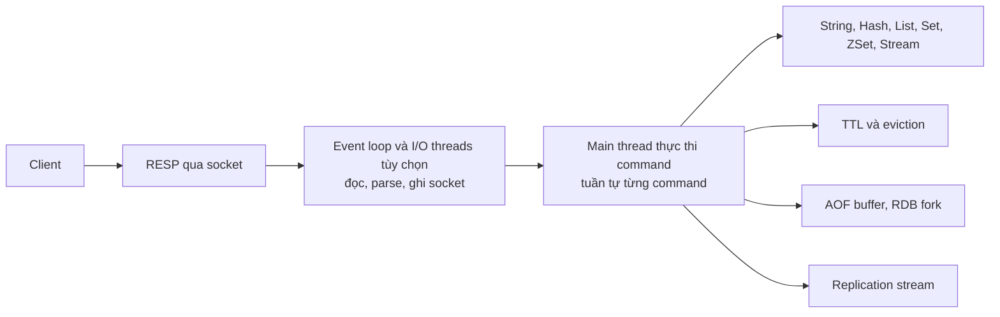
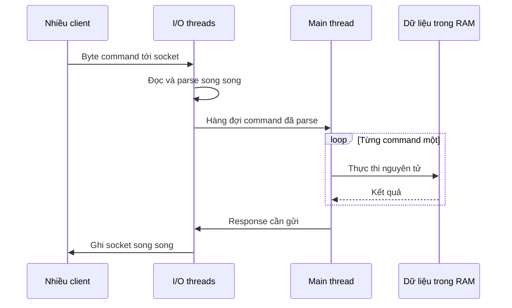

# Redis Internals

## 1. Tổng quan

Redis là một **data structure server** chạy trong memory: nó giữ dữ liệu trong RAM dưới dạng các cấu trúc dữ liệu (string, hash, list, set, sorted set, stream...) và cho phép client thao tác trên chúng qua mạng bằng các command nguyên tử.

Trong backend Python, Redis đảm nhận nhiều vai trò: cache, rate limiter, distributed lock, session store, message broker cho Celery, hàng đợi, leaderboard, pub/sub. Mỗi vai trò có yêu cầu khác nhau về độ bền và tính đúng đắn — và hiểu cách Redis chạy bên trong quyết định vai trò nào an toàn.

> **Ghi chú version:** Nội dung áp dụng cho Redis 7.x–8.x và Valkey (fork mã nguồn mở của Redis 7.2, tương thích giao thức). Redis đổi license từ 7.4 (RSALv2/SSPLv1) và thêm lựa chọn AGPLv3 từ Redis 8; nhiều dịch vụ managed (ví dụ ElastiCache) hỗ trợ Valkey. Chi tiết về I/O threading khác nhau giữa các version và giữa Redis với Valkey.

## 2. Mental Model

> Redis là **một người thủ kho duy nhất** làm việc cực nhanh trong một căn kho nằm hoàn toàn trong RAM. Mọi yêu cầu xếp hàng và được xử lý **lần lượt từng cái một**. Vì không bao giờ có hai người cùng sửa một thứ, mỗi command tự động nguyên tử. Nhưng nếu một yêu cầu tốn nhiều thời gian (đếm lại cả kho), mọi người phía sau phải chờ.



Diễn giải:

1. Client gửi command theo giao thức RESP qua TCP.
2. Event loop (và I/O threads nếu bật) đọc byte từ socket, parse thành command, và ghi response trả về.
3. **Một main thread** thực thi command — lần lượt, không song song. Đây là lý do mỗi command nguyên tử mà không cần lock.
4. Command thao tác trên cấu trúc dữ liệu trong memory, kiểm tra/cập nhật TTL.
5. Thay đổi được ghi vào AOF buffer (nếu bật) và gửi vào replication stream cho replica.

## 3. Vì sao Redis nhanh?

- **Dữ liệu trong RAM**: truy cập memory tính bằng nanosecond, disk tính bằng micro tới millisecond.
- **Không lock**: một thread thực thi command nên không có tranh chấp lock, không có context switch giữa worker thread.
- **Cấu trúc dữ liệu chuyên dụng**: mỗi kiểu có encoding tối ưu cho kích thước nhỏ và lớn. Xem [Data Structures](data-structures.md).
- **Event-driven I/O**: một thread xử lý hàng chục nghìn kết nối qua epoll/kqueue, giống [event loop của Python](../02-python-concurrency/event-loop.md).
- **Giao thức đơn giản** và **pipelining**: gửi nhiều command không chờ response từng cái.

Một instance Redis thường xử lý hàng trăm nghìn command đơn giản mỗi giây. Giới hạn thực tế thường là **mạng** (round trip) và **CPU của một core**, không phải memory.

## 4. Cơ chế hoạt động: event loop

Redis dùng event loop riêng (thư viện `ae`) với hai loại sự kiện:

- **File events**: socket sẵn sàng đọc/ghi (qua epoll trên Linux, kqueue trên macOS).
- **Time events**: tác vụ định kỳ `serverCron` (mặc định 10 lần/giây theo `hz`): xóa key hết hạn chủ động, rehash bảng băm dần dần, cập nhật thống kê, đóng client timeout, kiểm tra điều kiện lưu RDB.

Trước mỗi lần chờ sự kiện (`beforeSleep`): ghi AOF buffer, gửi response còn tồn cho client, xử lý key hết hạn nhanh.

### I/O threads

Từ Redis 6, có thể bật `io-threads` để đa luồng hóa phần **đọc/ghi socket và parse giao thức**. Việc **thực thi command vẫn trên main thread**. I/O threads giúp khi bottleneck là xử lý mạng (nhiều client, payload lớn), không giúp khi bottleneck là command chậm.



Diễn giải: song song hóa chỉ xảy ra ở hai đầu (mạng). Phần giữa — nơi dữ liệu thực sự được đọc và sửa — luôn tuần tự. Mô hình an toàn đồng thời của Redis vì vậy không đổi khi bật I/O threads.

### Background threads

Một số việc nặng chạy ở thread nền: giải phóng memory của key lớn khi dùng `UNLINK` hoặc `lazyfree-*`, `fsync` file AOF, đóng file. Và việc tạo snapshot RDB/rewrite AOF dùng **process con** (fork).

## 5. Tính nguyên tử và command chậm

Vì thực thi tuần tự:

- Mỗi command đơn lẻ nguyên tử: `INCR`, `SET key val NX PX 30000`, `LPUSH`, `ZADD`.
- **Lua script** (`EVAL`) và **function** (Redis 7+) chạy nguyên tử: không command nào khác chen giữa. Dùng cho logic nhiều bước (rate limit, release lock an toàn).
- `MULTI`/`EXEC`: gom command, thực thi liền mạch; không có rollback nếu một command lỗi. `WATCH` cho optimistic check-and-set.

Mặt trái: **command chậm chặn tất cả**. Một command O(N) trên dữ liệu lớn giữ main thread, mọi client khác chờ:

| Command nguy hiểm | Vì sao | Thay thế |
|---|---|---|
| `KEYS pattern` | Duyệt toàn bộ keyspace | `SCAN` (theo từng đợt) |
| `HGETALL`, `SMEMBERS`, `LRANGE 0 -1` trên key lớn | O(N) phần tử | `HSCAN`, `SSCAN`, phân trang, thiết kế key nhỏ hơn |
| `DEL` key rất lớn | Giải phóng hàng triệu phần tử đồng bộ | `UNLINK` (giải phóng ở background) |
| `FLUSHALL` / `FLUSHDB` | Xóa mọi thứ đồng bộ | `FLUSHALL ASYNC` |
| Lua script chạy lâu | Script nguyên tử = chặn mọi thứ | Giữ script ngắn, có giới hạn |
| `SORT`, `ZUNIONSTORE` trên tập lớn | Nhiều phép tính | Tính trước, tách nhỏ |

## 6. Memory model

- **Allocator**: jemalloc (mặc định trên Linux).
- **Keyspace** là bảng băm; khi cần mở rộng, Redis **rehash dần dần** (mỗi thao tác và mỗi chu kỳ cron di chuyển một ít bucket) thay vì dừng lại rehash toàn bộ.
- **Overhead mỗi key** khá lớn (entry trong dict, object header, SDS header, con trỏ expire nếu có TTL) — hàng chục byte. 100 triệu key nhỏ có thể tốn nhiều GB chỉ cho overhead. Gom dữ liệu nhỏ vào hash (encoding listpack gọn) thay vì nhiều key string riêng có thể tiết kiệm đáng kể.
- **`maxmemory`**: giới hạn memory dữ liệu; vượt thì áp dụng **eviction policy** hoặc từ chối ghi. Xem [TTL, Expiration và Eviction](ttl.md).
- **Fragmentation**: `mem_fragmentation_ratio` = RSS / memory dữ liệu. Tỷ lệ cao (> 1.5) nghĩa là allocator giữ nhiều memory không dùng; `activedefrag` có thể thu gọn trực tuyến.

### Fork và copy-on-write

Tạo snapshot RDB hoặc rewrite AOF dùng `fork()`: process con có bản sao "ảo" của toàn bộ memory, chia sẻ page với process cha theo copy-on-write. Trong lúc con ghi snapshot, mọi page cha sửa bị copy. Với workload ghi nhiều, memory có thể tăng gần gấp đôi trong lúc fork. Bản thân lời gọi `fork` cũng tốn thời gian tỷ lệ với kích thước memory (copy page table) — gây latency spike vài chục tới vài trăm ms với instance lớn. Xem [Persistence](persistence.md).

Không bao giờ để Redis bị **swap**: truy cập page đã bị swap ra disk làm một command mất hàng ms, và vì thực thi tuần tự, mọi command khác cùng chờ. Tắt Transparent Huge Pages để tránh latency khi copy-on-write.

## 7. Phía client: redis-py

```python
import redis.asyncio as redis

pool = redis.ConnectionPool.from_url(
    "redis://cache:6379/0",
    max_connections=50,
    socket_timeout=0.2,            # timeout đọc/ghi
    socket_connect_timeout=0.5,
    health_check_interval=30,
)
client = redis.Redis(connection_pool=pool)

async def get_many(keys: list[str]) -> list[bytes | None]:
    async with client.pipeline(transaction=False) as pipe:
        for k in keys:
            pipe.get(k)
        return await pipe.execute()          # một round trip cho mọi GET
```

- Mỗi command là một round trip; với 1 ms round trip, 100 `GET` tuần tự tốn 100 ms. **Pipeline** hoặc `MGET` gom lại thành một round trip.
- Timeout ngắn: Redis thường trả lời dưới 1 ms; chờ 5 giây cho cache nghĩa là cache đang làm hại. Xem [Timeout](../10-distributed-systems/timeout.md).
- Pool được tạo một lần (trong lifespan), dùng chung; không tạo client mỗi request.

## 8. Hành vi trong production

- **Latency spike định kỳ**: fork cho RDB/AOF rewrite, key lớn hết hạn cùng lúc, `KEYS` trong code quản trị.
- **CPU một core 100%**: Redis đã chạm giới hạn thực thi; thêm I/O threads không giúp nếu bottleneck là command; cần sharding ([Cluster](sentinel-cluster.md)) hoặc giảm công việc mỗi command.
- **Key lớn** (big key): hash hàng triệu field, list hàng triệu phần tử — làm command chậm, di chuyển slot chậm trong cluster, xóa gây block. Xem [Cache Problems](cache-problems.md).
- **Kết nối**: mỗi client kết nối tốn memory (buffer); hàng chục nghìn kết nối từ nhiều pod cần giới hạn `maxclients` và pool phía client hợp lý. Output buffer của client đọc chậm (pub/sub) có thể phình to — `client-output-buffer-limit`.

## 9. Failure Modes

| Failure | Nguyên nhân | Dấu hiệu |
|---|---|---|
| Mọi request chậm đột ngột | Command O(N) trên key lớn, `KEYS` | `SLOWLOG` có command chậm; latency spike trùng thời điểm |
| Latency spike định kỳ | Fork khi lưu RDB/AOF rewrite | `latest_fork_usec` cao trong `INFO` |
| OOM hoặc bị kill | Memory dữ liệu + copy-on-write khi fork vượt RAM | Process bị OOM killer; ghi lỗi |
| Từ chối ghi | Đạt `maxmemory` với `noeviction` | Lỗi `OOM command not allowed` |
| Kết nối cạn | Client không dùng pool, không giới hạn | Lỗi `max number of clients reached` |
| Swap | Memory vượt RAM vật lý | Latency hàng ms cho command đơn giản |

## 10. Trade-offs

| Đặc điểm | Lợi ích | Chi phí |
|---|---|---|
| Thực thi đơn luồng | Nguyên tử, không lock, dễ lý luận | Giới hạn một core; command chậm chặn tất cả |
| Dữ liệu trong RAM | Latency rất thấp | Chi phí RAM; dữ liệu có thể mất tùy cấu hình persistence |
| Fork cho persistence | Snapshot nhất quán không dừng server | Memory tăng, latency spike |
| Lua/function nguyên tử | Logic nhiều bước an toàn | Script dài chặn server |

## 11. Sai lầm thường gặp

- Dùng `KEYS` trong code ứng dụng.
- Lưu collection khổng lồ trong một key.
- Không đặt timeout cho client Redis.
- Tạo kết nối mới mỗi request.
- Chạy Redis gần giới hạn RAM mà quên memory cho fork.
- Coi Redis là database bền vững mặc định.

## 12. Cách debug trong production

```bash
redis-cli INFO stats          # instantaneous_ops_per_sec, keyspace_hits/misses, evicted_keys, expired_keys
redis-cli INFO memory         # used_memory, used_memory_rss, mem_fragmentation_ratio, maxmemory
redis-cli INFO persistence    # rdb_last_bgsave_status, aof_rewrite_in_progress, latest_fork_usec
redis-cli SLOWLOG GET 20      # command chậm nhất gần đây
redis-cli LATENCY DOCTOR      # phân tích nguồn latency (cần bật latency-monitor-threshold)
redis-cli --bigkeys           # quét tìm key lớn (dùng SCAN, vẫn tạo tải)
redis-cli MEMORY USAGE mykey  # memory của một key
redis-cli CLIENT LIST         # kết nối, buffer, command cuối
redis-cli --latency           # đo round trip từ phía client
```

Không chạy `MONITOR` lâu trên production — nó in mọi command và làm giảm throughput đáng kể.

## 13. Best Practices

- Coi Redis là đơn luồng: mọi command phải nhanh; tránh O(N) trên tập lớn.
- Dùng `SCAN`, `UNLINK`, `FLUSHALL ASYNC`.
- Pipeline/`MGET` để giảm round trip; timeout ngắn ở client.
- Để dư RAM cho fork; tắt swap cho Redis; tắt THP.
- Đặt `maxmemory` và eviction policy phù hợp với vai trò.
- Giám sát slowlog, latency, memory, fork time, hit ratio.

## 14. Tóm tắt

- Redis thực thi command trên một main thread; mỗi command nguyên tử, không cần lock.
- Tốc độ đến từ RAM, không lock, cấu trúc dữ liệu tối ưu, event-driven I/O và pipelining.
- I/O threads song song hóa việc đọc/ghi socket, không song song hóa thực thi command.
- Command O(N) trên key lớn chặn mọi client; fork cho persistence gây tăng memory và latency spike.
- Phía client cần pool dùng chung, pipeline và timeout ngắn.

## Liên quan

- [Data Structures](data-structures.md)
- [Persistence](persistence.md)
- [TTL, Expiration và Eviction](ttl.md)
- [Sentinel và Cluster](sentinel-cluster.md)
- [Event Loop](../02-python-concurrency/event-loop.md)
