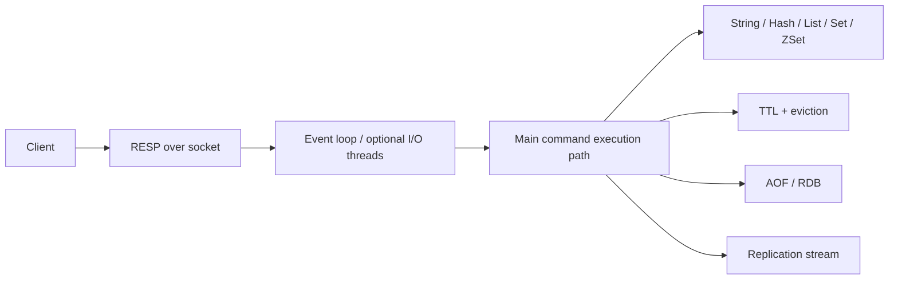

# Redis Internals

> **Phạm vi phỏng vấn:** Redis · **Ưu tiên:** P0/P1 · **Mindset:** Why → How → Trade-off → Production.

## 1. What is it?

Redis phục vụ command chủ yếu qua event loop và in-memory structures; single command atomic nhưng persistence/replication/failover có cửa sổ durability/consistency.

## 2. Why does it matter?

Senior Engineer cần hiểu **Redis Internals** để giảm latency mà không biến cache thành single point of failure. Điểm phỏng vấn nằm ở khả năng nêu invariant, điều kiện áp dụng và failure behavior, không nằm ở việc thuộc định nghĩa.

## 3. How does it work?

Command chậm/blocking ảnh hưởng client khác; encoding, key/value size và allocator quyết định memory. Background fork/rewrite, replication backlog và eviction tạo latency/failure mode.

Khi reasoning, đi theo chuỗi: **input → state transition → output → failure → recovery**. Quan sát `hit ratio, evictions, memory fragmentation, command latency và replication lag` và phân biệt symptom, bottleneck với root cause.

## 4. Example

```python
from dataclasses import dataclass

@dataclass(frozen=True)
class Decision:
    topic: str
    invariant: str
    metric: str

decision = Decision(
    topic='Redis Internals',
    invariant="Không làm mất hoặc lặp business effect",
    metric="p99 latency và error rate",
)
```

Ví dụ biến quyết định về **Redis Internals** thành invariant và tín hiệu vận hành có thể kiểm chứng.

## 5. Production Use Case

Theo dõi slowlog, command p99, used_memory_rss, fragmentation, evictions và replication lag; tránh key/value lớn/hot và O(N) command.

Checklist triển khai: capacity budget, timeout, idempotency (nếu có side effect), telemetry, canary, rollback và reconciliation.

## 6. Common Problems

- Không định nghĩa invariant và source of truth trước khi chọn công nghệ.
- Retry không backoff/jitter làm traffic amplification khi dependency lỗi.
- Không có bound cho queue, connection, memory hoặc concurrency.
- Chỉ theo dõi average; bỏ qua p95/p99, saturation và error semantics.
- Rollout toàn bộ, thiếu feature flag/canary và đường rollback dữ liệu.

## 7. Trade-offs

| Lựa chọn | Lợi ích | Chi phí / rủi ro | Khi phù hợp |
|---|---|---|---|
| Tối ưu/thiết kế xoay quanh Redis Internals | Kiểm soát rõ constraint chính | Tăng complexity và coupling | Metric chứng minh đây là bottleneck/risk |
| Giữ baseline đơn giản | Ít dependency, dễ debug | Có thể chạm giới hạn sớm | Traffic vừa, invariant vẫn được giữ |
| Managed service/library | Giảm vận hành hạ tầng | Cost, lock-in, giới hạn control | SLA và economics phù hợp |
| Tự vận hành/customize | Kiểm soát sâu | Ownership và failure surface lớn | Có năng lực vận hành và nhu cầu thật |

## 8. Interview Questions

### Basic / Mid-level (10)

- **B1.** What is Redis Internals, and which concrete problem does it address?
- **B2.** Explain the main internal mechanism behind Redis Internals.
- **B3.** Which guarantees does Redis Internals provide, and which does it not provide?
- **B4.** Which metrics or observations reveal the behavior of Redis Internals?
- **B5.** What is the most common misconception about Redis Internals?
- **B6.** How would you test assumptions involving Redis Internals?
- **B7.** Which edge cases or failure modes matter most for Redis Internals?
- **B8.** How can Redis Internals affect latency, throughput, memory, or correctness?
- **B9.** Which runtime conditions or configuration choices change the behavior of Redis Internals?
- **B10.** When is a different or simpler approach better than relying on Redis Internals?

### Production Scenarios (5)

- **S1.** A release involving Redis Internals triples p99 while averages look normal. How do you investigate and mitigate?
- **S2.** A critical dependency around Redis Internals is unavailable for ten minutes. Define degraded behavior and recovery.
- **S3.** Two concurrent operations expose a correctness gap related to Redis Internals. Which invariant and atomic boundary fix it?
- **S4.** Traffic grows from 1,000 to 20,000 RPS. Which measured limit involving Redis Internals fails first?
- **S5.** A canary changes the behavior of Redis Internals; success rate is flat but saturation rises. Promote or roll back?

## 9. Senior-level Questions

- **L1.** How does Redis Internals constrain the surrounding architecture and operational model?
- **L2.** Which subtle correctness issue appears when Redis Internals meets concurrency or partial failure?
- **L3.** What breaks first around Redis Internals at 20,000 RPS or 100× data volume?
- **L4.** Where should admission control or backpressure be placed when using Redis Internals?
- **L5.** How would you benchmark or validate Redis Internals without a misleading microbenchmark?
- **L6.** Which hidden coupling or migration cost can Redis Internals introduce?
- **L7.** How would you change a poor decision around Redis Internals with no downtime?
- **L8.** What production evidence would make you choose a different approach?
- **L9.** How do correctness, latency, cost, and complexity trade off for Redis Internals?
- **L10.** How would you turn an incident involving Redis Internals into a durable prevention mechanism?

## 10. Short Answers

**B1.** Redis phục vụ command chủ yếu qua event loop và in-memory structures; single command atomic nhưng persistence/replication/failover có cửa sổ durability/consistency. Trả lời tốt nối definition với constraint/invariant và một use case cụ thể.

**B2.** Mô tả state, lifecycle, boundary và failure path; không dừng ở public API của Redis Internals.

**B3.** Nêu lúc tạo, lúc sử dụng, lúc release/commit và điều xảy ra khi timeout hoặc cancellation.

**B4.** Đo hit ratio, evictions, memory fragmentation, command latency và replication lag; luôn tách average khỏi tail và success khỏi useful result.

**B5.** Lỗi phổ biến là dùng Redis Internals như mặc định mà không xác định ownership, limit và fallback.

**B6.** Test invariant trước, sau đó integration test failure path, concurrency và representative load.

**B7.** Xét timeout, duplicate, stale state, overload, dependency loss và recovery/reconciliation.

**B8.** Đo critical path, contention, queueing và amplification; throughput cao không bù được p99 xấu.

**B9.** Deadline, concurrency limit, retention/TTL, resource budget, telemetry và rollout policy phải explicit.

**B10.** Tránh Redis Internals khi bài toán đơn giản hơn giải được invariant với ít state và operational cost hơn.

Cấu trúc câu trả lời: **Definition → Why → How → Trade-off → Production example**. Với câu scenario: **stabilize → observe → hypothesize → verify → mitigate → prevent**.

## 11. Follow-up Questions

- **F1.** What assumption in your answer is most risky?
- **F2.** How would you prove that with metrics or an experiment?
- **F3.** What changes if the operation is not idempotent?
- **F4.** Where would you add timeout, retry, and backpressure?
- **F5.** What is your rollback and data-reconciliation plan?

## 12. Key Takeaways

- Nói được **vai trò, constraint hoặc invariant của Redis Internals**, không chỉ “dùng để làm gì”.
- Định lượng bằng hit ratio, evictions, memory fragmentation, command latency và replication lag và có baseline trước tối ưu.
- Thiết kế cho timeout, duplicate, overload, partial failure và recovery.
- Mọi tối ưu đều có chi phí về correctness, complexity, latency hoặc money.
- Production-ready nghĩa là có owner, alert, runbook, canary, rollback và reconciliation.


## 13. Mental Model

Redis nhanh nhờ RAM, data structure chuyên dụng và phần lớn command execution được serialize; vì thế một command O(N) lớn có thể giữ cả làn đường.

## 14. Internals Deep Dive


Client gửi RESP qua socket; event loop đọc request, parse command, thực thi trên data structure rồi ghi response. Redis hiện đại có thể dùng I/O thread cho network read/write tùy version/config, nhưng phần lớn command logic vẫn serialized trên main execution path. Điều này giảm lock contention nhưng O(N), big key, Lua/function dài hoặc fork pressure có thể làm tail latency của client khác tăng.

Key trỏ object có encoding tối ưu theo size/type; memory footprint gồm allocator fragmentation và replication/AOF buffers. Expiry vừa passive khi access vừa active sampling. Eviction chạy khi vượt `maxmemory` theo policy. RDB fork snapshot và AOF append/rewrite có durability/latency trade-off; replication async tạo acknowledged-write loss window khi failover.


Implementation detail có thể đổi theo version; khi trả lời interview, nêu rõ CPython/PostgreSQL/Redis/framework version nếu kết luận dựa vào behavior nội bộ thay vì public contract.

## 15. Request / Data Flow



Đọc diagram từ input tới state transition và output. Tại mỗi mũi tên, hỏi: operation có block không, có retry không, state có durable không, identity nào dùng để dedupe và metric nào chứng minh bước đó khỏe.

## 16. Failure Scenario

Redis timeout/down tạo cache miss storm hoặc mất coordination. Circuit-break nhanh, dùng stale/bounded fallback, rate-limit source of truth và warm cache dần; không retry mọi command đồng loạt.

Phân tích theo chuỗi: **trigger → saturation/incorrect state → propagation → user impact → immediate mitigation → durable prevention**. Tránh gọi retry hoặc scale là giải pháp nếu chưa chỉ ra dependency budget.

## 17. How I would debug this in production

1. Xem command p99/slowlog và client timeout.
2. Đo memory/RSS/fragmentation/eviction/expired.
3. Tìm hot/big key và O(N) command.
4. Kiểm replication lag/failover/topology refresh.
5. Circuit-break, bảo vệ source và verify warm-up.

## 18. Common Misconceptions

**Sai:** Redis ở RAM nên mọi command đều nhanh và có thể làm primary store mặc định. **Đúng:** complexity/big key/main execution path và durability model vẫn quan trọng.

## 19. When NOT to use

Không thêm cache nếu query đã nhanh, traffic thấp hoặc invalidation cost vượt lợi ích; không dùng lock Redis thay DB invariant.

## 20. What interviewer may ask next

1. **What guarantee does Redis Internals provide, and what does it explicitly not guarantee?**
2. **Which implementation detail changes across versions or runtimes?**
3. **Where is the first queue or contention point under high load?**
4. **What happens if the dependency times out after committing state?**
5. **How would you observe, degrade, and recover this in production?**
6. **Which simpler design would you choose at 100 RPS, and when would you evolve it?**

## 21. Check Your Understanding

1. Nếu throughput tăng 20× nhưng downstream capacity không đổi, **Redis Internals** sẽ tạo queue/backpressure ở đâu?
2. Timeout xảy ra ngay sau một state transition; caller có thể kết luận điều gì và không thể kết luận điều gì?
3. Metric, trace span và log field tối thiểu nào giúp phân biệt application, dependency và network latency?

<details>
<summary>Answer</summary>

1. Queue xuất hiện tại bounded resource đầu tiên: worker/thread/semaphore/connection pool/broker hoặc dependency. Nếu không có bound, overload chuyển thành memory growth và timeout storm.
2. Caller chỉ biết chưa nhận response trong deadline; operation có thể chưa chạy, đang chạy hoặc đã commit. Cần operation identity/idempotency và status/reconciliation.
3. Dùng end-to-end latency + queue/service time, correlation/trace ID, dependency spans, error/retry classification và saturation của pool/queue/resource.

</details>

## 22. See also

- [Cache Patterns](cache-patterns.md)
- [Redis Outage](../20-senior-scenarios/redis-down.md)
- [Distributed Lock](../10-distributed-systems/distributed-lock.md)
