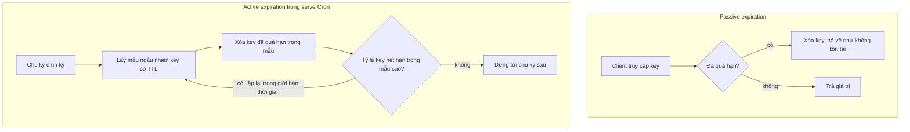
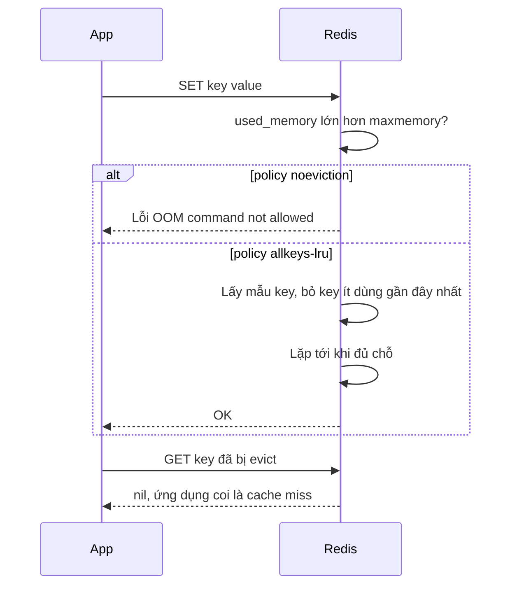

# TTL, Expiration và Eviction

## 1. Tổng quan

Redis có hai cơ chế khiến key biến mất mà không cần client xóa:

| Cơ chế | Kích hoạt bởi | Ý nghĩa |
|---|---|---|
| **Expiration** | TTL do ứng dụng đặt (`EX`, `PX`, `EXPIRE`) | "Key này chỉ có giá trị tới thời điểm T" — một quyết định **nghiệp vụ** |
| **Eviction** | Memory chạm `maxmemory` | "Hết chỗ, phải bỏ bớt key" — một quyết định **tài nguyên** |

Nhầm lẫn giữa hai cơ chế dẫn tới hai loại sự cố: dữ liệu quan trọng bị evict âm thầm (vì Redis được dùng như database), hoặc Redis từ chối ghi khi đầy (vì policy không phù hợp với vai trò cache).

## 2. Mental Model

> TTL là hạn sử dụng in trên hộp: tới hạn thì hộp được coi là hỏng. Eviction là khi tủ lạnh đầy: phải bỏ bớt một số hộp, kể cả hộp chưa tới hạn, theo một quy tắc chọn trước (bỏ hộp lâu không dùng, bỏ hộp ít dùng, bỏ hộp sắp hết hạn...).

## 3. Expiration hoạt động thế nào?

Redis lưu thời điểm hết hạn tuyệt đối của key trong một dict riêng (`expires`). Key hết hạn được xóa bằng hai cách:



Diễn giải:

1. **Passive (lazy)**: key được kiểm tra khi có người truy cập; nếu đã quá hạn, xóa ngay và trả về như không tồn tại. Client không bao giờ đọc được key đã hết hạn.
2. **Active**: key hết hạn mà không ai truy cập vẫn chiếm memory. Redis định kỳ lấy mẫu một số key có TTL, xóa key quá hạn; nếu tỷ lệ key quá hạn trong mẫu cao, lặp lại (có giới hạn thời gian CPU mỗi chu kỳ để không chặn server).

Hệ quả:

- Memory của key hết hạn không được giải phóng **đúng thời điểm** hết hạn; `expired_keys` tăng dần.
- Hàng triệu key cùng hết hạn một lúc khiến active expiration chiếm nhiều CPU hơn trong một khoảng thời gian.
- Trên replica, key hết hạn không bị xóa độc lập: master gửi lệnh `DEL` qua replication. Replica vẫn trả "không tồn tại" cho key logic đã hết hạn khi đọc (từ Redis 3.2).

### Các lưu ý về TTL

- `SET key value` (không `EX`/`KEEPTTL`) **xóa TTL** hiện có của key. Cập nhật giá trị mà quên giữ TTL → key sống vĩnh viễn.
- `INCR`, `HSET`, `LPUSH` giữ nguyên TTL; `RENAME` mang TTL theo.
- `EXPIRE` trên key không tồn tại không có tác dụng.
- `TTL key` trả `-1` nếu không có TTL, `-2` nếu key không tồn tại.
- TTL cho từng field của hash: `HEXPIRE` (Redis 7.4+).

## 4. Eviction hoạt động thế nào?

Khi `maxmemory` được đặt và memory dữ liệu vượt giới hạn, **trước mỗi command ghi**, Redis giải phóng memory theo `maxmemory-policy`:

| Policy | Chọn key nào để bỏ |
|---|---|
| `noeviction` (mặc định) | Không bỏ; từ chối command ghi với lỗi `OOM command not allowed` |
| `allkeys-lru` | Key ít được dùng gần đây nhất, trong mọi key |
| `allkeys-lfu` | Key ít được dùng thường xuyên nhất, trong mọi key |
| `allkeys-random` | Ngẫu nhiên trong mọi key |
| `volatile-lru` | LRU, chỉ trong key có TTL |
| `volatile-lfu` | LFU, chỉ trong key có TTL |
| `volatile-random` | Ngẫu nhiên, chỉ trong key có TTL |
| `volatile-ttl` | Key có TTL còn lại ngắn nhất |

LRU và LFU của Redis là **xấp xỉ**: Redis lấy mẫu vài key (`maxmemory-samples`, mặc định 5) và bỏ key tốt nhất trong mẫu, thay vì duy trì danh sách chính xác (tốn memory). LFU dùng bộ đếm tần suất có giảm dần theo thời gian (`lfu-decay-time`), phù hợp hơn LRU khi có key được truy cập thường xuyên nhưng một lần quét lớn có thể đẩy chúng ra.

### Chọn policy theo vai trò

| Vai trò của Redis | Policy phù hợp | Lý do |
|---|---|---|
| Cache thuần | `allkeys-lru` hoặc `allkeys-lfu` | Mọi key đều có thể dựng lại; bỏ key ít giá trị nhất |
| Cache + dữ liệu không được mất trên cùng instance | `volatile-*` (chỉ cache có TTL) | Dữ liệu không TTL không bị evict — nhưng nếu dữ liệu không TTL lấp đầy memory, ghi bị từ chối |
| Broker Celery, lock, rate limit, session, queue | `noeviction` | Mất key âm thầm là lỗi đúng đắn; thà báo lỗi rõ ràng |

Tốt nhất: **tách instance** theo vai trò. Cache và broker chung một Redis nghĩa là hoặc cache không được evict (đầy thì broker từ chối nhận task), hoặc message của broker có thể bị evict.

## 5. Ví dụ: đặt TTL an toàn

```python
import random

BASE_TTL = 300

def jittered_ttl(base: int = BASE_TTL, spread: float = 0.2) -> int:
    return int(base * (1 + random.uniform(0, spread)))

async def cache_coverage(r, key: str, payload: bytes) -> None:
    await r.set(key, payload, ex=jittered_ttl())

async def update_counter(r, key: str) -> None:
    async with r.pipeline(transaction=True) as pipe:
        pipe.incr(key)
        pipe.expire(key, 3600, nx=True)     # chỉ đặt TTL nếu chưa có (Redis 7+)
        await pipe.execute()
```

- **Jitter** rải thời điểm hết hạn, tránh [cache avalanche](cache-problems.md#4-cache-avalanche).
- Counter: `INCR` tạo key không có TTL; đặt `EXPIRE` ngay trong cùng transaction để không có key "mồ côi" sống mãi.

## 6. Bên trong hệ thống xảy ra gì khi memory đầy?



Diễn giải: với cache, eviction là hành vi mong muốn — ứng dụng thấy nó như cache miss. Hit ratio giảm dần khi working set lớn hơn memory. Với broker/lock, eviction là mất dữ liệu; `noeviction` biến vấn đề thành lỗi rõ ràng để được xử lý.

## 7. Hành vi trong production

- **Key không có TTL tích tụ**: bug quên TTL làm memory tăng mãi; với `volatile-*` policy, chúng không bao giờ bị evict → cuối cùng ghi bị từ chối. Theo dõi tỷ lệ key có TTL (`INFO keyspace`: `keys` và `expires`).
- **Eviction giới hạn hit ratio**: `evicted_keys` tăng liên tục nghĩa là working set lớn hơn memory — hoặc tăng memory, hoặc giảm dữ liệu cache (TTL ngắn hơn, value nhỏ hơn).
- **Memory cho fork**: đặt `maxmemory` thấp hơn RAM vật lý đủ để chứa copy-on-write khi lưu RDB/AOF rewrite, cộng buffer của client và replication. Xem [Persistence](persistence.md).
- **Key lớn bị evict/expire**: giải phóng key lớn đồng bộ block main thread; bật `lazyfree-lazy-eviction` và `lazyfree-lazy-expire`.

## 8. Failure Modes

| Failure | Nguyên nhân | Dấu hiệu |
|---|---|---|
| `OOM command not allowed` | `noeviction` hoặc `volatile-*` mà không đủ key có TTL để bỏ | Ghi lỗi, Celery không nhận task |
| Mất task/lock âm thầm | Broker/lock chung instance với cache dùng `allkeys-*` | Task biến mất, lock biến mất sớm |
| Memory tăng mãi | Key không TTL do `SET` ghi đè mất TTL | `expires` nhỏ hơn nhiều so với `keys` |
| Avalanche | TTL giống nhau cho key nạp cùng lúc | Miss hàng loạt định kỳ |
| Latency spike khi evict | Evict key lớn đồng bộ | SLOWLOG, latency trùng thời điểm evict |

## 9. Trade-offs

| Lựa chọn | Lợi ích | Chi phí |
|---|---|---|
| TTL ngắn | Dữ liệu mới, memory ít | Hit ratio thấp hơn |
| TTL dài | Hit ratio cao | Stale, memory nhiều |
| LRU | Đơn giản, phù hợp truy cập theo thời gian gần | Bị ảnh hưởng bởi quét một lần |
| LFU | Giữ key thực sự nóng | Key mới nóng cần thời gian để "tích điểm" |
| `noeviction` | Không mất dữ liệu âm thầm | Ghi lỗi khi đầy |

## 10. Sai lầm thường gặp

- Dùng một Redis cho cả cache và broker với cùng policy.
- `SET` ghi đè làm mất TTL.
- Đặt `maxmemory` bằng toàn bộ RAM.
- Nghĩ key biến mất đúng giây hết hạn.
- Không jitter TTL.

## 11. Cách debug

```bash
redis-cli INFO keyspace                  # db0:keys=...,expires=...,avg_ttl=...
redis-cli INFO stats | grep -E 'expired_keys|evicted_keys'
redis-cli CONFIG GET maxmemory*
redis-cli TTL mykey
redis-cli OBJECT FREQ mykey              # với policy LFU
redis-cli --hotkeys                      # cần LFU
```

## 12. Best Practices

- Mọi key cache có TTL, có jitter.
- Tách instance theo vai trò; `allkeys-lru/lfu` cho cache, `noeviction` cho broker/lock/queue.
- `maxmemory` chừa chỗ cho fork, buffer, fragmentation.
- Bật lazyfree cho eviction/expire.
- Giám sát `evicted_keys`, tỷ lệ key có TTL, memory.

## 13. Tóm tắt

- Expiration là quyết định nghiệp vụ (TTL); eviction là quyết định tài nguyên khi đạt `maxmemory`.
- Key hết hạn bị xóa khi được truy cập (passive) hoặc qua lấy mẫu định kỳ (active); memory không được giải phóng đúng lúc hết hạn.
- Eviction policy phải khớp vai trò: `allkeys-lru/lfu` cho cache, `noeviction` cho dữ liệu không được mất.
- TTL jitter tránh hết hạn đồng loạt; `SET` không có tùy chọn giữ TTL sẽ xóa TTL.

## Liên quan

- [Caching: nền tảng](caching.md)
- [Cache Problems](cache-problems.md)
- [Redis Internals](redis-internals.md)
- [Persistence](persistence.md)
- [Celery với Redis](../07-celery/celery-redis.md)
