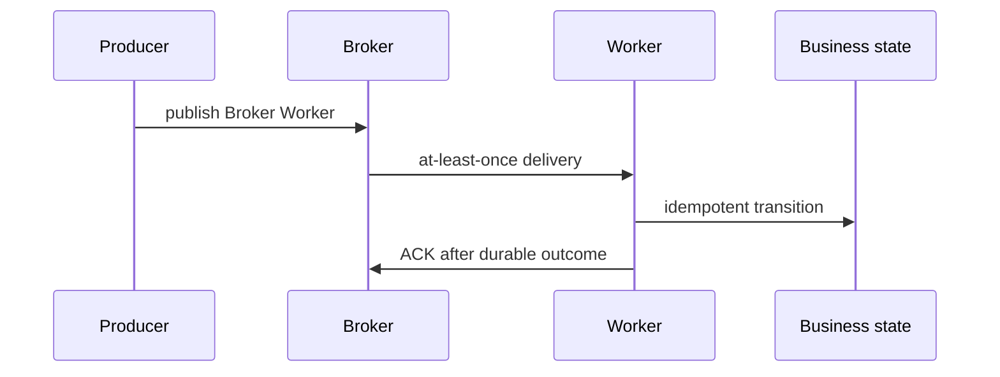

# Broker Worker

> **Phạm vi phỏng vấn:** Celery · **Ưu tiên:** P0/P1 · **Mindset:** Why → How → Trade-off → Production.

## 1. What is it?

Broker buffer/route message; worker reserve và thực thi bằng prefork/thread/greenlet tùy workload. Queue depth không bằng tiến độ nếu task runtime skew.

## 2. Why does it matter?

Senior Engineer cần hiểu **Broker Worker** để tách long-running work khỏi request path nhưng vẫn kiểm soát duplicate và retry. Điểm phỏng vấn nằm ở khả năng nêu invariant, điều kiện áp dụng và failure behavior, không nằm ở việc thuộc định nghĩa.

## 3. How does it work?

Prefetch cao tăng throughput nhưng fairness kém; ack late tăng redelivery safety nhưng đòi idempotency. Tách queue theo runtime/resource/SLO và graceful drain khi deploy.

Khi reasoning, đi theo chuỗi: **input → state transition → output → failure → recovery**. Quan sát `queue depth, task age, runtime, retry rate, failure rate và worker saturation` và phân biệt symptom, bottleneck với root cause.

## 4. Example

```python
from dataclasses import dataclass

@dataclass(frozen=True)
class Decision:
    topic: str
    invariant: str
    metric: str

decision = Decision(
    topic='Broker Worker',
    invariant="Không làm mất hoặc lặp business effect",
    metric="p99 latency và error rate",
)
```

Ví dụ biến quyết định về **Broker Worker** thành invariant và tín hiệu vận hành có thể kiểm chứng.

## 5. Production Use Case

OCR task dài dùng prefork queue/prefetch thấp; I/O webhook queue riêng; monitor oldest age, active/reserved và runtime percentile.

Checklist triển khai: capacity budget, timeout, idempotency (nếu có side effect), telemetry, canary, rollback và reconciliation.

## 6. Common Problems

- Không định nghĩa invariant và source of truth trước khi chọn công nghệ.
- Retry không backoff/jitter làm traffic amplification khi dependency lỗi.
- Không có bound cho queue, connection, memory hoặc concurrency.
- Chỉ theo dõi average; bỏ qua p95/p99, saturation và error semantics.
- Rollout toàn bộ, thiếu feature flag/canary và đường rollback dữ liệu.

## 7. Trade-offs

| Lựa chọn | Lợi ích | Chi phí / rủi ro | Khi phù hợp |
|---|---|---|---|
| Tối ưu/thiết kế xoay quanh Broker Worker | Kiểm soát rõ constraint chính | Tăng complexity và coupling | Metric chứng minh đây là bottleneck/risk |
| Giữ baseline đơn giản | Ít dependency, dễ debug | Có thể chạm giới hạn sớm | Traffic vừa, invariant vẫn được giữ |
| Managed service/library | Giảm vận hành hạ tầng | Cost, lock-in, giới hạn control | SLA và economics phù hợp |
| Tự vận hành/customize | Kiểm soát sâu | Ownership và failure surface lớn | Có năng lực vận hành và nhu cầu thật |

## 8. Interview Questions

### Basic / Mid-level (10)

- **B1.** What is Broker Worker, and which concrete problem does it address?
- **B2.** Explain the main internal mechanism behind Broker Worker.
- **B3.** Which guarantees does Broker Worker provide, and which does it not provide?
- **B4.** Which metrics or observations reveal the behavior of Broker Worker?
- **B5.** What is the most common misconception about Broker Worker?
- **B6.** How would you test assumptions involving Broker Worker?
- **B7.** Which edge cases or failure modes matter most for Broker Worker?
- **B8.** How can Broker Worker affect latency, throughput, memory, or correctness?
- **B9.** Which runtime conditions or configuration choices change the behavior of Broker Worker?
- **B10.** When is a different or simpler approach better than relying on Broker Worker?

### Production Scenarios (5)

- **S1.** A release involving Broker Worker triples p99 while averages look normal. How do you investigate and mitigate?
- **S2.** A critical dependency around Broker Worker is unavailable for ten minutes. Define degraded behavior and recovery.
- **S3.** Two concurrent operations expose a correctness gap related to Broker Worker. Which invariant and atomic boundary fix it?
- **S4.** Traffic grows from 1,000 to 20,000 RPS. Which measured limit involving Broker Worker fails first?
- **S5.** A canary changes the behavior of Broker Worker; success rate is flat but saturation rises. Promote or roll back?

## 9. Senior-level Questions

- **L1.** How does Broker Worker constrain the surrounding architecture and operational model?
- **L2.** Which subtle correctness issue appears when Broker Worker meets concurrency or partial failure?
- **L3.** What breaks first around Broker Worker at 20,000 RPS or 100× data volume?
- **L4.** Where should admission control or backpressure be placed when using Broker Worker?
- **L5.** How would you benchmark or validate Broker Worker without a misleading microbenchmark?
- **L6.** Which hidden coupling or migration cost can Broker Worker introduce?
- **L7.** How would you change a poor decision around Broker Worker with no downtime?
- **L8.** What production evidence would make you choose a different approach?
- **L9.** How do correctness, latency, cost, and complexity trade off for Broker Worker?
- **L10.** How would you turn an incident involving Broker Worker into a durable prevention mechanism?

## 10. Short Answers

**B1.** Broker buffer/route message; worker reserve và thực thi bằng prefork/thread/greenlet tùy workload. Queue depth không bằng tiến độ nếu task runtime skew. Trả lời tốt nối definition với constraint/invariant và một use case cụ thể.

**B2.** Mô tả state, lifecycle, boundary và failure path; không dừng ở public API của Broker Worker.

**B3.** Nêu lúc tạo, lúc sử dụng, lúc release/commit và điều xảy ra khi timeout hoặc cancellation.

**B4.** Đo queue depth, task age, runtime, retry rate, failure rate và worker saturation; luôn tách average khỏi tail và success khỏi useful result.

**B5.** Lỗi phổ biến là dùng Broker Worker như mặc định mà không xác định ownership, limit và fallback.

**B6.** Test invariant trước, sau đó integration test failure path, concurrency và representative load.

**B7.** Xét timeout, duplicate, stale state, overload, dependency loss và recovery/reconciliation.

**B8.** Đo critical path, contention, queueing và amplification; throughput cao không bù được p99 xấu.

**B9.** Deadline, concurrency limit, retention/TTL, resource budget, telemetry và rollout policy phải explicit.

**B10.** Tránh Broker Worker khi bài toán đơn giản hơn giải được invariant với ít state và operational cost hơn.

Cấu trúc câu trả lời: **Definition → Why → How → Trade-off → Production example**. Với câu scenario: **stabilize → observe → hypothesize → verify → mitigate → prevent**.

## 11. Follow-up Questions

- **F1.** What assumption in your answer is most risky?
- **F2.** How would you prove that with metrics or an experiment?
- **F3.** What changes if the operation is not idempotent?
- **F4.** Where would you add timeout, retry, and backpressure?
- **F5.** What is your rollback and data-reconciliation plan?

## 12. Key Takeaways

- Nói được **vai trò, constraint hoặc invariant của Broker Worker**, không chỉ “dùng để làm gì”.
- Định lượng bằng queue depth, task age, runtime, retry rate, failure rate và worker saturation và có baseline trước tối ưu.
- Thiết kế cho timeout, duplicate, overload, partial failure và recovery.
- Mọi tối ưu đều có chi phí về correctness, complexity, latency hoặc money.
- Production-ready nghĩa là có owner, alert, runbook, canary, rollback và reconciliation.


## 13. Mental Model

Hãy xem **Broker Worker** như một boundary biến input/state thành output. Muốn hiểu sâu phải chỉ ra ai sở hữu state, lifecycle, điểm contention và behavior khi dependency chậm hoặc mất.

## 14. Internals Deep Dive

Tách producer publish, broker delivery, worker reservation/execution/ACK và business state. Mỗi boundary có crash window; đo oldest age và business completion, không chỉ queue length.

Implementation detail có thể đổi theo version; khi trả lời interview, nêu rõ CPython/PostgreSQL/Redis/framework version nếu kết luận dựa vào behavior nội bộ thay vì public contract.

## 15. Request / Data Flow



Đọc diagram từ input tới state transition và output. Tại mỗi mũi tên, hỏi: operation có block không, có retry không, state có durable không, identity nào dùng để dedupe và metric nào chứng minh bước đó khỏe.

## 16. Failure Scenario

Worker có thể commit rồi crash trước ACK, hoặc ACK sớm rồi crash trước effect. Thiết kế idempotent business transition, retry budget, DLQ và reconciliation thay vì dựa task ID/lock.

Phân tích theo chuỗi: **trigger → saturation/incorrect state → propagation → user impact → immediate mitigation → durable prevention**. Tránh gọi retry hoặc scale là giải pháp nếu chưa chỉ ra dependency budget.

## 17. How I would debug this in production

1. Đo oldest task age, runtime percentile, retry/failure.
2. So active/reserved/prefetch và worker RSS/CPU.
3. Trace publish → delivery → attempt → business state → ACK.
4. Kiểm visibility/consumer timeout và deploy termination.
5. Quarantine poison task; reconcile duplicate/missing effect.

## 18. Common Misconceptions

**Sai:** task thành công trong log nghĩa business effect exactly once. **Đúng:** ACK, result backend và domain commit là các boundary độc lập.

## 19. When NOT to use

Không đưa work cần response tức thì hoặc transaction atomic đơn giản qua queue; queue thêm lag, duplicate và operational surface.

## 20. What interviewer may ask next

1. **What guarantee does Broker Worker provide, and what does it explicitly not guarantee?**
2. **Which implementation detail changes across versions or runtimes?**
3. **Where is the first queue or contention point under high load?**
4. **What happens if the dependency times out after committing state?**
5. **How would you observe, degrade, and recover this in production?**
6. **Which simpler design would you choose at 100 RPS, and when would you evolve it?**

## 21. Check Your Understanding

1. Nếu throughput tăng 20× nhưng downstream capacity không đổi, **Broker Worker** sẽ tạo queue/backpressure ở đâu?
2. Timeout xảy ra ngay sau một state transition; caller có thể kết luận điều gì và không thể kết luận điều gì?
3. Metric, trace span và log field tối thiểu nào giúp phân biệt application, dependency và network latency?

<details>
<summary>Answer</summary>

1. Queue xuất hiện tại bounded resource đầu tiên: worker/thread/semaphore/connection pool/broker hoặc dependency. Nếu không có bound, overload chuyển thành memory growth và timeout storm.
2. Caller chỉ biết chưa nhận response trong deadline; operation có thể chưa chạy, đang chạy hoặc đã commit. Cần operation identity/idempotency và status/reconciliation.
3. Dùng end-to-end latency + queue/service time, correlation/trace ID, dependency spans, error/retry classification và saturation của pool/queue/resource.

</details>

## 22. See also

- [Task Lifecycle](task-lifecycle.md)
- [Idempotency](idempotency.md)
- [Exactly-once Myth](exactly-once-myth.md)
- [Duplicate Task Incident](../20-senior-scenarios/celery-task-duplicate.md)
