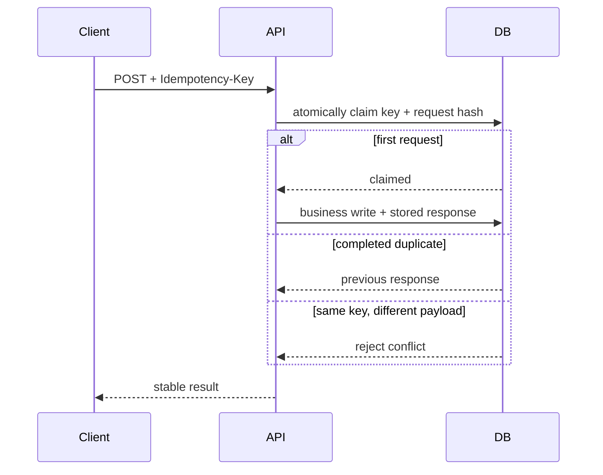

# Idempotency

> **Phạm vi phỏng vấn:** API Design · **Ưu tiên:** P0/P1 · **Mindset:** Why → How → Trade-off → Production.

## 1. What is it?

Operation idempotent cho cùng logical request nhiều lần nhưng effect quan sát được chỉ tương đương một lần.

## 2. Why does it matter?

Senior Engineer cần hiểu **Idempotency** để API khó thay đổi sau khi nhiều consumer phụ thuộc vào nó. Điểm phỏng vấn nằm ở khả năng nêu invariant, điều kiện áp dụng và failure behavior, không nằm ở việc thuộc định nghĩa.

## 3. How does it work?

Client gửi idempotency key; server atomically claim key và lưu response/status cùng business transaction hoặc unique constraint. Scope, canonical payload, TTL và concurrent duplicate phải rõ.

Khi reasoning, đi theo chuỗi: **input → state transition → output → failure → recovery**. Quan sát `compatibility, latency, error taxonomy, abuse rate và adoption` và phân biệt symptom, bottleneck với root cause.

## 4. Example

```sql
CREATE TABLE processed_request (
    tenant_id bigint NOT NULL,
    idempotency_key text NOT NULL,
    request_hash text NOT NULL,
    response jsonb,
    created_at timestamptz NOT NULL DEFAULT now(),
    PRIMARY KEY (tenant_id, idempotency_key)
);
```

`INSERT ... ON CONFLICT` phải nằm cùng transaction với business write; cùng key nhưng khác `request_hash` bị từ chối.

## 5. Production Use Case

Create warranty claim đặt unique `(tenant_id, idempotency_key)`; duplicate đang chạy nhận 409/202, duplicate hoàn tất nhận response cũ, payload khác bị từ chối.

Checklist triển khai: capacity budget, timeout, idempotency (nếu có side effect), telemetry, canary, rollback và reconciliation.

## 6. Common Problems

- Không định nghĩa invariant và source of truth trước khi chọn công nghệ.
- Retry không backoff/jitter làm traffic amplification khi dependency lỗi.
- Không có bound cho queue, connection, memory hoặc concurrency.
- Chỉ theo dõi average; bỏ qua p95/p99, saturation và error semantics.
- Rollout toàn bộ, thiếu feature flag/canary và đường rollback dữ liệu.

## 7. Trade-offs

| Lựa chọn | Lợi ích | Chi phí / rủi ro | Khi phù hợp |
|---|---|---|---|
| Tối ưu/thiết kế xoay quanh Idempotency | Kiểm soát rõ constraint chính | Tăng complexity và coupling | Metric chứng minh đây là bottleneck/risk |
| Giữ baseline đơn giản | Ít dependency, dễ debug | Có thể chạm giới hạn sớm | Traffic vừa, invariant vẫn được giữ |
| Managed service/library | Giảm vận hành hạ tầng | Cost, lock-in, giới hạn control | SLA và economics phù hợp |
| Tự vận hành/customize | Kiểm soát sâu | Ownership và failure surface lớn | Có năng lực vận hành và nhu cầu thật |

## 8. Interview Questions

### Basic / Mid-level (10)

- **B1.** What is Idempotency, and which concrete problem does it address?
- **B2.** Explain the main internal mechanism behind Idempotency.
- **B3.** Which guarantees does Idempotency provide, and which does it not provide?
- **B4.** Which metrics or observations reveal the behavior of Idempotency?
- **B5.** What is the most common misconception about Idempotency?
- **B6.** How would you test assumptions involving Idempotency?
- **B7.** Which edge cases or failure modes matter most for Idempotency?
- **B8.** How can Idempotency affect latency, throughput, memory, or correctness?
- **B9.** Which runtime conditions or configuration choices change the behavior of Idempotency?
- **B10.** When is a different or simpler approach better than relying on Idempotency?

### Production Scenarios (5)

- **S1.** Two create requests with the same key arrive concurrently. Show the atomic claim and response behavior.
- **S2.** The same idempotency key is reused with a different payload. What should the server return and store?
- **S3.** The database commits but the client times out before receiving the response. What happens on retry?
- **S4.** The external payment/email provider lacks idempotency support. How do you reduce duplicate effects?
- **S5.** A deduplication record expires before a delayed retry arrives. How do you choose retention and reconcile?

## 9. Senior-level Questions

- **L1.** How does Idempotency constrain the surrounding architecture and operational model?
- **L2.** Which subtle correctness issue appears when Idempotency meets concurrency or partial failure?
- **L3.** What breaks first around Idempotency at 20,000 RPS or 100× data volume?
- **L4.** Where should admission control or backpressure be placed when using Idempotency?
- **L5.** How would you benchmark or validate Idempotency without a misleading microbenchmark?
- **L6.** Which hidden coupling or migration cost can Idempotency introduce?
- **L7.** How would you change a poor decision around Idempotency with no downtime?
- **L8.** What production evidence would make you choose a different approach?
- **L9.** How do correctness, latency, cost, and complexity trade off for Idempotency?
- **L10.** How would you turn an incident involving Idempotency into a durable prevention mechanism?

## 10. Short Answers

**B1.** Operation idempotent cho cùng logical request nhiều lần nhưng effect quan sát được chỉ tương đương một lần. Trả lời tốt nối definition với constraint/invariant và một use case cụ thể.

**B2.** Mô tả state, lifecycle, boundary và failure path; không dừng ở public API của Idempotency.

**B3.** Nêu lúc tạo, lúc sử dụng, lúc release/commit và điều xảy ra khi timeout hoặc cancellation.

**B4.** Đo compatibility, latency, error taxonomy, abuse rate và adoption; luôn tách average khỏi tail và success khỏi useful result.

**B5.** Lỗi phổ biến là dùng Idempotency như mặc định mà không xác định ownership, limit và fallback.

**B6.** Test invariant trước, sau đó integration test failure path, concurrency và representative load.

**B7.** Xét timeout, duplicate, stale state, overload, dependency loss và recovery/reconciliation.

**B8.** Đo critical path, contention, queueing và amplification; throughput cao không bù được p99 xấu.

**B9.** Deadline, concurrency limit, retention/TTL, resource budget, telemetry và rollout policy phải explicit.

**B10.** Tránh Idempotency khi bài toán đơn giản hơn giải được invariant với ít state và operational cost hơn.

Cấu trúc câu trả lời: **Definition → Why → How → Trade-off → Production example**. Với câu scenario: **stabilize → observe → hypothesize → verify → mitigate → prevent**.

## 11. Follow-up Questions

- **F1.** What assumption in your answer is most risky?
- **F2.** How would you prove that with metrics or an experiment?
- **F3.** What changes if the operation is not idempotent?
- **F4.** Where would you add timeout, retry, and backpressure?
- **F5.** What is your rollback and data-reconciliation plan?

## 12. Key Takeaways

- Nói được **vai trò, constraint hoặc invariant của Idempotency**, không chỉ “dùng để làm gì”.
- Định lượng bằng compatibility, latency, error taxonomy, abuse rate và adoption và có baseline trước tối ưu.
- Thiết kế cho timeout, duplicate, overload, partial failure và recovery.
- Mọi tối ưu đều có chi phí về correctness, complexity, latency hoặc money.
- Production-ready nghĩa là có owner, alert, runbook, canary, rollback và reconciliation.


## 13. Mental Model

Idempotency biến retry từ một request mới thành việc quan sát lại cùng một logical operation.

## 14. Internals Deep Dive

API là distributed contract: method/status/schema chỉ là bề mặt; idempotency, concurrency control, pagination stability, deadline và compatibility quyết định behavior khi retry/evolution.

Implementation detail có thể đổi theo version; khi trả lời interview, nêu rõ CPython/PostgreSQL/Redis/framework version nếu kết luận dựa vào behavior nội bộ thay vì public contract.

## 15. Request / Data Flow



Đọc diagram từ input tới state transition và output. Tại mỗi mũi tên, hỏi: operation có block không, có retry không, state có durable không, identity nào dùng để dedupe và metric nào chứng minh bước đó khỏe.

## 16. Failure Scenario

Timeout khiến client không biết server đã commit chưa; retry có thể duplicate. Idempotency key, optimistic version, stable error semantics và request deadline phải nằm trong contract.

Phân tích theo chuỗi: **trigger → saturation/incorrect state → propagation → user impact → immediate mitigation → durable prevention**. Tránh gọi retry hoặc scale là giải pháp nếu chưa chỉ ra dependency budget.

## 17. How I would debug this in production

1. Phân đoạn error/latency theo endpoint/client/version.
2. Trace idempotency key và state transition.
3. Kiểm timeout/retry classification và payload hash.
4. Xem rate quota/abuse và compatibility failures.
5. Replay contract/integration test.

## 18. Common Misconceptions

**Sai:** HTTP method/status đủ tạo idempotency. **Đúng:** server phải atomically dedupe logical operation và xử lý unknown outcome.

## 19. When NOT to use

Không tạo version/abstraction mới khi chưa có compatibility need; contract nhỏ, explicit thường tốt hơn generic framework.

## 20. What interviewer may ask next

1. **What guarantee does Idempotency provide, and what does it explicitly not guarantee?**
2. **Which implementation detail changes across versions or runtimes?**
3. **Where is the first queue or contention point under high load?**
4. **What happens if the dependency times out after committing state?**
5. **How would you observe, degrade, and recover this in production?**
6. **Which simpler design would you choose at 100 RPS, and when would you evolve it?**

## 21. Check Your Understanding

1. Nếu throughput tăng 20× nhưng downstream capacity không đổi, **Idempotency** sẽ tạo queue/backpressure ở đâu?
2. Timeout xảy ra ngay sau một state transition; caller có thể kết luận điều gì và không thể kết luận điều gì?
3. Metric, trace span và log field tối thiểu nào giúp phân biệt application, dependency và network latency?

<details>
<summary>Answer</summary>

1. Queue xuất hiện tại bounded resource đầu tiên: worker/thread/semaphore/connection pool/broker hoặc dependency. Nếu không có bound, overload chuyển thành memory growth và timeout storm.
2. Caller chỉ biết chưa nhận response trong deadline; operation có thể chưa chạy, đang chạy hoặc đã commit. Cần operation identity/idempotency và status/reconciliation.
3. Dùng end-to-end latency + queue/service time, correlation/trace ID, dependency spans, error/retry classification và saturation của pool/queue/resource.

</details>

## 22. See also

- [Retry and Timeout](retry-timeout.md)
- [API Security](api-security.md)
