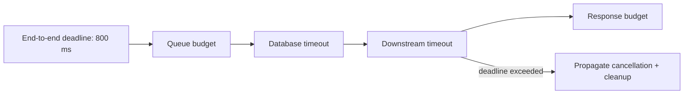

# Timeout

> **Phạm vi phỏng vấn:** Distributed Systems · **Ưu tiên:** P0/P1 · **Mindset:** Why → How → Trade-off → Production.

## 1. What is it?

Timeout biến chờ vô hạn thành failure có giới hạn; một request cần end-to-end deadline được chia cho từng hop.

## 2. Why does it matter?

Senior Engineer cần hiểu **Timeout** để network không đáng tin và retry có thể đổi correctness của business operation. Điểm phỏng vấn nằm ở khả năng nêu invariant, điều kiện áp dụng và failure behavior, không nằm ở việc thuộc định nghĩa.

## 3. How does it work?

Connect, read, write và pool timeout giải quyết failure khác nhau. Child timeout phải ngắn hơn caller deadline và cancellation cần truyền xuống để giải phóng resource.

Khi reasoning, đi theo chuỗi: **input → state transition → output → failure → recovery**. Quan sát `availability, stale-read window, duplicate rate, convergence time và p99 latency` và phân biệt symptom, bottleneck với root cause.

## 4. Example

```python
from dataclasses import dataclass

@dataclass(frozen=True)
class Decision:
    topic: str
    invariant: str
    metric: str

decision = Decision(
    topic='Timeout',
    invariant="Không làm mất hoặc lặp business effect",
    metric="p99 latency và error rate",
)
```

Ví dụ biến quyết định về **Timeout** thành invariant và tín hiệu vận hành có thể kiểm chứng.

## 5. Production Use Case

API budget 800ms dành 100ms queue, 400ms database, 200ms downstream và 100ms serialize; fallback khi AI provider vượt budget.

Checklist triển khai: capacity budget, timeout, idempotency (nếu có side effect), telemetry, canary, rollback và reconciliation.

## 6. Common Problems

- Không định nghĩa invariant và source of truth trước khi chọn công nghệ.
- Retry không backoff/jitter làm traffic amplification khi dependency lỗi.
- Không có bound cho queue, connection, memory hoặc concurrency.
- Chỉ theo dõi average; bỏ qua p95/p99, saturation và error semantics.
- Rollout toàn bộ, thiếu feature flag/canary và đường rollback dữ liệu.

## 7. Trade-offs

| Lựa chọn | Lợi ích | Chi phí / rủi ro | Khi phù hợp |
|---|---|---|---|
| Tối ưu/thiết kế xoay quanh Timeout | Kiểm soát rõ constraint chính | Tăng complexity và coupling | Metric chứng minh đây là bottleneck/risk |
| Giữ baseline đơn giản | Ít dependency, dễ debug | Có thể chạm giới hạn sớm | Traffic vừa, invariant vẫn được giữ |
| Managed service/library | Giảm vận hành hạ tầng | Cost, lock-in, giới hạn control | SLA và economics phù hợp |
| Tự vận hành/customize | Kiểm soát sâu | Ownership và failure surface lớn | Có năng lực vận hành và nhu cầu thật |

## 8. Interview Questions

### Basic / Mid-level (10)

- **B1.** What is Timeout, and which concrete problem does it address?
- **B2.** Explain the main internal mechanism behind Timeout.
- **B3.** Which guarantees does Timeout provide, and which does it not provide?
- **B4.** Which metrics or observations reveal the behavior of Timeout?
- **B5.** What is the most common misconception about Timeout?
- **B6.** How would you test assumptions involving Timeout?
- **B7.** Which edge cases or failure modes matter most for Timeout?
- **B8.** How can Timeout affect latency, throughput, memory, or correctness?
- **B9.** Which runtime conditions or configuration choices change the behavior of Timeout?
- **B10.** When is a different or simpler approach better than relying on Timeout?

### Production Scenarios (5)

- **S1.** A release involving Timeout triples p99 while averages look normal. How do you investigate and mitigate?
- **S2.** A critical dependency around Timeout is unavailable for ten minutes. Define degraded behavior and recovery.
- **S3.** Two concurrent operations expose a correctness gap related to Timeout. Which invariant and atomic boundary fix it?
- **S4.** Traffic grows from 1,000 to 20,000 RPS. Which measured limit involving Timeout fails first?
- **S5.** A canary changes the behavior of Timeout; success rate is flat but saturation rises. Promote or roll back?

## 9. Senior-level Questions

- **L1.** How does Timeout constrain the surrounding architecture and operational model?
- **L2.** Which subtle correctness issue appears when Timeout meets concurrency or partial failure?
- **L3.** What breaks first around Timeout at 20,000 RPS or 100× data volume?
- **L4.** Where should admission control or backpressure be placed when using Timeout?
- **L5.** How would you benchmark or validate Timeout without a misleading microbenchmark?
- **L6.** Which hidden coupling or migration cost can Timeout introduce?
- **L7.** How would you change a poor decision around Timeout with no downtime?
- **L8.** What production evidence would make you choose a different approach?
- **L9.** How do correctness, latency, cost, and complexity trade off for Timeout?
- **L10.** How would you turn an incident involving Timeout into a durable prevention mechanism?

## 10. Short Answers

**B1.** Timeout biến chờ vô hạn thành failure có giới hạn; một request cần end-to-end deadline được chia cho từng hop. Trả lời tốt nối definition với constraint/invariant và một use case cụ thể.

**B2.** Mô tả state, lifecycle, boundary và failure path; không dừng ở public API của Timeout.

**B3.** Nêu lúc tạo, lúc sử dụng, lúc release/commit và điều xảy ra khi timeout hoặc cancellation.

**B4.** Đo availability, stale-read window, duplicate rate, convergence time và p99 latency; luôn tách average khỏi tail và success khỏi useful result.

**B5.** Lỗi phổ biến là dùng Timeout như mặc định mà không xác định ownership, limit và fallback.

**B6.** Test invariant trước, sau đó integration test failure path, concurrency và representative load.

**B7.** Xét timeout, duplicate, stale state, overload, dependency loss và recovery/reconciliation.

**B8.** Đo critical path, contention, queueing và amplification; throughput cao không bù được p99 xấu.

**B9.** Deadline, concurrency limit, retention/TTL, resource budget, telemetry và rollout policy phải explicit.

**B10.** Tránh Timeout khi bài toán đơn giản hơn giải được invariant với ít state và operational cost hơn.

Cấu trúc câu trả lời: **Definition → Why → How → Trade-off → Production example**. Với câu scenario: **stabilize → observe → hypothesize → verify → mitigate → prevent**.

## 11. Follow-up Questions

- **F1.** What assumption in your answer is most risky?
- **F2.** How would you prove that with metrics or an experiment?
- **F3.** What changes if the operation is not idempotent?
- **F4.** Where would you add timeout, retry, and backpressure?
- **F5.** What is your rollback and data-reconciliation plan?

## 12. Key Takeaways

- Nói được **vai trò, constraint hoặc invariant của Timeout**, không chỉ “dùng để làm gì”.
- Định lượng bằng availability, stale-read window, duplicate rate, convergence time và p99 latency và có baseline trước tối ưu.
- Thiết kế cho timeout, duplicate, overload, partial failure và recovery.
- Mọi tối ưu đều có chi phí về correctness, complexity, latency hoặc money.
- Production-ready nghĩa là có owner, alert, runbook, canary, rollback và reconciliation.


## 13. Mental Model

Timeout là ngân sách chờ, không phải thời gian dependency chắc chắn dừng. Cancellation phải propagate và cleanup resource.

## 14. Internals Deep Dive

Assume message có thể delay/drop/duplicate/reorder và node có thể pause/restart. Đặt identity, deadline, atomic boundary, durable state và reconciliation trước khi chọn middleware.

Implementation detail có thể đổi theo version; khi trả lời interview, nêu rõ CPython/PostgreSQL/Redis/framework version nếu kết luận dựa vào behavior nội bộ thay vì public contract.

## 15. Request / Data Flow



Đọc diagram từ input tới state transition và output. Tại mỗi mũi tên, hỏi: operation có block không, có retry không, state có durable không, identity nào dùng để dedupe và metric nào chứng minh bước đó khỏe.

## 16. Failure Scenario

Network partition/timeout biến outcome thành unknown. Không suy diễn failure từ timeout; dùng operation identity, durable state, retry có budget, circuit/bulkhead và reconciliation.

Phân tích theo chuỗi: **trigger → saturation/incorrect state → propagation → user impact → immediate mitigation → durable prevention**. Tránh gọi retry hoặc scale là giải pháp nếu chưa chỉ ra dependency budget.

## 17. How I would debug this in production

1. Vẽ timeline theo correlation/message/operation ID.
2. Phân biệt timeout, rejection, duplicate và stale observation.
3. Xác định last durable state ở từng component.
4. Kiểm retry/deadline/circuit/queue lag.
5. Reconcile source of truth với projection/external effect.

## 18. Common Misconceptions

**Sai:** timeout chứng minh operation thất bại. **Đúng:** server có thể đã commit; timeout chỉ nói caller chưa quan sát response.

## 19. When NOT to use

Không dùng consensus/lock/saga nếu một local transaction hoặc unique constraint giải được invariant.

## 20. What interviewer may ask next

1. **What guarantee does Timeout provide, and what does it explicitly not guarantee?**
2. **Which implementation detail changes across versions or runtimes?**
3. **Where is the first queue or contention point under high load?**
4. **What happens if the dependency times out after committing state?**
5. **How would you observe, degrade, and recover this in production?**
6. **Which simpler design would you choose at 100 RPS, and when would you evolve it?**

## 21. Check Your Understanding

1. Nếu throughput tăng 20× nhưng downstream capacity không đổi, **Timeout** sẽ tạo queue/backpressure ở đâu?
2. Timeout xảy ra ngay sau một state transition; caller có thể kết luận điều gì và không thể kết luận điều gì?
3. Metric, trace span và log field tối thiểu nào giúp phân biệt application, dependency và network latency?

<details>
<summary>Answer</summary>

1. Queue xuất hiện tại bounded resource đầu tiên: worker/thread/semaphore/connection pool/broker hoặc dependency. Nếu không có bound, overload chuyển thành memory growth và timeout storm.
2. Caller chỉ biết chưa nhận response trong deadline; operation có thể chưa chạy, đang chạy hoặc đã commit. Cần operation identity/idempotency và status/reconciliation.
3. Dùng end-to-end latency + queue/service time, correlation/trace ID, dependency spans, error/retry classification và saturation của pool/queue/resource.

</details>

## 22. See also

- [Idempotency](idempotency.md)
- [Retry](retry.md)
- [Outbox](outbox-pattern.md)
- [Failure Scenarios](failure-scenarios.md)
