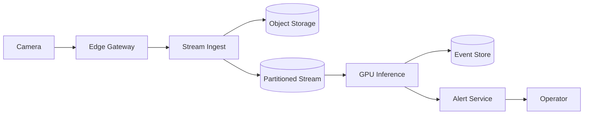
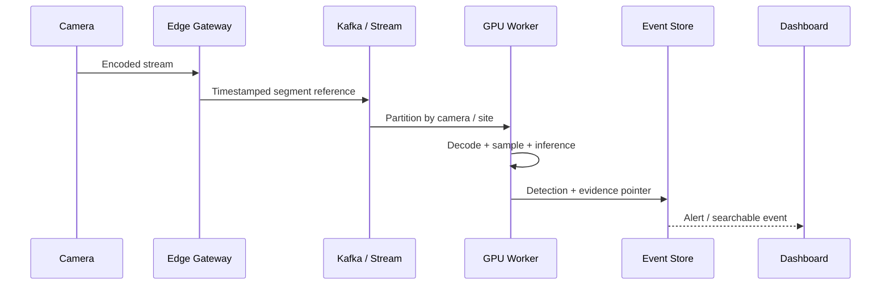
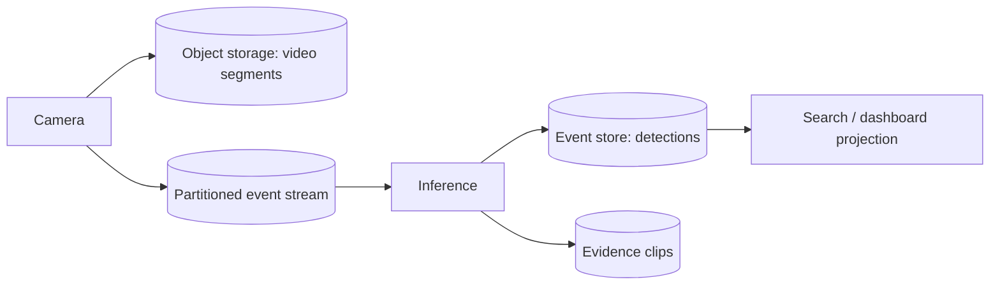
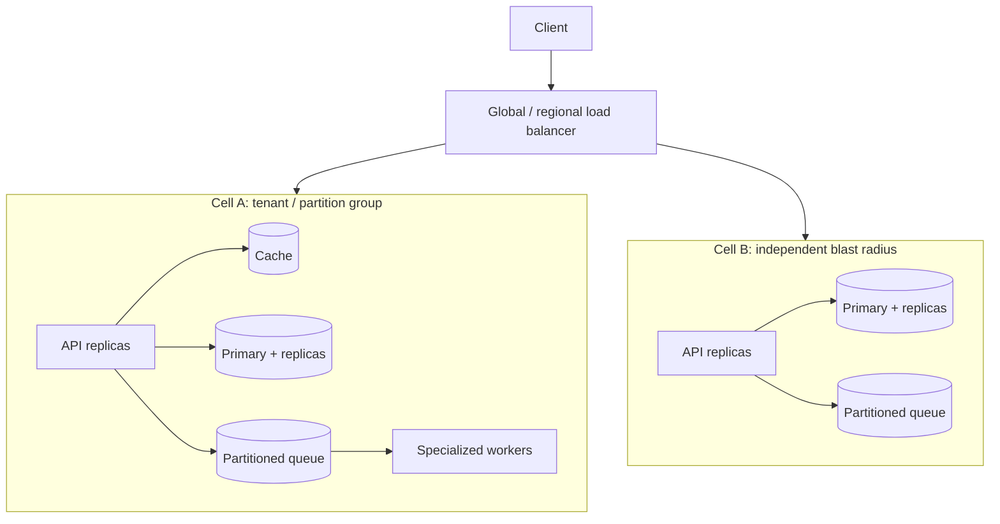
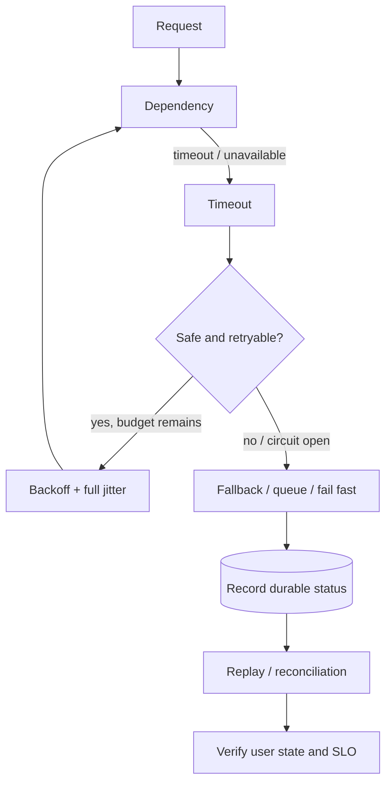
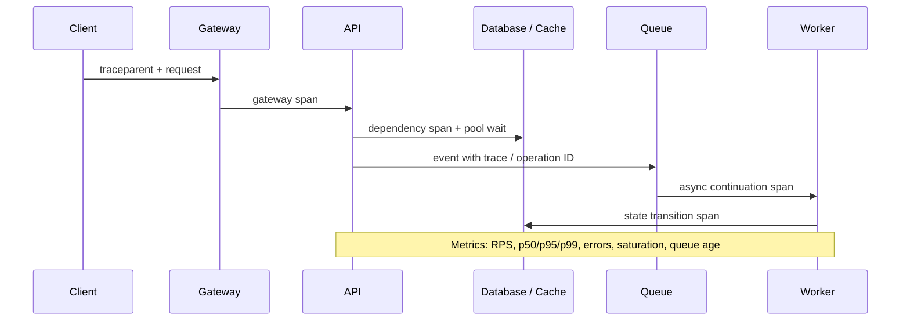

# Design: Video Analytics Platform

> Cách trình bày: clarify requirement → estimate → define invariant → draw → deep-dive bottleneck/failure → trade-off.

## 1. What is it?

Thiết kế nền tảng **Video Analytics Platform** để ingest camera/video, transcode, inference, event detection, clip evidence và live alert. Scope phỏng vấn tập trung vào backend/control plane; thuật toán ML/optimization chi tiết nằm ngoài phạm vi.

## 2. Why does it matter?

Bài toán kết hợp stateful workflow, dữ liệu lớn, partial failure và enterprise integration. Senior Engineer phải biến requirement mơ hồ thành SLO, capacity budget và ranh giới ownership có thể vận hành.

## 3. How does it work?

### Requirements

- Làm rõ tenant, geography, retention, compliance, consistency và thao tác nào critical.
- Source of truth phải durable; cache/projection có thể rebuild.
- Mọi side effect có idempotency key, audit trail và reconciliation path.

### Functional Requirements

- Core: ingest camera/video, transcode, inference, event detection, clip evidence và live alert.
- Query trạng thái/history, quản lý version/configuration và quyền theo tenant.
- Admin replay, manual override, export và audit nhưng phải authorization chặt.

### Non-functional Requirements

- Availability mục tiêu 99.9–99.99% theo criticality; multi-AZ trước multi-region.
- p95/p99 được định nghĩa riêng cho synchronous API và asynchronous completion.
- Encryption in transit/at rest; RPO/RTO, retention và data residency có số cụ thể.

### Scale Estimation

Assumption: 10.000 camera × 2 Mbps ≈ 20 Gbps ingest; 24/7 stream; alert dưới 3 giây; raw retention 30 ngày. Từ peak traffic tính số instance theo **measured sustainable RPS × target utilization 60–70%**, không dùng benchmark laptop. Storage = ingest/day × retention × replication/compression; cộng index/WAL/headroom. Connection budget phải chia từ giới hạn database xuống pod/worker.

### API

`POST /v1/cameras`, `POST /v1/videos`, `GET /v1/events?camera_id=`, `GET /v1/events/{id}/clip`. Write API trả resource/job ID ổn định; operation dài dùng `202 Accepted`. Cursor pagination thay offset cho history lớn. Error có machine-readable code, retryability và correlation ID.

### Data Model

Entity chính: Camera, StreamSession, VideoSegment, ModelVersion, Detection, Alert, EvidenceClip. Dùng immutable ID, `tenant_id`, version/ETag và timestamps; unique constraint bảo vệ business invariant. Audit event append-only, payload lớn tách khỏi OLTP row.

### High-level Architecture



### Database

Time-series/search cho event; PostgreSQL control plane; object storage lifecycle tiering cho segment/clip. Partition/shard theo access pattern đã đo; replica phục vụ stale-tolerant read. Schema migration expand/contract và online backfill có throttle.

### Cache

Edge/frame buffer và Redis hot camera status; không đẩy video bytes qua Redis. Dùng TTL jitter, single-flight và stale-if-error. Cache failure phải degrade có giới hạn; rate limit bảo vệ source khỏi miss storm.

### Message Queue

Partitioned stream theo camera/site; GPU worker consume với bounded lag, DLQ cho corrupt segment. Delivery mặc định at-least-once; consumer idempotent, retry có backoff/jitter/budget, poison message vào DLQ và có runbook replay.

### Storage

Object/blob lớn dùng object storage với checksum, versioning, lifecycle và signed URL. Metadata durable tách khỏi bytes; backup restore phải được diễn tập, không chỉ bật configuration.

### Scaling

Stateless API scale ngang sau load balancer; partition worker theo locality/resource. Autoscale dùng queue age/lag cùng saturation và cap theo downstream capacity. Hot partition cần virtual shard hoặc tenant isolation.

### Failure Handling

- Deadline truyền end-to-end; retry chỉ transient + idempotent, dùng exponential backoff/full jitter.
- Circuit breaker/load shedding khi dependency suy yếu; fallback phải ghi rõ stale/degraded semantics.
- Outbox xử lý dual write; reconciliation job sửa lost/stuck projection.
- Đặc thù cần drill: Bandwidth, GPU scheduling, frame dropping policy, clock skew, privacy/masking và model drift.

### Security

OIDC/OAuth2 ở edge, authorization theo resource/tenant ở service; least privilege IAM, secret rotation, encryption, PII redaction và immutable audit. Upload/untrusted content cần content-type verification, malware scan và quota.

### Observability

RED cho API, USE cho resource; queue age/lag, pool wait, saturation và business success. Trace mang `tenant_id` đã hash, job/message ID qua async boundary; tránh high-cardinality raw user ID. Alert theo multi-window SLO burn rate.

## 4. Example

```python
from dataclasses import dataclass
from uuid import UUID

@dataclass(frozen=True)
class Command:
    command_id: UUID
    tenant_id: UUID
    aggregate_id: UUID
    expected_version: int

# Repository atomically enforces (tenant_id, command_id) uniqueness and
# expected_version, then writes business state plus an outbox event.
```

Hai constraint tách biệt: `command_id` chống duplicate; `expected_version` chống lost update.

## 5. Production Use Case

Rollout theo cell/tenant, shadow traffic cho read path và canary cho write path. Trước launch cần load test có skew/hot key, dependency failure drill, restore test, capacity model, dashboard, alert, runbook và owner. Với **Video Analytics Platform**, review riêng: Bandwidth, GPU scheduling, frame dropping policy, clock skew, privacy/masking và model drift.

## 6. Common Problems

- Nhảy vào component trước khi chốt SLO, scale, consistency và source of truth.
- Tuyên bố “exactly once” nhưng không nói scope hoặc external side effect.
- Scale API mà bỏ qua database connection, hot partition và provider quota.
- Queue không bound, retry vô hạn và DLQ không có owner/replay procedure.
- Multi-region quá sớm, làm consistency/operation phức tạp hơn business cần.

## 7. Trade-offs

| Decision | Chọn khi | Đánh đổi |
|---|---|---|
| Strong consistency | Money/ownership/invariant | Latency, availability khi partition |
| Eventual consistency | Projection/feed/analytics | Stale UI, cần version/reconciliation |
| Synchronous call | Cần kết quả tức thời, dependency tin cậy | Coupling, tail-latency amplification |
| Queue/event | Work dài, burst hấp thụ được | Duplicate, lag, debugging khó hơn |
| Single region multi-AZ | Latency/complexity vừa phải | Không chịu được region loss |
| Active-active region | RTO thấp, global traffic | Conflict, cost và operational complexity |

### Bottlenecks

Database connection/lock, hot key/partition, queue lag, object-store bandwidth, external quota và serialized coordinator. Xác nhận bằng trace/profile/load test; không tối ưu từ sơ đồ.

### Future Improvements

Cell-based isolation, per-tenant quota, adaptive load shedding, tiered storage, automated reconciliation, chaos drill và cost-per-success dashboard. Chỉ thêm multi-region/sharding khi metric chứng minh giới hạn.


### Diagram 2 — Request / Sequence Flow



Flow đồng bộ chỉ giữ các bước cần cho user-visible result. Work dài, fan-out hoặc có thể replay đi qua durable queue/log. Mỗi command có operation ID; state transition dùng unique constraint hoặc expected version.

### Diagram 3 — Data Flow and Source of Truth



| Data | Source of Truth | Lý do |
|---|---|---|
| Raw segment/evidence clip | Object storage | Retention/lifecycle binary truth |
| Detection event | Event store | Searchable event truth |
| Camera/config/model version | PostgreSQL | Control-plane truth |
| Kafka record | Stream | Ordered transport within partition |

“Source of truth” nghĩa là nơi quyết định authoritative state sau recovery. Cache, search/vector index và analytics là projection: có thể stale và phải rebuild được từ durable source + version metadata.

### Diagram 4 — Scaling Architecture



Cell/partition chỉ xuất hiện khi tenant/data/traffic đủ lớn hoặc cần blast-radius isolation. HPA/autoscaling bị cap bởi DB connection, provider quota, storage bandwidth và worker resource; queue age tốt hơn queue length khi task runtime khác nhau.

### Diagram 5 — Failure and Recovery Flow



Retry không được vượt end-to-end deadline hoặc tạo duplicate effect. Circuit breaker, bulkhead và rate limit giới hạn propagation; reconciliation xử lý outcome “unknown” mà synchronous retry không thể chứng minh.

### Diagram 6 — Observability Trace



Log có `trace_id`, `operation_id`, tenant đã hash, version và typed error; không log token/PII/raw document mặc định. Alert dựa user SLI và multi-window burn rate, kết hợp queue age, pool wait, cache hit, DB/resource saturation.

### Architecture Evolution — Start Simple, Add Only for Measured Pain

| Stage | Architecture | Khi nào đủ / vấn đề buộc thay đổi |
|---|---|---|
| **V1 — ~100 RPS** | 2 API instance, PostgreSQL, object storage nếu có binary; background worker đơn giản | Dễ deploy/debug. **Không** dùng Kafka, sharding hay nhiều microservice nếu vẫn đạt SLO/RTO. |
| **V2 — ~5,000 RPS** | Load balancer, API scale ngang, Redis cho hot derived read, durable queue, worker pool, read replica cho stale read | Thêm vì cacheable read, burst/long work và deployment isolation đã được đo. Giữ global DB/pool budget. |
| **V3 — 20,000+ RPS / large data** | Partition/cell theo tenant/key, specialized workers, event-driven projection, tiered storage và isolation quota | Chỉ thêm khi hot partition, write/connection/storage ceiling hoặc blast radius không còn đáp ứng SLO. |

**Bottleneck gates:** trước mỗi bước, ghi metric trigger cụ thể—DB CPU/pool wait, cache hit, queue age, partition skew, provider quota hoặc cost/success. “Có thể scale” không phải lý do đủ để thêm component.

## Failure Scenarios

| Failure | Detection | Immediate mitigation | Durable design |
|---|---|---|---|
| API instance down | readiness, 5xx, connection reset | LB loại instance, drain/restart | ≥2 AZ, stateless API, graceful shutdown |
| Database down/failover | connect errors, replica/HA event | shed write, read-only/degraded mode | tested failover, backup restore, RPO/RTO |
| Redis down | timeout, hit ratio collapse | circuit-open, stale/bounded fallback | DB protection, TTL jitter, cache warm plan |
| Queue unavailable | publish error/outbox age | persist intent, pause noncritical producer | outbox, HA broker, replay runbook |
| Worker down | oldest age/lease expiry | autoscale/restart, requeue safely | heartbeat, idempotency, DLQ |
| Network timeout | dependency span/deadline | fail fast or bounded retry | propagated deadline, operation status |
| Duplicate request | same idempotency key | return prior/in-progress result | atomic dedupe + payload hash |
| Duplicate event | inbox unique conflict | ACK duplicate after verifying result | idempotent consumer + reconciliation |
| Slow dependency | p99, saturation, circuit state | bulkhead, fallback, rate limit | capacity contract and load/fault tests |
| Traffic spike / partial failure | SLO burn, queue/pool age | load shed, priority, degrade features | quota, cell isolation, pre-scale plan |

## Security Deep Dive

- **Authentication:** OIDC/OAuth2 at edge; short-lived credential, issuer/audience validation and revocation/rotation plan.
- **Authorization:** resource + action + tenant/ACL enforced server-side; admin/human override requires step-up and immutable audit.
- **Input boundary:** schema/size/content-type validation, malware/archive-bomb protection and signed upload URL with narrow scope.
- **Transport/storage:** TLS/mTLS where trust boundary requires, KMS-backed encryption, per-service IAM and secret manager—not secrets in image/log.
- **Privacy:** data classification, PII redaction, retention/legal hold, regional residency and deletion propagated to derived indexes/backups policy.
- **Abuse:** per-user/tenant/provider rate limit, quota, cost ceiling and anomaly signal; deny-by-default for cross-tenant access.

## How to explain this design in an interview

1. **Clarify requirements:** core user journey, tenant/geography, correctness, latency/availability, retention/compliance và out-of-scope.
2. **Estimate scale:** average/peak RPS, concurrency (`RPS × latency`), bytes/day, retention, worker/provider/GPU demand.
3. **Start simple:** V1 với ít component nhất; chỉ rõ PostgreSQL/object store nào là source of truth.
4. **Identify bottleneck:** dùng con số để chọn DB/cache/queue/partition deep dive; không liệt kê tool.
5. **Evolve architecture:** V2/V3 giải quyết bottleneck cụ thể và nêu cost/coupling mới.
6. **Discuss failure:** timeout, retry budget, idempotency, circuit/bulkhead, DLQ, degraded mode và reconciliation.
7. **Discuss security/observability:** identity/tenant/PII, SLI, trace async và alert burn-rate.
8. **Close with trade-offs:** assumption nào rủi ro nhất, metric nào khiến đổi design và bước tương lai nào chưa cần hôm nay.


## 8. Interview Questions

### Basic / Mid-level (10)

- **B1.** What is Video Analytics Platform, and which concrete problem does it address?
- **B2.** Explain the main internal mechanism behind Video Analytics Platform.
- **B3.** Which guarantees does Video Analytics Platform provide, and which does it not provide?
- **B4.** Which metrics or observations reveal the behavior of Video Analytics Platform?
- **B5.** What is the most common misconception about Video Analytics Platform?
- **B6.** How would you test assumptions involving Video Analytics Platform?
- **B7.** Which edge cases or failure modes matter most for Video Analytics Platform?
- **B8.** How can Video Analytics Platform affect latency, throughput, memory, or correctness?
- **B9.** Which runtime conditions or configuration choices change the behavior of Video Analytics Platform?
- **B10.** When is a different or simpler approach better than relying on Video Analytics Platform?

### Production Scenarios (5)

- **S1.** A release involving Video Analytics Platform triples p99 while averages look normal. How do you investigate and mitigate?
- **S2.** A critical dependency around Video Analytics Platform is unavailable for ten minutes. Define degraded behavior and recovery.
- **S3.** Two concurrent operations expose a correctness gap related to Video Analytics Platform. Which invariant and atomic boundary fix it?
- **S4.** Traffic grows from 1,000 to 20,000 RPS. Which measured limit involving Video Analytics Platform fails first?
- **S5.** A canary changes the behavior of Video Analytics Platform; success rate is flat but saturation rises. Promote or roll back?

## 9. Senior-level Questions

- **L1.** How does Video Analytics Platform constrain the surrounding architecture and operational model?
- **L2.** Which subtle correctness issue appears when Video Analytics Platform meets concurrency or partial failure?
- **L3.** What breaks first around Video Analytics Platform at 20,000 RPS or 100× data volume?
- **L4.** Where should admission control or backpressure be placed when using Video Analytics Platform?
- **L5.** How would you benchmark or validate Video Analytics Platform without a misleading microbenchmark?
- **L6.** Which hidden coupling or migration cost can Video Analytics Platform introduce?
- **L7.** How would you change a poor decision around Video Analytics Platform with no downtime?
- **L8.** What production evidence would make you choose a different approach?
- **L9.** How do correctness, latency, cost, and complexity trade off for Video Analytics Platform?
- **L10.** How would you turn an incident involving Video Analytics Platform into a durable prevention mechanism?

## 10. Short Answers

**B1.** Video Analytics Platform là hệ thống để ingest camera/video, transcode, inference, event detection, clip evidence và live alert. Trả lời tốt nối definition với constraint/invariant và một use case cụ thể.

**B2.** Mô tả state, lifecycle, boundary và failure path; không dừng ở public API của Video Analytics Platform.

**B3.** Nêu lúc tạo, lúc sử dụng, lúc release/commit và điều xảy ra khi timeout hoặc cancellation.

**B4.** Đo throughput, latency, availability, durability, cost và recovery time; luôn tách average khỏi tail và success khỏi useful result.

**B5.** Lỗi phổ biến là dùng Video Analytics Platform như mặc định mà không xác định ownership, limit và fallback.

**B6.** Test invariant trước, sau đó integration test failure path, concurrency và representative load.

**B7.** Xét timeout, duplicate, stale state, overload, dependency loss và recovery/reconciliation.

**B8.** Đo critical path, contention, queueing và amplification; throughput cao không bù được p99 xấu.

**B9.** Deadline, concurrency limit, retention/TTL, resource budget, telemetry và rollout policy phải explicit.

**B10.** Tránh Video Analytics Platform khi bài toán đơn giản hơn giải được invariant với ít state và operational cost hơn.

**Design pitch 90 giây:** “Tôi chốt invariant/SLO, estimate peak, chọn durable source of truth, tách work dài qua queue, dùng idempotency + outbox, rồi deep-dive bottleneck lớn nhất. Tôi thiết kế degraded mode, observability và reconciliation trước khi nói multi-region.”

## 11. Follow-up Questions

- **F1.** What assumption in your answer is most risky?
- **F2.** How would you prove that with metrics or an experiment?
- **F3.** What changes if the operation is not idempotent?
- **F4.** Where would you add timeout, retry, and backpressure?
- **F5.** What is your rollback and data-reconciliation plan?

## 12. Key Takeaways

- Requirement và con số dẫn component choice; component không phải điểm bắt đầu.
- Scale stateless tier dễ; state, connection budget, skew và failure recovery mới khó.
- At-least-once + idempotency + reconciliation là baseline thực dụng.
- Security, operability, cost và data lifecycle nằm trong design, không phải phụ lục.
- Luôn nêu assumption, trade-off và tín hiệu khiến bạn đổi thiết kế.
