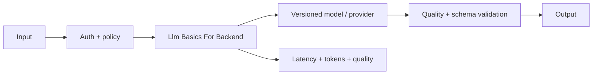

# Llm Basics For Backend

> **Phạm vi phỏng vấn:** AI Integration · **Ưu tiên:** P0/P1 · **Mindset:** Why → How → Trade-off → Production.

## 1. What is it?

LLM với Backend Engineer là remote/stateless inference API nhận token context và sinh token xác suất; context window, sampling, quota và price là system constraints.

## 2. Why does it matter?

Senior Engineer cần hiểu **Llm Basics For Backend** để kiểm soát latency, quality, privacy và chi phí của dependency xác suất. Điểm phỏng vấn nằm ở khả năng nêu invariant, điều kiện áp dụng và failure behavior, không nằm ở việc thuộc định nghĩa.

## 3. How does it work?

Prompt được tokenize; generation autoregressive làm latency/cost tăng theo input/output token. Backend quản model routing, structured output validation, timeout/cancellation, safety và prompt/model version.

Khi reasoning, đi theo chuỗi: **input → state transition → output → failure → recovery**. Quan sát `time-to-first-token, groundedness, token cost, retrieval recall và fallback rate` và phân biệt symptom, bottleneck với root cause.

## 4. Example

```python
from dataclasses import dataclass

@dataclass(frozen=True)
class RetrievedChunk:
    document_id: str
    text: str
    score: float

def select_context(chunks: list[RetrievedChunk], *, min_score: float = 0.72) -> list[RetrievedChunk]:
    allowed = (chunk for chunk in chunks if chunk.score >= min_score)
    return sorted(allowed, key=lambda chunk: chunk.score, reverse=True)[:8]
```

**Llm Basics For Backend** cần thêm tenant ACL, model version, token budget, citation và quality evaluation ở production.

## 5. Production Use Case

Claim summarizer ép JSON schema, validate fact/citation, retry repair tối đa một lần và chuyển human review khi confidence/evidence thấp.

Checklist triển khai: capacity budget, timeout, idempotency (nếu có side effect), telemetry, canary, rollback và reconciliation.

## 6. Common Problems

- Không định nghĩa invariant và source of truth trước khi chọn công nghệ.
- Retry không backoff/jitter làm traffic amplification khi dependency lỗi.
- Không có bound cho queue, connection, memory hoặc concurrency.
- Chỉ theo dõi average; bỏ qua p95/p99, saturation và error semantics.
- Rollout toàn bộ, thiếu feature flag/canary và đường rollback dữ liệu.

## 7. Trade-offs

| Lựa chọn | Lợi ích | Chi phí / rủi ro | Khi phù hợp |
|---|---|---|---|
| Tối ưu/thiết kế xoay quanh Llm Basics For Backend | Kiểm soát rõ constraint chính | Tăng complexity và coupling | Metric chứng minh đây là bottleneck/risk |
| Giữ baseline đơn giản | Ít dependency, dễ debug | Có thể chạm giới hạn sớm | Traffic vừa, invariant vẫn được giữ |
| Managed service/library | Giảm vận hành hạ tầng | Cost, lock-in, giới hạn control | SLA và economics phù hợp |
| Tự vận hành/customize | Kiểm soát sâu | Ownership và failure surface lớn | Có năng lực vận hành và nhu cầu thật |

## 8. Interview Questions

### Basic / Mid-level (10)

- **B1.** What is Llm Basics For Backend, and which concrete problem does it address?
- **B2.** Explain the main internal mechanism behind Llm Basics For Backend.
- **B3.** Which guarantees does Llm Basics For Backend provide, and which does it not provide?
- **B4.** Which metrics or observations reveal the behavior of Llm Basics For Backend?
- **B5.** What is the most common misconception about Llm Basics For Backend?
- **B6.** How would you test assumptions involving Llm Basics For Backend?
- **B7.** Which edge cases or failure modes matter most for Llm Basics For Backend?
- **B8.** How can Llm Basics For Backend affect latency, throughput, memory, or correctness?
- **B9.** Which runtime conditions or configuration choices change the behavior of Llm Basics For Backend?
- **B10.** When is a different or simpler approach better than relying on Llm Basics For Backend?

### Production Scenarios (5)

- **S1.** A release involving Llm Basics For Backend triples p99 while averages look normal. How do you investigate and mitigate?
- **S2.** A critical dependency around Llm Basics For Backend is unavailable for ten minutes. Define degraded behavior and recovery.
- **S3.** Two concurrent operations expose a correctness gap related to Llm Basics For Backend. Which invariant and atomic boundary fix it?
- **S4.** Traffic grows from 1,000 to 20,000 RPS. Which measured limit involving Llm Basics For Backend fails first?
- **S5.** A canary changes the behavior of Llm Basics For Backend; success rate is flat but saturation rises. Promote or roll back?

## 9. Senior-level Questions

- **L1.** How does Llm Basics For Backend constrain the surrounding architecture and operational model?
- **L2.** Which subtle correctness issue appears when Llm Basics For Backend meets concurrency or partial failure?
- **L3.** What breaks first around Llm Basics For Backend at 20,000 RPS or 100× data volume?
- **L4.** Where should admission control or backpressure be placed when using Llm Basics For Backend?
- **L5.** How would you benchmark or validate Llm Basics For Backend without a misleading microbenchmark?
- **L6.** Which hidden coupling or migration cost can Llm Basics For Backend introduce?
- **L7.** How would you change a poor decision around Llm Basics For Backend with no downtime?
- **L8.** What production evidence would make you choose a different approach?
- **L9.** How do correctness, latency, cost, and complexity trade off for Llm Basics For Backend?
- **L10.** How would you turn an incident involving Llm Basics For Backend into a durable prevention mechanism?

## 10. Short Answers

**B1.** LLM với Backend Engineer là remote/stateless inference API nhận token context và sinh token xác suất; context window, sampling, quota và price là system constraints. Trả lời tốt nối definition với constraint/invariant và một use case cụ thể.

**B2.** Mô tả state, lifecycle, boundary và failure path; không dừng ở public API của Llm Basics For Backend.

**B3.** Nêu lúc tạo, lúc sử dụng, lúc release/commit và điều xảy ra khi timeout hoặc cancellation.

**B4.** Đo time-to-first-token, groundedness, token cost, retrieval recall và fallback rate; luôn tách average khỏi tail và success khỏi useful result.

**B5.** Lỗi phổ biến là dùng Llm Basics For Backend như mặc định mà không xác định ownership, limit và fallback.

**B6.** Test invariant trước, sau đó integration test failure path, concurrency và representative load.

**B7.** Xét timeout, duplicate, stale state, overload, dependency loss và recovery/reconciliation.

**B8.** Đo critical path, contention, queueing và amplification; throughput cao không bù được p99 xấu.

**B9.** Deadline, concurrency limit, retention/TTL, resource budget, telemetry và rollout policy phải explicit.

**B10.** Tránh Llm Basics For Backend khi bài toán đơn giản hơn giải được invariant với ít state và operational cost hơn.

Cấu trúc câu trả lời: **Definition → Why → How → Trade-off → Production example**. Với câu scenario: **stabilize → observe → hypothesize → verify → mitigate → prevent**.

## 11. Follow-up Questions

- **F1.** What assumption in your answer is most risky?
- **F2.** How would you prove that with metrics or an experiment?
- **F3.** What changes if the operation is not idempotent?
- **F4.** Where would you add timeout, retry, and backpressure?
- **F5.** What is your rollback and data-reconciliation plan?

## 12. Key Takeaways

- Nói được **vai trò, constraint hoặc invariant của Llm Basics For Backend**, không chỉ “dùng để làm gì”.
- Định lượng bằng time-to-first-token, groundedness, token cost, retrieval recall và fallback rate và có baseline trước tối ưu.
- Thiết kế cho timeout, duplicate, overload, partial failure và recovery.
- Mọi tối ưu đều có chi phí về correctness, complexity, latency hoặc money.
- Production-ready nghĩa là có owner, alert, runbook, canary, rollback và reconciliation.


## 13. Mental Model

Hãy xem **Llm Basics For Backend** như một boundary biến input/state thành output. Muốn hiểu sâu phải chỉ ra ai sở hữu state, lifecycle, điểm contention và behavior khi dependency chậm hoặc mất.

## 14. Internals Deep Dive

Model là dependency xác suất có quota, token cost và quality drift. Version data/model/prompt, đo system + quality, enforce ACL ngoài model và luôn có abstention/fallback.

Implementation detail có thể đổi theo version; khi trả lời interview, nêu rõ CPython/PostgreSQL/Redis/framework version nếu kết luận dựa vào behavior nội bộ thay vì public contract.

## 15. Request / Data Flow



Đọc diagram từ input tới state transition và output. Tại mỗi mũi tên, hỏi: operation có block không, có retry không, state có durable không, identity nào dùng để dedupe và metric nào chứng minh bước đó khỏe.

## 16. Failure Scenario

Provider timeout, retrieval miss hoặc prompt injection có thể vẫn trả HTTP 200 nhưng answer sai. Có abstention, citation/ACL validation, fallback và evaluation/replay theo version.

Phân tích theo chuỗi: **trigger → saturation/incorrect state → propagation → user impact → immediate mitigation → durable prevention**. Tránh gọi retry hoặc scale là giải pháp nếu chưa chỉ ra dependency budget.

## 17. How I would debug this in production

1. Tách system latency khỏi retrieval/model quality.
2. Trace retrieval/rerank/prompt/provider/stream.
3. Kiểm model/prompt/index/data version và ACL.
4. Đo tokens/quota/retry/fallback.
5. Replay golden set và affected slice.

## 18. Common Misconceptions

**Sai:** HTTP 200 và answer trôi chảy nghĩa AI đúng. **Đúng:** phải đo retrieval, groundedness, citation, safety, cost và task success.

## 19. When NOT to use

Không dùng LLM khi rule/search/deterministic parser đáp ứng accuracy, latency và cost tốt hơn.

## 20. What interviewer may ask next

1. **What guarantee does Llm Basics For Backend provide, and what does it explicitly not guarantee?**
2. **Which implementation detail changes across versions or runtimes?**
3. **Where is the first queue or contention point under high load?**
4. **What happens if the dependency times out after committing state?**
5. **How would you observe, degrade, and recover this in production?**
6. **Which simpler design would you choose at 100 RPS, and when would you evolve it?**

## 21. Check Your Understanding

1. Nếu throughput tăng 20× nhưng downstream capacity không đổi, **Llm Basics For Backend** sẽ tạo queue/backpressure ở đâu?
2. Timeout xảy ra ngay sau một state transition; caller có thể kết luận điều gì và không thể kết luận điều gì?
3. Metric, trace span và log field tối thiểu nào giúp phân biệt application, dependency và network latency?

<details>
<summary>Answer</summary>

1. Queue xuất hiện tại bounded resource đầu tiên: worker/thread/semaphore/connection pool/broker hoặc dependency. Nếu không có bound, overload chuyển thành memory growth và timeout storm.
2. Caller chỉ biết chưa nhận response trong deadline; operation có thể chưa chạy, đang chạy hoặc đã commit. Cần operation identity/idempotency và status/reconciliation.
3. Dùng end-to-end latency + queue/service time, correlation/trace ID, dependency spans, error/retry classification và saturation của pool/queue/resource.

</details>

## 22. See also

- [RAG](rag.md)
- [Vector Database](vector-database.md)
- [AI Observability](ai-observability.md)
- [AI Chatbot Design](../11-system-design/design-ai-chatbot.md)
