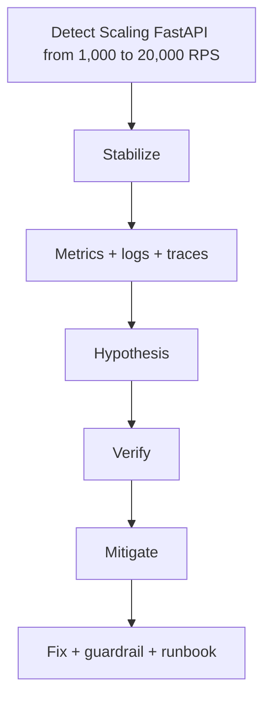

# Scaling FastAPI from 1,000 to 20,000 RPS

> **Phạm vi phỏng vấn:** Production Scenario · **Ưu tiên:** P0/P1 · **Mindset:** Why → How → Trade-off → Production.

## 1. What is it?

High traffic scenario kiểm tra toàn critical path từ load balancer đến database/queue; scale stateless API đơn lẻ có thể làm stateful dependency sập nhanh hơn.

## 2. Why does it matter?

Senior Engineer cần hiểu **Scaling FastAPI from 1,000 to 20,000 RPS** để Senior Engineer phải giảm impact trước, tìm nguyên nhân bằng evidence và phòng tái diễn. Điểm phỏng vấn nằm ở khả năng nêu invariant, điều kiện áp dụng và failure behavior, không nằm ở việc thuộc định nghĩa.

## 3. How does it work?

Từ 1k lên 20k RPS: đo sustainable RPS/worker ở 60–70% utilization; load balancer phân phối nhiều pod/process; giữ async path non-blocking và đẩy CPU work sang process/queue. Budget DB connection, tối ưu query/index, cache hot data trong Redis, dùng read replica chỉ cho stale-tolerant read, HPA theo saturation/queue age và rate-limit theo tenant.

Khi reasoning, đi theo chuỗi: **input → state transition → output → failure → recovery**. Quan sát `customer impact, detection time, mitigation time, MTTR và recurrence` và phân biệt symptom, bottleneck với root cause.

## 4. Example

```python
from dataclasses import dataclass

@dataclass(frozen=True)
class Decision:
    topic: str
    invariant: str
    metric: str

decision = Decision(
    topic='Scaling FastAPI from 1,000 to 20,000 RPS',
    invariant="Không làm mất hoặc lặp business effect",
    metric="p99 latency và error rate",
)
```

Ví dụ biến quyết định về **Scaling FastAPI from 1,000 to 20,000 RPS** thành invariant và tín hiệu vận hành có thể kiểm chứng.

## 5. Production Use Case

Trước campaign, load test có skew và cache-cold; pre-scale API/Redis, cap pool, warm cache, bật feature degradation và theo dõi SLO burn/DB CPU/pool wait/queue lag.

Checklist triển khai: capacity budget, timeout, idempotency (nếu có side effect), telemetry, canary, rollback và reconciliation.

## 6. Common Problems

- Không định nghĩa invariant và source of truth trước khi chọn công nghệ.
- Retry không backoff/jitter làm traffic amplification khi dependency lỗi.
- Không có bound cho queue, connection, memory hoặc concurrency.
- Chỉ theo dõi average; bỏ qua p95/p99, saturation và error semantics.
- Rollout toàn bộ, thiếu feature flag/canary và đường rollback dữ liệu.

## 7. Trade-offs

| Lựa chọn | Lợi ích | Chi phí / rủi ro | Khi phù hợp |
|---|---|---|---|
| Tối ưu/thiết kế xoay quanh Scaling FastAPI from 1,000 to 20,000 RPS | Kiểm soát rõ constraint chính | Tăng complexity và coupling | Metric chứng minh đây là bottleneck/risk |
| Giữ baseline đơn giản | Ít dependency, dễ debug | Có thể chạm giới hạn sớm | Traffic vừa, invariant vẫn được giữ |
| Managed service/library | Giảm vận hành hạ tầng | Cost, lock-in, giới hạn control | SLA và economics phù hợp |
| Tự vận hành/customize | Kiểm soát sâu | Ownership và failure surface lớn | Có năng lực vận hành và nhu cầu thật |

## 8. Interview Questions

### Basic / Mid-level (10)

- **B1.** What is Scaling FastAPI from 1,000 to 20,000 RPS, and which concrete problem does it address?
- **B2.** Explain the main internal mechanism behind Scaling FastAPI from 1,000 to 20,000 RPS.
- **B3.** Which guarantees does Scaling FastAPI from 1,000 to 20,000 RPS provide, and which does it not provide?
- **B4.** Which metrics or observations reveal the behavior of Scaling FastAPI from 1,000 to 20,000 RPS?
- **B5.** What is the most common misconception about Scaling FastAPI from 1,000 to 20,000 RPS?
- **B6.** How would you test assumptions involving Scaling FastAPI from 1,000 to 20,000 RPS?
- **B7.** Which edge cases or failure modes matter most for Scaling FastAPI from 1,000 to 20,000 RPS?
- **B8.** How can Scaling FastAPI from 1,000 to 20,000 RPS affect latency, throughput, memory, or correctness?
- **B9.** Which runtime conditions or configuration choices change the behavior of Scaling FastAPI from 1,000 to 20,000 RPS?
- **B10.** When is a different or simpler approach better than relying on Scaling FastAPI from 1,000 to 20,000 RPS?

### Production Scenarios (5)

- **S1.** A release involving Scaling FastAPI from 1,000 to 20,000 RPS triples p99 while averages look normal. How do you investigate and mitigate?
- **S2.** A critical dependency around Scaling FastAPI from 1,000 to 20,000 RPS is unavailable for ten minutes. Define degraded behavior and recovery.
- **S3.** Two concurrent operations expose a correctness gap related to Scaling FastAPI from 1,000 to 20,000 RPS. Which invariant and atomic boundary fix it?
- **S4.** Traffic grows from 1,000 to 20,000 RPS. Which measured limit involving Scaling FastAPI from 1,000 to 20,000 RPS fails first?
- **S5.** A canary changes the behavior of Scaling FastAPI from 1,000 to 20,000 RPS; success rate is flat but saturation rises. Promote or roll back?

## 9. Senior-level Questions

- **L1.** How does Scaling FastAPI from 1,000 to 20,000 RPS constrain the surrounding architecture and operational model?
- **L2.** Which subtle correctness issue appears when Scaling FastAPI from 1,000 to 20,000 RPS meets concurrency or partial failure?
- **L3.** What breaks first around Scaling FastAPI from 1,000 to 20,000 RPS at 20,000 RPS or 100× data volume?
- **L4.** Where should admission control or backpressure be placed when using Scaling FastAPI from 1,000 to 20,000 RPS?
- **L5.** How would you benchmark or validate Scaling FastAPI from 1,000 to 20,000 RPS without a misleading microbenchmark?
- **L6.** Which hidden coupling or migration cost can Scaling FastAPI from 1,000 to 20,000 RPS introduce?
- **L7.** How would you change a poor decision around Scaling FastAPI from 1,000 to 20,000 RPS with no downtime?
- **L8.** What production evidence would make you choose a different approach?
- **L9.** How do correctness, latency, cost, and complexity trade off for Scaling FastAPI from 1,000 to 20,000 RPS?
- **L10.** How would you turn an incident involving Scaling FastAPI from 1,000 to 20,000 RPS into a durable prevention mechanism?

## 10. Short Answers

**B1.** High traffic scenario kiểm tra toàn critical path từ load balancer đến database/queue; scale stateless API đơn lẻ có thể làm stateful dependency sập nhanh hơn. Trả lời tốt nối definition với constraint/invariant và một use case cụ thể.

**B2.** Mô tả state, lifecycle, boundary và failure path; không dừng ở public API của Scaling FastAPI from 1,000 to 20,000 RPS.

**B3.** Nêu lúc tạo, lúc sử dụng, lúc release/commit và điều xảy ra khi timeout hoặc cancellation.

**B4.** Đo customer impact, detection time, mitigation time, MTTR và recurrence; luôn tách average khỏi tail và success khỏi useful result.

**B5.** Lỗi phổ biến là dùng Scaling FastAPI from 1,000 to 20,000 RPS như mặc định mà không xác định ownership, limit và fallback.

**B6.** Test invariant trước, sau đó integration test failure path, concurrency và representative load.

**B7.** Xét timeout, duplicate, stale state, overload, dependency loss và recovery/reconciliation.

**B8.** Đo critical path, contention, queueing và amplification; throughput cao không bù được p99 xấu.

**B9.** Deadline, concurrency limit, retention/TTL, resource budget, telemetry và rollout policy phải explicit.

**B10.** Tránh Scaling FastAPI from 1,000 to 20,000 RPS khi bài toán đơn giản hơn giải được invariant với ít state và operational cost hơn.

Cấu trúc câu trả lời: **Definition → Why → How → Trade-off → Production example**. Với câu scenario: **stabilize → observe → hypothesize → verify → mitigate → prevent**.

## 11. Follow-up Questions

- **F1.** What assumption in your answer is most risky?
- **F2.** How would you prove that with metrics or an experiment?
- **F3.** What changes if the operation is not idempotent?
- **F4.** Where would you add timeout, retry, and backpressure?
- **F5.** What is your rollback and data-reconciliation plan?

## 12. Key Takeaways

- Nói được **vai trò, constraint hoặc invariant của Scaling FastAPI from 1,000 to 20,000 RPS**, không chỉ “dùng để làm gì”.
- Định lượng bằng customer impact, detection time, mitigation time, MTTR và recurrence và có baseline trước tối ưu.
- Thiết kế cho timeout, duplicate, overload, partial failure và recovery.
- Mọi tối ưu đều có chi phí về correctness, complexity, latency hoặc money.
- Production-ready nghĩa là có owner, alert, runbook, canary, rollback và reconciliation.


## 13. Mental Model

Hãy xem **Scaling FastAPI from 1,000 to 20,000 RPS** như một boundary biến input/state thành output. Muốn hiểu sâu phải chỉ ra ai sở hữu state, lifecycle, điểm contention và behavior khi dependency chậm hoặc mất.

## 14. Internals Deep Dive

Trong incident: stabilize trước, giữ evidence, dùng telemetry để kiểm hypothesis, rồi mới root cause. Mọi action cần owner, blast radius, rollback và verification.

Implementation detail có thể đổi theo version; khi trả lời interview, nêu rõ CPython/PostgreSQL/Redis/framework version nếu kết luận dựa vào behavior nội bộ thay vì public contract.

## 15. Request / Data Flow



Đọc diagram từ input tới state transition và output. Tại mỗi mũi tên, hỏi: operation có block không, có retry không, state có durable không, identity nào dùng để dedupe và metric nào chứng minh bước đó khỏe.

## 16. Failure Scenario

Mitigation không có verification có thể chỉ chuyển failure sang dependency khác. Theo dõi SLI, saturation và correctness/reconciliation cho tới khi hệ thống thực sự ổn định.

Phân tích theo chuỗi: **trigger → saturation/incorrect state → propagation → user impact → immediate mitigation → durable prevention**. Tránh gọi retry hoặc scale là giải pháp nếu chưa chỉ ra dependency budget.

## 17. How I would debug this in production

1. Declare severity/owner và customer impact.
2. Freeze recent risky change.
3. Mitigate bằng action reversible.
4. Dùng evidence kiểm từng hypothesis.
5. Verify recovery bằng SLI + correctness.
6. RCA và prevention có owner/deadline.

## 18. Common Misconceptions

**Sai:** restart service là root-cause fix. **Đúng:** restart có thể giảm impact nhưng phải giữ evidence, tìm mechanism và thêm prevention.

## 19. When NOT to use

Không thực hiện thay đổi irreversible/high-blast-radius trong incident nếu còn mitigation an toàn và evidence chưa đủ.

## 20. What interviewer may ask next

1. **What guarantee does Scaling FastAPI from 1,000 to 20,000 RPS provide, and what does it explicitly not guarantee?**
2. **Which implementation detail changes across versions or runtimes?**
3. **Where is the first queue or contention point under high load?**
4. **What happens if the dependency times out after committing state?**
5. **How would you observe, degrade, and recover this in production?**
6. **Which simpler design would you choose at 100 RPS, and when would you evolve it?**

## 21. Check Your Understanding

1. Nếu throughput tăng 20× nhưng downstream capacity không đổi, **Scaling FastAPI from 1,000 to 20,000 RPS** sẽ tạo queue/backpressure ở đâu?
2. Timeout xảy ra ngay sau một state transition; caller có thể kết luận điều gì và không thể kết luận điều gì?
3. Metric, trace span và log field tối thiểu nào giúp phân biệt application, dependency và network latency?

<details>
<summary>Answer</summary>

1. Queue xuất hiện tại bounded resource đầu tiên: worker/thread/semaphore/connection pool/broker hoặc dependency. Nếu không có bound, overload chuyển thành memory growth và timeout storm.
2. Caller chỉ biết chưa nhận response trong deadline; operation có thể chưa chạy, đang chạy hoặc đã commit. Cần operation identity/idempotency và status/reconciliation.
3. Dùng end-to-end latency + queue/service time, correlation/trace ID, dependency spans, error/retry classification và saturation của pool/queue/resource.

</details>

## 22. See also

- [Incident Debugging](../17-performance-reliability/incident-debugging.md)
- [Observability](../17-performance-reliability/observability.md)
- [System Design](../11-system-design/README.md)
