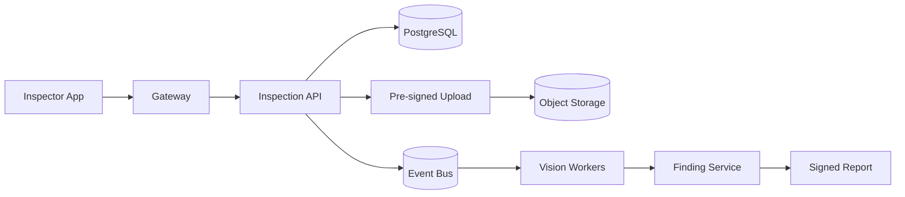

# Design: Vehicle Inspection Platform

> Cách trình bày: clarify requirement → estimate → define invariant → draw → deep-dive bottleneck/failure → trade-off.

## 1. What is it?

Thiết kế nền tảng **Vehicle Inspection Platform** để lập lịch, nhận checklist/ảnh/video, chạy rule/AI, ký biên bản và đồng bộ dealer. Scope phỏng vấn tập trung vào backend/control plane; thuật toán ML/optimization chi tiết nằm ngoài phạm vi.

## 2. Why does it matter?

Bài toán kết hợp stateful workflow, dữ liệu lớn, partial failure và enterprise integration. Senior Engineer phải biến requirement mơ hồ thành SLO, capacity budget và ranh giới ownership có thể vận hành.

## 3. How does it work?

### Requirements

- Làm rõ tenant, geography, retention, compliance, consistency và thao tác nào critical.
- Source of truth phải durable; cache/projection có thể rebuild.
- Mọi side effect có idempotency key, audit trail và reconciliation path.

### Functional Requirements

- Core: lập lịch, nhận checklist/ảnh/video, chạy rule/AI, ký biên bản và đồng bộ dealer.
- Query trạng thái/history, quản lý version/configuration và quyền theo tenant.
- Admin replay, manual override, export và audit nhưng phải authorization chặt.

### Non-functional Requirements

- Availability mục tiêu 99.9–99.99% theo criticality; multi-AZ trước multi-region.
- p95/p99 được định nghĩa riêng cho synchronous API và asynchronous completion.
- Encryption in transit/at rest; RPO/RTO, retention và data residency có số cụ thể.

### Scale Estimation

Assumption: 2M inspection/tháng; peak 300 submission RPS; mỗi phiên 80 ảnh × 4 MB; kết quả online dưới 5 giây. Từ peak traffic tính số instance theo **measured sustainable RPS × target utilization 60–70%**, không dùng benchmark laptop. Storage = ingest/day × retention × replication/compression; cộng index/WAL/headroom. Connection budget phải chia từ giới hạn database xuống pod/worker.

### API

`POST /v1/inspections`, `POST /v1/inspections/{id}/media`, `POST /v1/inspections/{id}/complete`, `GET /v1/vehicles/{vin}/inspections`. Write API trả resource/job ID ổn định; operation dài dùng `202 Accepted`. Cursor pagination thay offset cho history lớn. Error có machine-readable code, retryability và correlation ID.

### Data Model

Entity chính: Vehicle, Inspection, ChecklistVersion, Finding, MediaAsset, ModelResult, Inspector, AuditEvent. Dùng immutable ID, `tenant_id`, version/ETag và timestamps; unique constraint bảo vệ business invariant. Audit event append-only, payload lớn tách khỏi OLTP row.

### High-level Architecture



### Database

PostgreSQL cho workflow/constraint; object storage media; search/warehouse cho analytics và recall. Partition/shard theo access pattern đã đo; replica phục vụ stale-tolerant read. Schema migration expand/contract và online backfill có throttle.

### Cache

Redis cache checklist/version và short-lived upload session; không cache final signed result như source of truth. Dùng TTL jitter, single-flight và stale-if-error. Cache failure phải degrade có giới hạn; rate limit bảo vệ source khỏi miss storm.

### Message Queue

Event bus cho media analysis, fraud check, report generation và integration event. Delivery mặc định at-least-once; consumer idempotent, retry có backoff/jitter/budget, poison message vào DLQ và có runbook replay.

### Storage

Object/blob lớn dùng object storage với checksum, versioning, lifecycle và signed URL. Metadata durable tách khỏi bytes; backup restore phải được diễn tập, không chỉ bật configuration.

### Scaling

Stateless API scale ngang sau load balancer; partition worker theo locality/resource. Autoscale dùng queue age/lag cùng saturation và cap theo downstream capacity. Hot partition cần virtual shard hoặc tenant isolation.

### Failure Handling

- Deadline truyền end-to-end; retry chỉ transient + idempotent, dùng exponential backoff/full jitter.
- Circuit breaker/load shedding khi dependency suy yếu; fallback phải ghi rõ stale/degraded semantics.
- Outbox xử lý dual write; reconciliation job sửa lost/stuck projection.
- Đặc thù cần drill: VIN uniqueness, offline/mobile sync, evidence immutability, model false negative, manual override và auditability.

### Security

OIDC/OAuth2 ở edge, authorization theo resource/tenant ở service; least privilege IAM, secret rotation, encryption, PII redaction và immutable audit. Upload/untrusted content cần content-type verification, malware scan và quota.

### Observability

RED cho API, USE cho resource; queue age/lag, pool wait, saturation và business success. Trace mang `tenant_id` đã hash, job/message ID qua async boundary; tránh high-cardinality raw user ID. Alert theo multi-window SLO burn rate.

## 4. Example

```python
from dataclasses import dataclass
from uuid import UUID

@dataclass(frozen=True)
class Command:
    command_id: UUID
    tenant_id: UUID
    aggregate_id: UUID
    expected_version: int

# Repository atomically enforces (tenant_id, command_id) uniqueness and
# expected_version, then writes business state plus an outbox event.
```

Hai constraint tách biệt: `command_id` chống duplicate; `expected_version` chống lost update.

## 5. Production Use Case

Rollout theo cell/tenant, shadow traffic cho read path và canary cho write path. Trước launch cần load test có skew/hot key, dependency failure drill, restore test, capacity model, dashboard, alert, runbook và owner. Với **Vehicle Inspection Platform**, review riêng: VIN uniqueness, offline/mobile sync, evidence immutability, model false negative, manual override và auditability.

## 6. Common Problems

- Nhảy vào component trước khi chốt SLO, scale, consistency và source of truth.
- Tuyên bố “exactly once” nhưng không nói scope hoặc external side effect.
- Scale API mà bỏ qua database connection, hot partition và provider quota.
- Queue không bound, retry vô hạn và DLQ không có owner/replay procedure.
- Multi-region quá sớm, làm consistency/operation phức tạp hơn business cần.

## 7. Trade-offs

| Decision | Chọn khi | Đánh đổi |
|---|---|---|
| Strong consistency | Money/ownership/invariant | Latency, availability khi partition |
| Eventual consistency | Projection/feed/analytics | Stale UI, cần version/reconciliation |
| Synchronous call | Cần kết quả tức thời, dependency tin cậy | Coupling, tail-latency amplification |
| Queue/event | Work dài, burst hấp thụ được | Duplicate, lag, debugging khó hơn |
| Single region multi-AZ | Latency/complexity vừa phải | Không chịu được region loss |
| Active-active region | RTO thấp, global traffic | Conflict, cost và operational complexity |

### Bottlenecks

Database connection/lock, hot key/partition, queue lag, object-store bandwidth, external quota và serialized coordinator. Xác nhận bằng trace/profile/load test; không tối ưu từ sơ đồ.

### Future Improvements

Cell-based isolation, per-tenant quota, adaptive load shedding, tiered storage, automated reconciliation, chaos drill và cost-per-success dashboard. Chỉ thêm multi-region/sharding khi metric chứng minh giới hạn.

## 8. Interview Questions

### Basic / Mid-level (10)

- **B1.** What is Vehicle Inspection Platform, and which concrete problem does it address?
- **B2.** Explain the main internal mechanism behind Vehicle Inspection Platform.
- **B3.** Which guarantees does Vehicle Inspection Platform provide, and which does it not provide?
- **B4.** Which metrics or observations reveal the behavior of Vehicle Inspection Platform?
- **B5.** What is the most common misconception about Vehicle Inspection Platform?
- **B6.** How would you test assumptions involving Vehicle Inspection Platform?
- **B7.** Which edge cases or failure modes matter most for Vehicle Inspection Platform?
- **B8.** How can Vehicle Inspection Platform affect latency, throughput, memory, or correctness?
- **B9.** Which runtime conditions or configuration choices change the behavior of Vehicle Inspection Platform?
- **B10.** When is a different or simpler approach better than relying on Vehicle Inspection Platform?

### Production Scenarios (5)

- **S1.** A release involving Vehicle Inspection Platform triples p99 while averages look normal. How do you investigate and mitigate?
- **S2.** A critical dependency around Vehicle Inspection Platform is unavailable for ten minutes. Define degraded behavior and recovery.
- **S3.** Two concurrent operations expose a correctness gap related to Vehicle Inspection Platform. Which invariant and atomic boundary fix it?
- **S4.** Traffic grows from 1,000 to 20,000 RPS. Which measured limit involving Vehicle Inspection Platform fails first?
- **S5.** A canary changes the behavior of Vehicle Inspection Platform; success rate is flat but saturation rises. Promote or roll back?

## 9. Senior-level Questions

- **L1.** How does Vehicle Inspection Platform constrain the surrounding architecture and operational model?
- **L2.** Which subtle correctness issue appears when Vehicle Inspection Platform meets concurrency or partial failure?
- **L3.** What breaks first around Vehicle Inspection Platform at 20,000 RPS or 100× data volume?
- **L4.** Where should admission control or backpressure be placed when using Vehicle Inspection Platform?
- **L5.** How would you benchmark or validate Vehicle Inspection Platform without a misleading microbenchmark?
- **L6.** Which hidden coupling or migration cost can Vehicle Inspection Platform introduce?
- **L7.** How would you change a poor decision around Vehicle Inspection Platform with no downtime?
- **L8.** What production evidence would make you choose a different approach?
- **L9.** How do correctness, latency, cost, and complexity trade off for Vehicle Inspection Platform?
- **L10.** How would you turn an incident involving Vehicle Inspection Platform into a durable prevention mechanism?

## 10. Short Answers

**B1.** Vehicle Inspection Platform là hệ thống để lập lịch, nhận checklist/ảnh/video, chạy rule/AI, ký biên bản và đồng bộ dealer. Trả lời tốt nối definition với constraint/invariant và một use case cụ thể.

**B2.** Mô tả state, lifecycle, boundary và failure path; không dừng ở public API của Vehicle Inspection Platform.

**B3.** Nêu lúc tạo, lúc sử dụng, lúc release/commit và điều xảy ra khi timeout hoặc cancellation.

**B4.** Đo throughput, latency, availability, durability, cost và recovery time; luôn tách average khỏi tail và success khỏi useful result.

**B5.** Lỗi phổ biến là dùng Vehicle Inspection Platform như mặc định mà không xác định ownership, limit và fallback.

**B6.** Test invariant trước, sau đó integration test failure path, concurrency và representative load.

**B7.** Xét timeout, duplicate, stale state, overload, dependency loss và recovery/reconciliation.

**B8.** Đo critical path, contention, queueing và amplification; throughput cao không bù được p99 xấu.

**B9.** Deadline, concurrency limit, retention/TTL, resource budget, telemetry và rollout policy phải explicit.

**B10.** Tránh Vehicle Inspection Platform khi bài toán đơn giản hơn giải được invariant với ít state và operational cost hơn.

**Design pitch 90 giây:** “Tôi chốt invariant/SLO, estimate peak, chọn durable source of truth, tách work dài qua queue, dùng idempotency + outbox, rồi deep-dive bottleneck lớn nhất. Tôi thiết kế degraded mode, observability và reconciliation trước khi nói multi-region.”

## 11. Follow-up Questions

- **F1.** What assumption in your answer is most risky?
- **F2.** How would you prove that with metrics or an experiment?
- **F3.** What changes if the operation is not idempotent?
- **F4.** Where would you add timeout, retry, and backpressure?
- **F5.** What is your rollback and data-reconciliation plan?

## 12. Key Takeaways

- Requirement và con số dẫn component choice; component không phải điểm bắt đầu.
- Scale stateless tier dễ; state, connection budget, skew và failure recovery mới khó.
- At-least-once + idempotency + reconciliation là baseline thực dụng.
- Security, operability, cost và data lifecycle nằm trong design, không phải phụ lục.
- Luôn nêu assumption, trade-off và tín hiệu khiến bạn đổi thiết kế.
