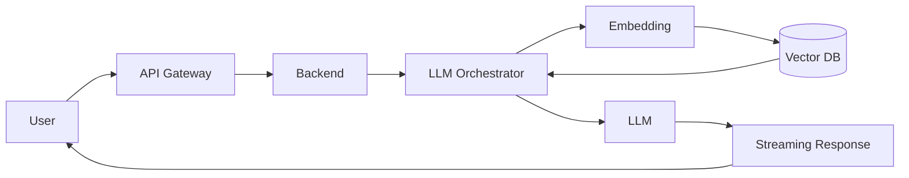

# Ai System Overview

> **Phạm vi phỏng vấn:** AI Integration · **Ưu tiên:** P0/P1 · **Mindset:** Why → How → Trade-off → Production.

## 1. What is it?

AI-enabled backend là hệ thống software thông thường bao quanh dependency model xác suất: identity, retrieval, orchestration, streaming, safety, cost và observability.

## 2. Why does it matter?

Senior Engineer cần hiểu **Ai System Overview** để kiểm soát latency, quality, privacy và chi phí của dependency xác suất. Điểm phỏng vấn nằm ở khả năng nêu invariant, điều kiện áp dụng và failure behavior, không nằm ở việc thuộc định nghĩa.

## 3. How does it work?

Online path: authenticate → retrieve/filter/rerank context → build versioned prompt → call model trong deadline/token budget → stream/cite. Offline path ingest/chunk/embed/index/evaluate; mọi artifact mang tenant, ACL và model/data version.

Khi reasoning, đi theo chuỗi: **input → state transition → output → failure → recovery**. Quan sát `time-to-first-token, groundedness, token cost, retrieval recall và fallback rate` và phân biệt symptom, bottleneck với root cause.

## 4. Example

Ingestion chạy riêng: parse → chunk → embed → index; online retrieval luôn filter tenant/ACL trước khi đưa evidence vào prompt.

## 5. Production Use Case

Automotive assistant chỉ trả answer khi evidence vượt threshold, cite manual version đúng VIN/model, fallback search khi provider lỗi và ghi quality/cost trace không lưu PII thô.

Checklist triển khai: capacity budget, timeout, idempotency (nếu có side effect), telemetry, canary, rollback và reconciliation.

## 6. Common Problems

- Không định nghĩa invariant và source of truth trước khi chọn công nghệ.
- Retry không backoff/jitter làm traffic amplification khi dependency lỗi.
- Không có bound cho queue, connection, memory hoặc concurrency.
- Chỉ theo dõi average; bỏ qua p95/p99, saturation và error semantics.
- Rollout toàn bộ, thiếu feature flag/canary và đường rollback dữ liệu.

## 7. Trade-offs

| Lựa chọn | Lợi ích | Chi phí / rủi ro | Khi phù hợp |
|---|---|---|---|
| Tối ưu/thiết kế xoay quanh Ai System Overview | Kiểm soát rõ constraint chính | Tăng complexity và coupling | Metric chứng minh đây là bottleneck/risk |
| Giữ baseline đơn giản | Ít dependency, dễ debug | Có thể chạm giới hạn sớm | Traffic vừa, invariant vẫn được giữ |
| Managed service/library | Giảm vận hành hạ tầng | Cost, lock-in, giới hạn control | SLA và economics phù hợp |
| Tự vận hành/customize | Kiểm soát sâu | Ownership và failure surface lớn | Có năng lực vận hành và nhu cầu thật |

## 8. Interview Questions

### Basic / Mid-level (10)

- **B1.** What is Ai System Overview, and which concrete problem does it address?
- **B2.** Explain the main internal mechanism behind Ai System Overview.
- **B3.** Which guarantees does Ai System Overview provide, and which does it not provide?
- **B4.** Which metrics or observations reveal the behavior of Ai System Overview?
- **B5.** What is the most common misconception about Ai System Overview?
- **B6.** How would you test assumptions involving Ai System Overview?
- **B7.** Which edge cases or failure modes matter most for Ai System Overview?
- **B8.** How can Ai System Overview affect latency, throughput, memory, or correctness?
- **B9.** Which runtime conditions or configuration choices change the behavior of Ai System Overview?
- **B10.** When is a different or simpler approach better than relying on Ai System Overview?

### Production Scenarios (5)

- **S1.** A release involving Ai System Overview triples p99 while averages look normal. How do you investigate and mitigate?
- **S2.** A critical dependency around Ai System Overview is unavailable for ten minutes. Define degraded behavior and recovery.
- **S3.** Two concurrent operations expose a correctness gap related to Ai System Overview. Which invariant and atomic boundary fix it?
- **S4.** Traffic grows from 1,000 to 20,000 RPS. Which measured limit involving Ai System Overview fails first?
- **S5.** A canary changes the behavior of Ai System Overview; success rate is flat but saturation rises. Promote or roll back?

## 9. Senior-level Questions

- **L1.** How does Ai System Overview constrain the surrounding architecture and operational model?
- **L2.** Which subtle correctness issue appears when Ai System Overview meets concurrency or partial failure?
- **L3.** What breaks first around Ai System Overview at 20,000 RPS or 100× data volume?
- **L4.** Where should admission control or backpressure be placed when using Ai System Overview?
- **L5.** How would you benchmark or validate Ai System Overview without a misleading microbenchmark?
- **L6.** Which hidden coupling or migration cost can Ai System Overview introduce?
- **L7.** How would you change a poor decision around Ai System Overview with no downtime?
- **L8.** What production evidence would make you choose a different approach?
- **L9.** How do correctness, latency, cost, and complexity trade off for Ai System Overview?
- **L10.** How would you turn an incident involving Ai System Overview into a durable prevention mechanism?

## 10. Short Answers

**B1.** AI-enabled backend là hệ thống software thông thường bao quanh dependency model xác suất: identity, retrieval, orchestration, streaming, safety, cost và observability. Trả lời tốt nối definition với constraint/invariant và một use case cụ thể.

**B2.** Mô tả state, lifecycle, boundary và failure path; không dừng ở public API của Ai System Overview.

**B3.** Nêu lúc tạo, lúc sử dụng, lúc release/commit và điều xảy ra khi timeout hoặc cancellation.

**B4.** Đo time-to-first-token, groundedness, token cost, retrieval recall và fallback rate; luôn tách average khỏi tail và success khỏi useful result.

**B5.** Lỗi phổ biến là dùng Ai System Overview như mặc định mà không xác định ownership, limit và fallback.

**B6.** Test invariant trước, sau đó integration test failure path, concurrency và representative load.

**B7.** Xét timeout, duplicate, stale state, overload, dependency loss và recovery/reconciliation.

**B8.** Đo critical path, contention, queueing và amplification; throughput cao không bù được p99 xấu.

**B9.** Deadline, concurrency limit, retention/TTL, resource budget, telemetry và rollout policy phải explicit.

**B10.** Tránh Ai System Overview khi bài toán đơn giản hơn giải được invariant với ít state và operational cost hơn.

Cấu trúc câu trả lời: **Definition → Why → How → Trade-off → Production example**. Với câu scenario: **stabilize → observe → hypothesize → verify → mitigate → prevent**.

## 11. Follow-up Questions

- **F1.** What assumption in your answer is most risky?
- **F2.** How would you prove that with metrics or an experiment?
- **F3.** What changes if the operation is not idempotent?
- **F4.** Where would you add timeout, retry, and backpressure?
- **F5.** What is your rollback and data-reconciliation plan?

## 12. Key Takeaways

- Nói được **vai trò, constraint hoặc invariant của Ai System Overview**, không chỉ “dùng để làm gì”.
- Định lượng bằng time-to-first-token, groundedness, token cost, retrieval recall và fallback rate và có baseline trước tối ưu.
- Thiết kế cho timeout, duplicate, overload, partial failure và recovery.
- Mọi tối ưu đều có chi phí về correctness, complexity, latency hoặc money.
- Production-ready nghĩa là có owner, alert, runbook, canary, rollback và reconciliation.
